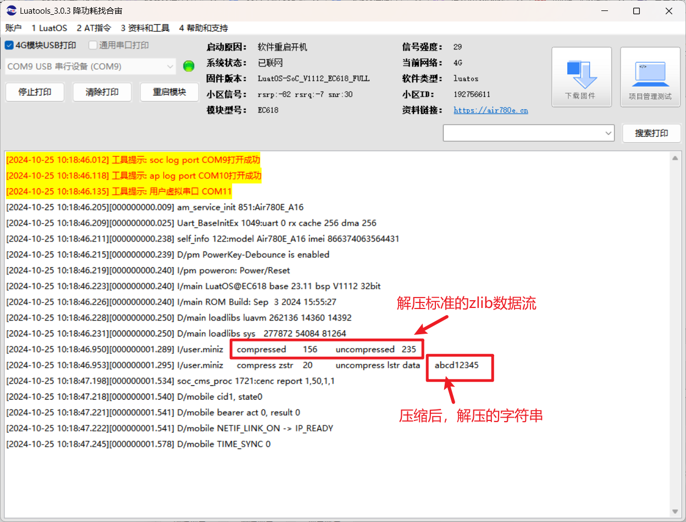

## 一、ZLIB 解压工具简介

Zlib 解压工具是一个广泛使用的压缩和解压缩库，主要用于处理数据的压缩和解压缩任务。Zlib 使用的是 DEFLATE 算法，这是一种通用的压缩算法。它被应用在很多场景中，比如压缩文件、网络传输中的数据压缩、以及各种应用程序中的数据存储和读取。

Zlib 的代码库相对小巧，因此在嵌入式系统和资源受限的环境中也能很好地使用。

详细细节可以参考：[https://www.cnblogs.com/LyShark/p/17861293.html](https://www.cnblogs.com/LyShark/p/17861293.html)

## 二、演示功能概述

演示如何对数据压缩解压。

## 三、准备硬件环境

淘宝购买链接：[Air780E 核心板淘宝购买链接](https://item.taobao.com/item.htm?id=693774140934&pisk=f1eiwOqL25l1_HYiV6D1ize3wN5d5FMjRrpxkx3VT2uIHCCskWm4kysffAEqor4KRRIskGT0ooqi_coq7DWE000qbVr2mmzKQjNtkV3mnoalvaBRelZshA7RyTFdpD4xQco2_VS2Tcnvc89h5lZshq-pu_FUfEDVVdOmgrkET0ir3mkq_MDEmmM2QjJaY2uI0UGAoNueWRjiw4YTC-_opNr-zluaXleFpfR_X2fhTJVn94W--KJ4KcqQreCDEs3zNVh-DyWpIxqEmyc8savgoor7gX2D7GUzmW4jBJS2_4PTWjestFRZqA0iaRlwjdkIgW2nBR7XNkEn7bDL96_tMA4gN4GNOwa0xVU4IX8G4iReapZyhDSYLIOj_DinyhbSB2IHjbEhxMA51foIXaIhxItMPKJlyMjHNEGZAcQR.&spm=a1z10.5-c-s.w4002-24045920841.33.639f1fd1YrS4b6&skuId=5098266470883) ；

此核心板的详细使用说明参考：[Air780E 产品手册](https://docs.openluat.com/air780e/product/) 中的 << 开发板 Core_Air780E 使用说明 V1.0.5.pdf>>；核心板使用过程中遇到任何问题，可以直接参考这份使用说明 pdf 文档。


### 3.2 数据通信线

typec 接口 USB 数据线即可。

### 3.3 PC 电脑

WINDOWS 系统。

## 四、准备软件环境

### 4.1 基本的下载调试工具

使用说明参考：[Luatools 下载和详细使用](https://docs.openluat.com/Luatools/) ；

## 五、ZLIB 解压操作软硬件资料

### 5.1 文档和工具：

- 780E 模块使用固件：[SDK& Demo - 合宙文档中心](https://docs.openluat.com/air780e/luatos/firmware/)，本 demo 使用的固件版本是：LuatOS-SoC_V1112_EC618_FULL.soc
- 本教程使用的 demo：[https://gitee.com/openLuat/LuatOS-Air780E/tree/master/demo/miniz](https://gitee.com/openLuat/LuatOS-Air780E/tree/master/demo/miniz)
- 将固件和脚本烧录到模块中：[Luatools 下载和使用教程 - 合宙模组资料中心](https://docs.openluat.com/Luatools/)
- 源码和固件已打包，如下所示：
[点我,下载完整压缩文件包](file/完整文件包.zip){:target="_blank"}

### 5.2 demo 使用 api 介绍

#### **使用常量**

| 常量<br/>                                | 类型<br/> | 解释<br/>                                                     |
| ---------------------------------------- | --------- | ------------------------------------------------------------- |
| miniz.WRITE_ZLIB_HEADER<br/>             | int<br/>  | 压缩参数,是否写入 zlib 头部数据,compress 函数的默认值<br/>    |
| miniz.COMPUTE_ADLER32<br/>               | int<br/>  | 压缩/解压参数,是否计算/校验 adler-32<br/>                     |
| miniz.GREEDY_PARSING_FLAG<br/>           | int<br/>  | 压缩参数,是否快速 greedy 处理, 默认使用较慢的处理模式<br/>    |
| miniz.NONDETERMINISTIC_PARSING_FLAG<br/> | int<br/>  | 压缩参数,是否快速初始化压缩器<br/>                            |
| miniz.RLE_MATCHES<br/>                   | int<br/>  | 压缩参数, 仅扫描 RLE<br/>                                     |
| miniz.FILTER_MATCHES<br/>                | int<br/>  | 压缩参数,过滤少于 5 次的字符<br/>                             |
| miniz.FORCE_ALL_STATIC_BLOCKS<br/>       | int<br/>  | 压缩参数,是否禁用优化过的 Huffman 表<br/>                     |
| miniz.FORCE_ALL_RAW_BLOCKS<br/>          | int<br/>  | 压缩参数,是否只要 raw 块<br/>                                 |
| miniz.PARSE_ZLIB_HEADER<br/>             | int<br/>  | 解压参数,是否处理 zlib 头部,uncompress 函数的默认值<br/>      |
| miniz.HAS_MORE_INPUT<br/>                | int<br/>  | 解压参数,是否还有更多数据,仅流式解压可用,暂不支持<br/>        |
| miniz.USING_NON_WRAPPING_OUTPUT_BUF<br/> | int<br/>  | 解压参数,解压区间是否够全部数据,,仅流式解压可用,暂不支持<br/> |
| miniz.COMPUTE_ADLER32<br/>               | int<br/>  | 解压参数,是否强制校验 adler-32<br/>                           |

#### miniz.compress(data, flags)

作用：快速压缩,需要 165kb 的系统内存和 32kb 的 LuaVM 内存

**参数：**

| **传入值类型**<br/> | **解释**<br/>                                                                 |
| ------------------- | ----------------------------------------------------------------------------- |
| string<br/>         | 待压缩的数据, 少于 400 字节的数据不建议压缩, 且压缩后的数据不能大于 32k.<br/> |
| flags<br/>          | 压缩参数,默认是 miniz.WRITE_ZLIB_HEADER , 即写入 zlib 头部<br/>               |

**返回值：**

| **返回值类型**<br/> | **解释**<br/>                                |
| ------------------- | -------------------------------------------- |
| string<br/>         | 若压缩成功,返回数据字符串, 否则返回 nil<br/> |

#### string.fromBase64(str)

作用：将字符串进行 base64 解码

**参数：**

| **传入值类型**<br/> | **解释**<br/>         |
| ------------------- | --------------------- |
| string<br/>         | 需要转换的字符串<br/> |

**返回值：**

| **返回值类型**<br/> | **解释**<br/>                                  |
| ------------------- | ---------------------------------------------- |
| string<br/>         | 解码后的字符串,如果解码失败会返回空字符串<br/> |

#### miniz.uncompress(data, flags)

作用：快速解压,需要 32kb 的 LuaVM 内存

**参数：**

| **传入值类型**<br/> | **解释**<br/>                                                   |
| ------------------- | --------------------------------------------------------------- |
| string<br/>         | 待解压的数据, 解压后的数据不能大于 32k<br/>                     |
| flags<br/>          | 解压参数,默认是 miniz.PARSE_ZLIB_HEADER , 即解析 zlib 头部<br/> |

**返回值：**

| **返回值类型**<br/> | **解释**<br/>                                |
| ------------------- | -------------------------------------------- |
| string<br/>         | 若解压成功,返回数据字符串, 否则返回 nil<br/> |

## 六、代码示例介绍

### 6.1 解压数据

先将压缩过的字符串进行 base64 解码，然后再解压：

```lua
-- 压缩过的字符串, 为了方便演示, 这里用了base64编码
    -- 大部分MCU设备的内存都比较小, miniz.compress 通常在服务器端完成,这里就不演示了
    -- miniz能解压标准zlib数据流
    -- 将字符串进行base64解码
    local b64str = "eAEFQIGNwyAMXOUm+E2+OzjhCCiOjYyhyvbVR7K7IR0l+iau8G82eIW5jXVoPzF5pse/B8FaPXLiWTNxEMsKI+WmIR0l+iayEY2i2V4UbqqPh5bwimyEuY11aD8xeaYHxAquvom6VDFUXqQjG1Fek6efCFfCK0b0LUnQMjiCxhUT05GNL75dFUWCSMcjN3EE5c4Wvq42/36R41fa"
    local str = b64str:fromBase64()
    -- 快速解压
    local dstr = miniz.uncompress(str)
```

压缩数据然后解压：

```lua
-- 演示压缩解压
    local ostr = "abcd12345"
    -- 压缩字符串
    local zstr = miniz.compress(ostr)
    -- 解压字符串
    local lstr = miniz.uncompress(zstr)
    log.info("miniz","compress zstr",#zstr,"uncompress lstr data",lstr)
```

## 七、功能验证

成功解压：



## 八、总结

本例程介绍了如何压缩和解压数据。

## 扩展

## 常见问题

### 1、解压数据不能超过多少？

解压后的数据不能大于 32k。


## 给读者的话

> 本篇文章由`Linden`开发；
>
> 本篇文章描述的内容，如果有错误、细节缺失、细节不清晰或者其他任何问题，总之就是无法解决您遇到的问题；
>
> 请登录[合宙技术交流论坛](https://chat.openluat.com/)，点击；
>
> 用截图标注+文字描述的方式跟帖回复，记录清楚您发现的问题；
>
> 我们会迅速核实并且修改文档；
>
> 同时也会为您累计找错积分，您还可能赢取月度找错奖金！
