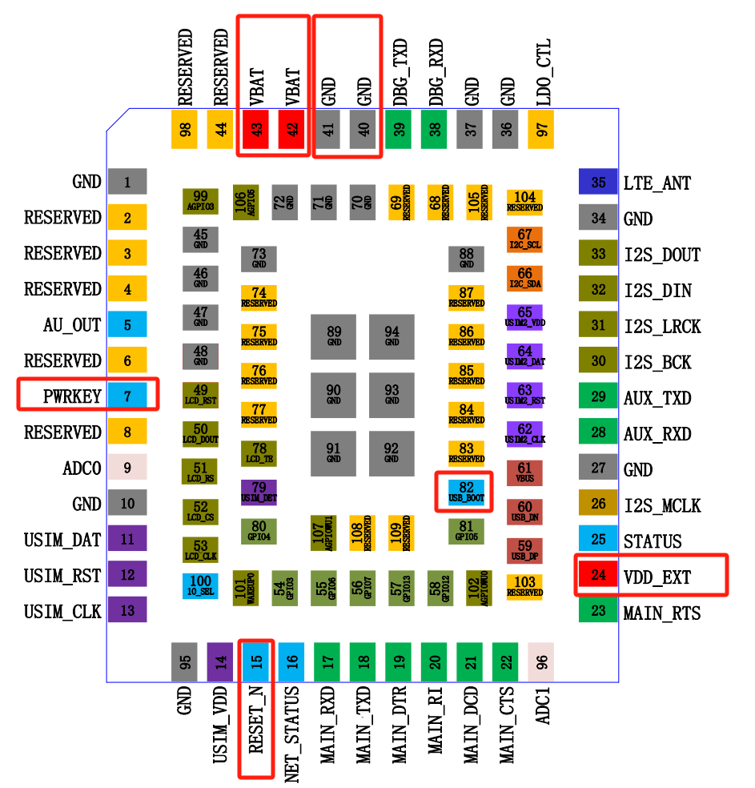
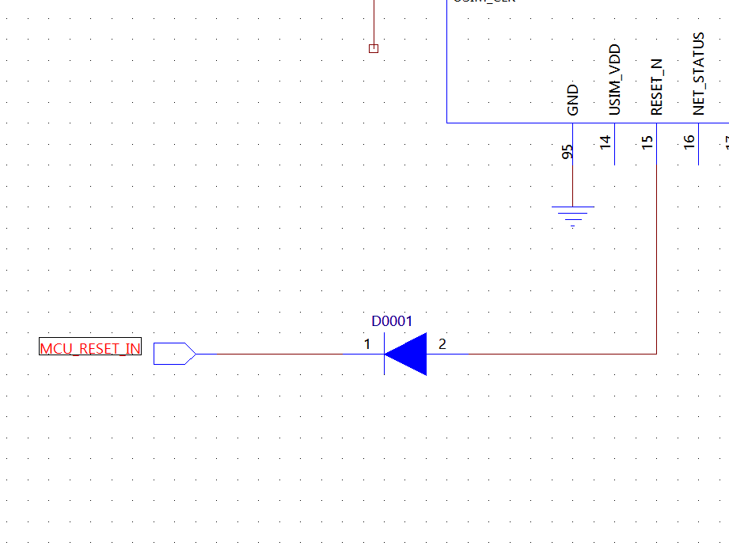

# 常见问题

## 一、Air780E开机启动及外围电路设计指导

Air780E模块开机正常启动所涉及到的管脚

| **管脚编号** | **管脚名称** | **功能描述**     | **备注**                         |
| ------------ | ------------ | ---------------- | -------------------------------- |
| 43，42       | VBAT         | 模块供电管脚     | 供电范围3.3V~4.3V                |
| 40，41，1... | GND          | 参考地           | 模块每个GND管脚都要良好接地      |
| 7            | PWRKEY       | 开机管脚         | 拉低开机                         |
| 15           | RESET_N      | 复位管脚         | 使系统硬件关机，并非重启功能     |
| 24           | VDD_EXT      | IO参考电压       | 电压输出管脚，休眠掉电。详见《》 |
| 82           | USB_BOOT     | BOOT模式选择管脚 | 拉高有效，上拉到VDD_EXT          |

### 模块开机的必要条件

Air780E要正常运行开机，需要如下几个必要条件：

- **VBAT供电管脚电压符合工作电压范围**。
  - **供电电压3.3V~4.3V**。注意实际Air780E正常开机的电压范围要大于规格书所给的工作范围，为3.1V~4.5V，但是实际使用中不建议超过3.3V~4.3V，避免射频指标恶化。注意，部分高压锂电池充满状态下电压能达到4.35V~4.4V，虽然超过4.3V的建议电压最大值，但是请放心使用，因为满电工作时间较短，而且考虑电池内阻因素，到达模块芯片端的电压会低于4.3V.
  - **持续供电电流大于1A，瞬间供电电流大于2A**。由于Cat.1射频工作特性，在射频发射瞬间会产生脉冲电流，脉冲电流最大会高达1.5~2A，持续时间百uS级别。若供电能力不够或者电源走线通路阻抗过高会引起VBAT供电电源跌落，严重时会造成`周期性的反复重启`。
    - 电源的跌落，可以用示波器进行测量。切记不能用万用表。
    - 可以从开机日志判断，比如用luatool通过链接Air780E的USB接口进行日志抓取，如果周期反复出现开机日志的打印，就可以考虑电源跌落原因。
    - 通过串口打印判断（MAIN_TXD/MAIN_RXD），开机后周期性反复打印“RDY"字样。在使用AT版本情况下通过此判断。
  - **VBAT供电纹波小于400mV**（经验值）。由于Cat.1射频工作特性，在射频工作时，很难保证VBAT供电的稳定不跌落。且在外部电源电路设计不合理的情况下（尤其是DCDC BUCK电源）。都会在VBAT电源上存在抖动和纹波，从经验来看，若跌落和纹波小于400mv的情况下不会对模块工作产生影响；但如果高于此范围，会有射频恶化的风险，以及低电压掉电重启的风险。
    - 如果优化，除了优化供电设计外，可以在VBAT管脚附近加大电容来减小纹波。官方参考设计推荐1000uf，比较保守，实际产品由于小型化或其他空间原因可以按照实际情况减小此电容的容值，以减小空间。那如果空间允许，建议无脑加上，增加系统健壮性。
- **开机管脚PWRKEY（7pin）触发开机动作**。Air780E模块不同于通常的MCU的上电开机，Air780E模块开机需要触发开机事件，也就是PWRKEY管脚拉低（**拉低时间>1S**），触发开机。
  - PWRKEY管脚只要VBAT管脚电压大于3.1V时就会为高，而且内部拉高，（注意：PWRKEY外部不能有任何上拉电路，否则会出现系统启动的不稳定风险），推荐如下几种开机方式：
    - 开集驱动开机电路。适合由主控MCU io口控制模块开机的方式。
        
        > 注意：三极管靠近模块放置，而且三极管集电极和PWRKEY之间无需串联电阻（模块内部已经串联5.6K电阻）
    - 按键开机方式。适合于Air780E做主控的方式，比如open 二次开发方式。
        
        > 注意：由于按键机械接触的方式，容易产生尖峰电压，还是建议做TVS防护，比如加TVS管，TVS管的选型上并没有太严格的要求，以通用和成本做考虑，可以选择工作电压5V的TVS。比如：PESDNC2FD5VU（芯导）；ESD5311N-2/TR（韦尔）; PESD5V0S1BLN（伯恩半导体）
    - PWRKEY接地方式。虽然Air780E不支持上电启动开机的方式，但是可以将PWRKEY直接接地的方式来变相实现上电开机的目的。但是这种方式有个缺点，毕竟是硬件实现的上电开机，会导致模块VBAT电压在关机电压临界点时（比如用电池供电，低电量情况下），会出现反复上电开关机的情况，进一步将电池放电。
        
        > 注意：上图PWRKEY串联0欧姆只是为了调试方便进行预留，直接PWRKEY接也不会有问题。
- **复位管脚RESET_N处于释放状态（没有被外部拉低）**。复位管脚RESET_N为硬件关机功能，（并不能直接让模块重启）在复位管脚拉低（拉低时间建议大于500ms）关机后，还需要PWERKEY触发开机动作。当然如果采用的是PWRKEY接地方式，操作RESET_N也能变相实现模块复位重启的效果。
  - RESET_N管脚与PWRKEY管脚类似，由模块内部拉高，**外部禁止任何形式的外部拉高**。
  - 如若RESET_N管脚一直被外部拉低且不被释放，模块则一直处于复位状态，不能正常启动，因此复位管脚也要作为模块不启动的排查对象。
  - RESET_N也有如下几种操作方式：
  

    -----------

  
   > 注意：如果PCB上RESET_N走线台词，建议在靠近模块端预留对地的100pf滤波电容
- **USB_BOOT管脚处于悬空或拉低状态**。USB_BOOT是模块进入下载模式的控制管脚，必须在模块开机启动时USB_BOOT管脚处于高状态（通常会用VDD_EXT管脚来拉高），才会让系统进入下载模式。进入下载模式后，不会相应外部AT指令。误入下载模式后，会容易误认为不开机。

### 总结

模块的上电开机，是硬件设计调试的第一步，引出遇到模块开机问题，可以参考以上开机条件进行逐一排查。在前期设计接地，也要根据这些要求来优化外部电路设计（尤其是电源部分）。

