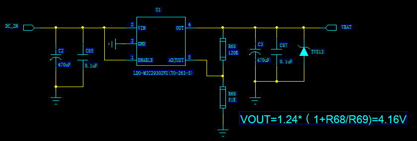
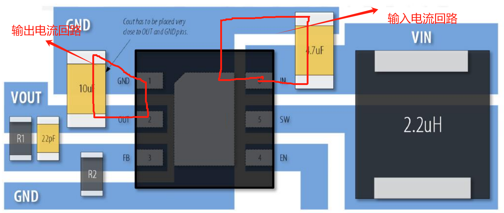
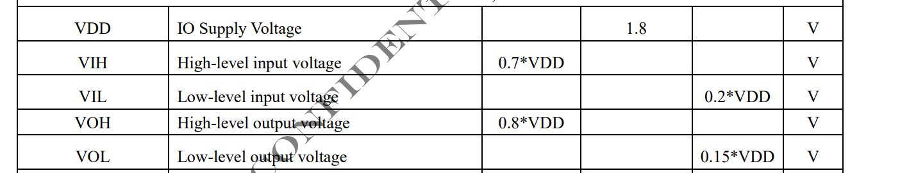

# 常见问题

## 一、Air780E开机启动及外围电路设计指导

Air780E模块开机正常启动所涉及到的管脚

| **管脚编号** | **管脚名称** | **功能描述**     | **备注**                         |
| ------------ | ------------ | ---------------- | -------------------------------- |
| 43，42       | VBAT         | 模块供电管脚     | 供电范围3.3V~4.3V                |
| 40，41，1... | GND          | 参考地           | 模块每个GND管脚都要良好接地      |
| 7            | PWRKEY       | 开机管脚         | 拉低开机                         |
| 15           | RESET_N      | 复位管脚         | 使系统硬件关机，并非重启功能     |
| 24           | VDD_EXT      | IO参考电压       | 电压输出管脚，休眠掉电。详见《》 |
| 82           | USB_BOOT     | BOOT模式选择管脚 | 拉高有效，上拉到VDD_EXT          |

### 模块开机的必要条件

Air780E要正常运行开机，需要如下几个必要条件：

- **VBAT供电管脚电压符合工作电压范围**。
  - **供电电压3.3V~4.3V**。注意实际Air780E正常开机的电压范围要大于规格书所给的工作范围，为3.1V~4.5V，但是实际使用中不建议超过3.3V~4.3V，避免射频指标恶化。注意，部分高压锂电池充满状态下电压能达到4.35V~4.4V，虽然超过4.3V的建议电压最大值，但是请放心使用，因为满电工作时间较短，而且考虑电池内阻因素，到达模块芯片端的电压会低于4.3V.
  - **持续供电电流大于1A，瞬间供电电流大于2A**。由于Cat.1射频工作特性，在射频发射瞬间会产生脉冲电流，脉冲电流最大会高达1.5~2A，持续时间百uS级别。若供电能力不够或者电源走线通路阻抗过高会引起VBAT供电电源跌落，严重时会造成`周期性的反复重启`。
    - 电源的跌落，可以用示波器进行测量。切记不能用万用表。
    - 可以从开机日志判断，比如用luatool通过链接Air780E的USB接口进行日志抓取，如果周期反复出现开机日志的打印，就可以考虑电源跌落原因。
    - 通过串口打印判断（MAIN_TXD/MAIN_RXD），开机后周期性反复打印“RDY"字样。在使用AT版本情况下通过此判断。
  - **VBAT供电纹波小于400mV**（经验值）。由于Cat.1射频工作特性，在射频工作时，很难保证VBAT供电的稳定不跌落。且在外部电源电路设计不合理的情况下（尤其是DCDC BUCK电源）。都会在VBAT电源上存在抖动和纹波，从经验来看，若跌落和纹波小于400mv的情况下不会对模块工作产生影响；但如果高于此范围，会有射频恶化的风险，以及低电压掉电重启的风险。
    - 如果优化，除了优化供电设计外，可以在VBAT管脚附近加大电容来减小纹波。官方参考设计推荐1000uf，比较保守，实际产品由于小型化或其他空间原因可以按照实际情况减小此电容的容值，以减小空间。那如果空间允许，建议无脑加上，增加系统健壮性。
- **开机管脚PWRKEY（7pin）触发开机动作**。Air780E模块不同于通常的MCU的上电开机，Air780E模块开机需要触发开机事件，也就是PWRKEY管脚拉低（**拉低时间>1S**），触发开机。
  - PWRKEY管脚只要VBAT管脚电压大于3.1V时就会为高，而且内部拉高，（注意：PWRKEY外部不能有任何上拉电路，否则会出现系统启动的不稳定风险），推荐如下几种开机方式：
    - 开集驱动开机电路。适合由主控MCU io口控制模块开机的方式。
        
        > 注意：三极管靠近模块放置，而且三极管集电极和PWRKEY之间无需串联电阻（模块内部已经串联5.6K电阻）
    - 按键开机方式。适合于Air780E做主控的方式，比如open 二次开发方式。
        
        > 注意：由于按键机械接触的方式，容易产生尖峰电压，还是建议做TVS防护，比如加TVS管，TVS管的选型上并没有太严格的要求，以通用和成本做考虑，可以选择工作电压5V的TVS。比如：PESDNC2FD5VU（芯导）；ESD5311N-2/TR（韦尔）; PESD5V0S1BLN（伯恩半导体）
    - PWRKEY接地方式。虽然Air780E不支持上电启动开机的方式，但是可以将PWRKEY直接接地的方式来变相实现上电开机的目的。但是这种方式有个缺点，毕竟是硬件实现的上电开机，会导致模块VBAT电压在关机电压临界点时（比如用电池供电，低电量情况下），会出现反复上电开关机的情况，进一步将电池放电。
        
        > 注意：上图PWRKEY串联0欧姆只是为了调试方便进行预留，直接PWRKEY接也不会有问题。
- **复位管脚RESET_N处于释放状态（没有被外部拉低）**。复位管脚RESET_N为硬件关机功能，（并不能直接让模块重启）在复位管脚拉低（拉低时间建议大于500ms）关机后，还需要PWERKEY触发开机动作。当然如果采用的是PWRKEY接地方式，操作RESET_N也能变相实现模块复位重启的效果。
  - RESET_N管脚与PWRKEY管脚类似，由模块内部拉高，**外部禁止任何形式的外部拉高**。
  - 如若RESET_N管脚一直被外部拉低且不被释放，模块则一直处于复位状态，不能正常启动，因此复位管脚也要作为模块不启动的排查对象。
  - RESET_N也有如下几种操作方式：
    

    -----------

  
   > 注意：如果PCB上RESET_N走线台词，建议在靠近模块端预留对地的100pf滤波电容
- **USB_BOOT管脚处于悬空或拉低状态**。USB_BOOT是模块进入下载模式的控制管脚，必须在模块开机启动时USB_BOOT管脚处于高状态（通常会用VDD_EXT管脚来拉高），才会让系统进入下载模式。进入下载模式后，不会相应外部AT指令。误入下载模式后，会容易误认为不开机。

### 总结

模块的上电开机，是硬件设计调试的第一步，引出遇到模块开机问题，可以参考以上开机条件进行逐一排查。在前期设计接地，也要根据这些要求来优化外部电路设计（尤其是电源部分）。

## 二、Air780E供电设计及选型推荐

常见的物联网应用场景下对Air780E的供电方式有如下三种：

### 一. LDO供电方式

使用LDO电源芯片线性降压的供电方案，原理简单，电路，走线要求都相对较低，而且输出电源干扰小，稳定，对射频，天线等影响较小。

但是由于Cat.1系统的特色性，对LDO的选型要求较高。如下是一般LDO的电源参考设计

 对于LDO电源的设计与选型有几点注意事项：

- **输入电压和输出电压压差尽量小**。由于LDO常用的是MOS半导通的降压特性，输入电压和输出电压差会加在LDO两端，会导致LDO承受耗散功率，造成发热和能量损失。而Cat.1的工作特性，在射频工作时，最大平均电流(FDD最大发射功率情况下）会达到600~700mA,使得LDO承受的耗散功率尤为严重。为了最小化电压差，建议LDO输出电压设置为接近4.2V，而输入电压建议不要超过5V，否则不建议采用LDO电源方案。
- **LDO器件封装选择。**

不少人选择LDO器件，只看器件的最大输出电流是否满足模块的要求电流，这种做法是错误的。LDO选型最重要的参数是热阻ϕ JA，表示芯片内部热结点到周围环境的热阻。通常芯片内部的结温的计算公式为：

其中： Tj为芯片结温；Rϕ JA 为热阻；TA为室温；PD为LDO芯片的耗散功率；

对于芯片结温Tj，通常规格书会给出当前芯片的最大允许的工作温度，比如如下：

也就是计算出来的LDO结温度不能超过125°C。而通常Rϕ JA 热阻与LDO的封装形式高度相关，具体可以查阅相关LDO芯片规格书，如下：

 例如：从上图规格书中我们可以得知SO-8封装的热阻为160°C/W，按照780E最大平均功率700mA, LDO压差1V计算，室温25°下，SO-8封装的LDO结温为0.7x1x160+25 = 137 °C  就高于了规格书要求的125的最大工作结温，所以SO-8的封装不满足Cat.1应用要求。

所以通常推荐选择封装为TO-252,SOT-223等这些带大面积散热PAD的封装，同时在PCB布局的时候要在空间允许的情况下尽量增加散热PAD的铺铜面积以及尽量多的过孔导热到PCB对面层增加散热面积。

- **LDO布局远离热敏感器件。**Cat.1模块供电LDO由于是比较大的热源，在热敏感的功能区域要尤其注意要远离，比如GPS，晶体振荡器，热敏感传感器。
- **LDO的输出电容的选择**。LDO输出电容容值不是越大越好，不合适的容值会导致输出震荡，计算公式相对复杂，这里不再赘述，感兴趣可以查阅反馈回路设计相关资料。若实际使用中遇到LDO输出震荡问题，调整输出电容即可，一般来说，只要按照LDO规格书推荐的输出电容值就可以。注意靠近LDO输出管脚放置。
- **推荐的LDO选型。**LDO选型不限于如下型号。
  - MIC29302WU   TO-263-5
  - LM317D2T-TR   TO-263-2
  - LM317DCYR   SOT-223-3

### 二 .DCDC供电方式

DC to DC开关电源的供电方式是Cat.1模块常用的方式，有其输出电流高，输入电压范围广，而且功耗相对LDO要低，发热小，同时不需如LDO的大面积散热覆铜。但是比较致命的缺点是容易对射频部分和天线部分造成传导或耦合干扰，从而影响模块的接受性能。但是这个问题是可以通过合理的DCDC电源设计以及PCB布局走线来优化解决。

如下是DCDC参考设计示例：

上图是以杰华特的JW5359M 开关电源举例，讲解各个部分的功能电路：

- C1和C25构成输入电容，其中C1大电容为可选，主要作用是放置于电源连接器附近，用于消除电源插拔时的尖峰电压；C25 22uf要靠近开关电源的电源输入管脚放置。C25电容选型除了耐压要满足输入电压要求外，还要选用低ESR的电容，建议用陶瓷MLCC电容。
- C16为自举电容，用于在DCDC内部下管关闭后能够迅速将上管栅极的电压提高至上管导通，在选型时要注意C16的耐压要大于输入电压。
- L2为功率电感，电感的感值范围可以由芯片规格书中公式进行计算得出，这里不做赘述。功率电感的选型除了关注感值外还需注意下面的几个参数：
  - 

  - 饱和电流（Isat），也就是导致功率电感磁饱和时的最大电流。功率电感进入磁饱和后，此时电流的增大不再转换为磁通量的增加，即立刻失去了电感的特性，导致短路大电流。电感的饱和电流一定要大于DCDC输出的**最大峰值电流。注意，最大峰值电流并不等于输出电流。**而是等于输出电流加上最大纹波电流**，**最大纹波电流可以按照输出电流的50%来估算。比如DCDC的最大输出电流为1A，则最大纹波电流为0.5A，于是最大峰值电流为1.5A，因此选择功率电感的饱和电流要大于1.5A。
  - 温升电流（Irms），功率电感的饱和电流不是固定不变的，通常会随着温度的升高而饱和电流降低。通常Irms是指电感温度在40度时的饱和电流。所以温升电流（Irms）通常会小于额定的饱和电流（Isat）。所以在做电感选型时主要Irms也要高于DCDC的最大峰值电流。
  - 等效直流阻抗(DCR), 也就是功率电感的内阻，主要影响电感的发热，较大的内阻会使得功率电感温度更容易升高，从而降低功率电感的感值和饱和电流。通常功率电感的内阻通常与封装大小直接相关，相同感值下封装更大的电感往往内阻较小。
- 反馈网络（R21,R22,C19)。R21,R22分压构成调整输出电压的反馈，这里不做过多阐述。注意，C19作为前馈电容主要作用是加快DCDC系统的瞬态响应，能够让DCDC在系统负载突然变化时，能够更快的响应，使得输出迅速稳定。通常前馈电容是可选的，但是对于Cat.1系统来说，由于射频脉冲式的工作形式，导致Cat.1系统对供电的瞬态响应要求高，因此前馈电容建议加上。前馈电容的值选择建议对于DCDC芯片规格书推荐值，由于前馈电容会影响DCDC反馈环路的相位，不合适的值会影响环路稳定性，从而引起震荡。
- C34 输出电容。输出电容比较重要，与功率电感一起，影响着DCDC的纹波电压大小。输出电容的计算方法在DCDC芯片规格书里描述得很详细，不做赘述。需要注意的是输出电容要选择ESR较小的MLCC陶瓷电容或者钽电容，且靠近DCDC输出放置。

 **DCDC开关电源的布局要求：**

 DCDC开关电源的布局很重要，对Cat.1射频灵敏度有很大的影响。如下是典型的布局较差的DCDC输出波形：

 上图波形能看到两种周期性的波形：呈现三角形，幅度相对较小的电源纹波；和尖峰脉冲幅值较大的低弹噪声。

- 电源纹波：是由开关电源的开关特性和功率电感输出电容充放电共同作用的结果，只要纹波电压幅值不大，基本不会对系统产生影响。如上图纹波电压峰峰值在20mv左右，相对较小属于正常范围。调节功率电感值和输出电容值以及开关频率均可以优化纹波电压。
- 地弹噪声：由于脉冲时间短频率高而且幅值较大，其高频分量通过电源传到到射频部分很容易对射频造成干扰，造成灵敏度恶化。所以地弹噪声是我们要消除的最大敌人。地弹噪声产生的原因是由于DCDC开关电源在工作时上管和下管分别交替打开而造成的电流环路变化而造成的磁通量变换，从而就会在电流环路上产生感应电动势也就是尖峰电压如下图，所以观察上图波形，可以看到地弹噪声都是出现在上下管切换的时刻。所以地**弹噪声想要通过调节电容和电感值去优化噪声是不可达到的**。

 输入电容和输出电容与DCDC芯片共同构成电流回路，也就是两者回路面积越大，产生的磁通量变化越大，也就是产生地弹噪声越大。因此想要尽可能的最小化噪声，就要在输出电容和输入电容的办法上做文章。

​    **DCDC电源布局示例：**

上图输入电容和输出电容直接放置在输入输出管脚的近端，同时电容地管脚直接就近连接到芯片的地管脚，从而整个输入输出电流环路面积最小。

DCDC布局建议：

1. 优先布局输入输出电容，首先将输入输出电容靠近芯片放置，再考虑其他部分的布局。
2. 输入输出电容的地管脚和DCDC芯片地管脚直接的回路连接，要尽量在表层连接，最好有一定宽度的覆铜。不建议通过过孔通过其他层连接，效果较差。
3. 芯片SW管脚与电感连接的走线尽量短，以减小对外的辐射。
4. 其他的一些通用的设计规则不再赘述。

总之，由于地弹噪声一旦发生，在已经成型的PCB上就很通过常规的硬件整改来定位问题和改善。因此在设计的时候就要特别关注DCDC开关电路的布局和走线。

### 三 .锂电池供电以及充电方式

通过直接用锂电池给模块供电的方式适合运用在便携式物联网的场景，锂电池供电让身边正常工作，充电进行补能。

锂电池的放电特性具有较高的瞬态放电能力而且内阻较低，对于Cat.1系统是比较理想的供电方式，而且Air780E模块的供电电压范围3.3V~4.3V是完全按照锂电池的放电特性来设计。下图是由电池直接给模块供电的参考设计。

- C49 220uF是补能电容，由于锂电池的低内阻和高放电能力，加上本身应用与便携式产品，空间尺寸优先。因此本不需要较大的电容，但是考虑到实际PCB电源走线长度以及电池连接器接触阻抗和电池引线长度等会引入额外的不确定的阻抗，因此会建议酌情加上220uf电容，建议选用低ESR的钽电容。
- C50 C51 C52 构成旁路电容滤波组，不同容值的电容会有不同的协振动点，组合起来能够增加滤波的高频带宽，比单一滤波电容有低的高频阻抗。
- TVS1作为电源端的ESD保护器件。建议在设计时要加上，会显著降低售后不良率。参考选型：PTVSHC3D4V5BH 芯导 ；GESDBL4V5Y1 格瑞宝；

**充电电路**：

 对于锂电池的充电有两种方式：线性充电和开关充电，他们的工作原理图类似与LDO和DCDC开关电源的原理。对于500mA以下的充电电流优选线性充电的方式，成本低，电路简单，干扰较小；对于1A以上的充电电流优先选择开关充电的充电方式；在500mA~1A之前，根据产品的空间尺寸，散热情况选择合适的充电方式。

 下图以线性充电方式为例介绍具体参考设计：

 **设计注意事项**：

- D2和C18构成输入电源端的保护网络，靠近输入端放置。若是5V USB进行充电的化C1容值不宜太大，否则容易触发电脑USB的供电短路保护。如果是直流电源供电，C18建议采用100UF以上的电解电容，电源浪涌保护。
- 充电芯片CHRG管脚为充电指示管脚，通常为开漏输出，需要VBUS输入电源上拉，同时可以通过二极管做隔离同时连接到主控MCU GPIO管脚做充电状态判断，如果采用Air780E做主控的open 二次开发方式，需要连接到带有中断的GPIO。
- 充电芯片PROG管脚用于配置恒压充电下的充电电流，由R5电阻的阻值进行设置，具体参考实际的芯片规格书。建议加上Q4 NPN作为充电控制管脚，可以通过MCU或者Air780E GPIO进行控制，注意Q4的口控制管脚要用VBUS上拉，同时分压到IO电平对应的电压，达到充电芯片默认开启状态。
- 部分锂电池会有温度NTC管脚，用来检测电池电压，这里可以用VDD_EXT做分压，通过ADC检测电池温度，方便做电池安全检测。注意R30的值要根据具体的电池NTC电阻规格来计算，建议分压后的值落在0~1.2V的ADC有效量程之中。

 **充电路径管理**：

  由于锂电池的充电特性，在频繁充放电的情况下会导致锂电池寿命下降，因此在外电长供电的应用场景下（比如4G网络摄像头，无线固话，常供电的电瓶车定位器等）建议做充电路径管理，即当外电供电时会切断电池与模块的供电连接，直接用外部电源给模块供电。（上图线性充电参考设计的TP4056就没有路径管理功能，这种情况下，不能在电池不在的情况下用充电口直接给模块供电）。

### 总结

文章描述的三种Cat.1模块系统常用的供电方案，其中各有优劣，需要根据具体实际场景进行选择和设计。

## 三、Air780E模块串口电路设计硬件指导

### 概述

串口作为Air780E模块最最主要的通信接口，承担着控制，数据传输，外设通信等重要功能。基本上绝大部分的Cat.1应用场景都会用到。而Air780E模块的串口特性和使用要求上与通常的MCU串口会有些不同，导致在第一次用Air780E模块做设计时容易踩到一些坑。本文主要从硬件设计的角度，着重讲解串口设计中的一些关键注意点，软件开发或者AT设置方面不做深入探讨。

### 串口相关管脚

Air780E支持3个串口，分别是主串口MAIN_UART, 扩展串口AUX_UART, 调试串口DBG_UART。对应的管脚如下：

| **管脚编号**       | **管脚名称** | **描述**             |
| ------------------ | ------------ | -------------------- |
| 主串口（MAIN_UART） |              |                      |
| 17                 | MAIN_RXD     | 串口数据接收         |
| 18                 | MAIN_TXD     | 串口数据发射         |
| 19                 | MAIN_DTR*    | 唤醒中断输入管脚     |
| 20                 | MAIN_RI*     | 振铃信号             |
| 21                 | MAIN_DCD*    | 载波检测*            |
| 22                 | MAIN_CTS     | 模块发送清除（输出） |
| 23                 | MAIN_RTS     | 模块发送请求（输入） |
| 扩展串口           |              |                      |
| 28                 | AUX_RXD      | 扩展串口数据接收     |
| 29                 | AUX_TXD      | 扩展串口数据发射     |
| 调试串口           |              |                      |
| 38                 | DBG_RXD      | 调试串口输入         |
| 39                 | DBG_TXD      | 调试串口输出         |

> *注： MAIN_DTR，MAIN_RI, MAIN_DCD 管脚严格意义来说，并不能归为串口功能，MAIN_DTR，MAIN_RI,是独立的控制功能管脚，MAIN_DCD目前并无功能，仅仅作为普通GPIO。

### 功能描述

- **主串口：**
  - 模块的AT指令控制，数据传输都是通过主串口来实现，注意，及时采用二次开发方式，也建议优先用主串口进行外部通信和模块控制。

  - 主串口有以下特性：

  - 为TTL电平串口（Air780E所有串口均为TTL电平串口），电平为3.3V/1.8V（默认）电平。（两种串口电平选择，可以通过pin 100管脚配置或者二次开发代码配置）。
  - 默认波特率115200，可以通过AT+IPR指令来配置波特率，最大支持921600波特率。不支持自适应波特率。
  - 只有主串口支持模块**休眠唤醒功能**（LPUART）。Air780E模块在休眠时，所有串口均为关闭状态，只有主串口支持接收串口数据唤醒模块。注意，在非9600的其他波特率下，进行串口收发数据唤醒时，会丢失前几个字节。
  - MAIN_DTR管脚，为中断输入管脚，用于唤醒模块。DTR管脚内部串联5.6K电阻，而且内部上拉，外部直连即可，不建议外接上拉
  - MAIN_DCD管脚：目前无功能，普通GPIO。
  - MAIN_RI管脚：振铃管脚，当模块收到短信时，会输出120ms 低脉冲通知主控来信。同时也可以通过AT+CFGRI指令设置URC上报提醒，当AT+CFGRI=1时，网络URC来到时，也会产生120ms低脉冲。详细功能介绍参考《**Luat 4G LTE 模块AT命令手册》**
  - 主串口支持软件/硬件流控功能。在模块与上位机大数据传输过程中，如果两边的发射和接收处理速度不一致，会导致串口缓存溢出，导致数据丢失。这种情况下就要用到串口流控功能，通过暂停对方数据发送，来适配数据接收方的处理速度。
    - 软件流控：软件流控发送不同的字符去暂停(XOFF，十进制 19)和恢复(XON，十进制 17)数据流。注意，当模块传送的是二进制/十六进制数据时，不适合软件流控方式，因为TE可能会将二进制数据当成流控字符。所以，软件流控只适用于只有三线的串口。
    - 硬件流控：硬件流控通过MAIN_RTS/MAIN_CTS 信号来实现。当接收缓存快满的时候，模块把 CTS 信号设置为无效，数据传输被暂停。当模块的接收缓存可以接收更多数据时，CTS 信号重新被设置为有效。要实现硬件流控功能，请确保你的应用串口要 连接 RTS/CTS 线。注意流控连接方式为直连的方式：RTS-----RTS; CTS-----CTS.
    > 注意：默认流控是关闭状态，若要使用串口流控需要通过指令AT+IFC来打开，详见《**Luat 4G LTE 模块AT命令手册》**
- **扩展串口：**
  - 扩展串口AUX_UART从硬件上的电器特性来说与主串口一样（但是不能支持休眠唤醒功能）。但是AT指令不能直接操控扩展串口，仅仅用于特定应用，比如外接GNSS定位模块，AT指令中封装的定位指令，只能通过扩展串口与GNSS模块通信。对于openCPU 二次开发应用来说，扩展串口则没有这个限制，可以当作通用串口来使用。
- **调试串口：**
  
  - 调试串口DBG_UART，用来输出模块的运行日志，无法通过AT指令来操作，但是可以通过AT指令（内部指令）来关闭调试串口的日志输出功能，但不建议。
  
  - 调试串口固定波特率961200不可更改，不建议连接任何外设，但建议设计时预留测试点。调试串口日志数据有专门的协议，如果用普通的串口工具抓取会显示乱码，只有用专用调试工具，如有需要请联系官方技术人员。
  
  - 对于openCPU 二次开发应用来说，调试串口可以配置为一般串口使用，但是要注意，即使配置为调试串口在开机时软件跑起来前的这段时间内，仍然会输出调试日志，这就有可能对外接的外设造成误动作。同理，将调试串口配置为GPIO使用时也会有这个问题。因此万不得已情况下不要使用调试串口做其他功能。

### 硬件设计指导

- **串口的连接方式：**
  - 主串口的型号命名很容易让人联想到RS232标准的DB9接口，其实不然，模块的串口连接方式与标准RS232连接方式有所不同，如下是标准RS232串口连接方式，特点是交叉连接。

  - 

  - 而模块串口遵循的是早期贺氏(HAYES)公司制定的MODEM串口标准，在这个标准下，DTR,DSR,CTS,RTS信号的功能有所不同。MODEM串口标准标准下DTR, DSR，CTS，RTS采用的是直连方式，如下图

  - 

  - 在逐渐的演变过程中，DCD ,DSR,RI 逐渐演变为其他的独立功能，在物联网串口应用中仅保留T/RX加流控管脚的5线串口的形式，但是CTS ，RTS的命名规则保留了下来，虽然CTS/RTS采用直连的方式，但是实际上模块的CTS管脚起到的功能是标准RTS功能；模块RTS管脚起到的功能是标准CTS功能。连接方式如下：

  - 

 甚至流控管脚也不是必须，就变成了3线串口：

- **串口的电平转换：**

Air780E的串口是TTL电平串口，TTL电平串口会有输入输出判别门限，如下图。

同时，外接MCU或者外设的TTL电平串口同意有判别门限，一般来说，TTL电平的判别门限高低取决于IO供电电平VDD的高低。如果串口双方的判别门限差别较大，一方的输出高电平落在对方的高电平判别门限下，就容易出现误判的现象，虽说Air780E可以通过100管脚来选择串口电平，但也仅有1.8V和3.3V两个档位，无法覆盖全部情况，在串口双方电平不一致的情况，就要增加电平转换电路来转换通信电平。

- 双方模块串口电平差别不大的情况：
  - 例如，模块串口电平3.3V， MCU串口电平3.0V。按照上图判别门限，模块的输入高判别门限为0.7x3.3=2.32V，所以MCU串口高电平输出为3V，高于模块的输入高判别门限，能够稳定判断。这种情况下即使MCU与模块的电平不一致，直接连接也不会造成通信问题。通常这种情况下，无需电平转换，只需要在窗口TX RX型号线上串联限流电阻即可，限流电阻用于减小串口电平不匹配造成的漏电，通常按经验串联1K电阻即可，注意串联电阻不宜过大，会印象串口型号的上升下降时间，从而影响串口信号质量。

  - 

> 注意：不要只看判别门限，还要考虑串口的耐压，即使落在判别门限内，但是一方高电平高于对方的IO耐压值的情况下就不能要串联电阻的方式，还是老老实实加串口电平转换。一般来说双方的电平差不宜超过0.5V

- 晶体管的电平转方案：

在串口波特率不高的情况下（如115200），可以通过NPN晶体管的方式进行电平转换，参考设计如下图，这种方式的优点：成本低； 劣势：低电平下会被三极管的饱和管压降抬高（通常在0.1v左右，不影响通信）；开关速度不够，超过460800波特率时不建议用这种方式。

 设计注意：

1. 模块RXD上拉电源选择，上图选择AGPIO做上拉而没有选择VDD_EXT电源做上拉，是因为VDD_EXT在模块休眠时会关闭，会导致RXD上产生一个低电平，又由于主串口支持休眠唤醒，就导致这个低电平让串口产生中断将模块唤醒，最终导致模块无法休眠。所以在需要休眠的应用设计上，**禁止用VDD_EXT电源上拉串口**。
2. 三极管的基极要用较低电平的一方参考电平来上拉，否则容易找出三级管不能完截止。
3. RXD和TXD的上拉电阻在不影响信号质量的情况下尽量加大，一方面是降低休眠功耗，一方面是降低AGPIO的驱动负荷（Air780E所有AGPIO共享5mA最大驱动电流）。
4. 对于三极管选型并没有严格要求，通用的3904NPN三极管都能满足要求

- 电平转换芯片方案：
  - 电平转换芯片，对成本不敏感的话，优先考虑用电平转芯片，无论速度，可靠性都很完美。对于设计方面只要注意芯片选型，同时模块端参考电平注意用AGPIO3，其他的参考具体芯片参考设计即可，没有太多注意事项。

 考虑到电平转换芯片价格与通道数量成正相关，也可以采用TX RX用双通道电平转换芯片，其他流控信号用晶体管或者分压方式来做电平转换。兼顾性能和成本。

  电平转换芯片选型：

- TXS0102/TXS0104/TXS0108系列，2/4/8通道，品牌TI
- RS0102/RS0104/RS0108系列，2/4/8通道，品牌润石
- SGM4553 ， 双通道，品牌圣邦威

### 总结

虽然串口这个硬件总线原理简单，速率低速，设计也不复杂，但是对于CAT.1通信系统尤其是低功耗物联网应用，串口的设计就会牵涉到休眠和功耗，因此在设计中还是要有足够的重视。

