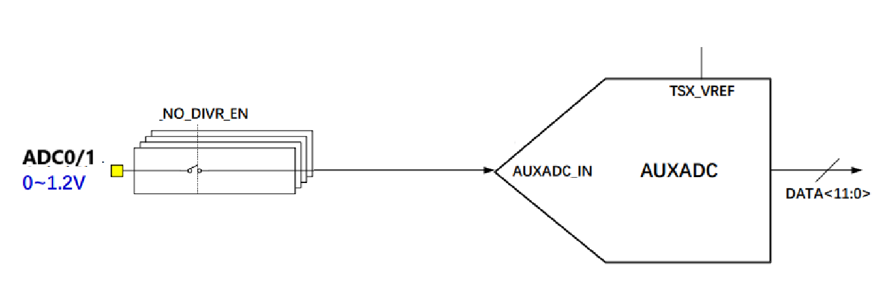
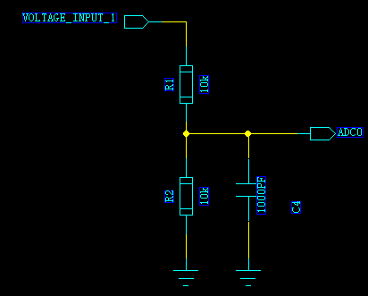
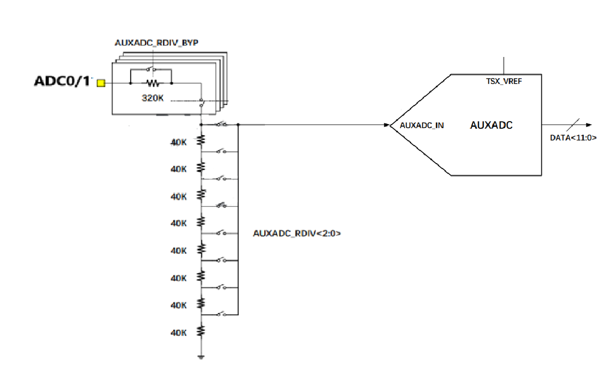
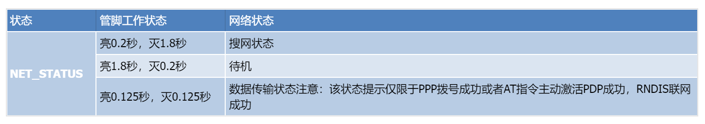
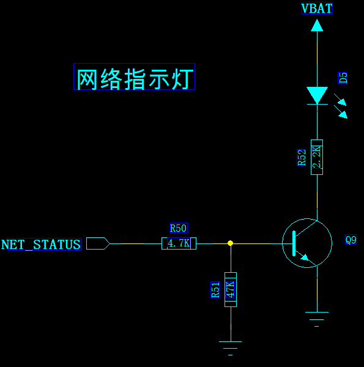
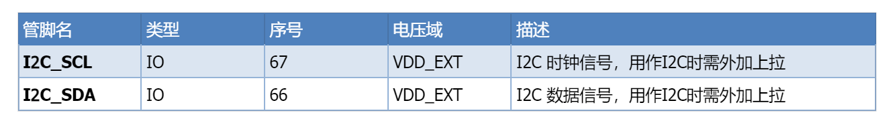
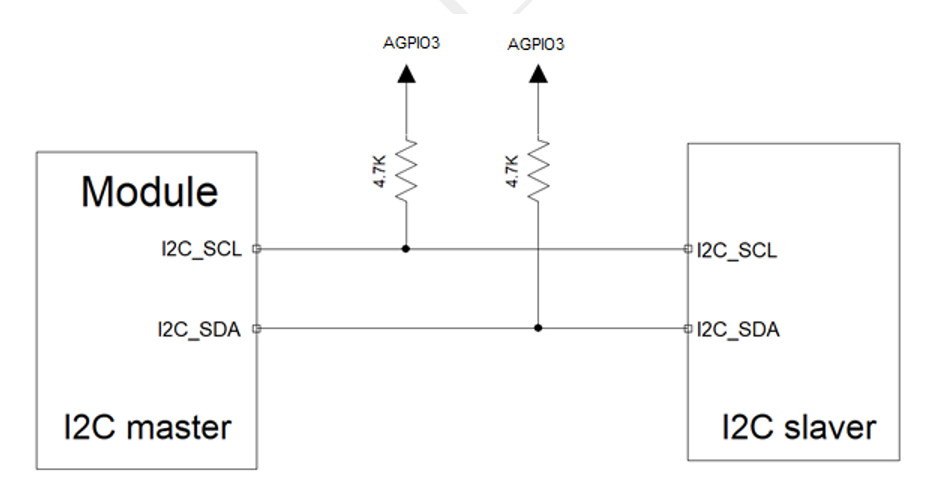
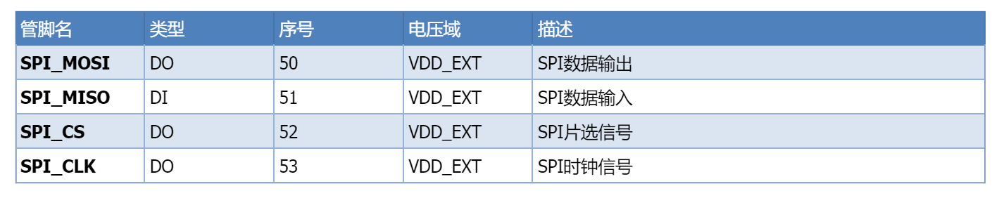
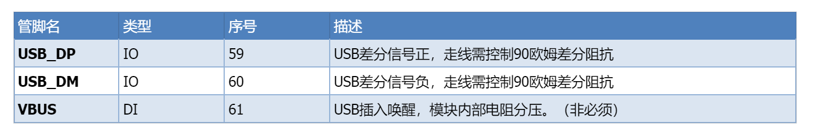
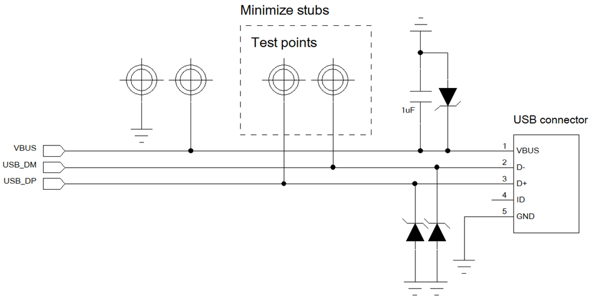

# Air780E 其他硬件接口设计说明 laolu

### ADC 接口设计指导

Air780E 模块(LuatOS 版本)支持 2 路通用 ADC 接口，管脚分布如下：

- ADC 接口特性：

  - 分辨率：12bit
  - 量程：0~1.1V
  - 时钟频率（fc）：1.625MHz~6.5MHz
  - 采样频率： fc / 16
  - 积分非线性: +-1.2mV
  - 微分非线性: +-0.3mV
  - 功耗：400uA
- ADC 分压模式： ADC 管脚可以设置为两种分压模式。
  **外部分压模式：**此模式下 ADC 管为直通模式，量程 0~1.1V。此模式下如果想要增加测量量程可以采用外部电阻分压的方式。

  
  

**内部分压模式：**此模式下可以配置内部的分压电阻，但内部的电阻分压只有固定几组组合。注意在内部分压模式下，不建议再加外部的分压。

  

### 指示灯设计指导

状态指示灯功能仅在 Air780E AT 版本支持，作为网络状态指示灯使用，而对于 LuatOS 版本，此管脚仅作通用 GPIO 管脚使用；

- 网络指示灯功能逻辑：
 
注意：网络指示灯为 AGPIO 类型管脚，在休眠时可以保持电平。

- 网路指示灯参考设计

  

### I2C 接口设计指导

Air780E 支持 1 路通用 I2C 接口(仅 LuatOS 版本支持),可以连接各类 I2C 外设。
 
- I2C 接口特性
  - 支持主/从模式
  - 三种速率：100KHZ ; 400KHZ ;1M HZ
  - 支持 16B FIFO
  - 支持 DMA 模式

注意： I2C 接口为普通 IO 类型接口，在模块休眠状态下会掉电。

- I2C 参考设计

  

### SPI 接口设计指导

Air780E 支持一路标准 4 线 SPI 接口

- SPI 接口特性：
  - 支持主从模式
  - 最大时钟频率：25.6MHz
  - 独立的发送和接收 FIFO
  - 支持 DMA 模式

### USB 接口设计指导

Air780E 支持 1 路 USB2.0 接口， 支持下载，调试，以及 RNDIS 数传。

- USB 接口特性：

  - 支持 USB2.O
  - 支持快速（12Mbps）；高速（480Mbps）模式
- USB 接口参考设计：

  

**设计注意事项：**

1. USB 走线需要严格按照差分线控制，做到平行和等长；
2. USB 走线的阻抗需要控制到差分 90 欧姆；
3. 需要尽可能的减少 USB 走线的 stubs，减少信号反射；USB 信号的测试点最好直接放在走线上以减少 stub；
4. 尽可能的减少 USB 走线的过孔数量；
5. 在靠近 USB 连接器或者测试点的地方添加 TVS 保护管，由于 USB 的速率较高，需要注意 TVS 管的选型，保证选用的 TVS 保护管的寄生电容小于 1pF;
6. VBUS 作为 USB 插入唤醒作用，并不直接参与 USB 插入检测，非必须，在不需要 USB 插入唤醒的场景也可以不接；
