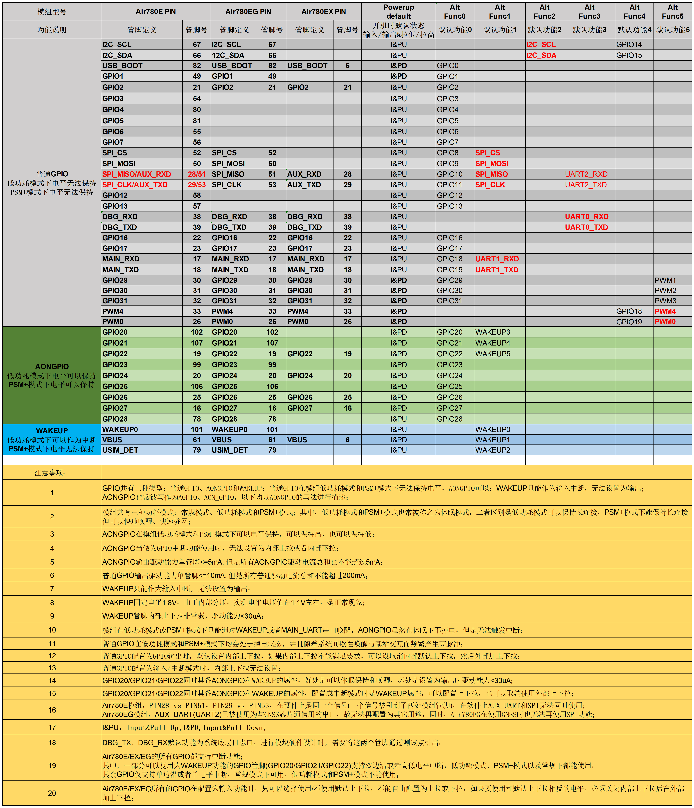
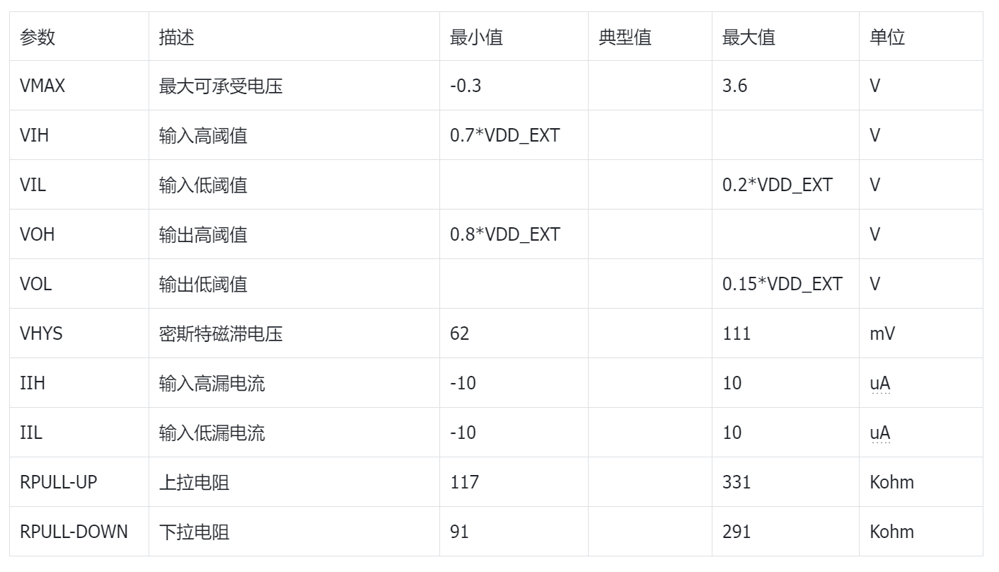
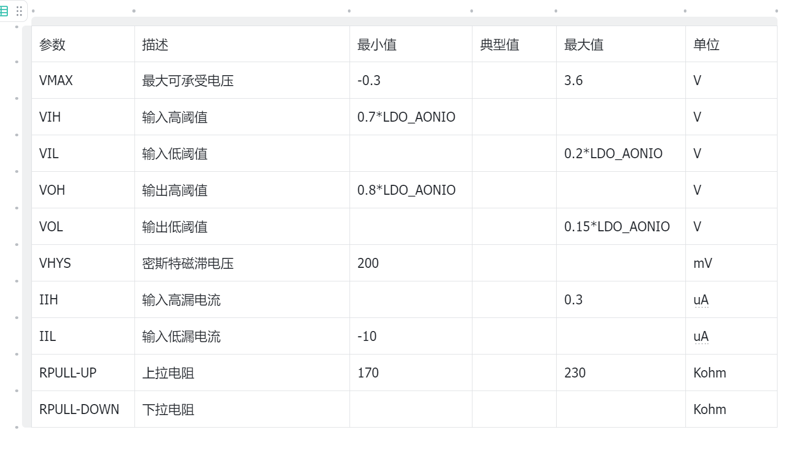
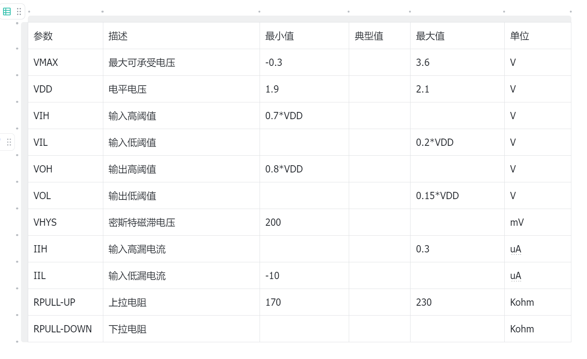
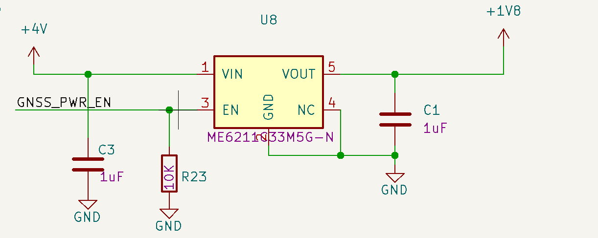
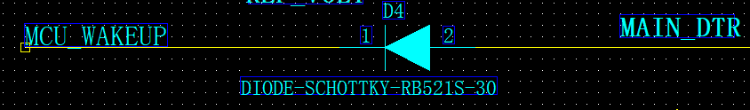

# Air780E GPIO 设计指导

# 概述

Air780E 支持两种软件开发方式，一种是传统的 AT 指令，一种是基于模组做 Open 开发；

传统 AT 指令的开发方式，合宙模组与行业内其它模组品牌在软件上区别不大，在硬件功耗上更有优势；

模组 Open 开发，合宙采用的是 LuatOS 方式，相对 C-SDK 入门更简单，开发更方便，开发时间上也更快；

本文所介绍的 GPIO 设计指导，都是针对 Air780E 用于 LuatOS 开发方式时的一些注意事项，AT 指令开发版本不支持 GPIO 操作；

Air780E 模块共支持 GPIO0~GPIO31 合计 32 个 GPIO 和 WAKEUP0~5 合计 6 个唤醒管脚，其中：

32 个 GPIO 口本身有多重复用功能，大家需要根据实际应用进行选择配置；

32 个 GPIO 中，又可分为普通 GPIO 和 AGPIO，在接下来的表格中，会详细介绍这两种 GPIO 的定义和区别；

6 个 WAKEUP 管脚中，部分也可以配置为 GPIO 功能，在接下来的表格中，也将详细介绍 WAKEUP 管脚的注意事项；

# GPIO 复用表

对于 GPIO 功能复用请参考如下表格

  

# GPIO 特性

Air780E 的 GPIO 口根据不同的特性，可以分为三种类型：普通 IO，AGPIO, Wakeup IO；

不同特性的 GPIO，其驱动能力以及在低功耗模式/PSM+ 模式下的表现区别比较大，在使用这些特性的 GPIO 时尤其要注意；

AGPIO 也常被写作为 AONGPIO、AON_GPIO，以下均以 AGPIO 的写法进行描述；

- 普通 IO

Air780E 大部分管脚为普通 GPIO(上图 GPIO 复用表格中灰色底色的 IO)；

Air780E 系统为了在休眠模式下有极致的低功耗性能，会在模块进入休眠/深休眠模式时，关闭 GPIO 供电(VDD_EXT)，因此会导致所有以 VDD_EXT 为电源域的 GPIO 会进入下电状态。因此在使用普通 GPIO 时，要尤其注意在休眠状态下 GPIO 的掉电状态对控制外设造成的误动作风险。

特性：

    - 电压域：VDD_EXT(1.8/3.3V可配置)
    - 输入输出:可以配置
    - 上下拉：内部可配置
    - 输入中断：上下边沿触发/双边沿触发/高低电平触发  （休眠后无法响应中断）
    - 休眠电平保持：不可保持
    - 休眠唤醒：不可唤醒模块
    - 驱动能力：单个普通GPIO驱动能力<=10mA
    - 参数：

   

- AGPIO

AGPIO 管脚为休眠可保持管脚(GPIO 复用表格中绿色底色 IO 管脚)；

这类管脚电源域为长保持的 LDO_AONIO 电源(为内部电源，模块外部不可测量)，这类电源在模块低功耗模式/PSM+ 下，仍然能够保持供电，因此 AGPIO 管脚在休眠状态下能够保持电平。AGPIO 管脚可以用于休眠状态下仍然需要保持工作状态的外设。

特性：

    - 电压域：LDO_AONIO(1.8/3.3V) 
    - 输入输出: 可以配置
    - 上下拉：内部可配置
    - 输入中断：上下边沿触发/双边沿触发/高低电平触发  （休眠后无法响应中断）
    - 休眠电平保持：可保持
    - 休眠唤醒：不可唤醒模块
    - 驱动能力：
      - AGPIOWU0/1/3(MAIN_DTR):  30uA
      - AGPIO3~8:  5mA (所有AGPIO总共驱动电流不能超过5mA)
    - 参数：
   
- Wakeup IO

  Air780E 包含 6 个特殊管脚 WAKEUP0~WAKEUP5,  此类型 IO 为中断唤醒管脚，能够在模块休眠状态下响应外部中断从而使模块退出休眠状态，因此这类 IO 管脚在休眠状态下也能保持供电；

  注意：Wakeup IO 仅支持输入，不能配置为输出，且固定电平不可配置。

特性：

    - 电压域：LDO_AON (2V，不可配置) 
    - 输入输出: 仅输入
    - 上下拉：内部可配置
    - 输入中断：上下边沿触发/双边沿触发/高低电平触发  
    - 休眠电平保持：可保持
    - 休眠唤醒：支持
    - 驱动能力： 30uA
    - 参数：
       

# GPIO 应用注意事项

- 普通 GPIO 以及相应的电压域 VDD_EXT 在休眠时会输出频繁百 ms 级别的高脉冲，极易导致连接的外设误动作。
  **原因：**Air780E 的休眠特性，VDD_EXT 在休眠状态下会关闭，但是 Air780E 系统在休眠的整个时期内并不是一直保持稳定休眠状态，需要不定时唤醒起来与 4G 网络交互以保持网络连接，因此 VDD_EXT 会随着模块唤醒而打开。而大部分普通 GPIO 默认是 i&PU 状态，就会被 VDD_EXT 拉高，导致输出高脉冲。
  **设计建议：**

  - 在一些需要休眠状态下正常工作的外设的控制（比如 LED 控制）不建议使用普通 GPIO，可以使用 AGPIO。
  - 由于 AGPIO 数量有限，在必须用普通 GPIO 的情况下，可以在普通 GPIO 上做外接 10K 电阻下拉（如下图 R23)，可以大幅减小休眠时输出的高脉冲幅值，使得减小到外设的高电平判别门限以下，也可以避免误动作的情况，但是相应的在某些情况下，会增加功耗，请根据实际情况酌情做出选择
    
- Wakeup IO 类型的 GPIO 不要用 VDD_EXT 或者普通 GPIO 上拉，会导致系统无法进入休眠。
  **原因：**Air780E 的休眠特性使得普通 GPIO 管脚和 VDD_EXT 会在休眠状态下输出高脉冲，会使得 Wakeup IO 收到中断而导致系统被唤醒，无法进入休眠模式。
  **设计建议：**

  - 使用内部的上下拉；
- Wakeup IO 类型的 GPIO 不要直接连接主控 MCU IO 管脚，会导致电平不一致而影响系统稳定性。
  **原因：**Wakeup IO 管脚电平是 2V 左右，这个与大多数 MCU 的 IO 电平不匹配，而且 Wakeup IO 的供电为内部的 LDO_AON，而这个供电会给系统启动相关的部分供电，比如 reset 管脚，因此 Wakeup IO 上由于电平不匹配而导致的漏洞有可能会影响系统稳定性。
  **设计建议：**

  - 使用二极管或者三极管来隔离(如下图)
    
