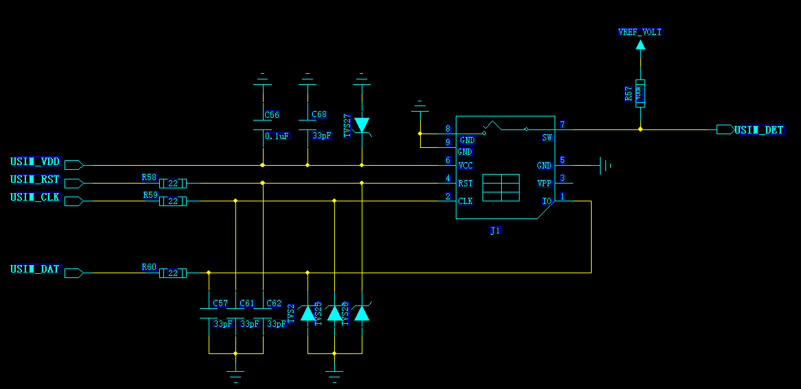
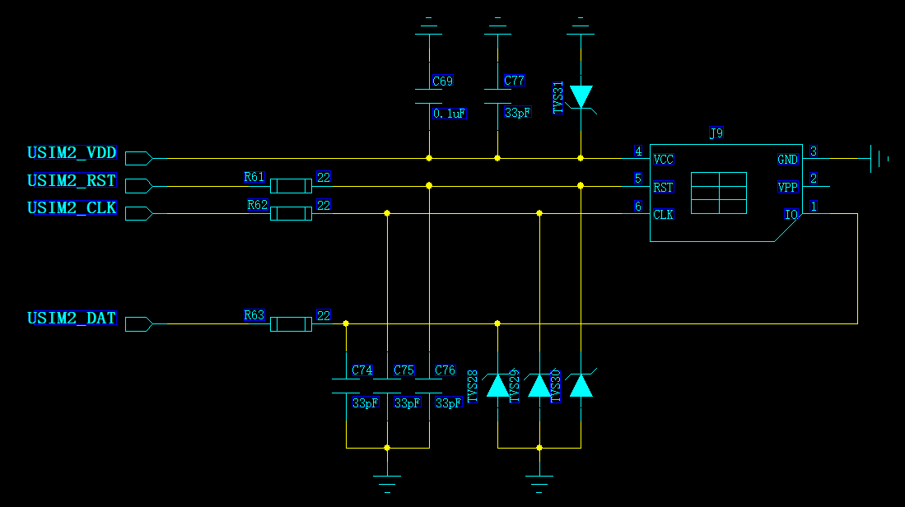
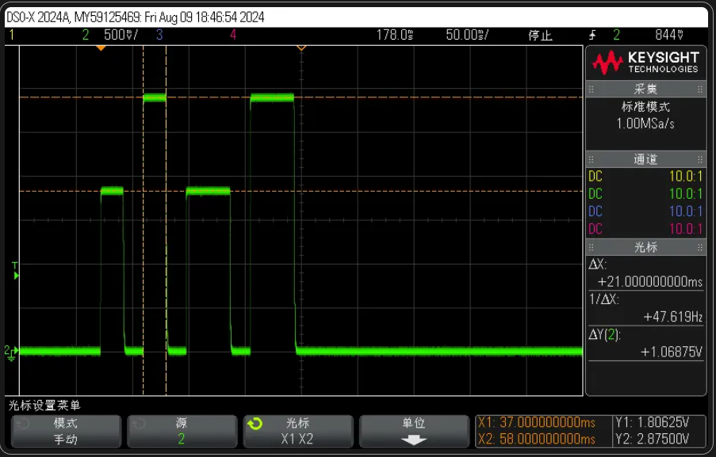

# Air780E SIM 卡接口设计指导

### 概述

SIM 卡接口由于连接 SIM 卡，读取 SIM 卡信息以便在注册 4G 网络时进行鉴权，身份验证。是 4G 通信系统的必要功能。Air780E 支持两路 SIM 卡，支持双卡切换，以便设备能灵活选择，切换网络。

### SIM 卡接口功能描述

Air780E 模块支持 2 路 USIM 接口，支持双卡单待功能，均符合 ETSI 和 IMT-2000 规范。其中，USIM1 接口自适应支 持 1.8 V 和 3.3 V USIM 卡，USIM2 接口支持 USIM 卡的电平与模组 GPIO 电平配置相同，模组 GPIO 电平配置为 1.8V 时，USIM2 只支持 1.8V 的 SIM 卡，模组 GPIO 电平配置为 3.3V 时，USIM2 只支持 3.3V 的 SIM 卡；

#### SIM 卡相关管脚

Air780E SIM 卡信号分别是如下管脚：

#### SIM 卡电气特性

特性：

```
 USIM_RST, USIM_CLK, USIM_DAT 信号电器特性
```

#### SIM 卡时序

**激活时序：**

#### 双 SIM 卡切换功能描述

```
  Air780E支持双卡单待，同一时间只能使用其中一个SIM通道。可以通过相应的AT指令或者LuatOS相应的API进行SIM卡通道切换。
```

特性：

### SIM 卡接口电路设计指导

如下时常用的 SIM 卡参考设计：

**USIM1 通道：**



**USIM2 通道：**



设计注意事项：

1. SIM 卡座与模块距离摆件不能太远，越近越好，尽量保证 SIM 卡信号线布线不超过 20cm。
2. SIM 卡信号线布线远离 RF 线和 VBAT 电源线。
3. 为了防止可能存在的 USIM_CLK 信号对 USIM_DATA 信号的串扰，两者布线不要太靠近，在两条走线之间增加地屏蔽。且对 USIM_RST_N 信号也需要地保护。
4. 为了保证良好的 ESD 保护，建议加 TVS 管，并靠近 SIM 卡座摆放。选择的 ESD 器件寄生电容不大于 50pF。在模块和 SIM 卡之间也可以串联 22 欧姆的电阻用以抑制杂散 EMI，增强 ESD 防护。SIM 卡的外围电路必须尽量靠近 SIM 卡座。
5. 在需要模块进入休眠的场景 SIM_DET 禁止用 VDD_EXT 上拉，否则会造成无法休眠的问题。建议用 VREF_VOLT 上拉。
6. USIM2 通道由于是与普通 GPIO 口复用，因此无法自适应 1.8V/3.3VUSIM 卡，USIM2 的电平只能与 VDD_EXT 保持一致，也就是与模组 GPIO 电平保持一致。
7. USIM2_DAT 和 USIM2_RST 在模块内部被 4.7K 上拉到 USIM_VDD; USIM2_CLK 通过 100k 上拉到 RefVolt, 因此如果要使用这三个管脚复用 GPIO，要注意上拉电阻对外设的影响。
8. USIM1_VDD 和 USIM2_VDD 共用同一个电源，内部是同一个网络，因此 USIM1_VDD 和 USIM2_VDD 总是同时上下电，即使 USIM2 通道不使用。
9. USIM_DET 只支持 USIM1 通道，通过中断触发系统查询 SIM 卡是否在位，因此，USIM_DET 只要是电平变化就能触发中断，无论是高电平或是低电平。

### SIM 卡常见问题

- 在出现 SIM 卡不识别卡时，测量 SIM 卡供电 VDD_SIM，总是发现 VDD_SIM 为低电平。

**   原因：**SIM 卡在初始化时，系统会尝试 4 次与 SIM 卡交互，此时 VDD_SIM 也会打开 4 次，分别在 1.8V 和 3.3V 交替检测，若检测不到 SIM 卡，VDD_SIM 卡就会关闭,如下图。因此在检测不到 SIM 卡的情况下 USIM_VDD 总是低电平。



**  设计建议：**VDD_SIM 不输出不是 SIM 卡不识别的原因，而是结果，SIM 卡上任何一个信号异常均会导致 VDD_SIM 自动关闭；