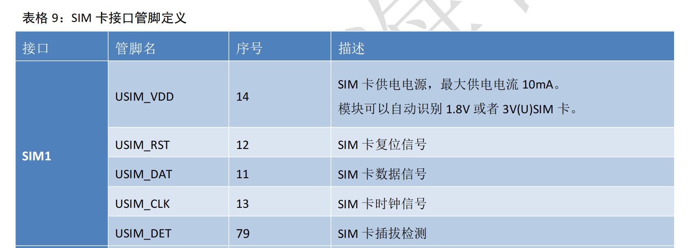
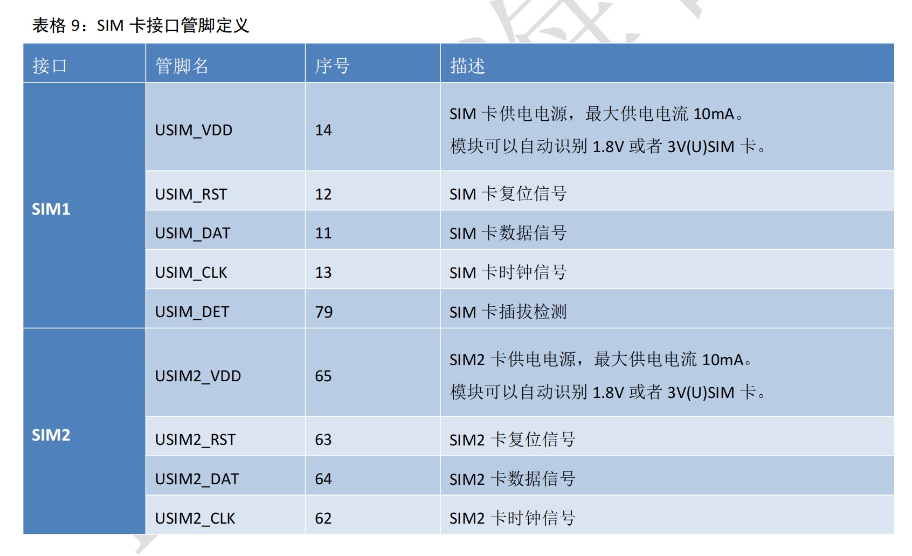

# SIM 卡电路很简单，但也有几点需要注意一下

上次水 SIM 卡相关的文章，还是上一次；

上一篇文章里吹牛说跟 SIM 卡相关的问题 还有很多，目的是为下一篇文章埋下伏笔；

伏笔埋是埋下了，但如果债老是不还，心里的石头就老悬在心里，搞不好老板还要扣老子的钱，Shit；

硬着头皮，写吧。

上一篇文章链接如下，没看过的同学可以补下课。

[https://mp.weixin.qq.com/s/M_LQXbyIvZvUCOwhMliVfw](https://mp.weixin.qq.com/s/M_LQXbyIvZvUCOwhMliVfw)

本篇文章我们主要讲 SIM 卡硬件电路相关的基础知识，以及常见的一些坑；

我们以合宙 4G Cat.1 模组经典型号 Air780E 为例进行说明，Air780E 相关资料请见 [www.air780e.cn](http://www.air780e.cn)；

SIM 卡信号

基础的 SIM 卡相关信号有 4 个：

USIM_VDD，SIM 卡供电电源；

USIM_RST，SIM 卡复位信号；

USIM_DAT，SIM 卡数据信号；

USIM_CLK，SIM 卡时钟信号；

参考电路如下：

除了以上 4 个基础信号外，还有两个信号大家经常会遇到：

USIM_VPP，SIM 卡编程电源；

USIM_DET，SIM 卡插入监测；

对于 USIM_VPP，大家经常会的疑问是，我需要接吗？悬空可以吗？

答案是：跟 USIM_VCC 短接在一起也可以，悬空也可以，对于大家所使用的 SIM 卡来说，这个信号就是个摆设；

USIM_VPP，Program voltage，编程电压；

在 A 类(5V 卡)操作条件下，Vpp 触点可用来提供编程或删除内部非易失性存储器单元的内容所需的电压；

Vpp 触电有两种工作：中止状态和编程状态。除非卡请求工作状态，接口设备应将触点保持在中止状态。

在 B 类(3V 卡)操作条件下，该触点保留待未来使用。 实际产品设计时，通常用不到 Vpp，可与 Vcc 短接，或悬空。

(以上信息参考网络 [https://www.peixunla.com/know/1204028.html](https://www.peixunla.com/know/1204028.html))

合宙模组推荐大家直接悬空，你看我们的手册都没介绍这个信号.......

对于 USIM_DET，则跟另外两件事息息相关：

一是你家的模组支持热插拔吗？

二是你家的模组支持双卡单待或者双卡双待吗？

我们先看下 Air780E 硬件手册上对于 USIM_DET 的定义：

所谓热插拔，就是模块在开机状态下插入 SIM 卡，模组软件可以检测到这一事件，并且重新开启 SIM 卡初始化流程； 
知识点：

SIM 卡检测流程默认只在开机时开启，确认无卡后不会再执行 SIM 卡初始化流程；

USIM_DET 相当于告诉模组，SIM 卡插进来了，我通知你了，你再执行一次初始化流程吧；

参考电路如下：

需要说明的是：

1，USIM_DET 为上下边沿电平触发中断，触发系统进行 SIM1 通道的卡在位检测(热插拔检测)；

注意，是 SIM1 通道，不是 SIM2 通道，SIM2 不支持插入检测(接下来我们再介绍 SIM2 通道相关的知识)；

2，从上图可以看出，USIM_DET 上拉到 AGPIO3(一直输出高电平)，卡未插入时为高，插入后为低；

3，为什么上拉到 AGPIO3，而不是常见的 VDD_EXT 电源？说来话长，简单说就是 AGPIO3 可以保证模组在开机后任何状态下都输出为高，而 VDD_EXT 则为了省电在模组休眠状态下会间歇性关闭；

4，我们的文档当前做的还真是一样难尽，明明信号定义是 USIM_DET，参考原理图却写成 USIM_CD......

5，文档问题我们已经注意到了，是当下重点中的重点，请给我们一点点时间，一定会做好！！！！！

合宙的大部分模组型号，都可以支持双卡单待，比如 Air780E；

关于双卡单待，你需要知道的是：

1，双卡单待，顾名思义就是只能一路 SIM 卡在工作，要么是 SIM1，要么是 SIM2，无法像我们的手机那样可以两张 SIM 卡同时工作；

2，合宙支持通过 AT 指令来指定选用哪一路 SIM 卡，大家感兴趣可以看一下合宙 AT 指令手册；

3，模块开机会默认检测 SIM1 通道，在 SIM1 通道检测到 SIM 卡不在位的情况下才会去检测 SIM2 通道；

4，再次强调！USIM_DET 仅支持 SIM1 通道，不支持 SIM2 通道，因此：

对于有内置贴片 SIM 卡的双卡应用场景，建议将贴片 SIM 卡置于 SIM2 通道，外置插拔 SIM 卡座置于 SIM1 通道，以实现优先使用外置插拔 SIM 卡的效果；

5，SIM2 的参考电路跟 SIM1 一样，没有区别(不考虑 USIM_DET 的话)；

除了以上介绍的这些，还有哪些需要注意的呢？

关于 PCB 走线：

1，SIM 卡座布局尽量靠近模组 SIM 接口，走线过长会影响信号质量，也容易受到其它高频信号干扰；

2，USIM_CLK 和 USIM_DATA 走线应包地处理以屏蔽干扰，并远离射频走线和电源走线；

关于电路处理：

1，USIM_VDD 并联 33pF 和 1uF 电容到地，如果 SIM_VDD 走线过长，必要时也可增加一个 4.7uF 电容；

2，USIM_CLK、USIM_DATA 和 USIM_RST 并联 33pF 电容到地，防止射频信号干扰；

3，因模组设计差异，合宙有的模组型号内部 USIM_DATA 已上拉至 USIM_VDD，有的模组型号则内部没有这样处理，您选用的模组若内部没做 USIM_DAT 上拉，建议 USIM_DAT 通过 10KΩ 电阻上拉到 USIM_VDD，增加 USIM_DAT 驱动能力；

4，建议在 SIM 卡座附近设计 ESD 保护，选择最大反向工作电压为 5V 的 TVS 管，寄生电容小于 10pF，布局位置尽量靠近卡座引脚；

5，USIM_DTA、USIM_CLK、USIM_RST 三个信号线建议预留端接电阻 22Ω 可抑制 EMI 杂散传输；

接下来，重点介绍两点最常见的避坑指南！

**一，电容、电阻、TVS 管参数选取不当，导致读卡不良；**

通常来说，在考虑电容、电阻、TVS 管等参数时，需重点关注以下三个问题：

1，电容容值不宜选取过大，过大会导致无法过滤来自射频干扰、SIM 卡信号波形变缓，甚至致读卡失败；

2，端接电阻值不宜过大，过大会导致信号驱动能力下降及波形异常；

3，TVS 管寄生电容不宜过大，过大会导致波形变缓，读卡失败；

(这下你知道各大模组公司的 FAE 在面对你的 SIM 卡技术问题时通常会让你把这些元器件都拿掉试试的原因了吧？）

**二，SIM 卡检测引脚逻辑错误，导致读卡不良；**

在使用 SIM 卡检测引脚时，客户有时会误用和模组检测逻辑相反的卡座，导致 SIM 卡检测功能异常，或者未将 USIM_DET 上拉至 AGPIO3，导致 SIM 卡无法检测；

因此，客户在选择 SIM 卡座时，需注意检测引脚是否与模组检测逻辑相同，合宙的模组是用 USIM_DET 用高电平表示拔出、低电平表示插入，切勿弄反了检测逻辑；

以上内容均来自合宙 Air780E 硬件设计手册和百度搜索，如有雷同，表示感谢。

说到最后，请教大家一个问题：

SIM，还是 USIM？这俩哥们有什么不同吗？
