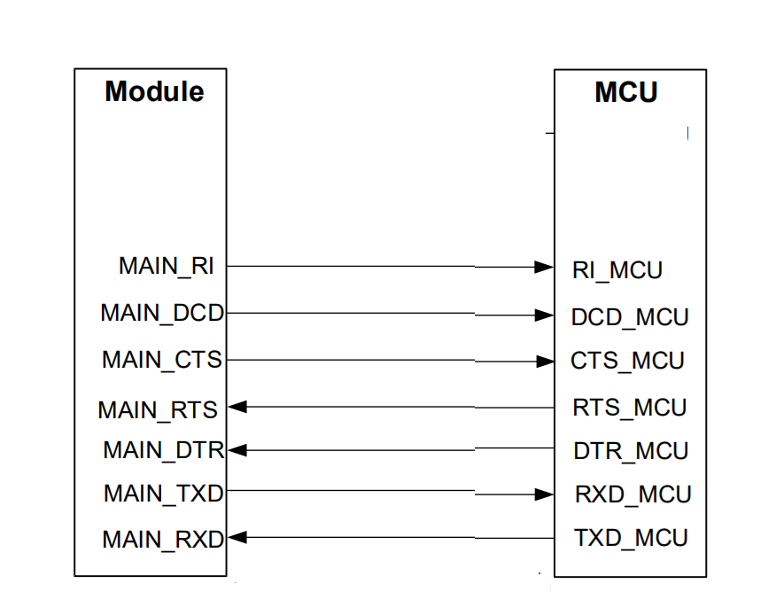

# UART 2通信电路

### 概述

串口作为Air780E模块最最主要的通信接口，承担着控制，数据传输，外设通信等重要功能。基本上绝大部分的Cat.1应用场景都会用到。而Air780E模块的串口特性和使用要求上与通常的MCU串口会有些不同，导致在第一次用Air780E模块做设计时容易踩到一些坑。本文主要从硬件设计的角度，着重讲解串口设计中的一些关键注意点，软件开发或者AT设置方面不做深入探讨。

### 串口相关管脚

Air780E支持3个串口，分别是主串口MAIN_UART, 扩展串口AUX_UART, 调试串口DBG_UART。扩展串口AUX_UART对应的管脚如下：

| **管脚编号**       | **管脚名称** | **描述**             |
| ------------------ | ------------ | -------------------- |
| 扩展串口           |              |                      |
| 28                 | AUX_RXD      | 扩展串口数据接收     |
| 29                 | AUX_TXD      | 扩展串口数据发射     |

### 功能描述

- **扩展串口：**
  - 扩展串口AUX_UART从硬件上的电器特性来说与主串口一样（但是不能支持休眠唤醒功能）。但是AT指令不能直接操控扩展串口，仅仅用于特定应用，比如外接GNSS定位模块，AT指令中封装的定位指令，只能通过扩展串口与GNSS模块通信。对于openCPU 二次开发应用来说，扩展串口则没有这个限制，可以当作通用串口来使用。

### 硬件设计指导

- **串口的连接方式：**
  - 串口的型号命名很容易让人联想到RS232标准的DB9接口，其实不然，模块的串口连接方式与标准RS232连接方式有所不同，如下是标准RS232串口连接方式，特点是交叉连接。

  - 

  - 而模块串口遵循的是早期贺氏(HAYES)公司制定的MODEM串口标准，在这个标准下，DTR,DSR,CTS,RTS信号的功能有所不同。MODEM串口标准标准下DTR, DSR，CTS，RTS采用的是直连方式，如下图

  - 

  - 在逐渐的演变过程中，DCD ,DSR,RI 逐渐演变为其他的独立功能，在物联网串口应用中仅保留T/RX加流控管脚的5线串口的形式，但是CTS ，RTS的命名规则保留了下来，虽然CTS/RTS采用直连的方式，但是实际上模块的CTS管脚起到的功能是标准RTS功能；模块RTS管脚起到的功能是标准CTS功能。连接方式如下：

  - 

 甚至流控管脚也不是必须，就变成了3线串口：

- **串口的电平转换：**

Air780E的串口是TTL电平串口，TTL电平串口会有输入输出判别门限，如下图。

同时，外接MCU或者外设的TTL电平串口同意有判别门限，一般来说，TTL电平的判别门限高低取决于IO供电电平VDD的高低。如果串口双方的判别门限差别较大，一方的输出高电平落在对方的高电平判别门限下，就容易出现误判的现象，虽说Air780E可以通过100管脚来选择串口电平，但也仅有1.8V和3.3V两个档位，无法覆盖全部情况，在串口双方电平不一致的情况，就要增加电平转换电路来转换通信电平。

- 双方模块串口电平差别不大的情况：
  - 例如，模块串口电平3.3V， MCU串口电平3.0V。按照上图判别门限，模块的输入高判别门限为0.7x3.3=2.32V，所以MCU串口高电平输出为3V，高于模块的输入高判别门限，能够稳定判断。这种情况下即使MCU与模块的电平不一致，直接连接也不会造成通信问题。通常这种情况下，无需电平转换，只需要在窗口TX RX型号线上串联限流电阻即可，限流电阻用于减小串口电平不匹配造成的漏电，通常按经验串联1K电阻即可，注意串联电阻不宜过大，会印象串口型号的上升下降时间，从而影响串口信号质量。

  - 

> 注意：不要只看判别门限，还要考虑串口的耐压，即使落在判别门限内，但是一方高电平高于对方的IO耐压值的情况下就不能要串联电阻的方式，还是老老实实加串口电平转换。一般来说双方的电平差不宜超过0.5V

- 晶体管的电平转方案：

在串口波特率不高的情况下（如115200），可以通过NPN晶体管的方式进行电平转换，参考设计如下图，这种方式的优点：成本低； 劣势：低电平下会被三极管的饱和管压降抬高（通常在0.1v左右，不影响通信）；开关速度不够，超过460800波特率时不建议用这种方式。

 设计注意：

1. 模块RXD上拉电源选择，上图选择AGPIO做上拉而没有选择VDD_EXT电源做上拉，是因为VDD_EXT在模块休眠时会关闭，会导致RXD上产生一个低电平，又由于主串口支持休眠唤醒，就导致这个低电平让串口产生中断将模块唤醒，最终导致模块无法休眠。所以在需要休眠的应用设计上，**禁止用VDD_EXT电源上拉串口**。
2. 三极管的基极要用较低电平的一方参考电平来上拉，否则容易找出三级管不能完截止。
3. RXD和TXD的上拉电阻在不影响信号质量的情况下尽量加大，一方面是降低休眠功耗，一方面是降低AGPIO的驱动负荷（Air780E所有AGPIO共享5mA最大驱动电流）。
4. 对于三极管选型并没有严格要求，通用的3904NPN三极管都能满足要求

- 电平转换芯片方案：
  - 电平转换芯片，对成本不敏感的话，优先考虑用电平转芯片，无论速度，可靠性都很完美。对于设计方面只要注意芯片选型，同时模块端参考电平注意用AGPIO3，其他的参考具体芯片参考设计即可，没有太多注意事项。

 考虑到电平转换芯片价格与通道数量成正相关，也可以采用TX RX用双通道电平转换芯片，其他流控信号用晶体管或者分压方式来做电平转换。兼顾性能和成本。

  电平转换芯片选型：

- TXS0102/TXS0104/TXS0108系列，2/4/8通道，品牌TI
- RS0102/RS0104/RS0108系列，2/4/8通道，品牌润石
- SGM4553 ， 双通道，品牌圣邦威

### 总结

虽然串口这个硬件总线原理简单，速率低速，设计也不复杂，但是对于CAT.1通信系统尤其是低功耗物联网应用，串口的设计就会牵涉到休眠和功耗，因此在设计中还是要有足够的重视。

