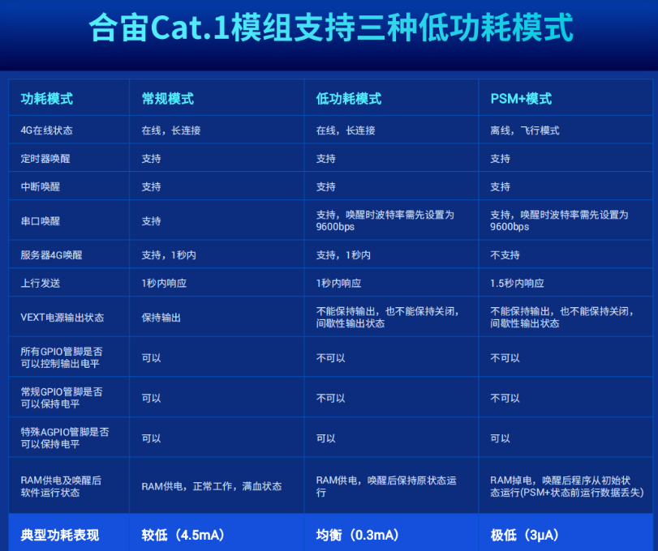
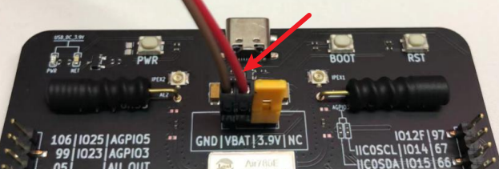
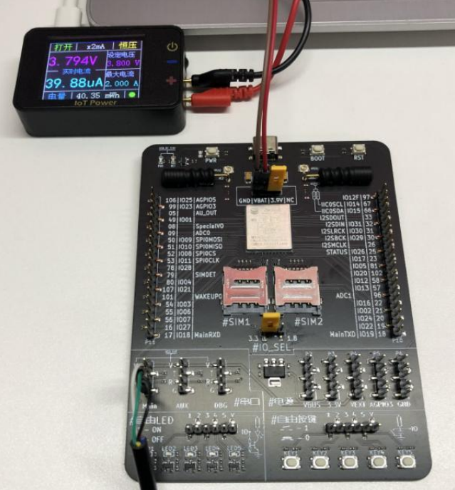

# 准备资料

## 软硬件资料

[780E开发板开发板购买链接](https://item.taobao.com/item.htm?spm=a21n57.1.item.2.3380523c235eiN&priceTId=2147811b17245554816554545e39d2&utparam={"aplus_abtest":"82a3183aeeb4f8b0b7fdcf18a3b3589e"}&id=724722276597&ns=1&abbucket=10&skuId=5208106143672&pisk=f96-9wOXSr4uTqVhFgNDK2yI-QZ0jTIzraSsKeYoOZQAAED34LVepwLA8UAkFUDppMQF-wIU4HTCRwLhZS2G4gJedPYLIRjzf6RHLaLIFKZBbhi7e-V0VgJedynmd52O4NHuWs4JOopXvHgWdvOIhoKHx49BPBgjGhTXRp9CREtX4hhIPQMWcxMH1uLqV3HdOYqo4LeY1vDhHnae5gFxB3XX2P8C2EUU8tBwwFsWkvagQ7U9JEW_oSIVG__k0weTkp7VOwtdlqaHaM1Ak3QuW28hUgXprgF7zip2yaORMlGyDiXRv6OYV8sveUdGHQoIwLCCz9dPwDrNcL_V_FR7gr-AEOAp7I3bPijvPCCdrrkBr1IfkCXmoAvFu6_BvZgR4gXGBgBnSFKnNoExTXRWmu1ITDde6OPkDFqWNXletn-vSoExOXgZFnLgVxlETIRF.)

[780E开发板设计资料](https://cdn.openluat-luatcommunity.openluat.com/attachment/20240819170318674_Air780E_硬件设计手册_V1.3.3.pdf)

[LuatOS-Air780E/500ma电池用10年程序源码demo](https://gitee.com/openLuat/LuatOS-Air780E/tree/master/demo/Air780E的LuatOS开发快速入门文档适配demo/9.500毫安的电池，怎么让Air780E续航10年)

[API使用介绍](https://wiki.luatos.com/api/pm.html)

### 1、780E开发板和SIM卡

### 2、合宙功耗仪

功耗仪使用方法：[⚡ IoT Power - CC - LuatOS 文档](https://wiki.luatos.com/iotpower/cc/index.html)

配套的上位机：[ PC客户端 - LuatOS 文档](https://wiki.luatos.com/iotpower/pc.html)

## 低功耗介绍
你还在为糟糕的NB网络环境发愁吗？
你还在为CAT1功耗无法再降低而烦恼吗？
你还在为有更加便宜的卡商，但只能使用联通卡而头疼吗？
合宙为您推出解决方案：
超低功耗，PSM+　模式
功耗低至3微安，一天上报一次，可以让您的５００毫安时电池能用１０年，并可以在1.5秒内上传成功。
任何卡都可以支持，PSM+，可以让您的供应商体系更加合理

1，三种功耗模式简捷定义
(1)常规模式;
网络在线状态，随时响应服务器命令，CPU满频运行，外设功能全部可用，比如，所有GPIO电平都可以控制
(2)低功耗模式;
网络在线状态，随时响应服务器命令，CPU降频运行，外设功能部份可用，比如，仅有AGPIO可以保持电平
(3)PSM+模式;
网络离线状态，无法响应服务器命令，CPU降频运行，外设功能部份可用，比如，仅有AGPIO可以保持电平;

2，关于常规GPIO和特殊AGPIO的说明:

合宙Air700系列/Air780系列模组在不同功耗模式下不同GPIO的功能表现不一致，其中:部分在低功耗模式和PSM+模式下可以保持电平的为特殊AGPIO(有些文档中有时也会被写为AON GPIOAlwaysON，一直保持的意思)，
部分常规GPI0的电平状态在低功耗模式和PSM+模式下不可保持(相对常规模式下常规GPIO电平的运行状态而言)，请务必注意;
关于常规GPIO和特殊AGPIO的相关说明，详见具体型号的硬件设计手册或其它资料，比如，Air780E资料链接：[780e引脚资料链接](https://cdn.openluat-luatcommunity.openluat.com/attachment/20240813172012124_Air780E&Air780EG&Air780EX&Air700E_GPIO_table_20240812.pdf)

### 低功耗不同模式的区别

## 低功耗模式的供电方法

注意：使用USB供电时无法进入低功耗模式

所以烧录脚本后，使用GND/VBAT这两个引脚供电，电压3.3V - 4.3V

**注意**

1. 不同的信号会导致功耗不一致，最好和最差相差40%
2. 使用功耗测试工具，来看看你的电池能用多久，建议您保持15% 以上的余量。

[合宙PSM+功耗计算](https://wiki.luatos.com/_static/tools/psmplus/index.html)
