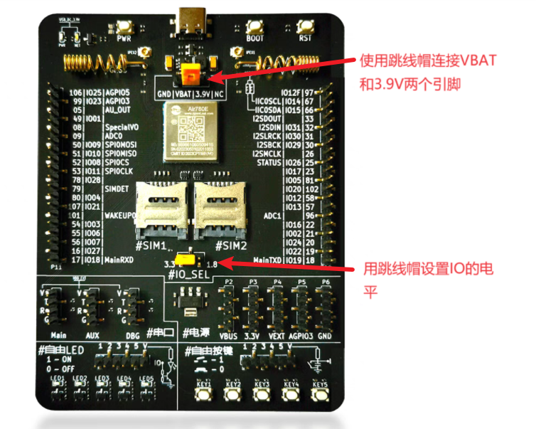
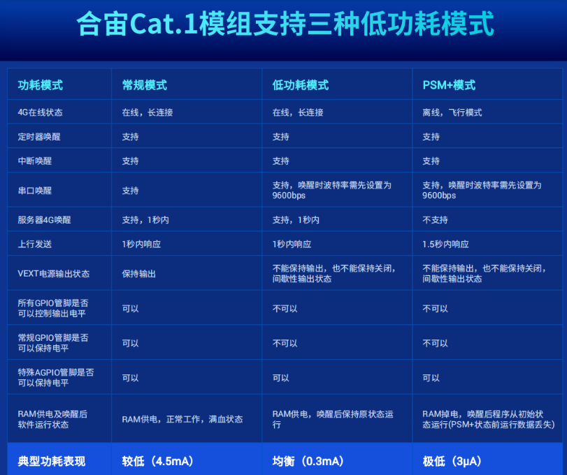
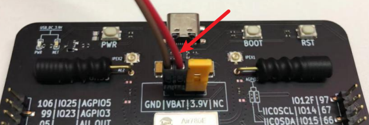
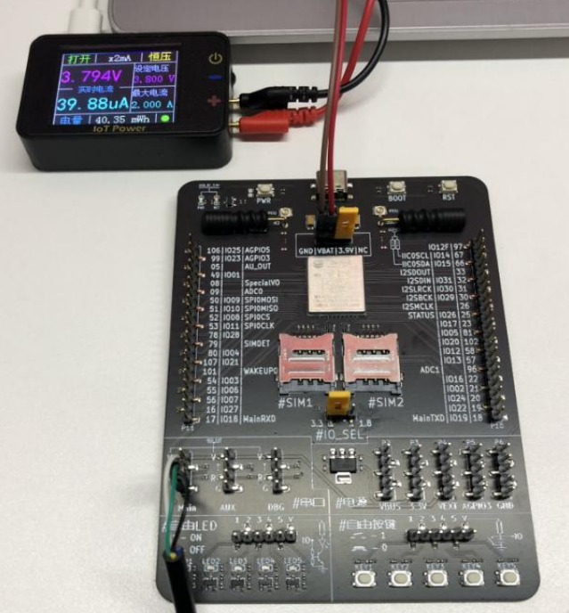
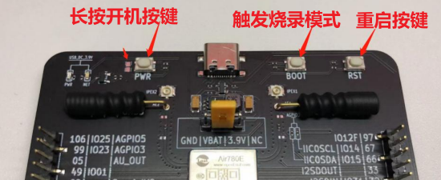
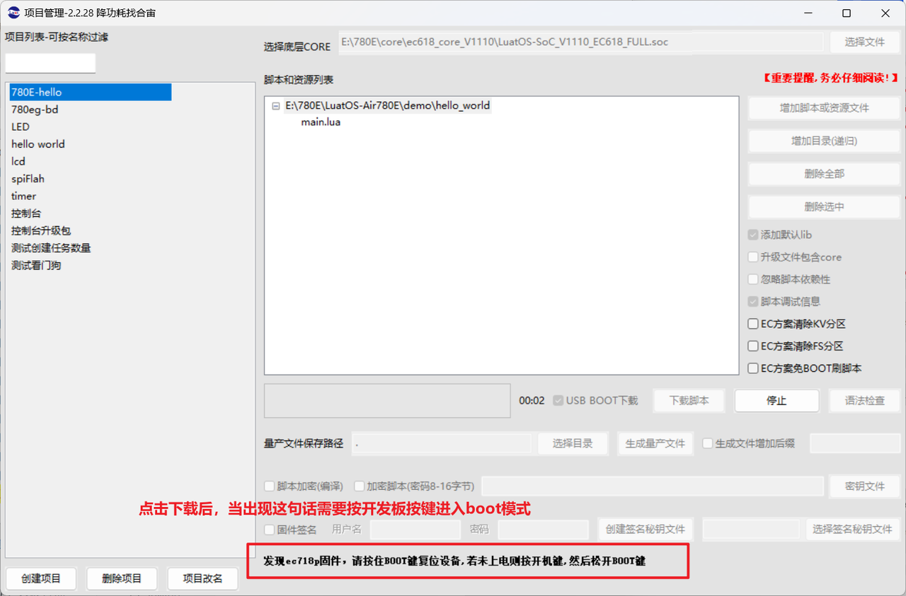

## 介绍

低功耗是合宙4G Cat.1模组最重要的特性之一；
合宙4G Cat.1模组有三种低功耗模式，分别有自己的特点；

## 准备资料

### 软硬件资料

[780E开发板开发板购买链接](https://item.taobao.com/item.htm?spm=a21n57.1.item.2.3380523c235eiN&priceTId=2147811b17245554816554545e39d2&utparam={"aplus_abtest":"82a3183aeeb4f8b0b7fdcf18a3b3589e"}&id=724722276597&ns=1&abbucket=10&skuId=5208106143672&pisk=f96-9wOXSr4uTqVhFgNDK2yI-QZ0jTIzraSsKeYoOZQAAED34LVepwLA8UAkFUDppMQF-wIU4HTCRwLhZS2G4gJedPYLIRjzf6RHLaLIFKZBbhi7e-V0VgJedynmd52O4NHuWs4JOopXvHgWdvOIhoKHx49BPBgjGhTXRp9CREtX4hhIPQMWcxMH1uLqV3HdOYqo4LeY1vDhHnae5gFxB3XX2P8C2EUU8tBwwFsWkvagQ7U9JEW_oSIVG__k0weTkp7VOwtdlqaHaM1Ak3QuW28hUgXprgF7zip2yaORMlGyDiXRv6OYV8sveUdGHQoIwLCCz9dPwDrNcL_V_FR7gr-AEOAp7I3bPijvPCCdrrkBr1IfkCXmoAvFu6_BvZgR4gXGBgBnSFKnNoExTXRWmu1ITDde6OPkDFqWNXletn-vSoExOXgZFnLgVxlETIRF.)

[780E开发板设计资料](https://cdn.openluat-luatcommunity.openluat.com/attachment/20240819170318674_Air780E_硬件设计手册_V1.3.3.pdf)

[LuatOS-Air780E/500ma电池用10年程序源码demo](https://gitee.com/openLuat/LuatOS-Air780E/tree/master/demo/Air780E的LuatOS开发快速入门文档适配demo/9.500毫安的电池，怎么让Air780E续航10年)

[API使用介绍](https://wiki.luatos.com/api/pm.html)

#### 1、780E开发板和SIM卡




#### 2、合宙功耗仪

功耗仪使用方法：[⚡ IoT Power - CC - LuatOS 文档](https://wiki.luatos.com/iotpower/cc/index.html)

配套的上位机：[ PC客户端 - LuatOS 文档](https://wiki.luatos.com/iotpower/pc.html)


### 低功耗介绍

你还在为糟糕的NB网络环境发愁吗？
你还在为CAT1功耗无法再降低而烦恼吗？
你还在为有更加便宜的卡商，但只能使用联通卡而头疼吗？
合宙为您推出解决方案：
超低功耗，PSM+　模式
功耗低至3微安，一天上报一次，可以让您的５００毫安时电池能用１０年，并可以在1.5秒内上传成功。
任何卡都可以支持，PSM+，可以让您的供应商体系更加合理

1，三种功耗模式简捷定义
(1)常规模式;
网络在线状态，随时响应服务器命令，CPU满频运行，外设功能全部可用，比如，所有GPIO电平都可以控制
(2)低功耗模式;
网络在线状态，随时响应服务器命令，CPU降频运行，外设功能部份可用，比如，仅有AGPIO可以保持电平
(3)PSM+模式;
网络离线状态，无法响应服务器命令，CPU降频运行，外设功能部份可用，比如，仅有AGPIO可以保持电平;

2，关于常规GPIO和特殊AGPIO的说明:

合宙Air700系列/Air780系列模组在不同功耗模式下不同GPIO的功能表现不一致，其中:部分在低功耗模式和PSM+模式下可以保持电平的为特殊AGPIO(有些文档中有时也会被写为AON GPIOAlwaysON，一直保持的意思)，
部分常规GPI0的电平状态在低功耗模式和PSM+模式下不可保持(相对常规模式下常规GPIO电平的运行状态而言)，请务必注意;
关于常规GPIO和特殊AGPIO的相关说明，详见具体型号的硬件设计手册或其它资料，比如，Air780E资料链接：[780e引脚资料链接](https://cdn.openluat-luatcommunity.openluat.com/attachment/20240813172012124_Air780E&Air780EG&Air780EX&Air700E_GPIO_table_20240812.pdf)

### 低功耗不同模式的区别




### 低功耗模式的供电方法

注意：使用USB供电时无法进入低功耗模式

所以烧录脚本后，使用GND/VBAT这两个引脚供电，电压3.3V - 4.3V





**注意**

1. 不同的信号会导致功耗不一致，最好和最差相差40%
2. 使用功耗测试工具，来看看你的电池能用多久，建议您保持15% 以上的余量。

[合宙PSM+功耗计算](https://wiki.luatos.com/_static/tools/psmplus/index.html)

## 编写脚本

此次使用的是psm_plus.lua的demo，该demo中使开发板处于PSM+极致功耗模式，同时支持定时器唤醒，外部引脚唤醒，串口唤醒三种模式。

1、首先定义一下服务器ip地址，端口号和定时器唤醒时间

```lua
local server_ip = "112.125.89.8"    --如果用TCP服务器，目前需要在用极致功耗模式时先断开服务器
local server_port = 46391  --换成自己的
local period = 3* 60* 60 * 1000 --3小时唤醒一次
```

2、获取唤醒的原因，并包含libnet库

```lua
libnet库是socket库的扩展版，socket是异步非阻塞api，linet是同步阻塞api
local reason, slp_state = pm.lastReson()  --获取唤醒原因
log.info("wakeup state", pm.lastReson())
local libnet = require "libnet"
```

3、定义libnet的任务标志和未处理消息回调函数

```lua
local d1Name = "D1_TASK"
local function netCB(msg)
    log.info("未处理消息", msg[1], msg[2], msg[3], msg[4])
end
```

4、创建执行函数.

```lua
local function testTask(ip, port)
    --1、首先根据唤醒原因，给变量txData赋予不同的值，用于发给服务器
    local txData
    if reason == 0 then
        txData = "normal wakeup"
    elseif reason == 1 then
        txData = "timer wakeup"
    elseif reason == 2 then
        txData = "pad wakeup"
    elseif reason == 3 then
        txData = "uart1 wakeup"
    end
    
    --2、退出飞行模式，为了降低功耗，进入psm+前进入飞行模式，唤醒后需要主动退出
    if slp_state > 0 then
        mobile.flymode(0,false) 
    end
    
    --3、关闭wakeup0引脚
    gpio.close(32)
    
    --4、配置联网
    local netc, needBreak
    local result, param, is_err
    
    --创建socket套接字
    netc = socket.create(nil, d1Name)
    --打开debug信息
    socket.debug(netc, false)
    --配置network一些信息
    socket.config(netc) -- demo用TCP服务器，目前需要在用极致功耗模式时先断开服务器
    --用来记录重连次数
    local retry = 0
    while retry < 3 do
        --[[获取内存信息，
            @param1 “sys”系统内存, “lua”虚拟机内存,”psram”psram内存, 默认为lua虚拟机内存
            @return1 总内存大小,单位字节
            @return2 当前已使用的内存大小,单位字节
            @return3 历史最高已使用的内存大小,单位字节
            ]]
        log.info(rtos.meminfo("sys"))   
        --[[阻塞等待网卡的网络连接
            @param1 任务标志
            @param2 超时时间，填0或空，表示没有超时一直等待
            @param3 后面的参数和socket保持一致
            @return 失败或者超时返回false 成功返回true
            ]]
        result = libnet.waitLink(d1Name, 0, netc)
        --[[阻塞等待ip或域名连接，如果加密还会等握手完成
            @param1 任务标志
            @param2 超时时间，填0或空，表示没有超时一直等待
            @param3 后面的参数和socket保持一致
            @return 失败或者超时返回false 成功返回true
            ]]
        result = libnet.connect(d1Name, 5000, netc, ip, port)
        if result then
            log.info("服务器连上了")
            --[[阻塞等待数据发送完成
                @param1 任务标志
                @param2 超时时间
                @param... 后面的参数和socket保持一致
                @return1 失败或者超时返回false，缓冲区满了或者成功返回true
                @return2 缓存区是否满了
                ]]
            result, param = libnet.tx(d1Name, 15000, netc, txData)
            if not result then
                log.info("服务器断开了", result, param)
                break
            else
                needBreak = true
            end
        else
            log.info("服务器连接失败")
        end
        --[[阻塞等待网络断开连接
            @param1 任务标志
            @param2 超时时间，填0或空，表示没有超时一直等待
            @param3 socket.create返回的netc
            ]]
        libnet.close(d1Name, 5000, netc)
        retry = retry + 1
        --向服务器发送一个数据成功，跳出循环
        if needBreak then
            break
        end
    end
    
    --5、配置串口、wakeup、定时器唤醒
    uart.setup(1, 9600)  --配置uart1，外部唤醒用
    gpio.setup(23,nil)
    gpio.close(35)  --这里pwrkey接地才需要，不接地通过按键控制的不需要
    gpio.setup(32, function() --配置wakeup中断，外部唤醒用
        log.info("gpio")
    end, gpio.PULLUP, gpio.FALLING)
    pm.dtimerStart(3, period)  --启动深度休眠定时器
    
    --6、进入低功耗模式
    mobile.flymode(0,true)     --进入飞行模式
    pm.power(pm.WORK_MODE,3)   --进入极致功耗模式
    log.info(rtos.meminfo("sys"))   --打印系统内存信息
    sys.wait(15000)   --demo演示唤醒时间是一分钟，如果15s后模块重启，则说明进入极致功耗模式失败，
    log.info("进入极致功耗模式失败，尝试重启")
    rtos.reboot()
end

sysplus.taskInitEx(testTask, d1Name, netCB, server_ip, server_port)
```

## 烧录代码到硬件

### （1）正确连接电脑和4G模组电路板

   使用带有数据通信功能的数据线，不要使用仅有充电功能的数据线；

### （2）识别4G模组的boot引脚

   在下载之前，要用模组的boot引脚触发下载， 也就是说，要把4G模组的boot引脚拉到 1.8v，或者直接把boot引脚和VDD_EXT引脚相连。我们要在按下BOOT按键时让模块开机，就可以进入下载模式了。

​    具体到 Air780E开发板，

1、当我们模块没开机时，按着BOOT键然后长按PWR开机。

2、当我们模块开机时，按着BOOT键然后点按重启键即可。



### （3）识别电脑的正确端口

​     判断是否进入BOOT模式：模块上电，此时在电脑的设备管理器中，查看串口设备， 会出现一个端口表示进入了boot下载模式，如下图所示：


​    当设备管理器出现了3个连续数字的com端口，并且每个数字都大于4，这时候， 硬件连接上就绪状态，恭喜你，可以进行烧录了！

### （4）新建项目

​    首先，确保你的 Luatools 的版本，上大于 2.2.13 版本的。

​    在 Luatools 的左上角上有版本显示的，如图所示：


Luatools 版本没问题的话， 就点击 LuaTOols 右上角的“项目管理测试”按钮，如下图所示：


 这时会弹出项目管理和烧录管理的对话框，如下图：

 1、新建一个项目

**注意：这里截图使用的hello world项目的烧录教程，烧录的时候要将脚本换成本次demo的。**


### （5） 开始烧录

选择780E板子对应的底层core和刚改的main.lua脚本文件。下载到板子中。




点击下载后，我们需要进入boot模式才能正常下载，在(3)(4)小节已经介绍了如何进入boot模式。


## 烧录问题排查

   如果你在烧录过程中遇到了问题， 请点击如下链接，进行烧录的问题排查。

**[详细的烧录操作步骤参考此处](https://doc.openluat.com/wiki/52?wiki_page_id=5071#_23)**

## 验证功能

1、低功耗PMS+模式功耗


2、wakeup0引脚唤醒并向服务器发送数据的功耗状态


3、串口唤醒并向服务器发送数据的功耗状态


4、定时器唤醒并向服务器发送数据的功耗状态


## 扩展

除了PSM+模式外，还有可以使用常规模式和低功耗模式，你可以测试一下数据。

## 总结

本例程实现了测量780E，在PSM+低功耗模式下的功耗，还有通过wakeup引脚，uart，timer唤醒后上传数据时的功耗。
