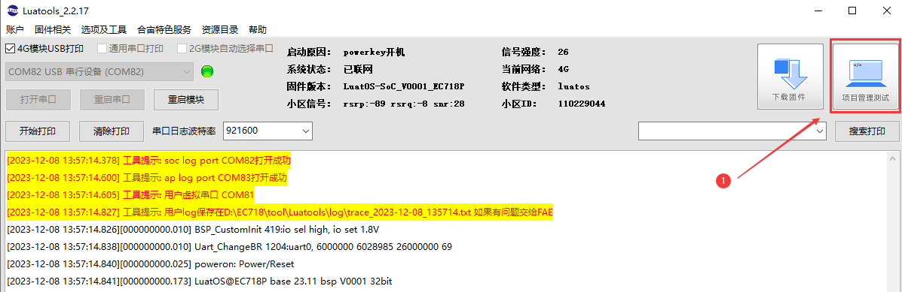

## 介绍

使用780E开发板读取温湿度数据，并将数据存到文件系统中。

## 编写脚本

### （一）准备资料

[780E开发板购买链接](https://item.taobao.com/item.htm?spm=a21n57.1.item.2.3380523c235eiN&priceTId=2147811b17245554816554545e39d2&utparam={"aplus_abtest":"82a3183aeeb4f8b0b7fdcf18a3b3589e"}&id=724722276597&ns=1&abbucket=10&skuId=5208106143672&pisk=f96-9wOXSr4uTqVhFgNDK2yI-QZ0jTIzraSsKeYoOZQAAED34LVepwLA8UAkFUDppMQF-wIU4HTCRwLhZS2G4gJedPYLIRjzf6RHLaLIFKZBbhi7e-V0VgJedynmd52O4NHuWs4JOopXvHgWdvOIhoKHx49BPBgjGhTXRp9CREtX4hhIPQMWcxMH1uLqV3HdOYqo4LeY1vDhHnae5gFxB3XX2P8C2EUU8tBwwFsWkvagQ7U9JEW_oSIVG__k0weTkp7VOwtdlqaHaM1Ak3QuW28hUgXprgF7zip2yaORMlGyDiXRv6OYV8sveUdGHQoIwLCCz9dPwDrNcL_V_FR7gr-AEOAp7I3bPijvPCCdrrkBr1IfkCXmoAvFu6_BvZgR4gXGBgBnSFKnNoExTXRWmu1ITDde6OPkDFqWNXletn-vSoExOXgZFnLgVxlETIRF.)

[780E开发板设计资料](https://cdn.openluat-luatcommunity.openluat.com/attachment/20240819170318674_Air780E_硬件设计手册_V1.3.3.pdf)

[LuatOS-Air780E-文件系统的使用-程序源码demo](https://gitee.com/openLuat/LuatOS-Air780E/tree/master/demo/Air780E的LuatOS开发快速入门文档适配demo/8.Air780E的文件系统对温湿度的存储和上报)

[合宙的TCP/UDP测试服务器](https://netlab.luatos.com/)

[API使用介绍](https://wiki.luatos.com/api/io.html)

780E开发板和DHT11


### (二)程序详解

1、首先采集温湿度数据

```lua
 --采集温湿度数据,该引脚需要接开发板上一个带上拉5k电阻的引脚
        local hum,tem,result = sensor.dht1x(7,true)
        log.info("hum:",hum/100,"tem:",tem/100,result)
```

2、在写入前，打印一下开发板文件系统的信息，防止内存不够

```lua
--[[打印文件系统信息
            @param1 获取是否成功
            @param2 总的block数量
            @param3 已使用的block数量
            @param4 block的大小,单位字节
            @param5 文件系统类型,例如lfs代表littlefs
        ]]
        log.info("result,总block,已使用block,block大小,类型",fs.fsstat())
```

3、拼接温湿度和结果数据

```lua
--拼接温湿度和结果数据
        local fullData = hum..tem..tostring(result)
```

4、将温湿度写入文件中

```lua
--将温湿度数据写入文件中
        local res_wri = io.writeFile("/dht1.txt", fullData)
        --打印写入结果
        log.info("writeFile result",res_wri)
```

5、读取写入到文件中的温湿度数据

```lua
--读取温湿度数据
        local readData = io.readFile("/dht1.txt")
        --[[string.sub(s,i,j)
            返回字符串s中的位置i到位置j的数据
        ]]
        log.info("文件读取的数据","hum:",string.sub(readData,1,4)/100,"tem:",string.sub(readData,5,8)/100,string.sub(readData,9,12))
```

## 烧录代码到硬件

### （1）正确连接电脑和4G模组电路板

   使用带有数据通信功能的数据线，不要使用仅有充电功能的数据线；

### （2）识别4G模组的boot引脚

   在下载之前，要用模组的boot引脚触发下载， 也就是说，要把4G模组的boot引脚拉到 1.8v，或者直接把boot引脚和VDD_EXT引脚相连。我们要在按下BOOT按键时让模块开机，就可以进入下载模式了。

​    具体到 Air780E开发板，

1、当我们模块没开机时，按着BOOT键然后长按PWR开机。

2、当我们模块开机时，按着BOOT键然后点按重启键即可。


### （3）识别电脑的正确端口

​     判断是否进入BOOT模式：模块上电，此时在电脑的设备管理器中，查看串口设备， 会出现一个端口表示进入了boot下载模式，如下图所示：


​    当设备管理器出现了3个连续数字的com端口，并且每个数字都大于4，这时候， 硬件连接上就绪状态，恭喜你，可以进行烧录了！

### （4）新建项目

​    首先，确保你的 Luatools 的版本，上大于 2.2.13 版本的。

​    在 Luatools 的左上角上有版本显示的，如图所示：


Luatools 版本没问题的话， 就点击 LuaTOols 右上角的“项目管理测试”按钮，如下图所示：



 这时会弹出项目管理和烧录管理的对话框，如下图：

 1、新建一个项目

**注意：这里截图使用的hello world项目的烧录教程，烧录的时候要将脚本换成本次demo的。**


### （5） 开始烧录

选择780E板子对应的底层core和刚改的main.lua脚本文件。下载到板子中。


点击下载后，我们需要进入boot模式才能正常下载，在(3)(4)小节已经介绍了如何进入boot模式。


## 烧录问题排查

   如果你在烧录过程中遇到了问题， 请点击如下链接，进行烧录的问题排查。

**[详细的烧录操作步骤参考此处](https://doc.openluat.com/wiki/52?wiki_page_id=5071#_23)**

## 验证功能


## 扩展

可以尝试将温湿度的数据通过tcp或mqtt上报到服务器

## 常见问题

### 1、文件系统剩余的空间是多少？

这个可以通过函数fs.fsstat()来获取文件系统的信息。它可以返回总的block数量和已使用的数量。还有block的大小，单位字节。还有文件系统的类型。

### 2、为什么文件读取失败？

(1) 如果是本地烧录的文件，检查下文件有没有烧录及完整路径是否正确。

(2) 如果读取的是程序运行过程中动态创建的文件，检查下文件是否创建成功，以及完整路径是否正确。（文件系统空间不足可能会导致文件创建失败）。

## 总结

成功通过780E读取温湿度数据，并将数据存储在文件系统。

