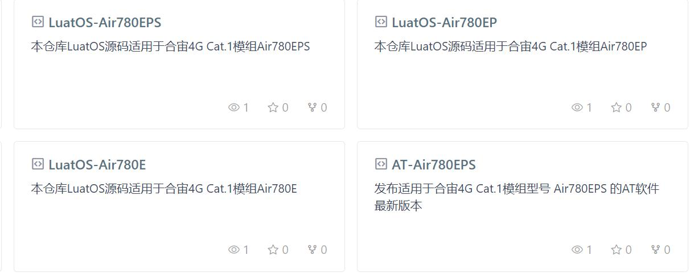
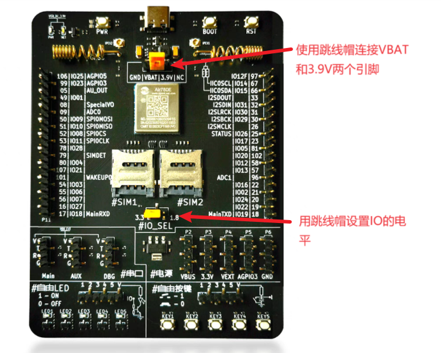
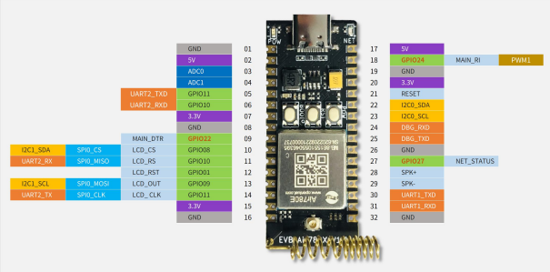

# 必须先要告诉你的一些废话

这里，先要告诉你一些前提条件，虽然听着像是废话， 但是如果你不知道的话，可能后面会比较懵逼，所以还是希望你能够认真看一看这一节。

这个项目的产品定义是：  模组每隔3秒，就往串口输出一次  “ hello world” 字符串。

要想达到这个目的， 这里有必要先介绍一下 LuatOS 在合宙4G模组的运行原理：

合宙的 4G模组， 除了运行4G协议栈之外， 还植入了5.3版本的Lua虚拟机，以及内置的一个脚本代码区。 

4G模组上电之后， 虚拟机会去代码区读取脚本代码的main入口， 并执行这个 main入口函数。

你只需要用 Lua 脚本改写 main 入口函数，并把这个脚本烧录到模组的正确位置，就可以正确运行脚本的代码。

幸运的是， 你只需要用合宙的 LuaTools 工具烧录脚本， 就一定能保证脚本烧录到正确的位置。

在完成这个初始项目之前， 你还需要准备好一套合适的硬件。

合适的硬件是什么呢？

是合宙的能运行LuatOS脚本的4G模组。

怎么知道合宙的哪些 4G模组能运行LuatOS 呢？

要想知道答案，你一定要记住一个网址：

https://gitee.com/openLuat

打开这个代码仓库的网址， 你会看到合宙的公开的一系列代码仓库。

合宙不仅仅公开了每个模组的示例代码， 还把缺陷跟踪也公开了，真是绝对自信！

进入这个网址后，你看到如下的以 LuatOS 开头的代码仓库，就是可以支持LuatOS 开发的型号：

如上图， Air780EPS， Air780EP，Air780E，都是能够运行LuatOS 的模组型号。

你要想运行哪个模组的软件， 就在合宙淘宝店购买对应的模组开发板， 然后进入对应的代码仓库，就可以开发了！

今天，我们用 LuatOS-Air780E 这个仓库作为例子。

所以，我已经事先准备好了 Air780E 开发板，你准备好了吗？

[合宙780E开发板购买链接](https://item.taobao.com/item.htm?id=724722276597)

[780E开发板软硬件资料](https://doc.openluat.com/wiki/21?wiki_page_id=6036)

[780E低功耗验证板使用说明](https://cdn.openluat-luatcommunity.openluat.com/attachment/20231009103600243_%E5%BC%80%E5%8F%91%E6%9D%BFEVB-Air780E-IO%E4%BD%BF%E7%94%A8%E8%AF%B4%E6%98%8EV1.2.0.pdf)

如下图为低功耗验证板：

如果您使用的是780E核心板:

则开发板使用说明为：[780E核心板开发板使用说明](https://cdn.openluat-luatcommunity.openluat.com/attachment/20240419155721583_%E5%BC%80%E5%8F%91%E6%9D%BFCore_Air780E%E4%BD%BF%E7%94%A8%E8%AF%B4%E6%98%8EV1.0.5.pdf)
