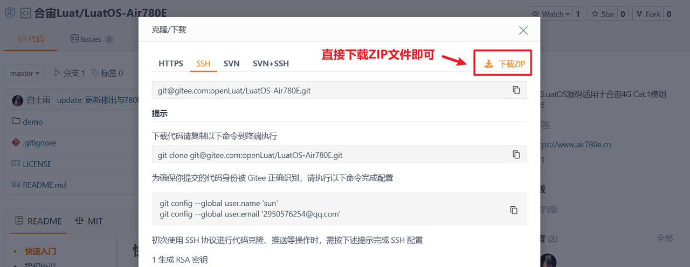
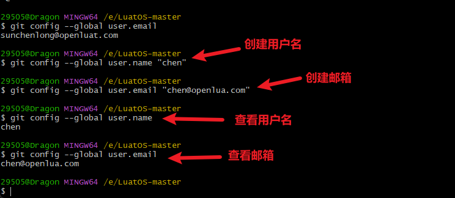
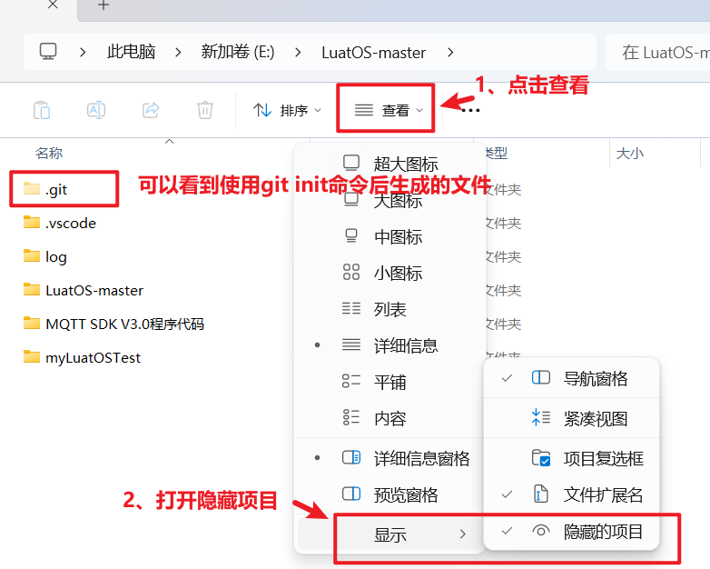
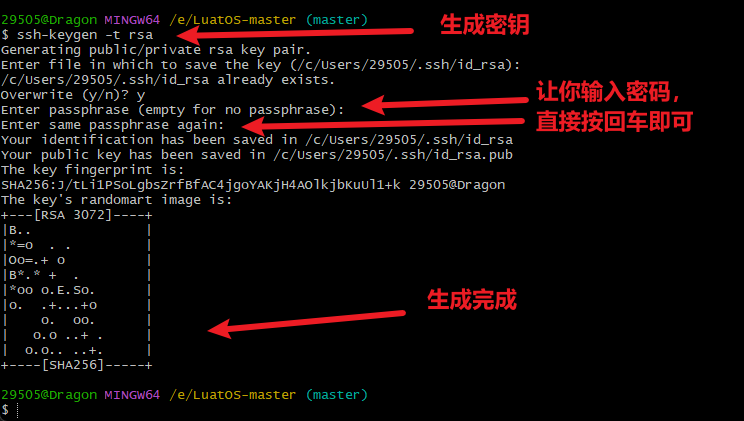
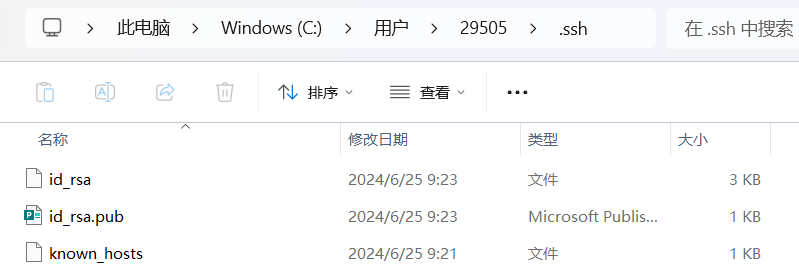
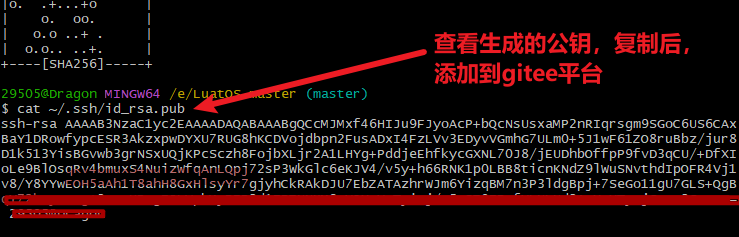
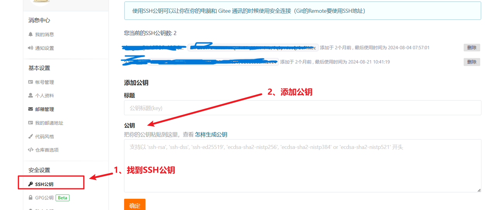
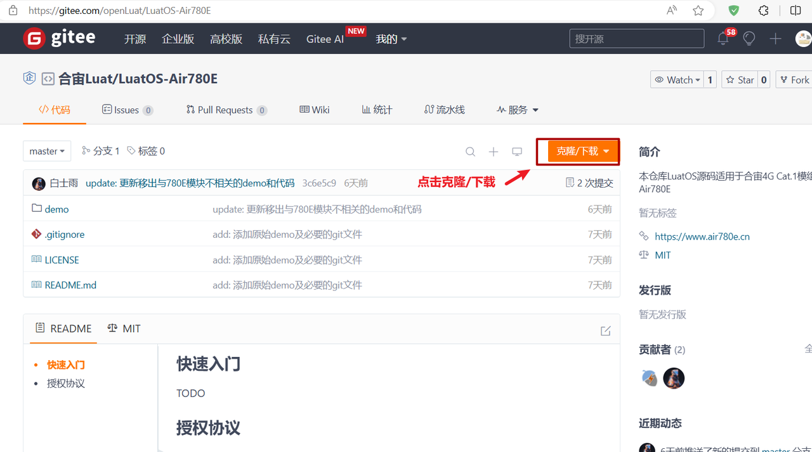

# 下载模组的示例代码

下载示例代码到一个合适的项目目录。从gitee下载代码的教程如下：

[合宙Luat/LuatOS-Air780E代码仓库](https://gitee.com/openLuat/LuatOS-Air780E/tree/master/demo/Air780E的LuatOS开发快速入门文档适配demo/1.Air780E的helloworld教程)

1、最简单快速的方式：
直接进入仓库，点击下载仓库文件




## 2、使用git工具下载

git工具下载地址：[Git - Downloading Package](https://git-scm.com/download/win)

1、进入下载地址后，下载对应的工具


2、双击安装工具


3、双击后，直接下一步安装即可
中途都是一些配置选项，一般使用默认选项即可。


git下载好之后。。。

1、新建一个文件夹，右键打开操作面板


2、设置用户签名：

用户名和邮箱是用来标识是谁提交的代码，输入以下命令

```Bash
  git config --global user.name "用户名"(用户名看情况随意写)
  git config --global user.email "邮箱"(不需要真实存在，看情况随便写)
```



2、初始化本地库，输入以下命令

```Bash
  git init
```


输入这个命令后，可以在当前目录下看到一个.git文件。只有.git文件是用git init命令生成的。其他的没关系。有了.git文件后，当前文件夹就是一个git仓库了，可以与远程的仓库进行连接。



3、从远程仓库下载一个公钥，为了让远程仓库验证自己的身份。输入以下命令

```Bash
ssh-keygen -t rsa #产生公钥
cat ~/.ssh/id_rsa.pub #查看公钥
```



生成的公钥可以在C:/User/用户/.ssh下看到





4、将公钥添加到gitee仓库

gitee:[Gitee - 基于 Git 的代码托管和研发协作平台](https://gitee.com/)

在gitee找到账号设置，然后找到SSH公钥，再添加公钥。



4、克隆仓库到本地，输入以下命令




此时在资源管理器中可以看到git下来的仓库文件

