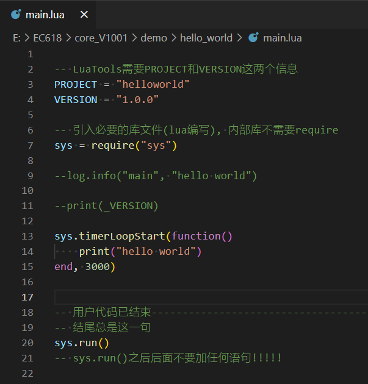

# 修改代码

用编辑器打开你下载下来的 LuatOS-Air780E/demo/hello_world/main.lua 文件。

​     我是习惯用 vscode，后面的例子都用 vscode 做演示了。

​     如果你是用其他的编辑器， 也差不多类似。

其中sys.timerLoopStart(func, timeout)的作用是每隔timeout的时间循环执行回调函数func中的内容。

你把这段代码稍作修改后，改为这样：

然后保存，代码修改工作就大功告成了！

我们实现了每隔3000ms执行一次printf("hello world")

是不是炒鸡简单？
