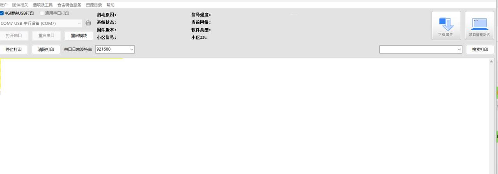
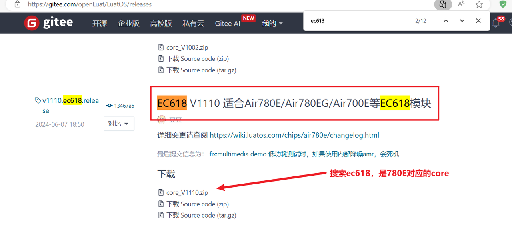

# 烧录代码到硬件

 烧录代码， 需要进行如下几步：

## 1 下载和安装合宙调试工具 LuatTools

​     要想烧录代码， 先要下载合宙的强大的调试工具： Luatools。

​     如果你已经安装使用过 Luatools， 可以直接跳到下个小节： 烧录代码。

​     Luatools 的最新版本的工具介绍和下载地址为：

https://doc.openluat.com/wiki/52?wiki_page_id=5071

Luatools 工具主要有如下几个功能：

   （1）自动从合宙服务器获取最新的合宙模组固件；

   （2）烧录固件和脚本；

   （3）查看和保存模组的串口输出日志；

   （4）简单的串口调试；

Luatools 下载之后， 无需安装， 解压到你的硬盘，点击 Luatools_v2.exe 运行，出现如下界面，就代表 Luatools 安装成功了：

## 2、烧录代码

​    首先要说明一点：  脚本代码， 要和固件的bin文件一起烧录。

### （1）找到烧录的固件文件

​    Air780E 的固件在 Luatools 解压后目录的 resource\718_lua_lod\core_V1001\LuatOS-SoC_V1001_EC718P.soc

 或者去官网下载。底层core下载地址：[LuatOS底层core](https://gitee.com/openLuat/LuatOS/releases)

### （2）正确连接电脑和4G模组电路板

   使用带有数据通信功能的数据线，不要使用仅有充电功能的数据线；

### （3）识别4G模组的boot引脚

   在下载之前，要用模组的boot引脚触发下载， 也就是说，要把4G模组的boot引脚拉到 1.8v，或者直接把boot引脚和VDD_EXT引脚相连。我们要在按下BOOT按键时让模块开机，就可以进入下载模式了。

​    具体到 Air780E开发板，

1、当我们模块没开机时，按着BOOT键然后长按PWR开机。

2、当我们模块开机时，按着BOOT键然后点按重启键即可。

### （4）识别电脑的正确端口

​     判断是否进入BOOT模式：模块上电，此时在电脑的设备管理器中，查看串口设备， 会出现一个端口表示进入了boot下载模式，如下图所示：

​    当设备管理器出现了3个连续数字的com端口，并且每个数字都大于4，这时候， 硬件连接上就绪状态，恭喜你，可以进行烧录了！

### （5）新建项目

​    首先，确保你的 Luatools 的版本，上大于 2.2.13 版本的。

​    在 Luatools 的左上角上有版本显示的，如图所示：

Luatools 版本没问题的话， 就点击 LuaTOols 右上角的“项目管理测试”按钮，如下图所示：

 这时会弹出项目管理和烧录管理的对话框，如下图：

 1、新建一个项目

### （6） 开始烧录

选择780E板子对应的底层core和刚改的main.lua脚本文件。下载到板子中。

点击下载后，我们需要进入boot模式才能正常下载，在(3)(4)小节已经介绍了如何进入boot模式。

## 3，烧录问题排查

   如果你在烧录过程中遇到了问题， 请点击如下链接，进行烧录的问题排查。

**[详细的烧录操作步骤参考此处](https://doc.openluat.com/wiki/52?wiki_page_id=5071#_23)**
