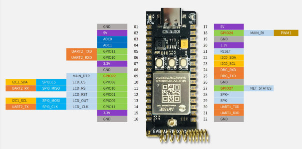
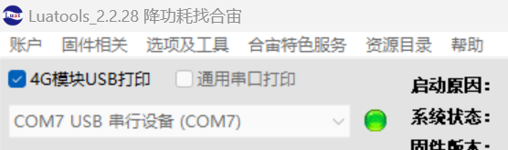

## 介绍

本章将带你快速体验LuatOS的入门

## 必须先要告诉你的一些废话

这里，先要告诉你一些前提条件，虽然听着像是废话，但是如果你不知道的话，可能后面会比较懵逼，所以还是希望你能够认真看一看这一节。

这个项目的产品定义是：模组每隔3秒，就往串口输出一次  “ hello world” 字符串。

要想达到这个目的，这里有必要先介绍一下 LuatOS 在合宙4G模组的运行原理：

合宙的 4G模组，除了运行4G协议栈之外，还植入了5.3版本的Lua虚拟机，以及内置的一个脚本代码区。 

4G模组上电之后， 虚拟机会去代码区读取脚本代码的main入口， 并执行这个 main入口函数。

你只需要用 Lua 脚本改写 main 入口函数，并把这个脚本烧录到模组的正确位置，就可以正确运行脚本的代码。

幸运的是， 你只需要用合宙的Luatools工具烧录脚本， 就一定能保证脚本烧录到正确的位置。

在完成这个初始项目之前，你还需要准备好一套合适的硬件。

合适的硬件是什么呢？

是合宙的能运行LuatOS脚本的4G模组。

怎么知道合宙的哪些4G模组能运行LuatOS呢？

要想知道答案，你可以看我们的选型手册第二页：

[选型手册](https://docs.openluat.com/product/)

模块对应的总代码仓库地址：

https://gitee.com/openLuat

打开这个代码仓库的网址，你会看到合宙的公开的一系列代码仓库。

合宙不仅仅公开了每个模组的示例代码，还把缺陷跟踪也公开了，真是绝对自信！

你要想运行哪个模组的软件， 就在合宙淘宝店购买对应的模组开发板， 然后进入对应的代码仓库，就可以开发了！

今天，我们用 LuatOS-Air780E 这个仓库中的demo作为例子来进行学习。

[780E_LuatOS开发代码仓库](https://gitee.com/openLuat/LuatOS-Air780E/tree/master)

同时，合宙还有强大的社区资料支持,这个网站的LuatOS-SOC接口文档中，可以看到使用的API函数的介绍说明：

[Luatos_API介绍说明](https://wiki.luatos.com/api/supported.html)

在开始之前，我已经事先准备好了 Air780E 开发板，你准备好了吗？

我们的780E开发板有两种，一种是低功耗验证板，一种是核心板。

他们只有在验证低功耗的时候有区别，其他的没什么区别。

比如，核心板并未留出模块的 4V 供电管脚，目前 5V 的供电管脚会经过 DCDC 芯片转换，会有额外耗流。

如果使用的是低功耗验证板：

[合宙780E低功耗验证板购买链接](https://item.taobao.com/item.htm?id=724722276597)

[780E低功耗验证板使用说明](https://cdn.openluat-luatcommunity.openluat.com/attachment/20231009103600243_%E5%BC%80%E5%8F%91%E6%9D%BFEVB-Air780E-IO%E4%BD%BF%E7%94%A8%E8%AF%B4%E6%98%8EV1.2.0.pdf)

[780E开发板软硬件资料](https://doc.openluat.com/wiki/21?wiki_page_id=6036)


如果您使用的是780E核心板:

[780E核心板购买链接](https://item.taobao.com/item.htm?spm=a21xtw.29178619.product_shelf.4.568f1170SrSiYY&id=693774140934&pisk=f87wm1a5SPUaI5s14LT2aNqLdM89WUe7_Z9XisfD1dvMCZ6ViQdxmxxmjp4HGpgb6FZvutJFHdt6SZSKu_CA55Lb6FC9kE27FzTV61LYAQh4AZ8HKId0lVvMiCvgYvy7Fzaq8kekr8sXVa4HWpM1-UESUSKzE_phcsyH1QeflpumzbdwjGaJKq2f-C5eh1Vxoqbe_h7b5zlqZhscw3Q1Grup5_SH-I7YZmJ24ib6-N23rHKcmgtVAAV1Et5hHF_3icvlfOThSglmo68NjndwYAyeENChyexQr75hJO1O8sG0oB6WK1QMuzVJ7FvM8BQbpVvVxib6XEHg3KQFtNjV4JHvthX5kGkm0hApTLNUTja5ghUPA9KiDmKHyBJ71CimmYKWTLNT1mnvxCReF5gl.)

[780E核心板开发板使用说明](https://cdn.openluat-luatcommunity.openluat.com/attachment/20240419155721583_%E5%BC%80%E5%8F%91%E6%9D%BFCore_Air780E%E4%BD%BF%E7%94%A8%E8%AF%B4%E6%98%8EV1.0.5.pdf)

[780E开发板软硬件资料](https://doc.openluat.com/wiki/21?wiki_page_id=6036)



## 下载模组的示例代码

下载示例代码到一个合适的项目目录。从gitee下载代码的教程如下：

[合宙Luat/LuatOS-Air780E代码仓库](https://gitee.com/openLuat/LuatOS-Air780E/tree/master/demo/Air780E的LuatOS开发快速入门文档适配demo/1.Air780E的helloworld教程)

### 1、最简单快速的方式：

直接进入仓库，点击下载仓库文件


### 2、使用git工具下载

git工具下载地址：[Git - Downloading Package](https://git-scm.com/download/win)

1、进入下载地址后，下载对应的工具


2、双击安装工具


3、双击后，直接下一步安装即可
中途都是一些配置选项，一般使用默认选项即可。


git下载好之后。。。

1、新建一个文件夹，右键打开操作面板


2、设置用户签名：

用户名和邮箱是用来标识是谁提交的代码，输入以下命令

```Bash
  git config --global user.name "用户名"(用户名看情况随意写)
  git config --global user.email "邮箱"(不需要真实存在，看情况随便写)
```


3、初始化本地库，输入以下命令

```Bash
  git init
```


输入这个命令后，可以在当前目录下看到一个.git文件。只有.git文件是用git init命令生成的。其他的没关系。有了.git文件后，当前文件夹就是一个git仓库了，可以与远程的仓库进行连接。


4、从远程仓库下载一个公钥，为了让远程仓库验证自己的身份。输入以下命令

```Bash
ssh-keygen -t rsa #产生公钥
cat ~/.ssh/id_rsa.pub #查看公钥
```


生成的公钥可以在C:/User/用户/.ssh下看到


5、将公钥添加到gitee仓库

gitee:[Gitee - 基于 Git 的代码托管和研发协作平台](https://gitee.com/)

在gitee找到账号设置，然后找到SSH公钥，再添加公钥。


6、克隆仓库到本地，输入以下命令


此时在资源管理器中可以看到git下来的仓库文件


## 修改代码

用编辑器打开你下载下来的 LuatOS-Air780E/demo/hello_world/main.lua 文件。

​     我是习惯用 vscode，后面的例子都用 vscode 做演示了。

​     如果你是用其他的编辑器， 也差不多类似。

其中sys.timerLoopStart(func, timeout)的作用是每隔timeout的时间循环执行回调函数func中的内容。

你把这段代码稍作修改后，改为这样：


然后保存，代码修改工作就大功告成了！

我们实现了每隔3000ms执行一次printf("hello world")

是不是炒鸡简单？

## 烧录代码到硬件

 烧录代码， 需要进行如下几步：

### 1 下载和安装合宙调试工具 LuatTools

​     要想烧录代码， 先要下载合宙的强大的调试工具： Luatools。

​     如果你已经安装使用过 Luatools， 可以直接跳到下个小节： 烧录代码。

​     Luatools 的最新版本的工具介绍和下载地址为：

https://doc.openluat.com/wiki/52?wiki_page_id=5071

Luatools 工具主要有如下几个功能：

   （1）自动从合宙服务器获取最新的合宙模组固件；

   （2）烧录固件和脚本；

   （3）查看和保存模组的串口输出日志；

   （4）简单的串口调试；


Luatools 下载之后， 无需安装， 解压到你的硬盘，点击 Luatools_v2.exe 运行，出现如下界面，就代表 Luatools 安装成功了：


### 2 烧录代码

​    首先要说明一点：  脚本代码， 要和固件的bin文件一起烧录。

#### （1）找到烧录的固件文件

​    Air780E 的固件在 Luatools 解压后目录的 resource\718_lua_lod\core_V1001\LuatOS-SoC_V1001_EC718P.soc

 或者去官网下载。底层core下载地址：[LuatOS底层core](https://gitee.com/openLuat/LuatOS/releases)


#### （2）正确连接电脑和4G模组电路板

   使用带有数据通信功能的数据线，不要使用仅有充电功能的数据线；

#### （3）识别4G模组的boot引脚

   在下载之前，要用模组的boot引脚触发下载， 也就是说，要把4G模组的boot引脚拉到 1.8v，或者直接把boot引脚和VDD_EXT引脚相连。我们要在按下BOOT按键时让模块开机，就可以进入下载模式了。

​    具体到 Air780E开发板，

1、当我们模块没开机时，按着BOOT键然后长按PWR开机。

2、当我们模块开机时，按着BOOT键然后点按重启键即可。


#### （4）识别电脑的正确端口

​     判断是否进入BOOT模式：模块上电，此时在电脑的设备管理器中，查看串口设备， 会出现一个端口表示进入了boot下载模式，如下图所示：


​    当设备管理器出现了3个连续数字的com端口，并且每个数字都大于4，这时候， 硬件连接上就绪状态，恭喜你，可以进行烧录了！

#### （5）新建项目

​    首先，确保你的 Luatools 的版本，上大于 2.2.13 版本的。

​    在 Luatools 的左上角上有版本显示的，如图所示：



Luatools 版本没问题的话， 就点击 LuaTOols 右上角的“项目管理测试”按钮，如下图所示：


 这时会弹出项目管理和烧录管理的对话框，如下图：

 1、新建一个项目


#### （6） 开始烧录

选择780E板子对应的底层core和刚改的main.lua脚本文件。下载到板子中。


点击下载后，我们需要进入boot模式才能正常下载，在(3)(4)小节已经介绍了如何进入boot模式。


### 3 烧录问题排查

   如果你在烧录过程中遇到了问题， 请点击如下链接，进行烧录的问题排查。

**[详细的烧录操作步骤参考此处](https://doc.openluat.com/wiki/52?wiki_page_id=5071#_23)**

## 验证功能

烧录完成后，会自动开机，此时电脑的设备管理器中会虚拟出三个端口表示正常开机


Luatools会自动抓取应用日志和系统日志，并且在主界面解析显示应用日志，如下图所示


从打印的日志可以看到，这个4G开发板，在不断的打印 hello world。

你太棒了！ 你成功了！

## 总结

这节我们学会了

1、如何下载LuatOS的core，

2、如何使用烧录工具Luatools，

3、如何编辑lua脚本实现打印hello world
