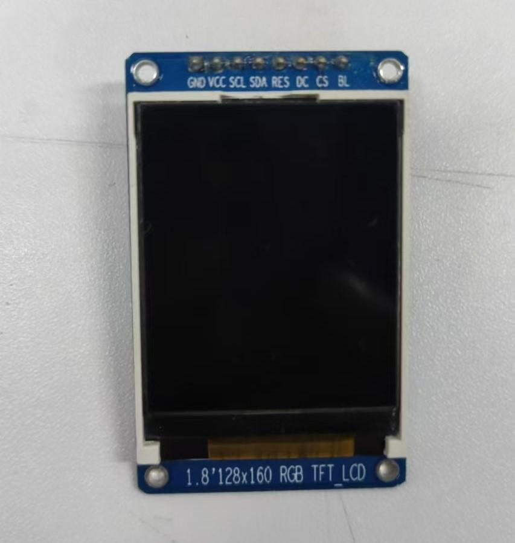

# 硬件准备

## 1、780E开发板和st7789驱动的小屏幕




## 2、硬件管脚连接
```lua
LCD管脚       Air780E管脚            
GND          GND                          
VCC          3.3V                      
SCL          (GPIO11)          
SDA          (GPIO09)         
RES          (GPIO01)       
DC           (GPIO10)       
CS           (GPIO08)       
BL(可以不接)  (GPIO22)  
提示:
1. 只使用SPI的时钟线(SCK)和数据输出线(MOSI), 其他均为GPIO脚
2. 数据输入(MISO)和片选(CS), 虽然是SPI, 但已复用为GPIO, 并非固定,是可以自由修改成其他脚
3. 若使用多个SPI设备, 那么RES/CS请选用非SPI功能脚
4. BL可以不接的
```