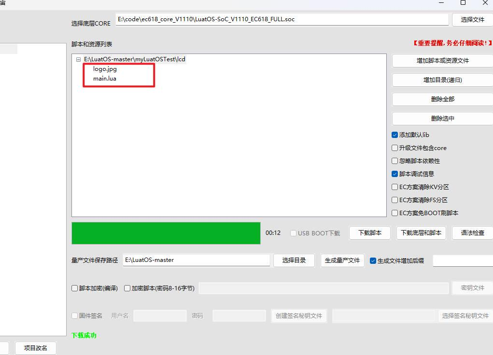
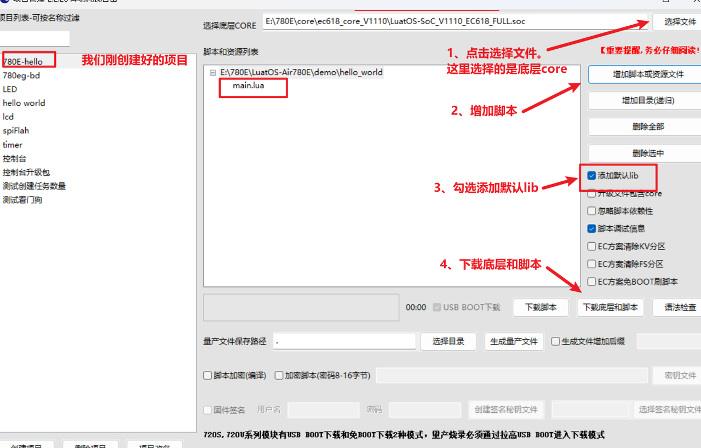
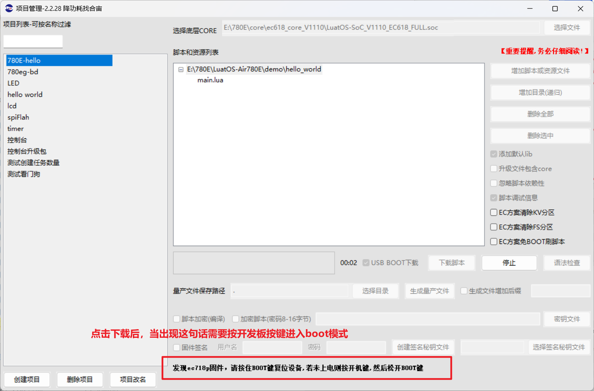
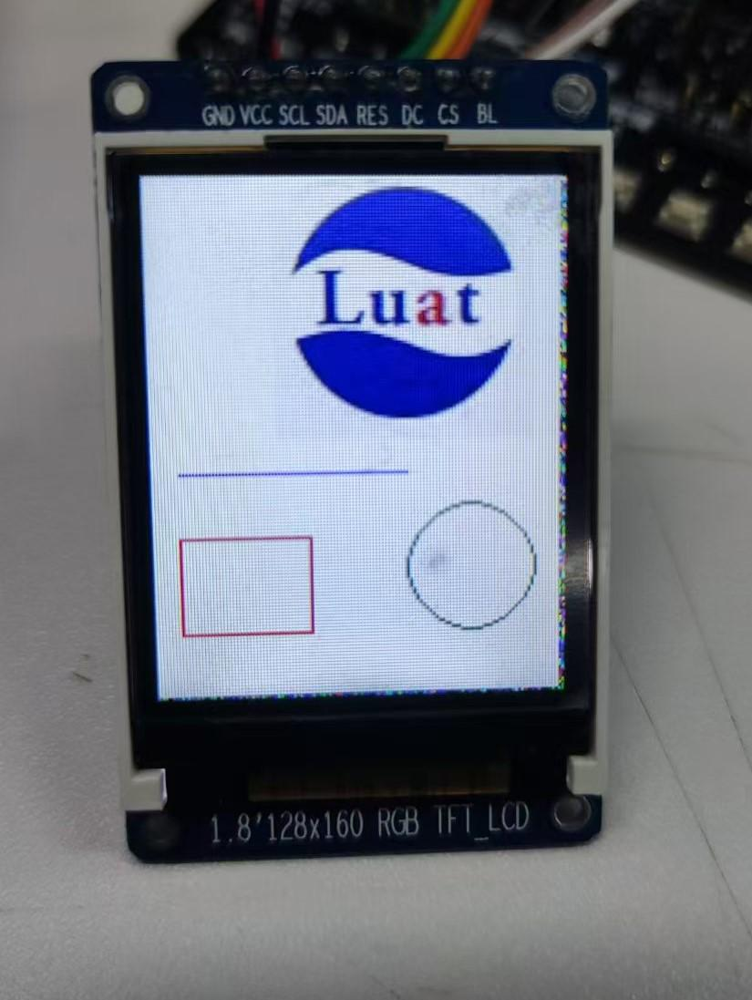

# 介绍

本文档实现了驱动屏幕画图和显示图片。
本文档教程使用屏幕驱动为st7789,大小为1.8寸。

## 硬件准备

[780E开发板购买链接](https://item.taobao.com/item.htm?spm=a21n57.1.item.2.3380523c235eiN&priceTId=2147811b17245554816554545e39d2&utparam={"aplus_abtest":"82a3183aeeb4f8b0b7fdcf18a3b3589e"}&id=724722276597&ns=1&abbucket=10&skuId=5208106143672&pisk=f96-9wOXSr4uTqVhFgNDK2yI-QZ0jTIzraSsKeYoOZQAAED34LVepwLA8UAkFUDppMQF-wIU4HTCRwLhZS2G4gJedPYLIRjzf6RHLaLIFKZBbhi7e-V0VgJedynmd52O4NHuWs4JOopXvHgWdvOIhoKHx49BPBgjGhTXRp9CREtX4hhIPQMWcxMH1uLqV3HdOYqo4LeY1vDhHnae5gFxB3XX2P8C2EUU8tBwwFsWkvagQ7U9JEW_oSIVG__k0weTkp7VOwtdlqaHaM1Ak3QuW28hUgXprgF7zip2yaORMlGyDiXRv6OYV8sveUdGHQoIwLCCz9dPwDrNcL_V_FR7gr-AEOAp7I3bPijvPCCdrrkBr1IfkCXmoAvFu6_BvZgR4gXGBgBnSFKnNoExTXRWmu1ITDde6OPkDFqWNXletn-vSoExOXgZFnLgVxlETIRF.)

[780E开发板设计资料](https://cdn.openluat-luatcommunity.openluat.com/attachment/20240819170318674_Air780E_硬件设计手册_V1.3.3.pdf)

[LuatOS-Air780E-spi驱动小屏幕程序源码demo](https://gitee.com/openLuat/LuatOS-Air780E/tree/master/demo/Air780E的LuatOS开发快速入门文档适配demo/7.通过Air780E驱动SPI小屏幕的详细讲解)

[API使用介绍说明](https://wiki.luatos.com/api/lcd.html)

### 1、780E开发板和st7789驱动的小屏幕


### 2、硬件管脚连接

```lua
LCD管脚       Air780E管脚            
GND          GND                          
VCC          3.3V                      
SCL          (GPIO11)          
SDA          (GPIO09)         
RES          (GPIO01)       
DC           (GPIO10)       
CS           (GPIO08)       
BL(可以不接)  (GPIO22)  
提示:
1. 只使用SPI的时钟线(SCK)和数据输出线(MOSI), 其他均为GPIO脚
2. 数据输入(MISO)和片选(CS), 虽然是SPI, 但已复用为GPIO, 并非固定,是可以自由修改成其他脚
3. 若使用多个SPI设备, 那么RES/CS请选用非SPI功能脚
4. BL可以不接的
```

## 编写脚本

1、设置引脚

```lua
local spi_id    =   0
local pin_reset =   1
local pin_dc    =   10
local pin_cs    =   8
local bl        =   22
```

2、设置并启用SPI

```lua
--[[设置并启用SPI
    @param1 SPI号
    @param2 cs片选引脚
    @param3 CPHA 默认0,可选0/1
    @param4 CPOL 默认0,可选0/1
    @param5 数据宽度,默认8bit
    @param6 波特率,默认20M=20000000
    @param7 大小端, 默认spi.MSB, 可选spi.LSB
    @return spi_device 
]]
spi_lcd = spi.deviceSetup(spi_id,pin_cs,0,0,8,20*1000*1000,spi.MSB,1,0)
```

3、初始化lcd屏幕，配置型号，引脚等

```lua
--[[lcd显示屏初始化
    @param1 lcd类型
    @param2 附加参数,table
    @param3 spi设备,当port = “device”时有效
    @param4 允许初始化在lcd service里运行，默认是false
]]
lcd.init("st7735",{port = port,pin_dc = pin_dc, pin_pwr = bl, pin_rst = pin_reset,direction = 0,w = 128,h = 160,xoffset = 0,yoffset = 0},spi_lcd)
```

4、清屏

```lua
-- 清屏，默认背景色
        lcd.clear()
```

5、显示一张图片

```lua
if lcd.showImage then
            -- 注意, jpg需要是常规格式, 不能是渐进式JPG
            -- 如果无法解码, 可以用画图工具另存为,新文件就能解码了
            -- 判断要显示的图片是否存在
            log.info("文件/luadb/logo.jpg是否存在",io.exists("/luadb/logo.jpg")) 
            --[[显示图片，当前只支持jpg,jpeg
                @param1 x坐标
                @param2 y坐标
                @param3 文件路径
            ]]
            lcd.showImage(40,0,"/luadb/logo.jpg")
            sys.wait(1000)
            
        end
```

6、绘制一条线

```lua
--[[在两点之间画一条线
            @param1 第一个点的X位置
            @param2 第一个点的y位置
            @param3 第二个点的x位置
            @param4 第二个点的y位置
            @param5 绘画颜色,默认前景色[可选]
        ]]
        log.info("lcd.drawLine", lcd.drawLine(10,90,80,90,0x001F))
```

7、绘制一个框

```lua
--[[从x / y位置（左上边缘）开始绘制一个框
            @param1 左上边缘的X位置
            @param2 左上边缘的Y位置
            @param3 右下边缘的X位置
            @param4 右下边缘的Y位置
            @param5 绘画颜色,默认前景色[可选]
        ]]
        log.info("lcd.drawRectangle", lcd.drawRectangle(10,110,50,140,0xF800))
```

8、绘制一个圆

```lua
--[[从x / y位置（圆心）开始绘制一个圆
            @param1 圆心的X位置
            @param2 圆心的Y位置
            @param3 半径
            @param4 绘画颜色,默认前景色[可选]
        ]]
        log.info("lcd.drawCircle", lcd.drawCircle(100,120,20,0x0CE0))
```

## 烧录代码到硬件

### （1）正确连接电脑和4G模组电路板

   使用带有数据通信功能的数据线，不要使用仅有充电功能的数据线；

### （2）识别4G模组的boot引脚

   在下载之前，要用模组的boot引脚触发下载， 也就是说，要把4G模组的boot引脚拉到 1.8v，或者直接把boot引脚和VDD_EXT引脚相连。我们要在按下BOOT按键时让模块开机，就可以进入下载模式了。

​    具体到 Air780E开发板，

1、当我们模块没开机时，按着BOOT键然后长按PWR开机。

2、当我们模块开机时，按着BOOT键然后点按重启键即可。


### （3）识别电脑的正确端口

​     判断是否进入BOOT模式：模块上电，此时在电脑的设备管理器中，查看串口设备， 会出现一个端口表示进入了boot下载模式，如下图所示：


​    当设备管理器出现了3个连续数字的com端口，并且每个数字都大于4，这时候， 硬件连接上就绪状态，恭喜你，可以进行烧录了！

### （4）新建项目

​    首先，确保你的 Luatools 的版本，上大于 2.2.13 版本的。

​    在 Luatools 的左上角上有版本显示的，如图所示：


Luatools 版本没问题的话， 就点击 LuaTOols 右上角的“项目管理测试”按钮，如下图所示：


 这时会弹出项目管理和烧录管理的对话框，如下图：

 1、新建一个项目

**注意：烧录的时候要将图片和脚本一起烧录进去。**



### （5） 开始烧录

选择780E板子对应的底层core和刚改的main.lua脚本文件。下载到板子中。





点击下载后，我们需要进入boot模式才能正常下载，在(3)(4)小节已经介绍了如何进入boot模式。


## 烧录问题排查

   如果你在烧录过程中遇到了问题， 请点击如下链接，进行烧录的问题排查。

**[详细的烧录操作步骤参考此处](https://doc.openluat.com/wiki/52?wiki_page_id=5071#_23)**

## 验证功能

脚本和图片一起烧录进去后，可以在屏幕上看到



## 常见问题

一、为什么屏幕点不亮

1、检查接线是否正确。
2、检查设置的驱动是否正确。

二、显示颜色相反

```lua
 --如果显示颜色相反，请解开下面一行的注释，关闭反色
lcd.invoff()
```

三、图片显示不正常

用电脑自带的画图工具另存为jpg格式。

## 总结

本文档实现了驱动屏幕画图和显示图片。
