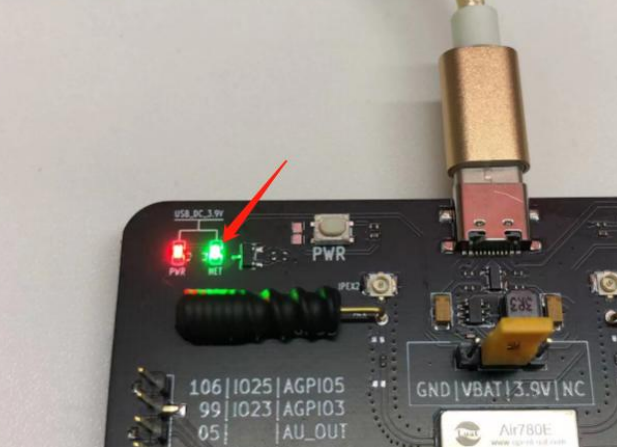
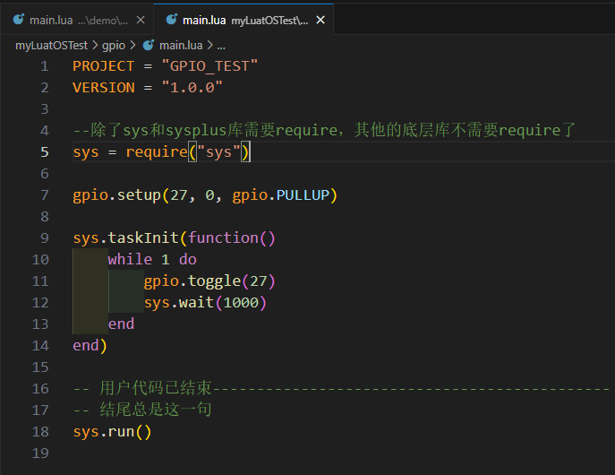
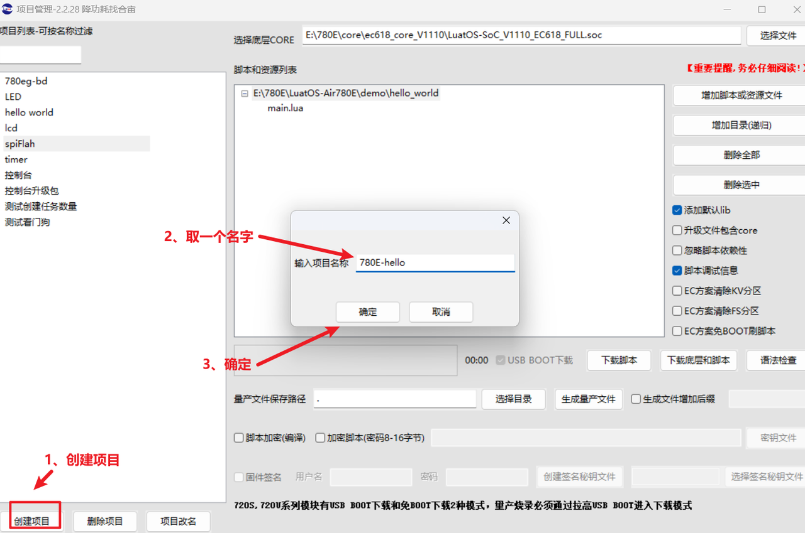

## 介绍

**用Air780E的本地脚本控制灯的亮和灭**

## 编写脚本

[780E开发板购买链接](https://item.taobao.com/item.htm?spm=a21n57.1.item.2.3380523c235eiN&priceTId=2147811b17245554816554545e39d2&utparam={"aplus_abtest":"82a3183aeeb4f8b0b7fdcf18a3b3589e"}&id=724722276597&ns=1&abbucket=10&skuId=5208106143672&pisk=f96-9wOXSr4uTqVhFgNDK2yI-QZ0jTIzraSsKeYoOZQAAED34LVepwLA8UAkFUDppMQF-wIU4HTCRwLhZS2G4gJedPYLIRjzf6RHLaLIFKZBbhi7e-V0VgJedynmd52O4NHuWs4JOopXvHgWdvOIhoKHx49BPBgjGhTXRp9CREtX4hhIPQMWcxMH1uLqV3HdOYqo4LeY1vDhHnae5gFxB3XX2P8C2EUU8tBwwFsWkvagQ7U9JEW_oSIVG__k0weTkp7VOwtdlqaHaM1Ak3QuW28hUgXprgF7zip2yaORMlGyDiXRv6OYV8sveUdGHQoIwLCCz9dPwDrNcL_V_FR7gr-AEOAp7I3bPijvPCCdrrkBr1IfkCXmoAvFu6_BvZgR4gXGBgBnSFKnNoExTXRWmu1ITDde6OPkDFqWNXletn-vSoExOXgZFnLgVxlETIRF.)

[780E开发板设计资料](https://cdn.openluat-luatcommunity.openluat.com/attachment/20240819170318674_Air780E_硬件设计手册_V1.3.3.pdf)

[780E低功耗验证板使用手册](https://cdn.openluat-luatcommunity.openluat.com/attachment/20231009103600243_%E5%BC%80%E5%8F%91%E6%9D%BFEVB-Air780E-IO%E4%BD%BF%E7%94%A8%E8%AF%B4%E6%98%8EV1.2.0.pdf)

[780E本地控制灯的亮灭程序源码demo](https://gitee.com/openLuat/LuatOS-Air780E/tree/master/demo/Air780E的LuatOS开发快速入门文档适配demo/2.用Air780E的本地脚本控制灯的亮和灭)

[API接口说明](https://wiki.luatos.com/api/gpio.html)

###  （一）选择灯的引脚

使用合宙的LuatOS脚本编写程序，只需要两个API即可实现控制小灯的功能。

首先我们选择780E开发板的27号引脚来控制NET指示灯的亮灭。NET灯在开发板上的位置如下：



### （二）程序编写

程序demo：[用Air780E的本地脚本控制灯的亮和灭](https://gitee.com/openLuat/LuatOS-Air780E/tree/master/demo/Air780E的LuatOS开发快速入门文档适配demo/2.用Air780E的本地脚本控制灯的亮和灭)

在主程序编写前，这里我们需要提前了解一个概念，就是LuatOS中的协程，我们可以将类比RTOS中的线程来理解。不同的点在于LuatOS的协程没有任务优先级，所以每个任务都需要有阻塞或延时来给其他任务运行的时间。

 如果不了解RTOS没关系，接下来我给您打个比方:

想象你在厨房里做饭，有几个菜要同时准备。你先开始煮汤（相当于启动协程A），但煮汤需要时间，你不能一直盯着它，所以你决定在汤煮的时候去切菜（启动协程B）。切完菜，你又去检查一下汤的状态（协程A恢复执行），接着你又去炒菜（启动协程C）。每道菜都是分阶段完成的，但你不会等一道菜完全做好才开始另一道，而是根据每道菜的需要，交替地进行。

协程就像你在厨房里同时处理多个菜的过程。每个菜的步骤可以随时暂停（比如汤在煮的时候，你可以去做别的,程序中就是使用延时或阻塞），然后在适当的时机继续进行。而每次暂停和恢复都是有条件的（延时或阻塞结束），比如汤煮开了你才会回来继续处理它。

如果你现在不理解没关系，先用起来慢慢就理解了^_^。

创建一个协程：

```Lua
sys.taskInit(function()
    --程序写在这里，就会被协程执行
end)
```

主程序编写，一共就两个API，一个是gpio.setup()，另一个是gpio.toggle()：

```Lua
PROJECT = "GPIO_TEST"
VERSION = "1.0.0"

--除了sys和sysplus库需要require，其他的底层库不需要require了
sys = require("sys")

--[[
    参数1：27代表27号引脚
    参数2：0代表输入模式
    参数3：gpio.PULLUP代表上拉模式
]]
gpio.setup(27, 0, gpio.PULLUP)

sys.taskInit(function()
    -- 写一个while循环，让小灯一直亮灭
    while 1 do
        -- 翻转27号引脚的状态
        gpio.toggle(27)
        -- 延时1秒
        sys.wait(1000)
    end
end)

sys.run()
```



## 烧录代码到硬件

### （1）正确连接电脑和4G模组电路板

   使用带有数据通信功能的数据线，不要使用仅有充电功能的数据线；

### （2）识别4G模组的boot引脚

   在下载之前，要用模组的boot引脚触发下载， 也就是说，要把4G模组的boot引脚拉到 1.8v，或者直接把boot引脚和VDD_EXT引脚相连。我们要在按下BOOT按键时让模块开机，就可以进入下载模式了。

​    具体到 Air780E开发板，

1、当我们模块没开机时，按着BOOT键然后长按PWR开机。

2、当我们模块开机时，按着BOOT键然后点按重启键即可。


### （3）识别电脑的正确端口

​     判断是否进入BOOT模式：模块上电，此时在电脑的设备管理器中，查看串口设备， 会出现一个端口表示进入了boot下载模式，如下图所示：


​    当设备管理器出现了3个连续数字的com端口，并且每个数字都大于4，这时候， 硬件连接上就绪状态，恭喜你，可以进行烧录了！

### （4）新建项目

​    首先，确保你的 Luatools 的版本，上大于 2.2.13 版本的。

​    在 Luatools 的左上角上有版本显示的，如图所示：


Luatools 版本没问题的话， 就点击 LuaTOols 右上角的“项目管理测试”按钮，如下图所示：


 这时会弹出项目管理和烧录管理的对话框，如下图：

 1、新建一个项目

**注意：这里截图使用的hello world项目的烧录教程，烧录的时候要将脚本换成本次demo的。**



### （5) 开始烧录

选择780E板子对应的底层core和刚改的main.lua脚本文件。下载到板子中。


点击下载后，我们需要进入boot模式才能正常下载，在(3)(4)小节已经介绍了如何进入boot模式。


## 烧录问题排查

   如果你在烧录过程中遇到了问题， 请点击如下链接，进行烧录的问题排查。

**[详细的烧录操作步骤参考此处](https://doc.openluat.com/wiki/52?wiki_page_id=5071#_23)**

## 验证功能

将程序下载进开发板之后（程序下载可参考上一节烧录代码章节），即可看到NET灯每隔1秒闪烁一次。


## 总结

本节我们学会了使用脚本控制开发板上的网络指示灯的亮灭。
