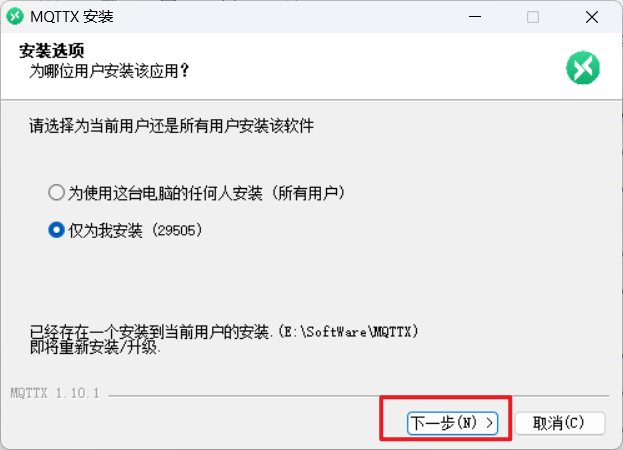
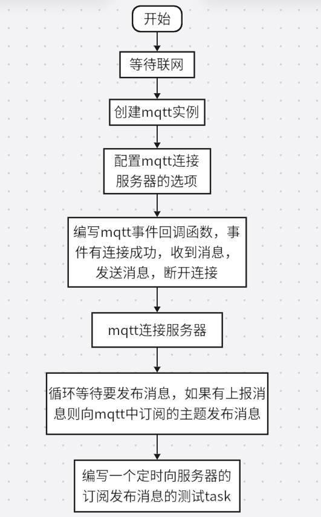
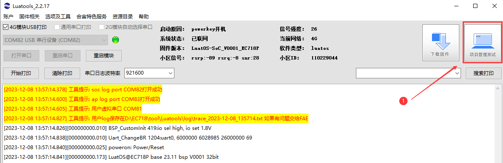
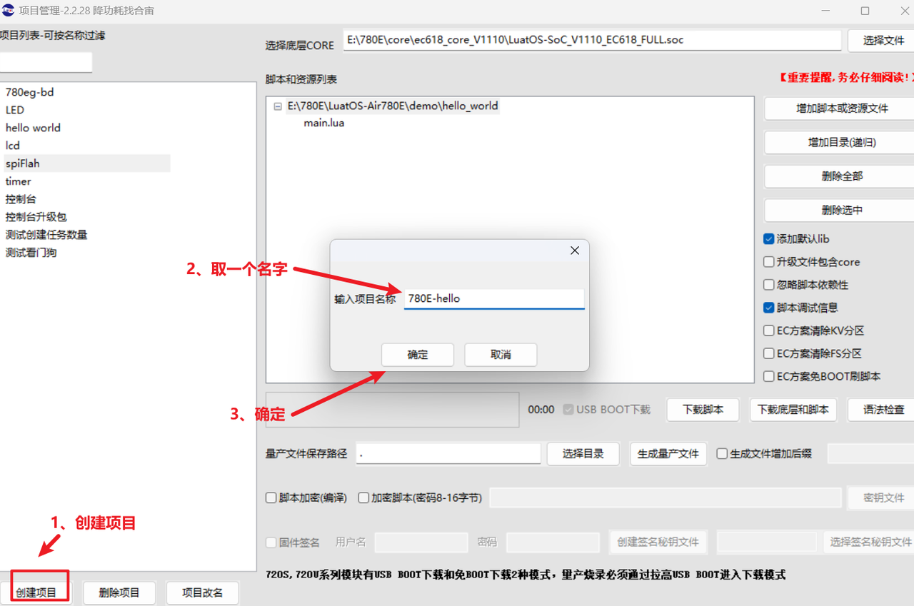
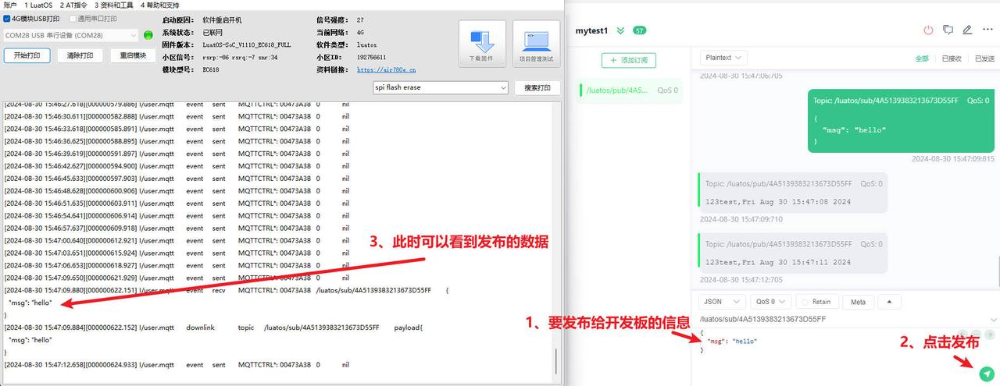

## 介绍

本demo实现了使用780E通过mqtt协议与MQTTX测试工具连接，并实现了数据的上传和下载。

## 编写脚本

### (一) 准备工具

[780E开发板购买链接](https://item.taobao.com/item.htm?spm=a21n57.1.item.2.3380523c235eiN&priceTId=2147811b17245554816554545e39d2&utparam={"aplus_abtest":"82a3183aeeb4f8b0b7fdcf18a3b3589e"}&id=724722276597&ns=1&abbucket=10&skuId=5208106143672&pisk=f96-9wOXSr4uTqVhFgNDK2yI-QZ0jTIzraSsKeYoOZQAAED34LVepwLA8UAkFUDppMQF-wIU4HTCRwLhZS2G4gJedPYLIRjzf6RHLaLIFKZBbhi7e-V0VgJedynmd52O4NHuWs4JOopXvHgWdvOIhoKHx49BPBgjGhTXRp9CREtX4hhIPQMWcxMH1uLqV3HdOYqo4LeY1vDhHnae5gFxB3XX2P8C2EUU8tBwwFsWkvagQ7U9JEW_oSIVG__k0weTkp7VOwtdlqaHaM1Ak3QuW28hUgXprgF7zip2yaORMlGyDiXRv6OYV8sveUdGHQoIwLCCz9dPwDrNcL_V_FR7gr-AEOAp7I3bPijvPCCdrrkBr1IfkCXmoAvFu6_BvZgR4gXGBgBnSFKnNoExTXRWmu1ITDde6OPkDFqWNXletn-vSoExOXgZFnLgVxlETIRF.)

[780E开发板设计资料](https://cdn.openluat-luatcommunity.openluat.com/attachment/20240819170318674_Air780E_硬件设计手册_V1.3.3.pdf)

[LuatOS-Air780E使用MQTT远程控制程序源码demo](https://gitee.com/openLuat/LuatOS-Air780E/tree/master/demo/Air780E的LuatOS开发快速入门文档适配demo/6.通过Air780E的MQTT的连接实现远程控制)

[API使用说明](https://wiki.luatos.com/api/mqtt.html)

2、mqtt测试工具

本demo中使用的测试工具是MQTTX，下载链接如下：[MQTTX：全功能 MQTT 客户端工具](https://mqttx.app/zh)

下载后的安装程序：


双击后点击下一步安装就可以了



### (二)程序详解

#### 1、概念

首先我们先来了解一些mqtt的基本原理。
订阅者订阅了一个主题后，能够接收到对这个主题发布的消息。基本原理如下图：


本源码程序demo实现流程图如下：



关于sys.subscribe()和mqtt_client:subscribe()的区别：sys.subscribe()是luatOS内部的订阅，接收sys.public()发布的消息，而mqtt_client:subscribe()订阅的是mqtt服务器发布消息，接收来自mqtt_client:public()发布的消息。

#### 2、程序分步详解

1、等待联网

```Lua
sys.waitUntil("IP_READY")
```

2、获取本设备的id，本demo中用来给MQTT服务器创建主题时当做Client ID号。因为MQTT服务器创建时的Client ID必须是唯一的，设备id也是唯一的，所以正好可以拿来使用。

```Lua
-- 获取设备的imei号
    local device_id = mcu.unique_id():toHex()
    -- 下面的是mqtt的参数均可自行修改
    client_id = device_id
    --发布消息的主题内容
    pub_topic = "/luatos/pub/" .. device_id
    --要订阅的主题内容
    sub_topic = "/luatos/sub/" .. device_id
```

3、创建一个mqtt实例，用来进行mqtt连接、订阅、发布消息等操作。

```Lua
--提前定义的参数，用来创建mqtt实例，根据自己的服务器修改以下参数
local mqtt_host = "lbsmqtt.airm2m.com"
local mqtt_port = 1884
local mqtt_isssl = false

local mqttc = nil
--[[
        @param1 适配器序号,不填会选择平台自带的
        @param2 服务器地址，域名或ip都可
        @param3 端口号
        @param4 是否为ssl加密连接
        @param5 是否为ipv6
    ]]
    mqttc = mqtt.create(nil, mqtt_host, mqtt_port, mqtt_isssl, ca_file)
```

4、配置连接mqtt服务器的参数，有mqtt设置的Client ID，账号，密码等。

```Lua
local client_id = "mqttx_b55c41b7"
local user_name = "user"
local password = "password"
    --[[配置mqtt连接服务器的参数
        @param1 设备id
        @param2 账号[可选]
        @param3 密码[可选]
        @param4 清除session，默认true[可选]
    ]]
    mqttc:auth(client_id,user_name,password) -- client_id必填,其余选填
```

5、设置mqtt掉线自动重连机制。

```Lua
    --[[
        @param1 是否自动重连
        @param2 自动重连机制，单位ms
    ]]
    mqttc:autoreconn(true, 3000) -- 自动重连机制
```

6、在mqtt的事件回调函数中编写逻辑

```Lua
    --[[mqtt事件回调函数，其中事件包括
        conack：连接成功事件。
        recv：接收服务器下发数据的事件
        sent：发送完成事件
        disconnect：断开连接事件
        ]]
    --[[回调函数参数：
        @param1 mqtt的句柄
        @param2 事件
        @param3 传入的数据
    ]]
    mqttc:on(function(mqtt_client, event, data, payload)
        -- 用户自定义代码
        log.info("mqtt", "event", event, mqtt_client, data, payload)
        if event == "conack" then
            -- 触发mqtt连接服务器成功事件，
            -- 在luat内部发布一条消息。
            sys.publish("mqtt_conack")
            --订阅一个mqtt主题
            mqtt_client:subscribe(sub_topic)--单主题订阅
            -- mqtt_client:subscribe({[topic1]=1,[topic2]=1,[topic3]=1})--多主题订阅
        elseif event == "recv" then
            --触发接收数据事件
            log.info("mqtt", "downlink", "topic", data, "payload", payload)
        elseif event == "sent" then
            --触发发送数据事件
        end
    end)
```

7、连接mqtt服务器

```Lua
mqttc:connect()
```

8、等待连接成功的luat内部的消息，此消息的发布在连接成功事件中

```Lua
sys.waitUntil("mqtt_conack")
```

9、循环等待上报数据

```Lua
    while true do
        -- 演示等待其他task发送过来的上报信息
        local ret, topic, data, qos = sys.waitUntil("mqtt_pub", 300000)
        if ret then
            -- 当接收到的tpoic是字符串close时，就跳出等待其他task发过来的上报消息的循环
            if topic == "close" then break end
            mqttc:publish(topic, data, qos)
        end
    end
```

10、关闭mqtt连接

```Lua
mqttc:close()
```

11、定时上报数据演示

```Lua
sys.taskInit(function()
    sys.wait(3000)
    --定义要定时上报的数据
    local data = "123test,"
    --发送的数据质量
    local qos = 0 -- QOS0不带puback, QOS1是带puback的
    while true do
        sys.wait(3000)
        --如果mqttc实例存在，并且mqtt客户端就绪
        if mqttc and mqttc:ready() then
            --发布一个mqtt消息，这个消息的订阅，在mqtt服务器上，后面会介绍如何在mqtt服务器上订阅
            local pkgid = mqttc:publish(pub_topic, data .. os.date(), qos)
        end
    end
end)
```

## 烧录代码到硬件

### （1）正确连接电脑和4G模组电路板

   使用带有数据通信功能的数据线，不要使用仅有充电功能的数据线；

### （2）识别4G模组的boot引脚

   在下载之前，要用模组的boot引脚触发下载， 也就是说，要把4G模组的boot引脚拉到 1.8v，或者直接把boot引脚和VDD_EXT引脚相连。我们要在按下BOOT按键时让模块开机，就可以进入下载模式了。

​    具体到 Air780E开发板，

1、当我们模块没开机时，按着BOOT键然后长按PWR开机。

2、当我们模块开机时，按着BOOT键然后点按重启键即可。


### （3）识别电脑的正确端口

​     判断是否进入BOOT模式：模块上电，此时在电脑的设备管理器中，查看串口设备， 会出现一个端口表示进入了boot下载模式，如下图所示：


​    当设备管理器出现了3个连续数字的com端口，并且每个数字都大于4，这时候， 硬件连接上就绪状态，恭喜你，可以进行烧录了！

### （4）新建项目

​    首先，确保你的 Luatools 的版本，上大于 2.2.13 版本的。

​    在 Luatools 的左上角上有版本显示的，如图所示：


Luatools 版本没问题的话， 就点击 LuaTOols 右上角的“项目管理测试”按钮，如下图所示：



 这时会弹出项目管理和烧录管理的对话框，如下图：

 1、新建一个项目

**注意：这里截图使用的hello world项目的烧录教程，烧录的时候要将脚本换成本次demo的。**



### （5） 开始烧录

选择780E板子对应的底层core和刚改的main.lua脚本文件。下载到板子中。


点击下载后，我们需要进入boot模式才能正常下载，在(3)(4)小节已经介绍了如何进入boot模式。


## 烧录问题排查

   如果你在烧录过程中遇到了问题， 请点击如下链接，进行烧录的问题排查。

**[详细的烧录操作步骤参考此处](https://doc.openluat.com/wiki/52?wiki_page_id=5071#_23)**

## 验证功能

### 1、配置MQTTX服务器

1、打开MQTTX工具后，添加一个连接


2、添加一个订阅，在MQTTX工具中填写和程序中对应的连接参数：


订阅成功后界面如下：


### 2、订阅和发布消息

1、此时给开发板开机运行，即可看到我们之前写的自动发送测试的数据。


2、MQTTX发布消息，主题是开发板订阅的主题，开发板可以接收到MQTTX发布的消息。




## 扩展

在本demo中，我们实现了数据的上传和下发，你可以将温湿度数据上传到MQTT服务器，也可以用下发的数据进行控制灯的开关。

## 常见问题

Q: 模组支持MQTT最新的版本是多少？

A: 支持MQTT_V3.1、MQTT_V3.1.1版本


Q: 模组最多支持几路链接？

A: mqtt/tcp/udp的链接公用8路通道


Q: client id是否允许重复

A: client id不允许重复，要保证唯一性，如果在已经有一个该id的链接情况下，另外一个设备也用了相同的clientid接入，会把另一个在连链接挤掉。


Q: Qos0、1、2如何选择

A: 应用允许的情况下，建议使用Qos0，Qos1和Qos2会加重网络负担。


Q: 为什么mqtt ssl访问失败

A: 检查服务器是否支持模块支持的加密套件，用模块程序中的三元组和证书，在mqttx或者mqttfx客户端工具上尝试是否可以成功链接。


Q: 排查是否设备单体问题：如果同一地点，某些设备正常，某些设备异常，按照如下几种情况分析

A:

分析正常设备和异常设备的使用环境是否相同：
如果不同，例如异常设备固定在钢制墙壁上，正常设备放置在桌子上，钢制墙壁可能对天线射频有干扰，将异常设备和正常设备放置在同样的使用环境中，再对比测试。
如果相同，参考第2步。
分析正常和异常的设备，驻留的小区是否相同：
如果相同，重点排查异常设备的天线射频部分。
如同不同，多测试几次，确认下，是不是在异常小区内很容易出问题，如果异常小区很容易出问题，可能就是小区拥堵造成的。

## 总结

本demo实现了使用780E通过mqtt协议与MQTTX测试工具连接，并实现了数据的上传和下载。
