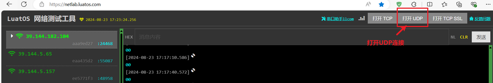
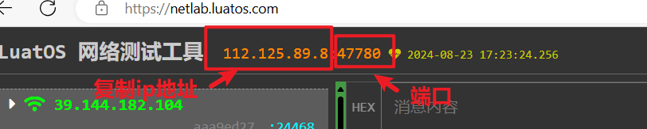
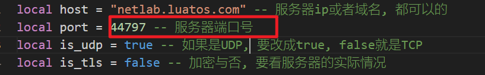
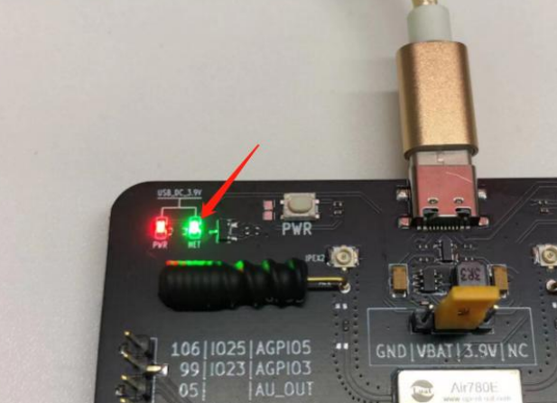
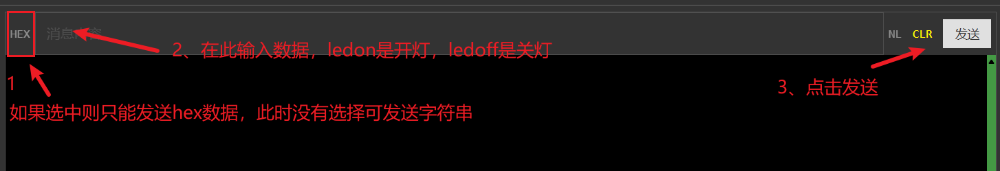

# 验证功能

### 1、连接服务器

合宙的 TCP/UDP 测试服务器：[wstool](https://netlab.luatos.com/)

打开web服务器，将ip地址和端口号复制后复制给程序的host和port

将上面的ip地址和端口号复制到程序的host和port位置：

### 2、效果展示

780E开发板的27号灯所在位置：

效果展示：

我们需要在浏览器的消息发送框中，先选择字符模式，再输入ledon或ledoff，点击发送，来控制灯的亮灭。

