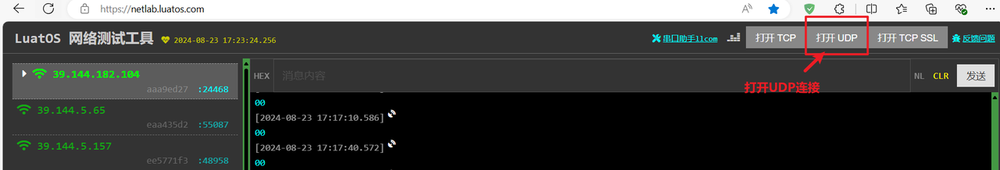
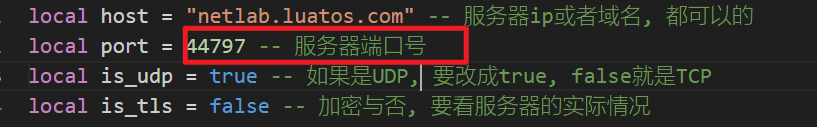
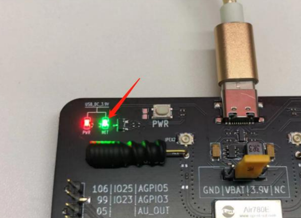
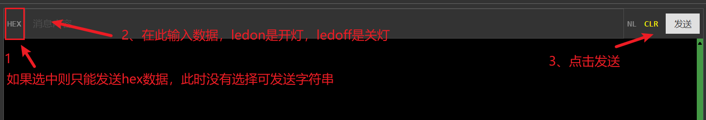

## 介绍

用电脑浏览器通过Air780E控制灯的亮和灭

## 编写脚本

[780E开发板购买链接](https://item.taobao.com/item.htm?spm=a21n57.1.item.2.3380523c235eiN&priceTId=2147811b17245554816554545e39d2&utparam={"aplus_abtest":"82a3183aeeb4f8b0b7fdcf18a3b3589e"}&id=724722276597&ns=1&abbucket=10&skuId=5208106143672&pisk=f96-9wOXSr4uTqVhFgNDK2yI-QZ0jTIzraSsKeYoOZQAAED34LVepwLA8UAkFUDppMQF-wIU4HTCRwLhZS2G4gJedPYLIRjzf6RHLaLIFKZBbhi7e-V0VgJedynmd52O4NHuWs4JOopXvHgWdvOIhoKHx49BPBgjGhTXRp9CREtX4hhIPQMWcxMH1uLqV3HdOYqo4LeY1vDhHnae5gFxB3XX2P8C2EUU8tBwwFsWkvagQ7U9JEW_oSIVG__k0weTkp7VOwtdlqaHaM1Ak3QuW28hUgXprgF7zip2yaORMlGyDiXRv6OYV8sveUdGHQoIwLCCz9dPwDrNcL_V_FR7gr-AEOAp7I3bPijvPCCdrrkBr1IfkCXmoAvFu6_BvZgR4gXGBgBnSFKnNoExTXRWmu1ITDde6OPkDFqWNXletn-vSoExOXgZFnLgVxlETIRF.)

[780E开发板设计资料](https://cdn.openluat-luatcommunity.openluat.com/attachment/20240819170318674_Air780E_硬件设计手册_V1.3.3.pdf)

[通过UDP连接780E控制灯的亮灭程序源码demo](https://gitee.com/openLuat/LuatOS-Air780E/tree/master/demo/Air780E的LuatOS开发快速入门文档适配demo/3.用电脑浏览器通过Air780E控制灯的亮和灭)

[合宙的TCP/UDP测试服务器](https://netlab.luatos.com/)

[API接口说明](https://wiki.luatos.com/api/socket.html)

### 1、实现流程图

这个demo看似程序不少，实际上打印日志和判断返回值的内容有很多，主要函数并不多，接下来我将带你过一遍程序。

这个流程图只画了我们需要用到的流程，demo里还有一些功能是我们现在用不到的，先不看。

socket连接服务器后，780E等待服务器下发的数据，如果下发ledon指令则控制灯亮，如果下发ledoff指令则控制灯灭。


### 2、程序详解

第一步：等待联网

```Lua
sys.waitUntil("IP_READY")
```

第二步：联网成功后，创建socket

```Lua
-- 申请一个socket_ctrl
--[[
    @param1 适配的网卡，nil为采用默认网卡
    @param2 消息通知的taskName，此处先随意填一个即可
]]
local netc = socket.create(nil,"MySocket")
```

第三步：配置network信息

```Lua
--[[配置network一些信息
        @param1 socket_ctrl
        @param2 本地端口号，不写会自动分配一个
        @parma3 是否是UDP
        @param4 是否是加密传输
    ]]
    socket.config(netc, nil, is_udp, false)
```

第四步：连接服务器。

```Lua
--[[
     @param1 socket_ctrl
     @param2 ip地址
     @parma3 端口号
]]
local result = socket.connect(netc, host, port)
```

第五步：连接服务器成功后，先新建一个数组，然后接收服务器的数据

```Lua
-- 创建一个用于接收UDP服务器下发数据的数组
local rx_buff = zbuff.create(1024)
--[[
     @param1 socket_ctrl
     @param2 用于接收数据的数组
]]
local succ, rx_len = socket.rx(netc, rx_buff)
```

第六步：判断接收的数据是否为空,如果不为空就public一个消息。

```Lua
--[[对接收到的数据进行处理
                rx_buff:used()代表rx_buff内的数据长度
            ]]
            if rx_buff:used() > 0 then
                --rx_buff:query()：取出数组内的数据
                local rx_data = rx_buff:query()
                log.info("socket", "接收到的数据为:", rx_data)
                --[[发布一个消息sc_txrx，并连同数据rx_data一同发送。
                    接收方为第八步的sys.waitUntil("sc_txrx", 30000)
                ]]
                sys.publish("sc_txrx", rx_data)
                rx_buff:del()
            end
```

第七步：我们建一个task任务。

```Lua
sys.taskInit(function()
    -- 你要执行的函数
end)
```

第八步：我们在task中写一个while循环，等待sys.publish("sc_txrx", rx_data)的消息，当接收到消息 或等待时间超过设定的30000ms 后继续执行。

```Lua
--[[
     @param1 等待的消息
     @param2 超时时间
     return result 等待到消息，result为true，否则为false
     return rx_data  等待的数据中，携带的参数
]]
local result, rx_data = sys.waitUntil("sc_txrx", 30000)
```

第九步：如果我们等待到了消息，则开始判断收到的参数是否为ledon或ledoff，如果为ledon则执行gpio.set(27,1)，将27号引脚置高电平，开灯；如果为ledoff则执行gpio.set(27, 0)，将27号引脚置低电平，关灯。

```Lua
if result then
            log.info("sys.waitUntil接收到数据")
            --[[在接收的数据rx_data中，寻找ledon出现的位置，如果找到
                会返回第一次出现的位置和最后出现的位置。
            ]]
            local s, e = string.find(rx_data, "ledon")
            if s == 1 and e == 5 then
                gpio.set(27, 1)
                log.info("开灯")
            end
            local s2, e2 = string.find(rx_data, "ledoff")
            if s2 == 1 and e2 == 6 then
                gpio.set(27, 0)
                log.info("关灯")
            end
else
```

第十步：如果我们sys.waitUntil()30秒后还没接收到数据，则会发布一个心跳的消息。

```Lua
            log.info("发布keepalive,waitUntil的返回值为: ", result)
            -- 发送心跳
            sys.publish("keepalive")
        end
```

第十一步：我们可以在连接函数中添加这个消息的订阅，当收到这个消息的publish后就会向服务器发送一次心跳。

```Lua
    -- 订阅心跳消息
    sys.subscribe("keepalive", function()
        succ, full, result = socket.tx(netc, "keepalive" .. os.date())
        log.info("socket", "心跳包发送数据的结果", succ, full, result)
    end)
```

## 验证功能

### 1、连接服务器

合宙的 TCP/UDP 测试服务器：[wstool](https://netlab.luatos.com/)

打开web服务器，将ip地址和端口号复制后复制给程序的host和port




将上面的ip地址和端口号复制到程序的host和port位置：




### 2、效果展示

780E开发板的27号灯所在位置：



效果展示：

我们需要在浏览器的消息发送框中，先选择字符模式，再输入ledon或ledoff，点击发送，来控制灯的亮灭。




## 总结

本节我们实现了使用电脑浏览器，通过udp连接，实现灯的远程控制。

除此之外还学会了如何判断字符串。
