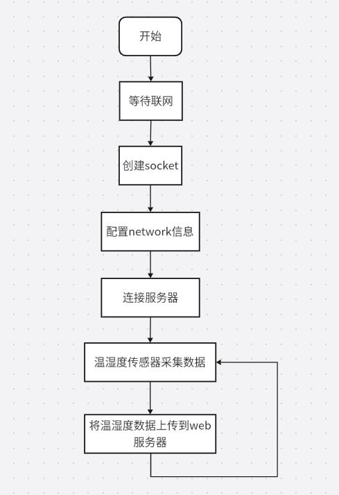

# 编写脚本
## 1、实现流程图



## 2、程序详解
第一步：等待联网
```lua
sys.waitUntil("IP_READY")
```
第二步：联网成功后，创建socket
```lua
-- 申请一个socket_ctrl
--[[
    @param1 适配的网卡，nil为采用默认网卡
    @param2 消息通知的taskName，此处先随意填一个即可
]]
local netc = socket.create(nil,"MySocket")
```
第三步：配置network信息
```lua
local host = "netlab.luatos.com" -- 服务器ip或者域名, 都可以的
local is_udp = true -- 如果是UDP, 要改成true, false就是TCP
local is_tls = false -- 加密与否, 要看服务器的实际情况

--[[配置network一些信息
        @param1 socket_ctrl
        @param2 本地端口号，不写会自动分配一个
        @parma3 是否是UDP
        @param4 是否是加密传输
    ]]
    socket.config(netc, nil, is_udp, is_tls)
```
第四步：连接服务器。
```lua
local port = 47966 -- 服务器端口号

--[[
     @param1 socket_ctrl
     @param2 ip地址
     @parma3 端口号
]]
local result = socket.connect(netc, host, port)
```
第五步：调用dht11接口读取温湿度的值。
```lua
            --[[读取dht11传感器的数值
                @param1  dht11的out引脚连接780E开发板的引脚号
                @param2  是否校验读取到的值，true为校验
                @return1 湿度值，单位为0.01%
                @return2 温度值 单位为0.01%
                @return  成功返回true，失败返回false
            ]]
            local h,t,r = sensor.dht1x(dht11_pin, true)
```
第六步：将温湿度数据上报。
```lua
--[[将温湿度的数据上传到web服务器
    @param1 socket.create()创建的socket_ctrl
    @param2 要发送的温湿度数据
]]
local succ,full,result = socket.tx(netc,data)
```
