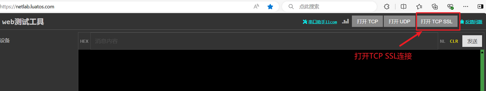

## 介绍

Air780E跟服务器之间的加密通信

## 编写脚本

### （一）准备资料

[780E开发板购买链接](https://item.taobao.com/item.htm?spm=a21n57.1.item.2.3380523c235eiN&priceTId=2147811b17245554816554545e39d2&utparam={"aplus_abtest":"82a3183aeeb4f8b0b7fdcf18a3b3589e"}&id=724722276597&ns=1&abbucket=10&skuId=5208106143672&pisk=f96-9wOXSr4uTqVhFgNDK2yI-QZ0jTIzraSsKeYoOZQAAED34LVepwLA8UAkFUDppMQF-wIU4HTCRwLhZS2G4gJedPYLIRjzf6RHLaLIFKZBbhi7e-V0VgJedynmd52O4NHuWs4JOopXvHgWdvOIhoKHx49BPBgjGhTXRp9CREtX4hhIPQMWcxMH1uLqV3HdOYqo4LeY1vDhHnae5gFxB3XX2P8C2EUU8tBwwFsWkvagQ7U9JEW_oSIVG__k0weTkp7VOwtdlqaHaM1Ak3QuW28hUgXprgF7zip2yaORMlGyDiXRv6OYV8sveUdGHQoIwLCCz9dPwDrNcL_V_FR7gr-AEOAp7I3bPijvPCCdrrkBr1IfkCXmoAvFu6_BvZgR4gXGBgBnSFKnNoExTXRWmu1ITDde6OPkDFqWNXletn-vSoExOXgZFnLgVxlETIRF.)

[780E开发板设计资料](https://cdn.openluat-luatcommunity.openluat.com/attachment/20240819170318674_Air780E_硬件设计手册_V1.3.3.pdf)

[LuatOS-Air780E/网络加密通信程序源码demo](https://gitee.com/openLuat/LuatOS-Air780E/tree/master/demo/Air780E的LuatOS开发快速入门文档适配demo/10.Air780E跟服务器之间的加密通信)

[合宙的 TCP/UDP 测试服务器](https://netlab.luatos.com/)

[API介绍说明](https://wiki.luatos.com/api/libs/libnet.html)

### （二）程序详解

1、首先配置联网配置

```Lua
--=============================================================
-- 测试网站 https://netlab.luatos.com/ 点击 打开TCP 获取测试端口号
-- 要按实际情况修改
local host = "112.125.89.8" -- 服务器ip或者域名, 都可以的
local port = 45186           -- 服务器端口号
local is_udp = false        -- 如果是UDP, 要改成true, false就是TCP
local is_tls = true        -- 加密与否, 要看服务器的实际情况
--=============================================================
```

2、联网后，创建联网成功后，对收发数据事件的处理函数

```Lua
local function sockettest()
    -- 等待联网
    sys.waitUntil("IP_READY")

    -- 时间同步
    socket.sntp()

    -- 开始正在的逻辑, 发起socket链接,等待数据/上报心跳
    local taskName = "sc"
    local topic = taskName .. "_txrx"
    log.info("topic", topic)
    local txqueue = {}
    --[[创建一个任务线程
    @param1     function   任务函数名，用于resume唤醒时调用
    @param2     string     任务名称，用于唤醒任务id
    @param3     function   接收到非目标消息时的回调函数
    @param4     any        任务函数fun的可变参数
    @return     number     返回该任务的线程号
    ]]
    sysplus.taskInitEx(sockettask, taskName, netCB, taskName, txqueue, topic)
    while 1 do
        local result, tp, data = sys.waitUntil(topic, 30000)
        log.info("event", result, tp, data)
        if not result then
            -- 等很久了,没数据上传/下发, 发个日期心跳包吧
            table.insert(txqueue, os.date())
            sys_send(taskName, socket.EVENT, 0)
        elseif tp == "uplink" then
            -- 上行数据, 主动上报的数据,那就发送呀
            table.insert(txqueue, data)
            sys_send(taskName, socket.EVENT, 0)
        elseif tp == "downlink" then
            -- 下行数据,接收的数据, 从ipv6task来的
            -- 其他代码可以通过 sys.publish()
            log.info("socket", "收到下发的数据了", #data,"data:",data)
        end
    end
end
```

3、联网函数

```Lua
function sockettask(d1Name, txqueue, rxtopic)
    -- 打印准备连接的服务器信息
    log.info("socket", host, port, is_udp and "UDP" or "TCP", is_tls and "TLS" or "RAW")

    -- 准备好所需要的接收缓冲区
    local rx_buff = zbuff.create(1024)
    local netc = socket.create(nil, d1Name)
    socket.config(netc, nil, is_udp, is_tls)
    log.info("任务id", d1Name)

    while true do
        -- 连接服务器, 15秒超时
        log.info("socket", "开始连接服务器")
        sysplus.cleanMsg(d1Name)
        local result = libnet.connect(d1Name, 15000, netc, host, port)
        if result then
            log.info("socket", "服务器连上了")
            --向服务器发送数据
            libnet.tx(d1Name, 0, netc, "helloworld")
        else
            log.info("socket", "服务器没连上了!!!")
        end
        while result do
            -- 连接成功之后, 先尝试接收
            -- log.info("socket", "调用rx接收数据")
            local succ, param = socket.rx(netc, rx_buff)
            if not succ then
                log.info("服务器断开了", succ, param, ip, port)
                break
            end
            -- 如果服务器有下发数据, used()就必然大于0, 进行处理
            if rx_buff:used() > 0 then
                log.info("socket", "收到服务器数据，长度", rx_buff:used())
                local data = rx_buff:query() -- 获取数据
                sys.publish(rxtopic, "downlink", data)
                rx_buff:del()
            end
            -- log.info("libnet", "调用wait开始等待消息")
            -- 等待事件, 例如: 服务器下发数据, 有数据准备上报, 服务器断开连接
            result, param, param2 = libnet.wait(d1Name, 15000, netc)
            log.info("libnet", "wait", result, param, param2)
            if not result then
                -- 网络异常了, 那就断开了, 执行清理工作
                log.info("socket", "服务器断开了", result, param)
                break
            elseif #txqueue > 0 then
                -- 有待上报的数据,处理之
                while #txqueue > 0 do
                    local data = table.remove(txqueue, 1)
                    if not data then
                        break
                    end
                    result,param = libnet.tx(d1Name, 15000, netc,data)
                    log.info("libnet", "发送数据的结果", result, param)
                    if not result then
                        log.info("socket", "数据发送异常", result, param)
                        break
                    end
                end
            end
            -- 循环尾部, 继续下一轮循环
        end
        -- 能到这里, 要么服务器断开连接, 要么上报(tx)失败, 或者是主动退出
        libnet.close(d1Name, 5000, netc)
        -- log.info(rtos.meminfo("sys"))
        sys.wait(30000) -- 这是重连时长, 自行调整
    end
end
```

## 烧录代码到硬件

### （1）正确连接电脑和4G模组电路板

   使用带有数据通信功能的数据线，不要使用仅有充电功能的数据线；

### （2）识别4G模组的boot引脚

   在下载之前，要用模组的boot引脚触发下载， 也就是说，要把4G模组的boot引脚拉到 1.8v，或者直接把boot引脚和VDD_EXT引脚相连。我们要在按下BOOT按键时让模块开机，就可以进入下载模式了。

​    具体到 Air780E开发板，

1、当我们模块没开机时，按着BOOT键然后长按PWR开机。

2、当我们模块开机时，按着BOOT键然后点按重启键即可。


### （3）识别电脑的正确端口

​     判断是否进入BOOT模式：模块上电，此时在电脑的设备管理器中，查看串口设备， 会出现一个端口表示进入了boot下载模式，如下图所示：


​    当设备管理器出现了3个连续数字的com端口，并且每个数字都大于4，这时候， 硬件连接上就绪状态，恭喜你，可以进行烧录了！

### （4）新建项目

​    首先，确保你的 Luatools 的版本，上大于 2.2.13 版本的。

​    在 Luatools 的左上角上有版本显示的，如图所示：


Luatools 版本没问题的话， 就点击 LuaTOols 右上角的“项目管理测试”按钮，如下图所示：


 这时会弹出项目管理和烧录管理的对话框，如下图：

 1、新建一个项目

**注意：这里截图使用的hello world项目的烧录教程，烧录的时候要将脚本换成本次demo的。**


### （5） 开始烧录

选择780E板子对应的底层core和刚改的main.lua脚本文件。下载到板子中。


点击下载后，我们需要进入boot模式才能正常下载，在(3)(4)小节已经介绍了如何进入boot模式。


## 烧录问题排查

   如果你在烧录过程中遇到了问题， 请点击如下链接，进行烧录的问题排查。

**[详细的烧录操作步骤参考此处](https://doc.openluat.com/wiki/52?wiki_page_id=5071#_23)**

## 验证功能

1、打开TCP SSL连接测试工具。



2、配置端口，tcp连接，是否加密。


3、成功连接并发送数据


## 常见问题

1、最多同时支持多少个连接？

 socket支持多个连接的, 通常最多支持8个。加密连接(TLS/SSL)需要更多内存, 这意味着能容纳的连接数会小很多, 同时也更慢。

2、可以与mqtt库同时使用吗？

支持与http/mqtt/websocket/ftp库同时使用, 互不干扰。

## 总结

本例程实现了通过tcpssl协议进行加密通信

