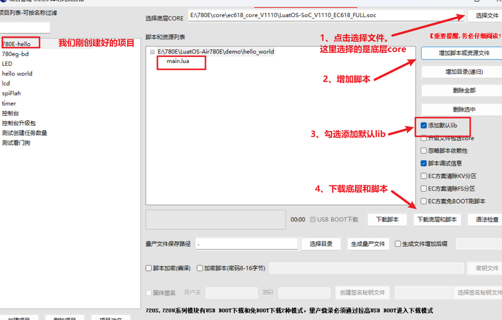
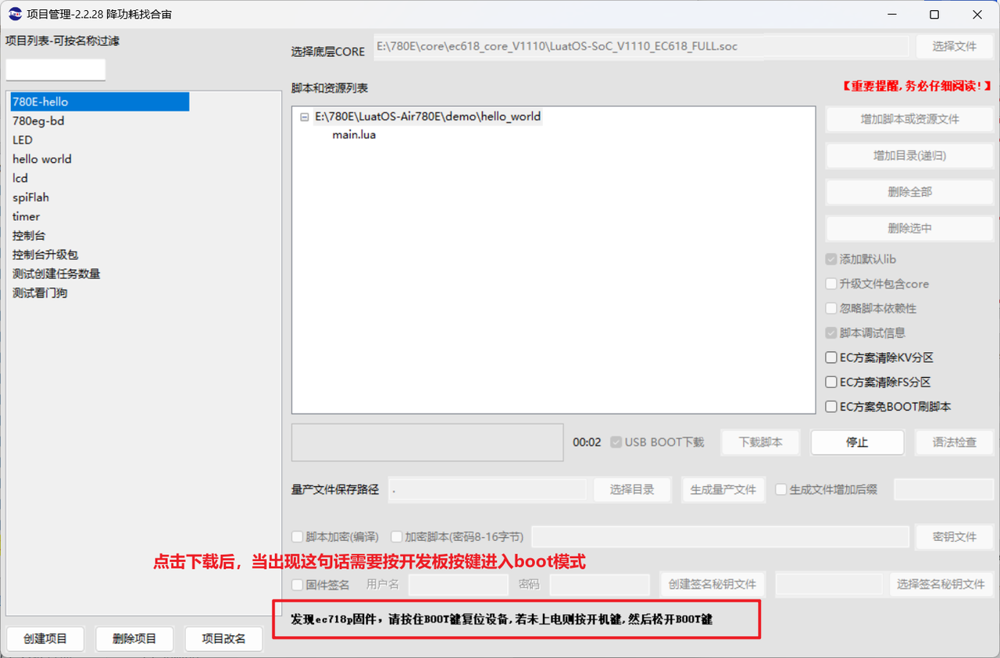
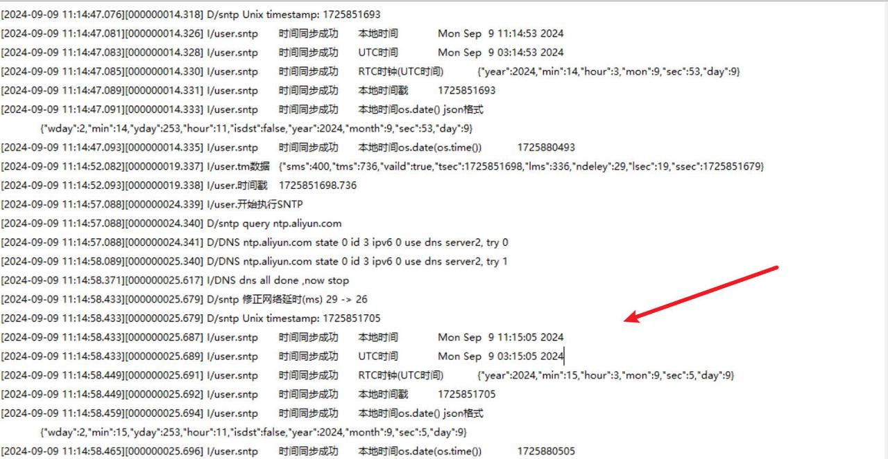

# 介绍

**Air780E怎么获取精准的时钟？**

## 编写脚本

### （一）准备资料

[780E开发板购买链接](https://item.taobao.com/item.htm?spm=a21n57.1.item.2.3380523c235eiN&priceTId=2147811b17245554816554545e39d2&utparam={"aplus_abtest":"82a3183aeeb4f8b0b7fdcf18a3b3589e"}&id=724722276597&ns=1&abbucket=10&skuId=5208106143672&pisk=f96-9wOXSr4uTqVhFgNDK2yI-QZ0jTIzraSsKeYoOZQAAED34LVepwLA8UAkFUDppMQF-wIU4HTCRwLhZS2G4gJedPYLIRjzf6RHLaLIFKZBbhi7e-V0VgJedynmd52O4NHuWs4JOopXvHgWdvOIhoKHx49BPBgjGhTXRp9CREtX4hhIPQMWcxMH1uLqV3HdOYqo4LeY1vDhHnae5gFxB3XX2P8C2EUU8tBwwFsWkvagQ7U9JEW_oSIVG__k0weTkp7VOwtdlqaHaM1Ak3QuW28hUgXprgF7zip2yaORMlGyDiXRv6OYV8sveUdGHQoIwLCCz9dPwDrNcL_V_FR7gr-AEOAp7I3bPijvPCCdrrkBr1IfkCXmoAvFu6_BvZgR4gXGBgBnSFKnNoExTXRWmu1ITDde6OPkDFqWNXletn-vSoExOXgZFnLgVxlETIRF.)

[780E开发板设计资料](https://cdn.openluat-luatcommunity.openluat.com/attachment/20240819170318674_Air780E_硬件设计手册_V1.3.3.pdf)

[LuatOS-Air780E-获取精准时钟程序源码demo](https://gitee.com/openLuat/LuatOS-Air780E/tree/master/demo/Air780E的LuatOS开发快速入门文档适配demo/11.Air780E怎么获取精准的时钟)

[API介绍说明](https://wiki.luatos.com/api/socket.html)

### （二）程序详解

#### 1、时间戳

luat有一个获取当前时间戳函数：

```Lua
--[[@param1 日期时间的table
    @return 时间戳
]]
os.time(mytime)
```

但是在lua下，时间戳的精度只能到秒。想要提升时间戳精度，可以使用下面时间同步方案。

#### 2、时间同步

时间同步有两种方式，基站时间同步和ntp服务器授时。

对于Cat.1模块，移动/电信卡，通常会下发基站时间，所以不必须sntp，而联通卡通常不会下发，就需要sntp。

使用ntptm可以精确到毫秒级时间。

##### （1）基站时间同步

联网成功后，会自动进行基站时间同步，同步完成后直接打印时间戳。

```Lua
sys.subscribe("NTP_UPDATE", function()
    log.info("mobile", "time", os.date())
end)
```

##### （2）ntp服务器授时

先等待联网，然后调用socket.sntp进行同步：

```Lua
-- 等待联网
sys.waitUntil("IP_READY")
sys.wait(1000)
-- 开始sntp时间同步
socket.sntp()
-- 等待时间同步完成
local ret = sys.waitUntil("NTP_UPDATE", 5000)
--如果时间同步完成，则打印同步的时间
if ret then
    -- 以下是获取/打印时间的演示,注意时区问题
    log.info("sntp", "时间同步成功", "本地时间", os.date())
    log.info("sntp", "时间同步成功", "UTC时间", os.date("!%c"))
    log.info("sntp", "时间同步成功", "RTC时钟(UTC时间)", json.encode(rtc.get()))
    -- os.time(rtc.get()) 需要 2023.07.21 之后的版本, 因为月份的命名差异mon/month
    -- log.info("sntp", "时间同步成功", "utc时间戳", os.time(rtc.get()))
    log.info("sntp", "时间同步成功", "本地时间戳", os.time())
    local t = os.date("*t")
    log.info("sntp", "时间同步成功", "本地时间os.date() json格式", json.encode(t))
    log.info("sntp", "时间同步成功", "本地时间os.date(os.time())", os.time(t))
    -- log.info("sntp", "时间同步成功", "本地时间", os.time())
    -- 正常使用, 一小时一次, 已经足够了, 甚至1天一次也可以
    -- sys.wait(3600000) 
    -- 这里为了演示, 用5秒一次
    sys.wait(5000)
else
    log.info("sntp", "时间同步失败")
    sys.wait(60000) -- 1分钟后重试
end
```

精确到ms级的，ntptm网络对时后的时间戳

```Lua
-- 时间戳, 精确到毫秒. 2023.11.15 新增
-- 注意, 至少成功完成2次sntp,该时间戳才比较准确
-- 如果仅完成了一次sntp, 时间戳比标准时间会慢一个网络延时的时长(10~500ms)不等
if socket.ntptm then
    local tm = socket.ntptm()
    log.info("tm数据", json.encode(tm))
    log.info("时间戳", string.format("%u.%03d", tm.tsec, tm.tms))
    sys.wait(5000)
end
```

如果同步失败，则打印一个提示信息。

```Lua
sys.subscribe("NTP_ERROR", function()
    log.info("socket", "sntp error")
    -- socket.sntp()
end)
```

## 烧录代码到硬件

### （1）正确连接电脑和4G模组电路板

   使用带有数据通信功能的数据线，不要使用仅有充电功能的数据线；

### （2）识别4G模组的boot引脚

   在下载之前，要用模组的boot引脚触发下载， 也就是说，要把4G模组的boot引脚拉到 1.8v，或者直接把boot引脚和VDD_EXT引脚相连。我们要在按下BOOT按键时让模块开机，就可以进入下载模式了。

​    具体到 Air780E开发板，

1、当我们模块没开机时，按着BOOT键然后长按PWR开机。

2、当我们模块开机时，按着BOOT键然后点按重启键即可。


### （3）识别电脑的正确端口

​     判断是否进入BOOT模式：模块上电，此时在电脑的设备管理器中，查看串口设备， 会出现一个端口表示进入了boot下载模式，如下图所示：


​    当设备管理器出现了3个连续数字的com端口，并且每个数字都大于4，这时候， 硬件连接上就绪状态，恭喜你，可以进行烧录了！

### （4）新建项目

​    首先，确保你的 Luatools 的版本，上大于 2.2.13 版本的。

​    在 Luatools 的左上角上有版本显示的，如图所示：


Luatools 版本没问题的话， 就点击 LuaTOols 右上角的“项目管理测试”按钮，如下图所示：


 这时会弹出项目管理和烧录管理的对话框，如下图：

 1、新建一个项目

**注意：这里截图使用的hello world项目的烧录教程，烧录的时候要将脚本换成本次demo的。**


### （5） 开始烧录

选择780E板子对应的底层core和刚改的main.lua脚本文件。下载到板子中。





点击下载后，我们需要进入boot模式才能正常下载，在(3)(4)小节已经介绍了如何进入boot模式。


## 烧录问题排查

   如果你在烧录过程中遇到了问题， 请点击如下链接，进行烧录的问题排查。

**[详细的烧录操作步骤参考此处](https://doc.openluat.com/wiki/52?wiki_page_id=5071#_23)**

## 验证功能

将程序烧录到脚本后，可看到如下打印：



## 常见问题

注意：函数socket.ntptm()在执行socket.sntp()且获取到NTP时间后才有效，而且是2次sntp之后才是比较准确的值，网络波动越小, 该时间戳越稳定

## 总结

本例程实现了获取ms级精准时钟。
