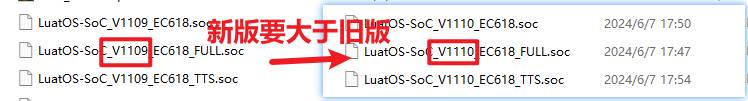
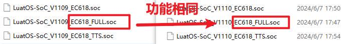
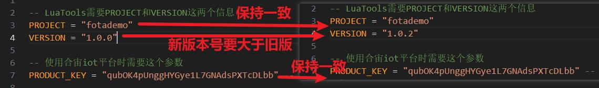
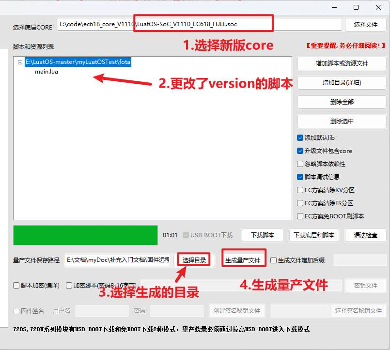
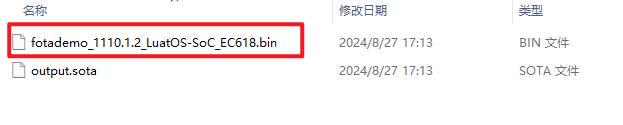
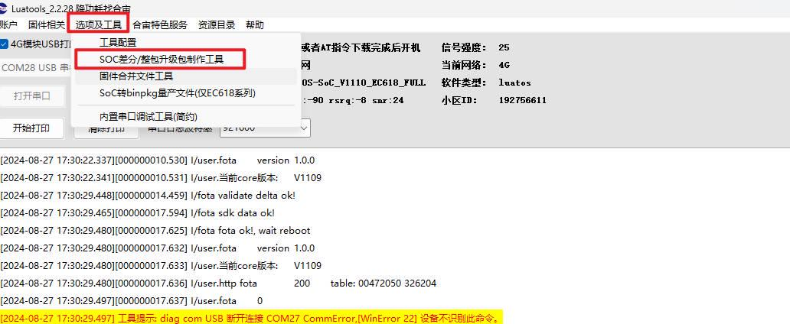
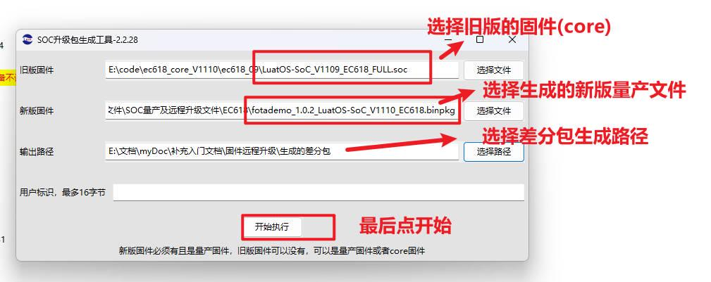

# 生成差分包

固件（core）：[LuatOS底层core地址](https://gitee.com/openLuat/LuatOS/releases)

进入固件页面后，搜索EC618可以找到780E对应的固件，旧版的固件在后面。

[780E开发板设计资料](https://cdn.openluat-luatcommunity.openluat.com/attachment/20240819170318674_Air780E_硬件设计手册_V1.3.3.pdf)

[LuatOS-Air780E固件远程升级的程序源码demo](https://gitee.com/openLuat/LuatOS-Air780E/tree/master/demo/Air780E的LuatOS开发快速入门文档适配demo/5.Air780E固件的远程升级)

[合宙的 TCP/UDP 测试服务器](https://iot.openluat.com/cloud/main)

[API接口介绍](https://wiki.luatos.com/api/libs/libfota.html)

合宙的远程升级支持使用合宙云平台和自建服务器，此例程使用的是合宙云平台。

1、准备新旧版的core和脚本.

关于需要升级的core（固件），需要注意的点有：

1. 需要 V1103及以上的固件。

2. 需要 LuaTools 2.1.89（LuaTools工具的版本，可以在工具左上角看到） 及以上的升级文件生成。

3. 新版core的版本号必须大于旧版core。

4. 新旧版core的支持功能相同，因为功能不同的core 的文件系统地址可能不同，如果升级的话可能导致程序异常。

5. 程序中需要保证新旧版本的PROJECT相同，新版本的版本号VERSION大于旧版，PRODUCT_KEY和云平台保持一致。

2、使用Luatools生成bin差分包

1、生成量产文件

在Luatools中选择新版的core，和更改了version的脚本文件，然后生成量产文件：

2、在选择生成量产文件的目录中，找到bin文件。

3、生成差分包.

首先在Luatools中找到差分工具。

然后选择旧版的core，生成的新版量产文件，最后点击开始生成差分文件。

