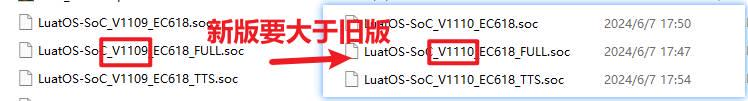
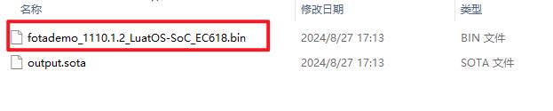
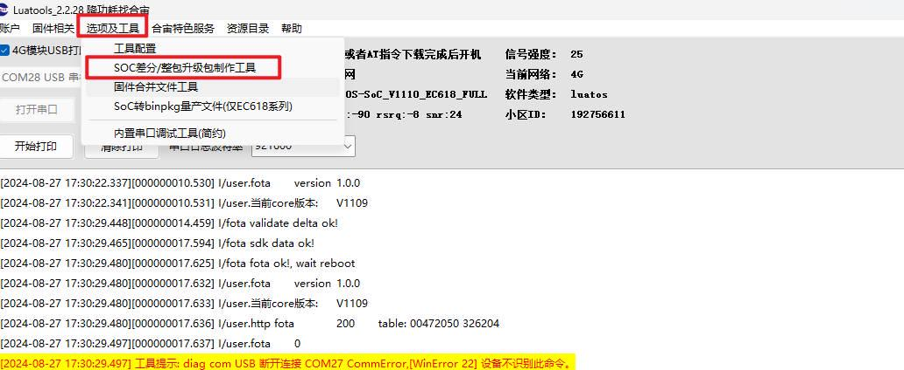
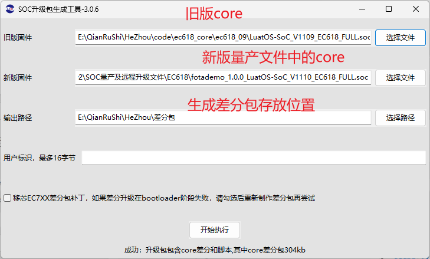
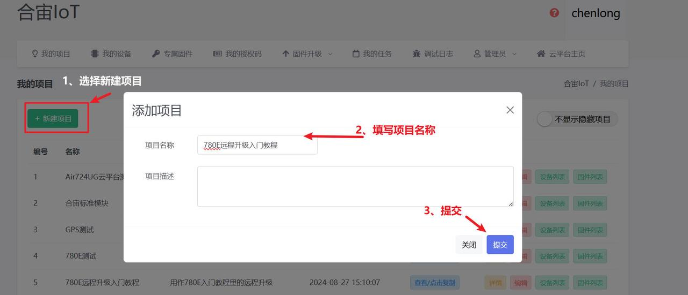
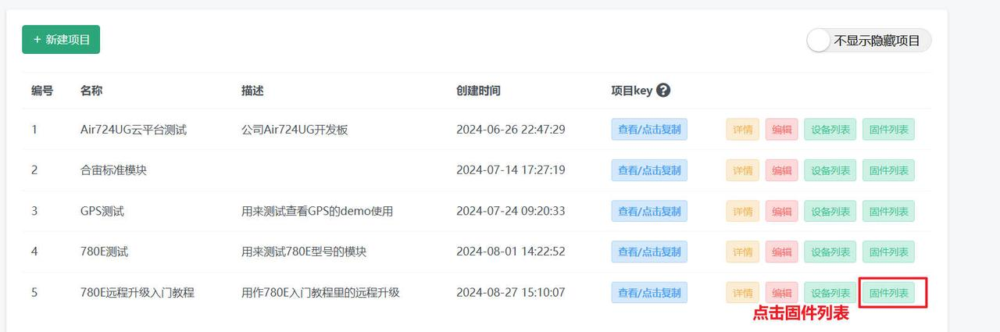
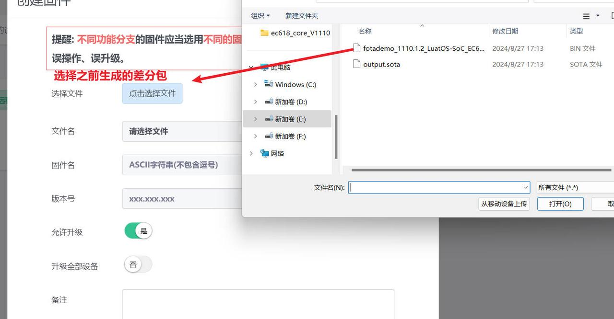
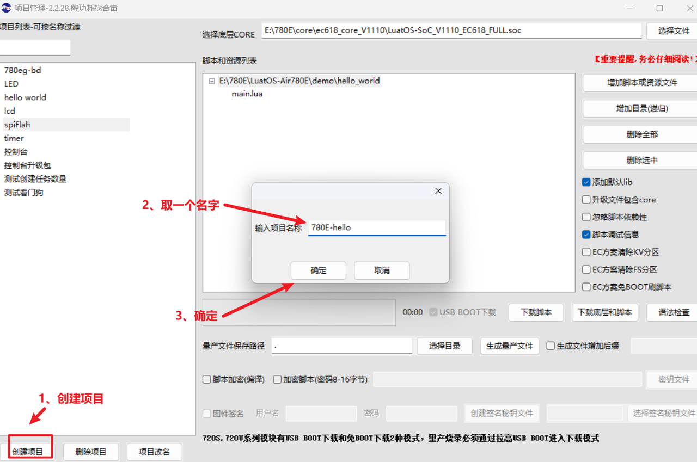

## 介绍

合宙的远程升级支持使用合宙云平台和自建服务器，此例程使用的是合宙云平台进行升级。

## 生成差分包

固件（core）：[LuatOS底层core地址](https://gitee.com/openLuat/LuatOS/releases)

进入固件页面后，搜索EC618可以找到780E对应的固件，旧版的固件在后面。

[780E开发板设计资料](https://cdn.openluat-luatcommunity.openluat.com/attachment/20240819170318674_Air780E_硬件设计手册_V1.3.3.pdf)

[LuatOS-Air780E固件远程升级的程序源码demo](https://gitee.com/openLuat/LuatOS-Air780E/tree/master/demo/Air780E的LuatOS开发快速入门文档适配demo/5.Air780E固件的远程升级)

[合宙的 TCP/UDP 测试服务器](https://iot.openluat.com/cloud/main)

[API接口介绍](https://wiki.luatos.com/api/libs/libfota.html)

合宙的远程升级支持使用合宙云平台和自建服务器，此例程使用的是合宙云平台。

1、准备新旧版的core和脚本.

关于需要升级的core（固件），需要注意的点有：

1. 需要 V1103及以上的固件。

2. 需要 Luatools 2.1.89（Luatools工具的版本，可以在工具左上角看到） 及以上的升级文件生成。

3. 新版core的版本号必须大于旧版core。



4. 新旧版core的支持功能相同，因为功能不同的core 的文件系统地址可能不同，如果升级的话可能导致程序异常。


5. 程序中需要保证新旧版本的PROJECT相同，新版本的版本号VERSION大于旧版，PRODUCT_KEY和云平台保持一致。


2、使用Luatools生成bin差分包

1、生成量产文件

在Luatools中选择新版的core，和更改了version的脚本文件，然后生成量产文件：


2、在选择生成量产文件的目录中，找到bin文件。



3、生成差分包.

首先在Luatools中找到差分工具。



然后选择旧版的core，生成的新版量产文件，最后点击开始生成差分文件。



## 云平台配置

1、云平台新建项目

1、进入IoT界面，新建项目。




2、复制项目key到脚本代码中。


然后我们先去准备一个差分包。

2、云平台添加差分包

1、进入云平台，选择本项目的固件列表。





## 编写脚本

1、等待联网。

```lua
sys.waitUntil("IP_READY")
```

2、用于fota升级的函数。

```lua
--[[ @param1 回调函数
]]
libfota.request(fota_cb)
```

3、fota升级的回调函数, 当回调函数中传入的值为0时，重启模块。

```lua
function fota_cb(ret)
    if ret == 0 then
        rtos.reboot()
    end
end
```

4、定时查询是否有远程升级

```lua
sys.timerLoopStart(libfota.request, 3600000, fota_cb)
```

## 验证功能

1、重启设备后会自动升级差分包

3、查看升级日志


## 烧录代码到硬件


### （1）正确连接电脑和4G模组电路板

   使用带有数据通信功能的数据线，不要使用仅有充电功能的数据线；

### （2）识别4G模组的boot引脚

   在下载之前，要用模组的boot引脚触发下载， 也就是说，要把4G模组的boot引脚拉到 1.8v，或者直接把boot引脚和VDD_EXT引脚相连。我们要在按下BOOT按键时让模块开机，就可以进入下载模式了。

​    具体到 Air780E开发板，

1、当我们模块没开机时，按着BOOT键然后长按PWR开机。

2、当我们模块开机时，按着BOOT键然后点按重启键即可。


### （3）识别电脑的正确端口

​     判断是否进入BOOT模式：模块上电，此时在电脑的设备管理器中，查看串口设备， 会出现一个端口表示进入了boot下载模式，如下图所示：


​    当设备管理器出现了3个连续数字的com端口，并且每个数字都大于4，这时候， 硬件连接上就绪状态，恭喜你，可以进行烧录了！

### （4）新建项目

​    首先，确保你的 Luatools 的版本，上大于 2.2.13 版本的。

​    在 Luatools 的左上角上有版本显示的，如图所示：


Luatools 版本没问题的话， 就点击 LuaTOols 右上角的“项目管理测试”按钮，如下图所示：


 这时会弹出项目管理和烧录管理的对话框，如下图：

 1、新建一个项目

**注意：这里截图使用的hello world项目的烧录教程，烧录的时候要将脚本换成本次demo的。**



### （5） 开始烧录

选择780E板子对应的底层core和刚改的main.lua脚本文件。下载到板子中。


点击下载后，我们需要进入boot模式才能正常下载，在(3)(4)小节已经介绍了如何进入boot模式。


## 烧录问题排查

   如果你在烧录过程中遇到了问题， 请点击如下链接，进行烧录的问题排查。

**[详细的烧录操作步骤参考此处](https://doc.openluat.com/wiki/52?wiki_page_id=5071#_23)**

## 验证功能

1、重启设备后会自动升级差分包

3、查看升级日志


## 常见问题

1、要升级的core的版本大于旧版本

2、脚本中PROJECT保持一致，VERSION版本号大于旧版

3、升级时的错误可以查看升级日志

