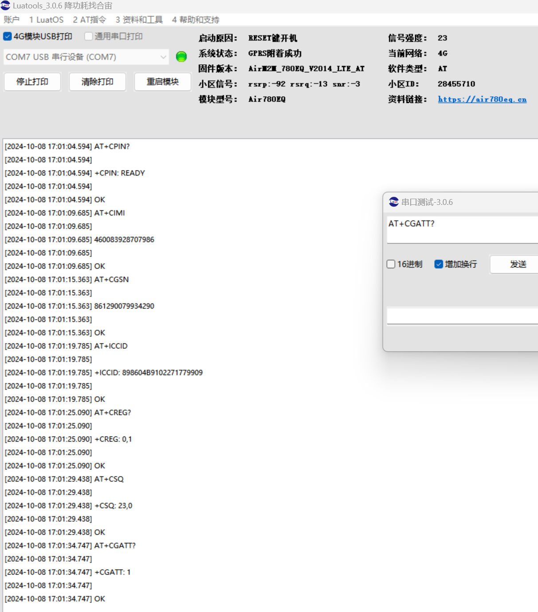
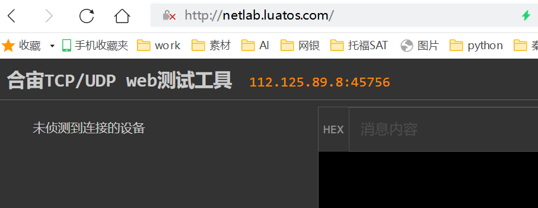
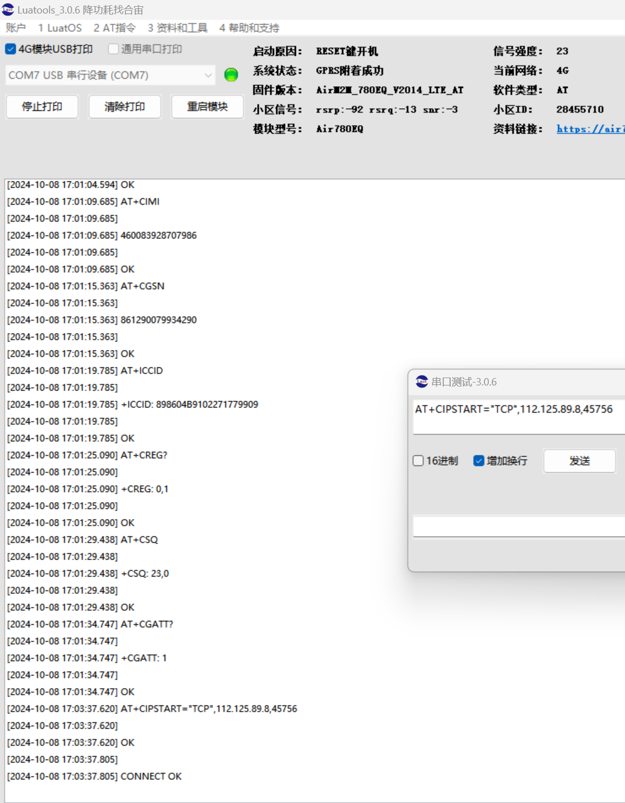
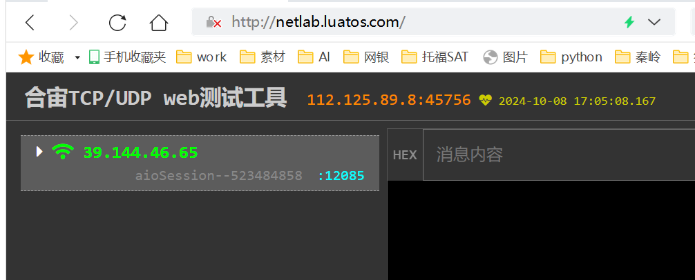
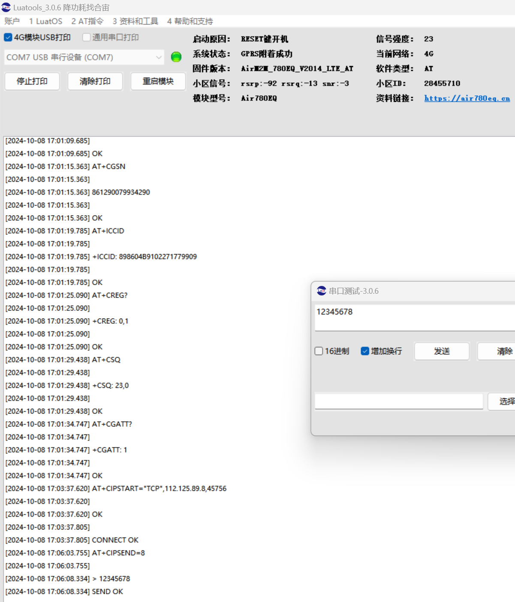
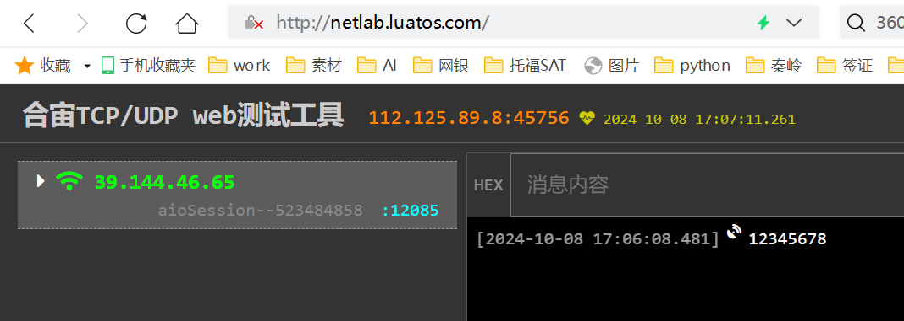
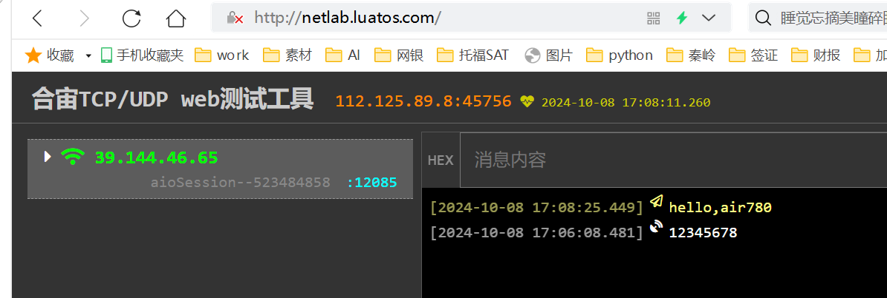
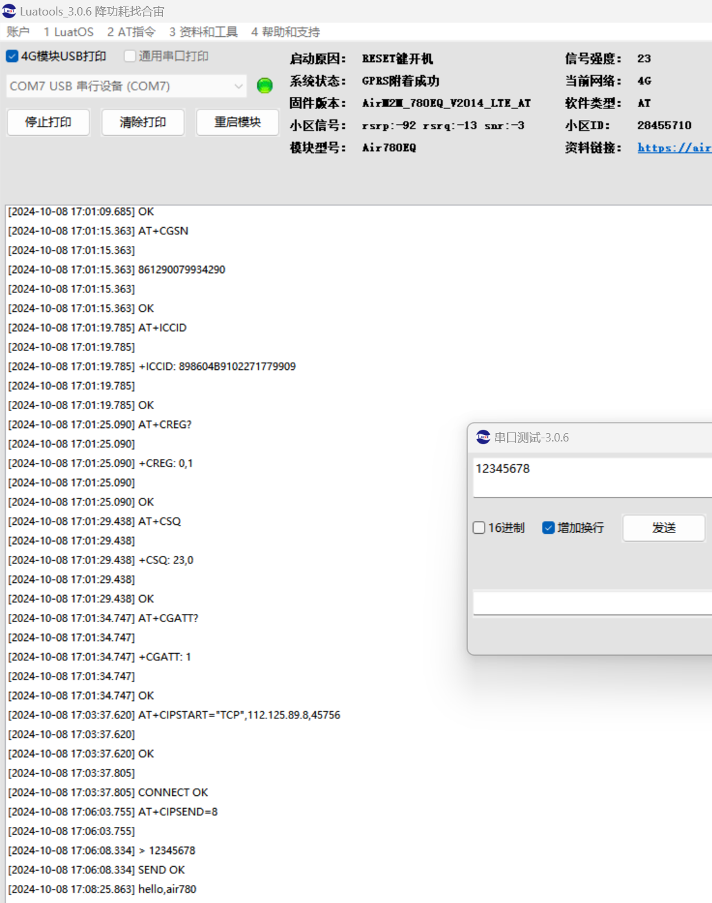

# 合宙模组典型上网业务的 AT 上网流程

## 一、简介

    本文介绍了合宙 4G 模组的常用的 AT 指令和服务器交互的流程。

    进一步详细的流程， 参见各个模组的 AT 命令资料。

    如果没有顺手的串口工具，推荐 [LLCOM | 能跑Lua代码的串口调试工具！](https://llcom.papapoi.com/index.html)

## 二、准备工作

    - 准备一套合宙任意模组的开发板，windows电脑，串口PC工具；

    - 打开合宙的 TCP/UDP web 测试工具。
    
      合宙web测试工具的详细使用方法参见： [合宙TCP/UDP web测试工具](https://docs.openluat.com/TCPUDP_Test/)

## 三、查询终端状态

合宙4G模组，开机后，会自动搜网，注册网络，选择一个最优的小区，并驻留在这个小区。

这时， 按照如下次序查询，确定设备的状态：

    - 1.查询 SIM 卡是否插好，用 AT+CPIN?；
    - 2,查询 IMSI，IMEI，ICCID，业务备用，
        分别是 AT+CIMI，AT+CGSN，AT+ICCID；
    - 3,查询 是否网络注册成功， 用 AT+CREG?；
    - 4,查询终端信号强度， 用 AT+CSQ
    - 5,查询 是否上网服务已经激活，用 AT+CGATT?

    AT 交互示例如图：

## 四、和服务器建立 socket 连接

    - 1，兼容 2G 时代的3个无用指令
      
    这么三个指令， 是在 2G 时代设计的，到了 4G 时代，已经完全无用了，

    但是为了兼容之前的 MCU 的代码，这里还是提一下。

    如果你是新开发的项目，完全可以删掉这三个指令了。

    AT+CSTT， 
    AT+CIICR，
    AT+CIFSR, 可以查询本机获取到的 IP 地址。

    - 2，打开 TCP 服务器，开始监听
      这里使用合宙的 TCP/UDP web测试网站： netlab.Luatos.com, 如图：

    
    - 3， 连接服务器，建立 socket

    建立和服务器的socket连接， 用如下指令：
    AT+CIPSTART="TCP",112.125.89.8,45756

    其中的 IP 地址和端口参数， 是把上面 web测试网站的 IP 和端口抄下来。

    “TCP” 也可以更换为 “UDP”。

    当模块返回 CONNECT OK 后， socket 就建立成功了。

    AT 交互过程如图：

    这时，web测试工具，也显示有终端连接成功：

## 五、和服务器数据交互

    用指令  AT+CIPSEND 向服务器发送数据。

    服务器端，也显示收到了数据：

    
    从服务器端发送消息， 终端也能显示出来收到的数据：

    以上的例子， 是终端每次发送固定长度的数据。

    如果终端想发送不定长的数据， 或者是想透传数据，可以参考详细的 AT 手册。

