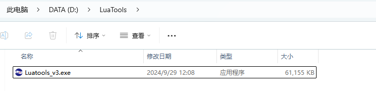
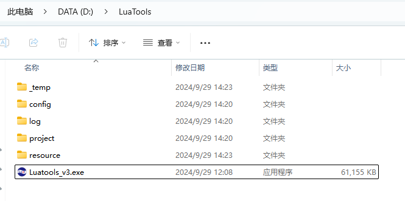

# Luatools下载调试工具

>作为由合宙所提供的调试工具，Luatools支持最新固件获取、固件打包、trace打印、单机烧录等功能
>
>此工具适用于合宙所有 4G 模组， 4G + GNSS 模组。

# 一、运行环境要求

- 此工具运行于win7及以上系统;

- 不支持 Mac和 Linux。

# 二、支持的模组型号

- Air724, 
- 所有的 Air780 系列模组；
- 所有的 Air700 系列模组；
- Air201 系列模组；

# 三、下载与安装

## （一）Luatools下载

 点击下载：[Luatools v3 下载调试工具](https://luatos.com/luatools/download/last "Luatools v3下载")

## （二）Luatools安装

1. 工具下载后的文件名为：Luatools_v3.exe

2. 在win系统--D盘（或其他盘）推荐在根目录下新建文件名，并重命名为 LuaTools，目录太深可能会导致工具某些功能会出问题。

3. 将下载的Luatools_v2.exe拷贝或移动到新建的LuaTools文件夹内
   **注意：若出现危险提醒，无需理会，继续下载即可**

 

4. 双击Luatools_v3.exe启动程序， 关闭每日tips，点击开始后更新
   **注意：如果有杀软拦截，请务必通过！！！务必通过！！！务必通过！！！**

5. 更新完成后，LuaTools文件夹内，会生成几个新文件夹：

# 三、功能介绍

## （一）文件夹功能介绍

### 1， _temp 文件夹：临时文件

### 2. config 文件夹：对 Luatools_v3 进行的一些配置会存放到这个文件夹

### 3. log 文件夹：里面存放有模块输出的各种日志信息，当模块出现问题需要向合宙技术人员寻求技术支持的时候，就需要提交这个目录下的文件
   - 4gdiag 文件夹：ap和cp日志
   - ramdump 文件夹：死机dump文件
   - main_xxxxxx：模块输出的调试日志
   - trace_xxxxxx：Luatools工具输出的日志

### 4. resource 文件夹：合宙模块相关的AT固件，LuaTask开发的Core底层固件，Lib库和demo脚本
   - aa_bb_lod 文件夹：aa表示芯片平台，bb表示开发方式（at / lua）,比如 LuatOS_Air780E, AT_Air780EQ
   - 8910_script 文件夹：Air724 模块的demo和Lib
   - soc_script 文件夹：gitee Luatos 主仓库更新的demo和Lib
   - LuatOS_iRTU_bb：LuatOS_iRTU表示是iRTU开发方式，bb表示模块名称

### 5. project 文件夹：使用项目管理后会自动生成这个目录，用于管理下载项目

## （二）主界面介绍

### 1. 账户
   - 登录：使用购买时销售为你自动创建的erp账号登陆，可以在合宙技术人员远程支持客户时协助抓取本机log
   
   - 工具配置:点击Log，当配合技术人员抓取bug日志时在此页面打开log功能，例如AP与CP日志，若使用工具经常遇到蓝屏，可先关闭底层日志的抓取
   
   - Exit：退出工具

### 2. LuatOS
  - 2.1 代码调试
    对应各个模块的DEMO的gitee路径
    Air780E模块gitee路径： [Air780E](https://gitee.com/openLuat/LuatOS-Air780E "Air780E代码仓库")
    Air780EX模块gitee路径：[Air780EX](https://gitee.com/openLuat/LuatOS-Air780EX "Air780EX代码仓库")
    Air724UG模块gitee路径： [Air724UG](https://gitee.com/openLuat/LuatOS-Air724UG "Air724UG代码仓库")
    Air201模块gitee路径：[Air201](https://gitee.com/openLuat/LuatOS-Air201 "Air201代码仓库")
    Air780EPS模块gitee路径：[Air780EPS](https://gitee.com/openLuat/LuatOS-Air780EPS "Air780EPS代码仓库")
    Air780EP模块gitee路径：[Air780EP](https://gitee.com/openLuat/LuatOS-Air780EP "Air780EP代码仓库")
    

   - 2.2 资源目录
     点击后进入对应资源所在目录
     

   - 2.3 固件工具
     差分包制作工具，固件脚本合并工具，转量产bin文件工具，iot平台账号绑定工具
   
     - 差分包/整包升级包制作
       可生成差分包或整包，用于FOTA远程升级使用，由于部分模块不支持在该工具上生成，具体以各模块FOTA远程升级例程上的要求为准。
       

     - 固件合并文件工具：固件合入bin文件。
       Air780E，Air780EX使用xxx.binpkg；
       Air780EP，Air780EPS，Air780EQ，Air700ECQ，Air201，Air700 使用xxx.soc；
       Air724 使用 xxx.pac
       
       

### 3，AT指令
   - 固件烧录
   - 调试工具

7. 日志打印窗口

   

   - 支持4G模块USB（默认）打印和通用串口打印日志
   - 在非USB打印时，可选择通用串口工具在windows设备管理器对应的端口号，例如USB-TTL：

    

   - 开始/停止打印可以暂停文本区的自动滚动打印
   - 清除打印可以清空文本区的打印日志，但是不会删除log文件夹下的文件内容

8. 模块状态显示窗口
   - 启动原因：模块开机原因
   - 系统状态：如果文本区中存在对应的日志，这里会显示SIM卡、网络注册等信息
   - 固件版本：这里仅仅显示core的版本信息，例如AT或者Luat的版本信息，不显示Lib和用户脚本的版本号
   - 小区信号：显示模块接入主小区 RSRQ、RSRP、SNR 信号值
   - 信号强度：这里显示GSM的信号强度。**信号强度与卡是否欠费无关，不插卡也可以有信号强度**
   - 当前网络：网络类型，例如 4G网络
   - 软件类型：这里是指Core的类型，例如Luatask或者AT
   - 小区ID：显示模块接入主小区的cellid

9. 下载固件入口
   - 除第二步点击选择文件后选择固件外，也可以直接拖动固件至该界面
   - 除AT固件外，可根据自己需要选择是否操作第三步，不需要可跳过第三步

10. 项目管理入口
    - 详细操作教程在[项目管理](# 项目管理)

11. 搜索打印
    - 通过关键词搜索可直接跳转到与之相匹配内容行

12. 底部链接
    - 鼠标悬停至窗口四个边或四个角，可对窗口进行大小缩放

# 日志查看

1. 使用Luatools文本区查看日志

   

2. 使用文本编辑器直接查看log日志

   - LuaTools 的日志是 USB-TTL 或者 USB-VCOM 提供的，因此可能会独占串口
   - 用文本编辑器打开 log的时候，注意生成的 Log 文件时间，必要时，先关闭 LuaTools 再使用文本编辑器查看日志

   

   

# 项目管理

> 在使用LuaTools下载源码时，强烈建议使用项目管理来进行下载，每个下载都用一个项目来区分。

## 新建项目

1. 创建项目

   

2. 输入TestSocket然后确定

   

3. 单击TestSocket项目，在右侧分别填入
   - 底层Core：Lua开发的底层Core
   - 增加脚本或资源文件：添加用户脚本、数据及Lib库
   - 默认USB打印trace，trace三个选项是用来选择打印输出方式的
   - 添加默认lib：不建议勾选
   - 升级文件包含core：用于项目打包，可按需选择
   - 升级文件包含脚本：用于项目打包，建议直接勾选
   - 升级文件无资源文件：用于项目打包，不选
   - USB BOOT下载：使用Boot模式下载
   - 下载脚本：只下载脚本列表中的数据
   - 下载底层和脚本：底层core和脚本列表中的数据都下载
   - 语法检查：单独检查用户编写的脚本有无语法错误

4. **注意，首次下载时，强烈建议直接下载底层和脚本**

# 固件烧录（USB烧录）

> 首先USB连接PC，保持上电不开机状态

## AT开发

1. 点击`下载固件`按钮。

2. 选中要下载的AT固件

3. 按住下载模式按键（boot 键）不放，同时再长按开机键开机，这时开发板会进入下载模式，Luatools下载进度条会开始跑，这时可以松开 boot 按键。直到工具提示下载完成。

## LuatOS开发

1. 在Luatools工具主界面点击"项目管理测试"

2. 如果没有新建过项目，需要先建立一个项目

3. 选择底层固件 .soc文件

4. 添加脚本以及资源文件

5. 勾选添加默认lib

6. 如果模块是第一次还没有烧录过固件，或固件更换过，需要点击"下载固件和脚本"进行烧录。如果固件不需要更改，只有脚本变动，只需要点击"下载脚本"烧录即可。

**如果，未能成功进入下载模式，而是进入正常开模式，这时可以按住 boot 键，再短按复位按键，让开发板重启，重新进入下载模式。**

**如何判断有没有进入下载模式:可以通过 PC 端的设备管理器中虚拟出来的 USB 断开数量来判断：**

- 正常开机模式：
  
- 下载模式：
  

## 视频烧录教程

[【LuatOS-Air】Air780E烧录教程](https://www.bilibili.com/video/BV1ae4y177jo/)

# 固件烧录（Uart烧录）

## 注意事项

- Cat.1模块只有780E/780EP/780EQ/700ECQ...移芯芯片平台的支持串口烧录，也只能通过main_uart（uart1）串口进行烧录，其他串口不行
- 使用串口的前提是模块可以正常工作，所以串口烧录不能救砖。需要救砖还是要用usb+boot的方式烧录
- AT开发如果main_uart可以通过115200波特率正常通讯AT指令，那么可以不用重启，只点击下载，模块会自动进入下载模式。
- LuatOS开发串口烧录时需要重启下，才可进入下载模式。

## AT开发

0. 获取对应模块的AT固件
   **获取方式（其一）：**[文件夹功能介绍](# 文件夹功能介绍)中的resource文件夹
1. 勾选`通用串口打印`
2. 选择对应的串口号
3. 打开串口
4. 开始打印
5. 点击`下载固件`
6. 点击`选择文件`，选择对应的AT固件
7. 点击下载，随后根据提示重启模块即可

## LuatOS开发

- 选择开发用到的core+脚本+lib后，生成LuatOS量产固件（后缀为 .soc）
- 8910平台量产固件生成路径在 "Luatools工具目录\4G量产文件"
- 618/718P/716E/716S平台量产固件生成路径在 "Luatools工具目录\SOC量产及远程升级文件\xxx对应芯片平台文件夹内"
- 得到固件之后，仿照AT开发的固件烧录教程进行烧录即可

