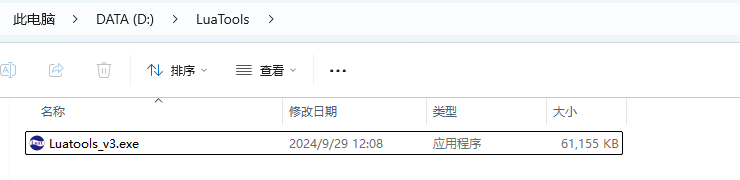
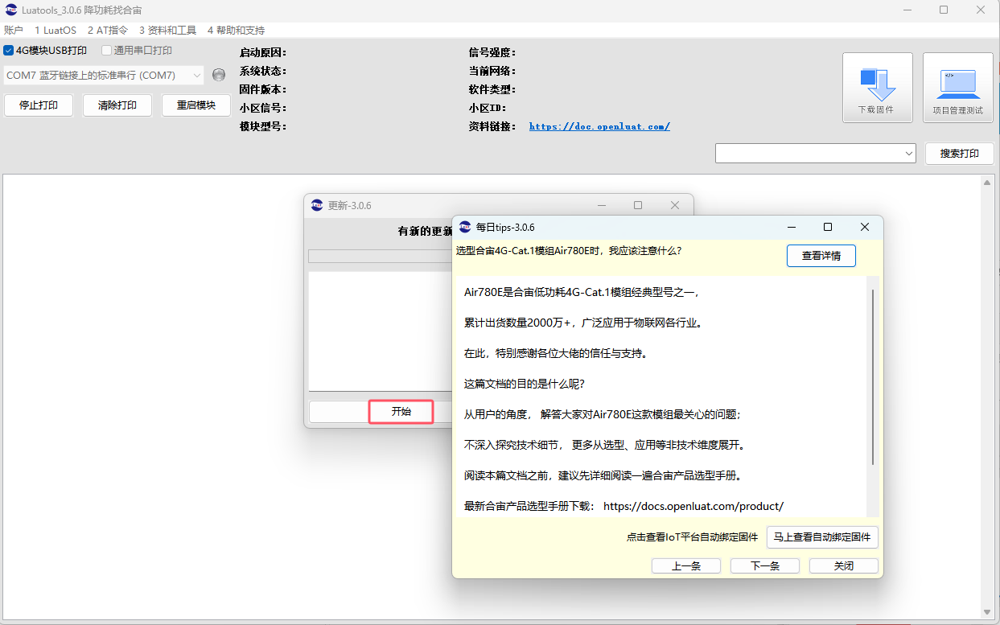
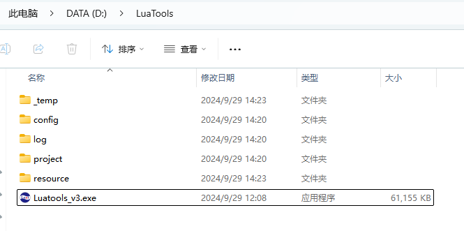

# Luatools下载调试工具

>作为由合宙所提供的调试工具，Luatools支持最新固件获取、固件打包、trace打印、单机烧录等功能
>
>此工具适用于合宙所有 4G 模组和 4G + GNSS 模组。

# 一、下载和安装

## （一）运行环境要求

- 此工具运行于win7及以上系统;

- 不支持 Mac和 Linux。

## （二）支持的模组型号

- Air724, 
- 所有的 Air780 系列模组；
- 所有的 Air700 系列模组；
- Air201 系列模组；

## （三）Luatools下载

 点击下载：[Luatools v3 下载调试工具](https://luatos.com/luatools/download/last "Luatools v3下载")

## （四）Luatools安装

### 1. 工具下载后的文件名为：Luatools_v3.exe

### 2. 在win系统--D盘（或其他盘）推荐在根目录下新建文件名，并重命名为 Luatools，目录太深可能会导致工具某些功能会出问题。

### 3. 将下载的Luatools_v3.exe拷贝或移动到新建的Luatools文件夹内
   **注意：若出现危险提醒，无需理会，继续下载即可**

 

### 4. 双击Luatools_v3.exe启动程序， 关闭每日tips，点击开始后更新
   **注意：如果有杀软拦截，请务必通过！！！务必通过！！！务必通过！！！**

### 5. 更新完成后，Luatools文件夹内，会生成几个新文件夹：

[下一章：   二、主要文件夹介绍](https://docs.openluat.com/Luatools_2/)