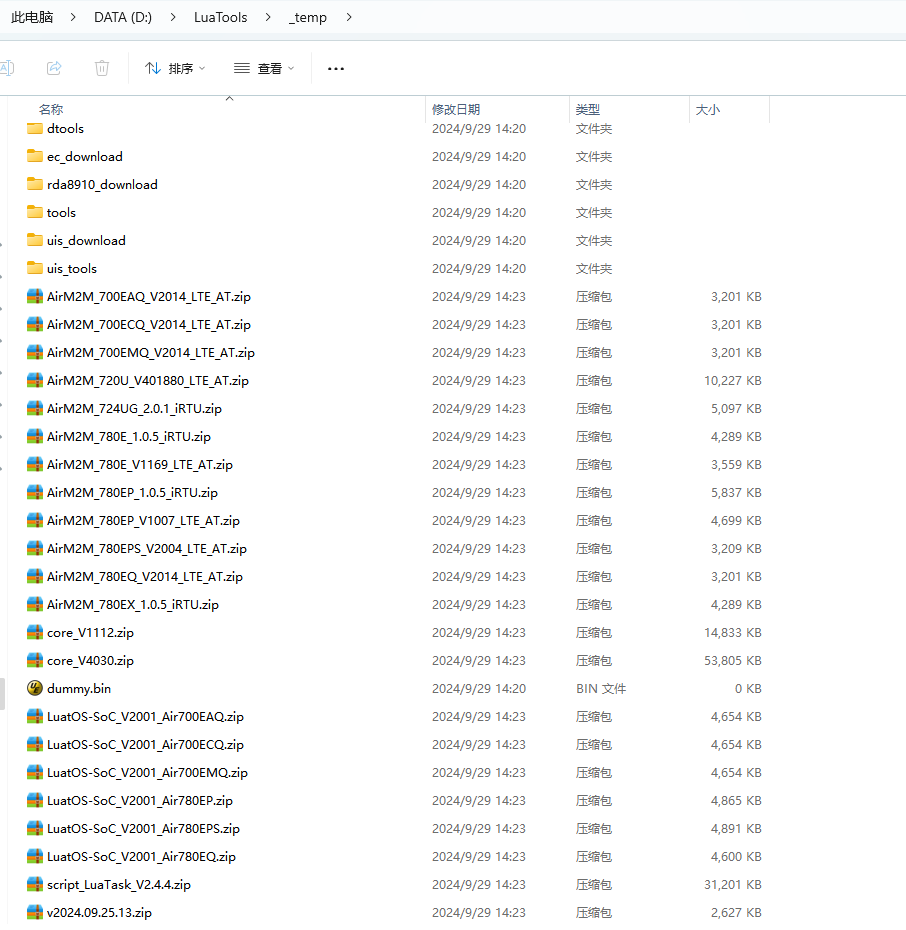
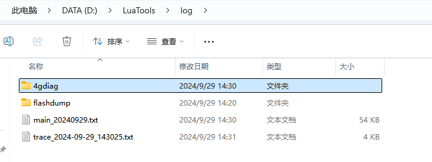
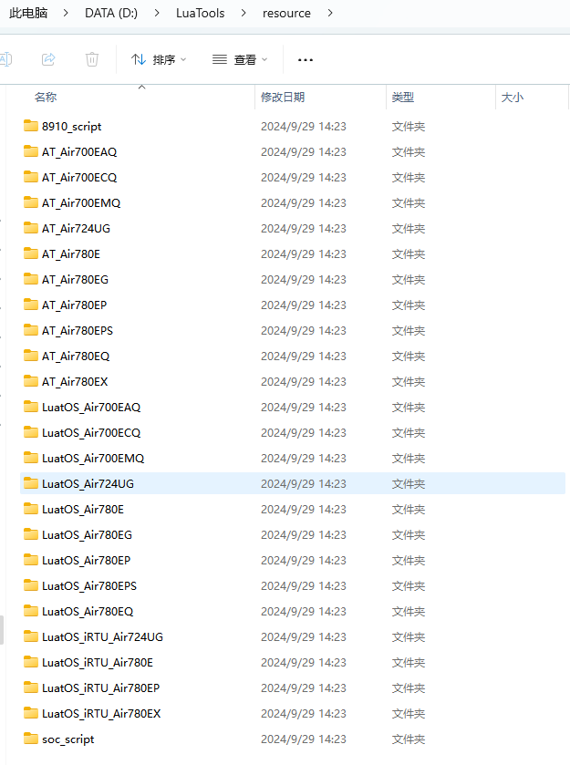

# Luatools下载调试工具

>作为由合宙所提供的调试工具，Luatools支持最新固件获取、固件打包、trace打印、单机烧录等功能
>
>此工具适用于合宙所有 4G 模组和 4G + GNSS 模组。

# 二、主要文件夹介绍

## 1， _temp 文件夹

临时文件

## 2. config 文件夹

对 Luatools_v3 进行的一些配置会存放到这个文件夹

## 3. log 文件夹

里面存放有模块输出的各种日志信息，当模块出现问题需要向合宙技术人员寻求技术支持的时候，就需要提交这个目录下的文件：

   - 4gdiag 文件夹：ap和cp日志
   - ramdump 文件夹：死机dump文件
   - main_xxxxxx：模块输出的调试日志
   - trace_xxxxxx：Luatools工具输出的日志

## 4. resource 文件夹

合宙模块相关的AT固件，LuaTask开发的Core底层固件，Lib库和demo脚本

   - aa_bb_lod 文件夹：aa表示芯片平台，bb表示开发方式（at / lua）,比如 LuatOS_Air780E, AT_Air780EQ
   - 8910_script 文件夹：Air724 模块的demo和Lib
   - soc_script 文件夹：gitee Luatos 主仓库更新的demo和Lib
   - LuatOS_iRTU_bb：LuatOS_iRTU表示是iRTU开发方式，bb表示模块名称

## 5. project 文件夹

使用项目管理后会自动生成这个目录，用于管理下载项目

[三、菜单和界面介绍](https://docs.openluat.com/Luatools_3/)