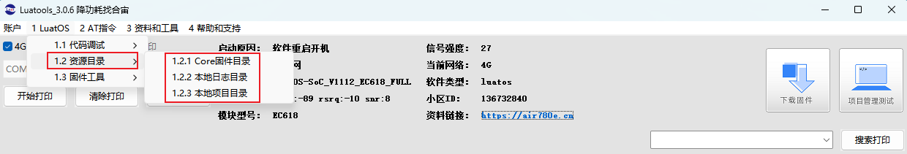
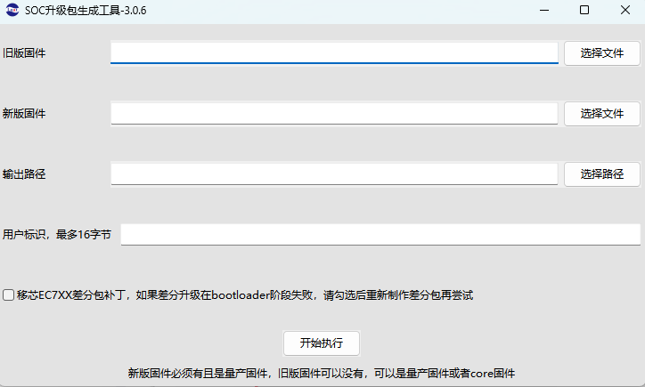
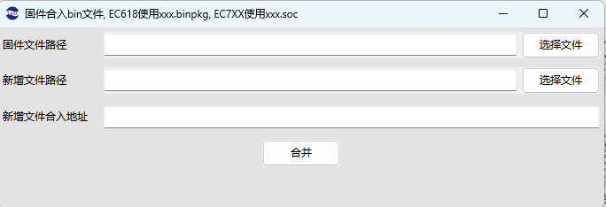
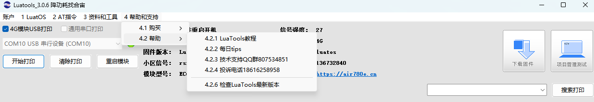
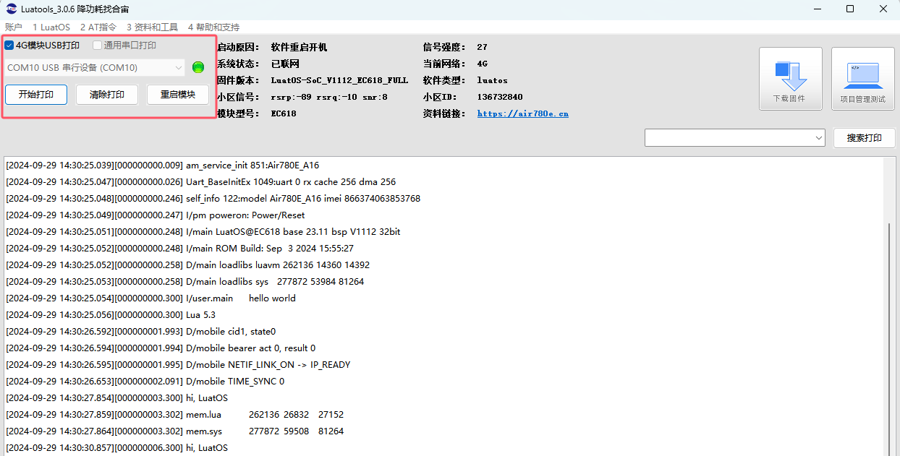

# Luatools下载调试工具

>作为由合宙所提供的调试工具，Luatools支持最新固件获取、固件打包、trace打印、单机烧录等功能
>
>此工具适用于合宙所有 4G 模组和 4G + GNSS 模组。

# 三、菜单和界面介绍

### 1. 账户

   - 登录
   
   使用购买时销售为你自动创建的erp账号登陆，可以在合宙技术人员远程支持客户时协助抓取本机log

   

   - 工具配置
   
   点击Log，当配合技术人员抓取bug日志时在此页面打开log功能，例如AP与CP日志，若使用工具经常遇到蓝屏，可先关闭底层日志的抓取

   

   - Exit：退出工具

### 2. LuatOS

#### 2.1 代码调试

   对应各个模块的DEMO的gitee路径

   - Air780E模块gitee路径： [Air780E](https://gitee.com/openLuat/LuatOS-Air780E "Air780E代码仓库")

   - Air780EX模块gitee路径：[Air780EX](https://gitee.com/openLuat/LuatOS-Air780EX "Air780EX代码仓库")

   - Air724UG模块gitee路径： [Air724UG](https://gitee.com/openLuat/LuatOS-Air724UG "Air724UG代码仓库")

   - Air201模块gitee路径：[Air201](https://gitee.com/openLuat/LuatOS-Air201 "Air201代码仓库")

   - Air780EPS模块gitee路径：[Air780EPS](https://gitee.com/openLuat/LuatOS-Air780EPS "Air780EPS代码仓库")

   - Air780EP模块gitee路径：[Air780EP](https://gitee.com/openLuat/LuatOS-Air780EP "Air780EP代码仓库")
   
   

#### 2.2 资源目录

   点击后进入对应资源所在目录

   

#### 2.3 固件工具

     差分包制作工具，固件脚本合并工具，转量产bin文件工具，iot平台账号绑定工具

   

   - 差分包/整包升级包制作
       可生成差分包或整包，用于FOTA远程升级使用，由于部分模块不支持在该工具上生成，具体以各模块FOTA远程升级例程上的要求为准。

       

   - 固件合并文件工具：固件合入bin文件。

      对 Air780E，Air780EX 模组：  使用xxx.binpkg；

      对 Air780EP，Air780EPS，Air780EQ，Air700ECQ，Air201，Air700 模组： 使用xxx.soc；

      对 Air724 模组：  使用 xxx.pac

      
       

### 3，AT指令
#### 3.1 固件烧录

     点击可以直接烧录对应模块的AT最新固件

   

     会弹出如下界面，点击下载后可以直接下载对应最新的AT固件版本（AT详细烧录过程见下面AT固件烧录部分描述）

   

#### 3.2 调试工具

     - 内置简约版本的串口调试工具，选择菜单：

   

     - 选择串口调试工具后，会弹出如下界面：

   

### 4，资料和工具

   

  
#### 4.1 Web工具

  - 经纬度查询和纠偏： [GPS-Offset](https://www.openluat.com/GPS-Offset.html)
  - TCP/UDP WEB测试工具： [netlab.luatos.com](https://netlab.luatos.com/)

#### 4.2 合宙 IOT平台

  - FOTA远程升级服务：[合宙云平台](https://iot.openluat.com/cloud/main)
  - ERP模块生产记录： [合宙ERP系统](https://erp.openluat.com/)
  - 合宙DTU管理平台： [DTU管理系统](https://dtu.openluat.com/)
  - LBS基站定位服务： [基站定位](https://doc.openluat.com/wiki/33?wiki_page_id=4092)
   
   

#### 4.3 资料
   

### 5， 帮助和支持
   

#### 5.1 购买

#### 5.2 帮助

### 6. 日志打印窗口

   

    - 支持4G模块USB（默认）打印和通用串口打印日志

    - 在非USB打印时，可选择通用串口工具在windows设备管理器对应的端口号，例如USB-TTL：

   

    - 开始/停止打印可以暂停文本区的自动滚动打印

    - 清除打印可以清空文本区的打印日志，但是不会删除log文件夹下的文件内容

### 7，模块状态显示窗口

   - 启动原因：模块开机原因
   - 系统状态：如果文本区中存在对应的日志，这里会显示SIM卡、网络注册等信息
   - 固件版本：这里仅仅显示core的版本信息，例如AT或者Luat的版本信息，不显示Lib和用户脚本的版本号
   - 小区信号：显示模块接入主小区 RSRQ、RSRP、SNR 信号值
   - 信号强度：这里显示GSM的信号强度。信号强度与卡是否欠费无关，不插卡也可以有信号强度
   - 当前网络：网络类型，例如 4G网络
   - 软件类型：这里是指Core的类型，例如Luatask或者AT
   - 小区ID：显示模块接入主小区的cellid
   - 资料链接：模块对应资料链接
   

### 8，下载固件入口

   - 除第二步点击选择文件后选择固件外，也可以直接拖动固件至该界面
   - 除AT固件外，可根据自己需要选择是否操作第三步，不需要可跳过第三步
   

### 9， 项目管理入口

   详细操作教程在第五章，[项目管理]

   

### 10，搜索打印

   通过关键词搜索可直接跳转到与之相匹配内容行

   

### 11，底部链接

   鼠标悬停至窗口四个边或四个角，可对窗口进行大小缩放

   

[下一章：   四、日志查看](https://docs.openluat.com/Luatools_4/)