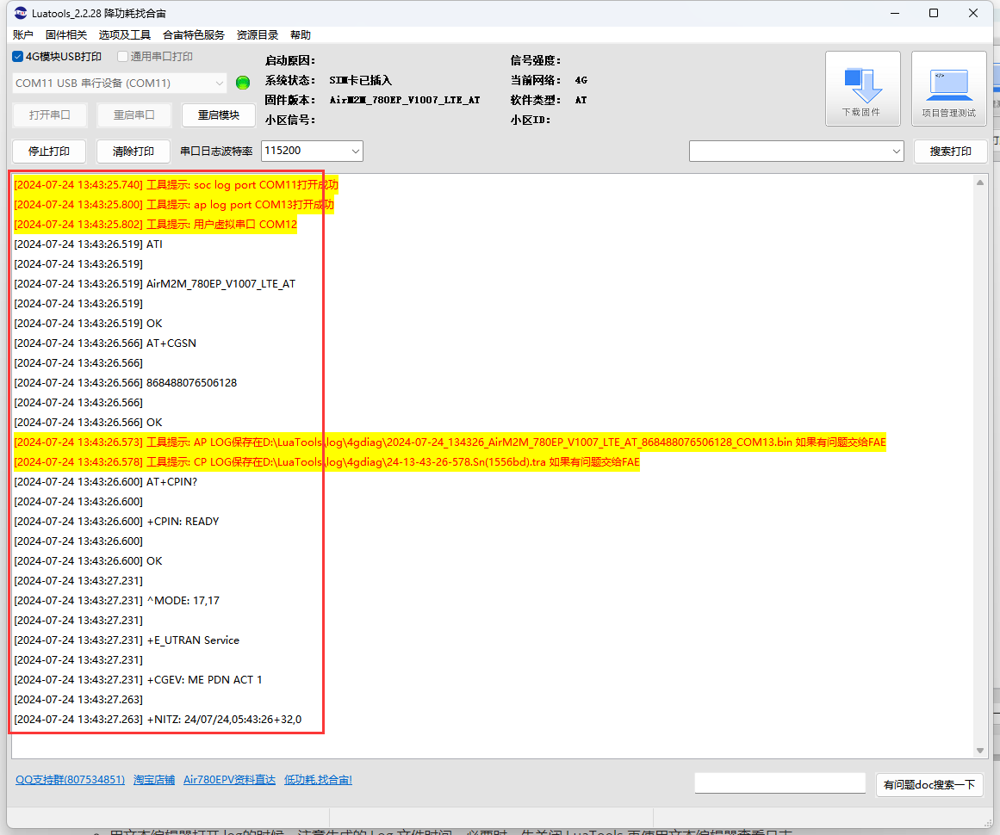
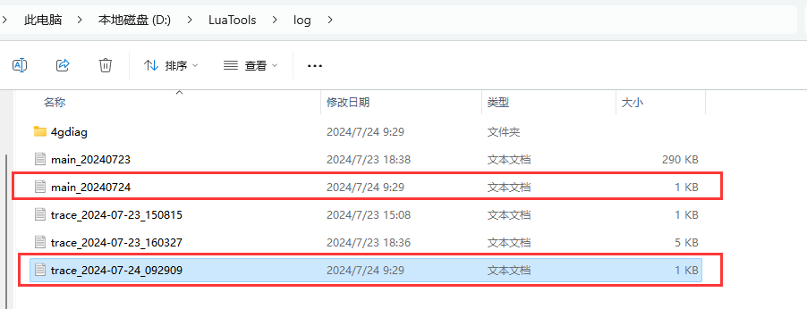
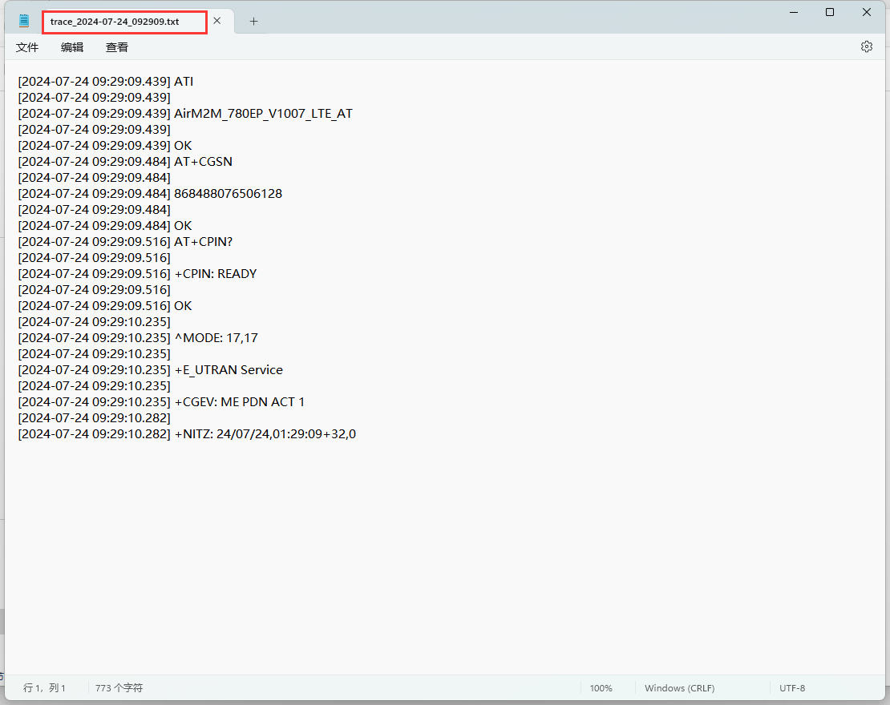

# Luatools下载调试工具

>作为由合宙所提供的调试工具，Luatools支持最新固件获取、固件打包、trace打印、单机烧录等功能
>
>此工具适用于合宙所有 4G 模组， 4G + GNSS 模组。

# 五、日志查看

## （一）使用Luatools文本区查看日志

## （二）使用文本编辑器直接查看log日志

- Luatools 的日志是 USB-TTL 或者 USB-VCOM 提供的，因此可能会独占串口

- 用文本编辑器打开 log的时候，注意生成的 Log 文件时间，必要时，先关闭 Luatools 再使用文本编辑器查看日志

[下一章：   五、项目管理](https://docs.openluat.com/Luatools_5/)