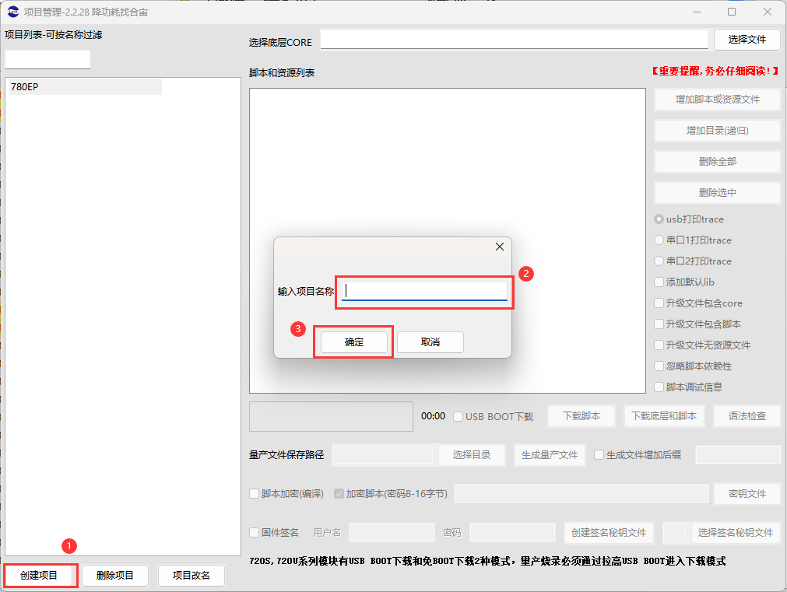
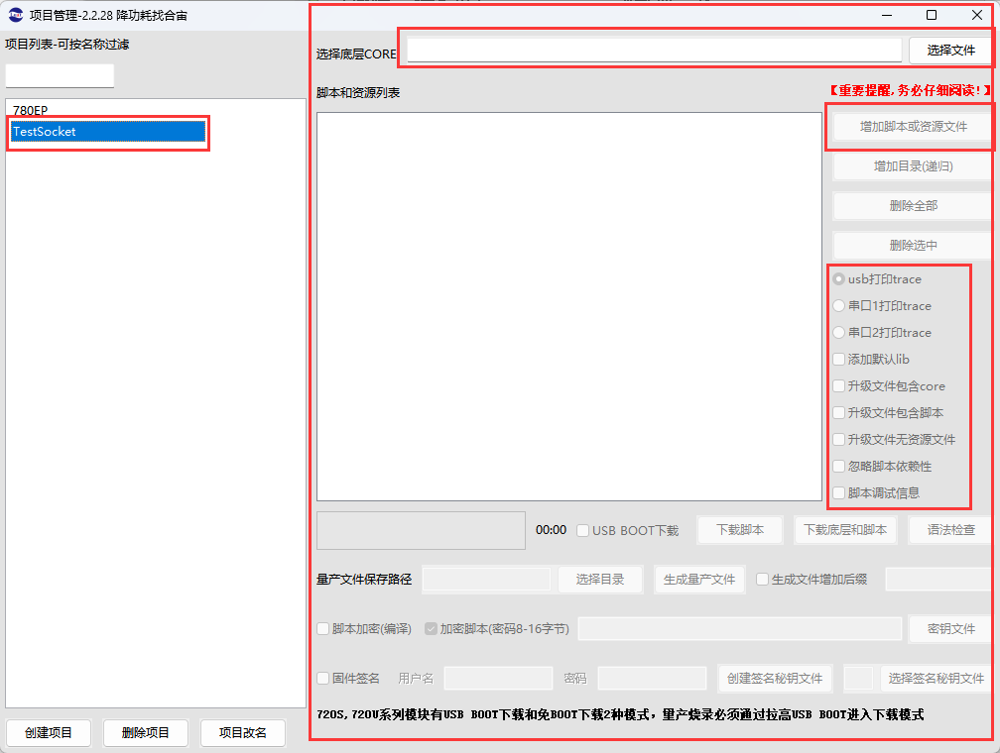

# Luatools下载调试工具

>作为由合宙所提供的调试工具，Luatools支持最新固件获取、固件打包、trace打印、单机烧录等功能
>
>此工具适用于合宙所有 4G 模组， 4G + GNSS 模组。

# 六、项目管理

## （一）创建项目

## （二）输入TestSocket，然后确定

## （三）单击 单击TestSocket项目，在右侧分别填入
   - 底层Core：Lua开发的底层Core
   - 增加脚本或资源文件：添加用户脚本、数据及Lib库
   - 默认USB打印trace，trace三个选项是用来选择打印输出方式的
   - 添加默认lib：不建议勾选
   - 升级文件包含core：用于项目打包，可按需选择
   - 升级文件包含脚本：用于项目打包，建议直接勾选
   - 升级文件无资源文件：用于项目打包，不选
   - USB BOOT下载：使用Boot模式下载
   - 下载脚本：只下载脚本列表中的数据
   - 下载底层和脚本：底层core和脚本列表中的数据都下载
   - 语法检查：单独检查用户编写的脚本有无语法错误

## （四）注意，首次下载时，强烈建议直接下载底层和脚本

[六、固件烧录](https://docs.openluat.com/Luatools_6/)
