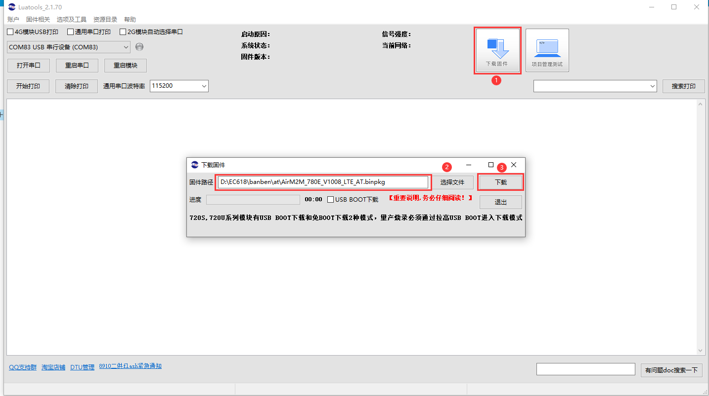
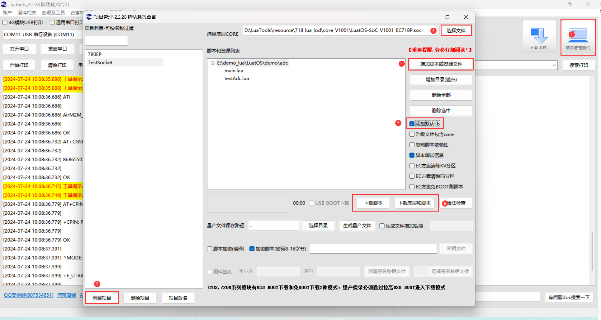
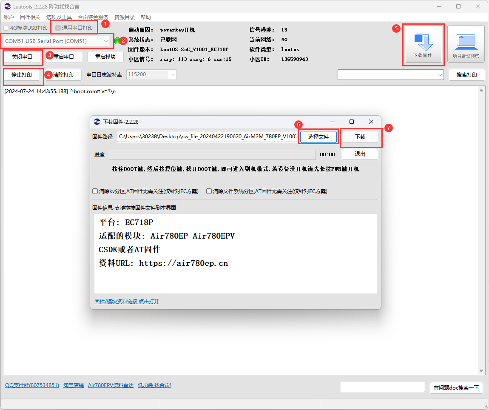
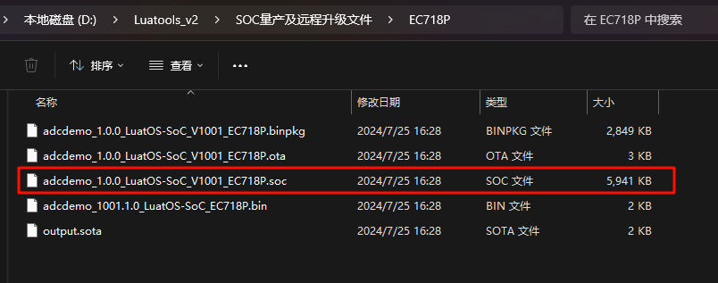

# Luatools下载调试工具

>作为由合宙所提供的调试工具，Luatools支持最新固件获取、固件打包、trace打印、单机烧录等功能
>
>此工具适用于合宙所有 4G 模组和 4G + GNSS 模组。

# 六、固件烧录

## （一）USB 固件烧录

  首先USB连接PC，保持上电不开机状态。

### 1，AT开发方式

  

   - （1）点击下载固件按钮。

   - （2）选中要下载的AT固件

   - （3）如果是开发板按住下载模式按键（boot 键）不放，同时再长按开机键开机，这时开发板会进入下载模式，Luatools下载进度条会开始跑，这时可以松开 boot 按键。直到工具提示下载完成。

   - （4）如果是自己画板，需要将模块boot引脚按照对应硬件手册要求，拉高到对应电平，再按住boot按键，上电开机，这时板子会进入下载模式，Luatools下载进度条会开始跑，这时可以松开 boot 按键。直到工具提示下载完成。

### 2，LuatOS开发方式

   - （1）在Luatools工具主界面点击"项目管理测试"

   - （2）如果没有新建过项目，需要先建立一个项目

   - （3）选择底层固件 .soc文件，或者其他后缀的固件

   - （4）添加脚本以及资源文件

   - （5）勾选添加默认lib

   - （6）如果模块是第一次还没有烧录过固件，或固件更换过，需要点击"下载固件和脚本"进行烧录。如果固件不需要更改，只有脚本变动，只需要点击"下载脚本"烧录即可。

   - （7）如果是开发板按住下载模式按键（boot 键）不放，同时再长按开机键开机，这时开发板会进入下载模式，Luatools下载进度条会开始跑，这时可以松开 boot 按键。直到工具提示下载完成。

   - （8）如果是自己画板，需要将模块boot引脚按照对应硬件手册要求，拉高到对应电平，再按住boot按键，上电开机，这时板子会进入下载模式，Luatools下载进度条会开始跑，这时可以松开 boot 按键。直到工具提示下载完成。

**如果，未能成功进入下载模式，而是进入正常开模式，这时可以按住 boot 键，再短按复位按键，让开发板重启，重新进入下载模式。**

**如何判断有没有进入下载模式:可以通过 PC 端的设备管理器中虚拟出来的 USB 断开数量来判断：**

   - 正常开机模式：

   
   - 下载模式：

## （二）视频烧录教程

点击下方链接，观看视频烧录教程：

[Air780E烧录教程](https://www.bilibili.com/video/BV1ae4y177jo/)

## （三）串口固件烧录

**重要注意事项**

   - Cat.1模块只有780E/780EX/780EP/780EQ/700ECQ/780EPS/Air201,支持串口烧录，
   - 只能通过main_uart（uart1）串口进行烧录，其他串口不行
   - 使用串口烧录的前提，是模块在正常工作，所以串口烧录不能救砖。
   - 救砖一定要用 USB + boot 的方式烧录；
   - AT开发模式下，如果 main_uart 可以通过115200波特率正常通讯AT指令，那么可以不用重启，只点击下载，模块会自动进入下载模式。
   - LuatOS开发模式下，串口烧录时需要重启，才可进入下载模式。

###  1，AT开发模式

   - (1)获取对应模块的AT固件
**获取方式（其一）**：中的resource文件夹

   - (2)勾选通用串口打印
   - (3)选择对应的串口号
   - (4)打开串口
   - (5)开始打印
   - (6)点击下载固件
   - (7)点击选择文件，选择对应的AT固件
   - (8)如果main_uart可以通过115200波特率正常通讯AT指令，点击下载，模块会自动进入下载模式。
   - (9)如果不能通讯，请确保模块复位或者下上电通过main_uart 115200波特率可以看到"RDY"的URC上报（串口功能正常），随后点击下载，如果模块没有进入下载状态，则按下复位或者重新上下电开机，则可以进入下载状态。

### 2，LuatOS开发模式

全文完。
