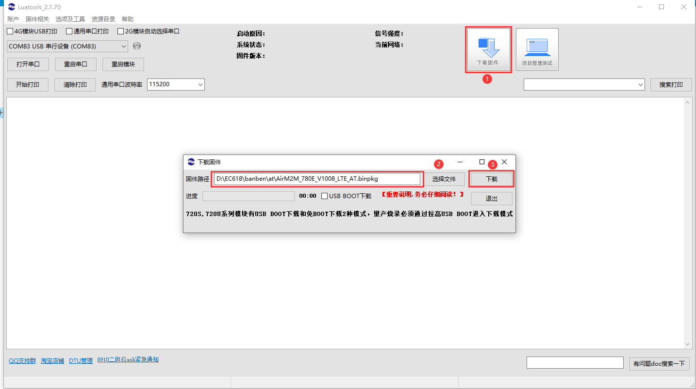
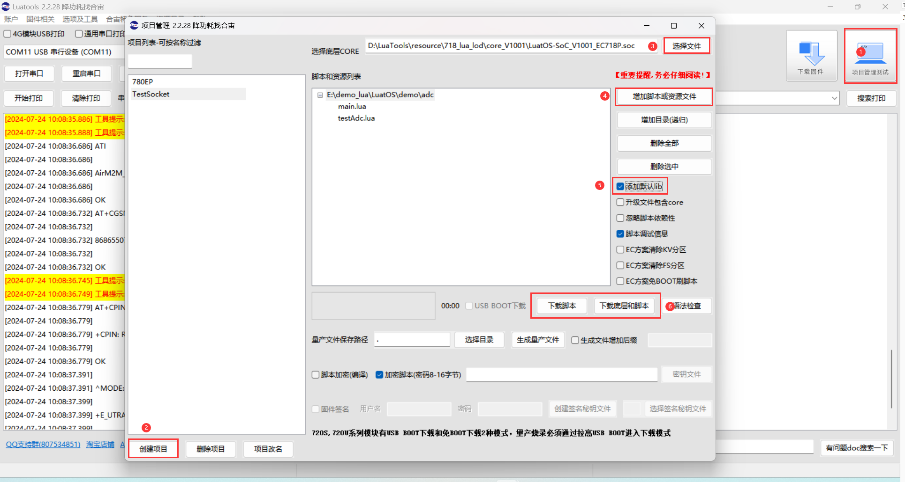
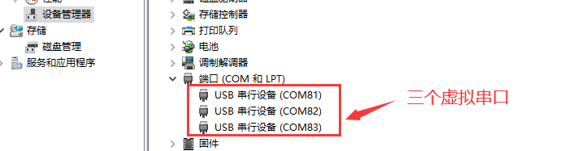
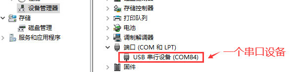

# Luatools下载调试工具

>作为由合宙所提供的调试工具，Luatools支持最新固件获取、固件打包、trace打印、单机烧录等功能
>
>此工具适用于合宙所有 4G 模组， 4G + GNSS 模组。

# 七、USB 固件烧录

  首先USB连接PC，保持上电不开机状态

## （一）AT开发方式

  

   - 1，点击下载固件按钮。

   - 2，选中要下载的AT固件

   - 3，如果是开发板按住下载模式按键（boot 键）不放，同时再长按开机键开机，这时开发板会进入下载模式，Luatools下载进度条会开始跑，这时可以松开 boot 按键。直到工具提示下载完成。

   - 4，如果是自己画板，需要将模块boot引脚按照对应硬件手册要求，拉高到对应电平，再按住boot按键，上电开机，这时板子会进入下载模式，Luatools下载进度条会开始跑，这时可以松开 boot 按键。直到工具提示下载完成。

## （二）LuatOS开发方式

   - 1，在Luatools工具主界面点击"项目管理测试"

   - 2，如果没有新建过项目，需要先建立一个项目

   - 3，选择底层固件 .soc文件，或者其他后缀的固件

   - 4，添加脚本以及资源文件

   - 5，勾选添加默认lib

   - 6，如果模块是第一次还没有烧录过固件，或固件更换过，需要点击"下载固件和脚本"进行烧录。如果固件不需要更改，只有脚本变动，只需要点击"下载脚本"烧录即可。

   - 7，如果是开发板按住下载模式按键（boot 键）不放，同时再长按开机键开机，这时开发板会进入下载模式，Luatools下载进度条会开始跑，这时可以松开 boot 按键。直到工具提示下载完成。

   - 8，如果是自己画板，需要将模块boot引脚按照对应硬件手册要求，拉高到对应电平，再按住boot按键，上电开机，这时板子会进入下载模式，Luatools下载进度条会开始跑，这时可以松开 boot 按键。直到工具提示下载完成。

**如果，未能成功进入下载模式，而是进入正常开模式，这时可以按住 boot 键，再短按复位按键，让开发板重启，重新进入下载模式。**

**如何判断有没有进入下载模式:可以通过 PC 端的设备管理器中虚拟出来的 USB 断开数量来判断：**

   - 正常开机模式：

   
   - 下载模式：

## （三）视频烧录教程

点击下方链接，观看视频烧录教程：

[Air780E烧录教程](https://www.bilibili.com/video/BV1ae4y177jo/)

