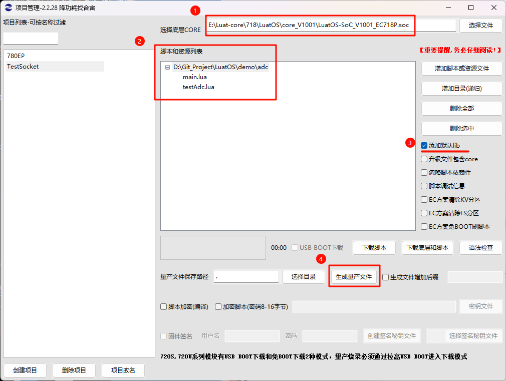
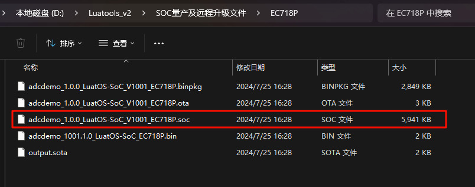

# Luatools下载调试工具

>作为由合宙所提供的调试工具，Luatools支持最新固件获取、固件打包、trace打印、单机烧录等功能
>
>此工具适用于合宙所有 4G 模组和 4G + GNSS 模组。

# 九、串口固件烧录

**重要注意事项**

   - Cat.1模块只有780E/780EX/780EP/780EQ/700ECQ/780EPS/Air201,支持串口烧录，
   - 只能通过main_uart（uart1）串口进行烧录，其他串口不行
   - 使用串口烧录的前提，是模块在正常工作，所以串口烧录不能救砖。
   - 救砖一定要用 USB + boot 的方式烧录；
   - AT开发模式下，如果 main_uart 可以通过115200波特率正常通讯AT指令，那么可以不用重启，只点击下载，模块会自动进入下载模式。
   - LuatOS开发模式下，串口烧录时需要重启，才可进入下载模式。

## （一）AT开发模式

   - 1，获取对应模块的AT固件
**获取方式（其一）**：中的resource文件夹

   - 2，勾选通用串口打印
   - 3，选择对应的串口号
   - 4，打开串口
   - 5，开始打印
   - 6，点击下载固件
   - 7，点击选择文件，选择对应的AT固件
   - 8，如果main_uart可以通过115200波特率正常通讯AT指令，点击下载，模块会自动进入下载模式。
   - 9，如果不能通讯，请确保模块复位或者下上电通过main_uart 115200波特率可以看到"RDY"的URC上报（串口功能正常），随后点击下载，如果模块没有进入下载状态，则按下复位或者重新上下电开机，则可以进入下载状态。

## （二）LuatOS开发模式

