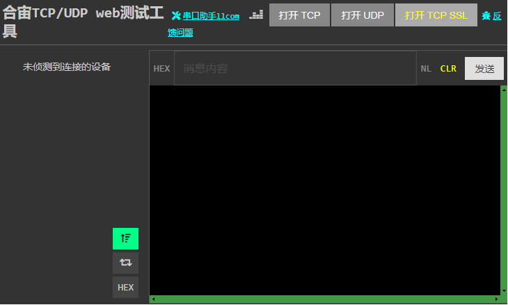
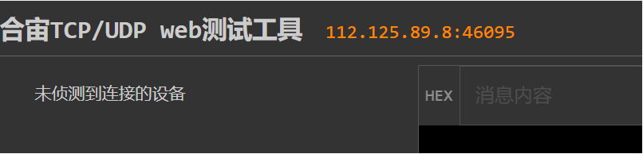
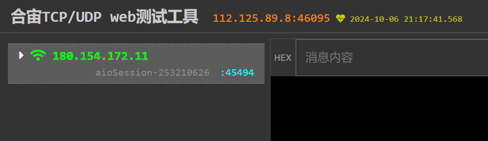
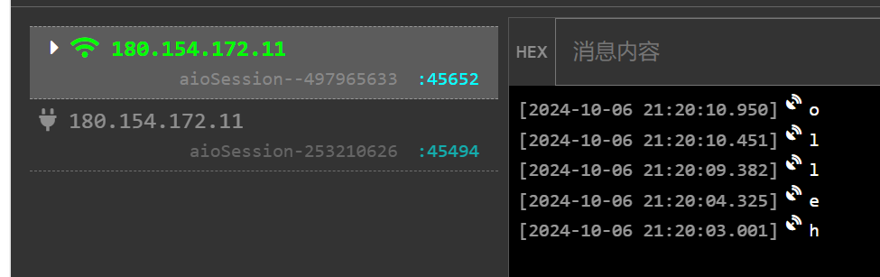
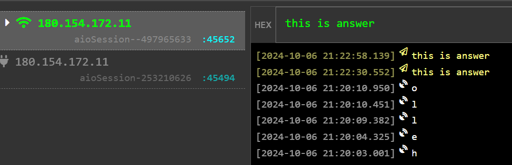
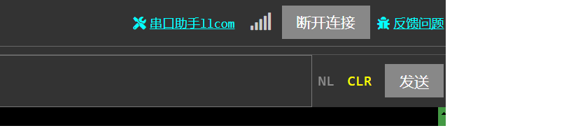

# 合宙 TCP/UDP web测试工具简介

## 合宙 TCP/UDP web测试工具简介

    合宙提供了一个 web 端的 TCP/UDP 测试工具，方便用户做各种基于 TCP 和 TDP 的模拟测试。

    网址为：   
[http://netlab.luatos.com/](http://netlab.luatos.com/)

    该测试工具不仅支持 TCP 和 UDP 测试，还支持 SSL。

## 工具说明

### TCP 测试

   按照如下步骤，可以把 合宙TCP/UDP web工具作为 TCP server 做测试：

   -- 1， 点击 "打开TCP" 按钮， 界面会出现 TCP server 侦听的 IP 地址和端口，如图所示：

   -- 2，终端在代码里面填上对应的 IP 112.125.89.8， TCP 端口填上 46095， 然后打开 socekt；

   -- 3, TCP 链接建立后， 合宙 TCP/UDP web 测试工具，会在界面上显示连上来的设备，如图所示：

   -- 4，终端发送数据给云端， web测试工具会显示收到的内容，如图：

   -- 5，web 测试工具，也可以主动向终端发消息，如图：

   -- 6，如果web 测试工具想主动断开链接，点击断开链接按钮即可。

### UCP 测试

    UDP 的测试，和 TCP 相同， 点击 "打开UDP"按钮即可开始测试。

### 其他功能

   -- 1， 日志的排列次序配置；

    左下角有按钮，支持日志按照时间正序和倒序排序的设置；

   -- 2， 支持自动回复；

    点击左下角的自动回复按钮，服务器可以自动回复终端发的消息，

    回复内容和收到的内容相同。      

   -- 3， 支持16进制显示消息日志

    点击左下角的16进制显示按钮后，同时显示 ascii 和 16进制的消息日志。
    