# FOTA（远程升级）
@[TOC](目录名称)

## 一. 概述
update是物联网中比较常用的功能，本文介绍如何用Air780E开发板，如何做update升级。

LuatOS-Air开发模式下，固件分为两部分：core和script

远程升级时：core为差分升级；script为全量覆盖升级

远程升级时：可以仅升级script；可以仅升级core；也可以同时升级core+script

支持合宙iot平台升级和自建第三方服务器升级

## 二. 材料准备
1. [[EVB_Air780E]](https://item.taobao.com/item.htm?spm=a1z10.1-c-s.w5003-23813349255.25.43af346aVmYQNY&id=614125604268&scene=taobao_shop "EVB_Air724UG_A13")开发板一套，包括天线SIM卡，USB线。
2. PC电脑，以及登录官方IOT后台 https://iot.openluat.com/
3. 固件和DEMO下载地址 [LuatOS软件包](https://gitee.com/openLuat/LuatOS/releases)

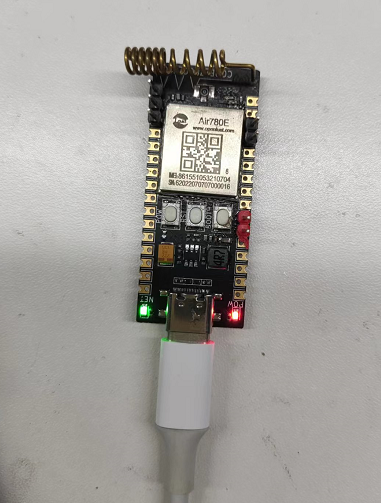


## 三. 合宙iot平台升级core+script过程

### 	1. iot平台创建产品

1. ​	登录[合宙iot平台](http://iot.openluat.com/ "合宙iot平台")

2. 如果没有账户，注册一个账户

3. 我的项目->新建产品
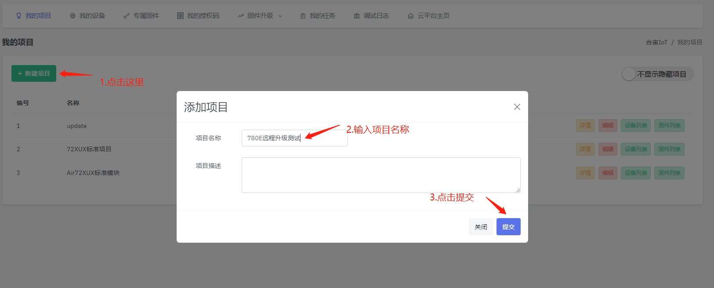

4. 复制PRODUCT_KEY
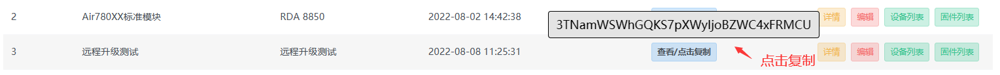

###    2. 模块端脚本修改，生成升级包

| core |         旧版本core          |                          新版本core                          |
| ---: | :-------------------------: | :----------------------------------------------------------: |
| 例子 |     LuatOS-SoC_V1103_EC618.soc    |                      LuatOS-SoC_V1103_EC618.soc                      |
| 要求 | 1、大于等于旧版本core版本号 | 2、新旧版本core支持的功能相同 |

|     script <br />main.lua     |    旧版本<br />（模块端本地烧录的）    | 新版本<br />（生成的量产文件，远程升级包） |                    要求                     |
| :---------------------------: | :------------------------------------: | :----------------------------------------: | :-----------------------------------------: |
|   PROJECT<br />（项目名称）   |        fotademo         |           fotademo           |              新旧版本保持一致               |
|  VERSION<br />（软件版本号）  |                 1.0.1                  |                   1.0.2                    |            大于等于旧版本VERSION            |
| PRODUCT_KEY<br />（项目密钥） | 3TNamWSWhGQKS7pXWyIjoBZWC4xFRMCU |   3TNamWSWhGQKS7pXWyIjoBZWC4xFRMCU   | 和iot平台创建的产品<br />ProductKey保持一致 |


### 3. 按照新版本的需求，修改main.lua

   如下图所示，PROJECT和PRODUCT_KEY保持不变，PRODUCT_KEY需和服务器保持一致，VERSION修改为1.0.2。

>**注意事项：**
**1、固件版本 V1103 及以上, 配合 libfota.lua
2、main.lua 内填写版本号要符合 x.y.z 形式, 其中 x/y/z 均为数值, 不限于个位数
3、若fota使用合宙iot平台, 版本号中的 y 会被忽略, 推荐写0, 务必留意**

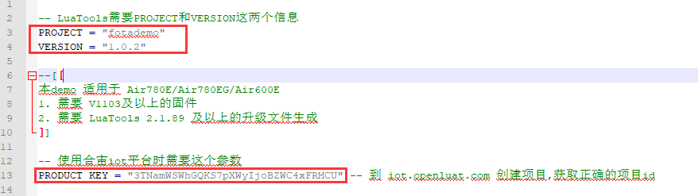


### 4. 使用Luatools生成bin文件差分包

**`注意：只有Luatools版本2.1.89以上支持生成bin文件差分包，低版本仅支持生成sota文件`**
* **只升级脚本，差分包制作流程如下：**
固件和DEMO下载地址 [LuatOS软件包](https://gitee.com/openLuat/LuatOS/releases "LuatOS软件包")，这里下载的是LuatOS-SoC@EC618 V1103项目下面的core_V1103.zip软件包。下载对应软件包后按如下步骤生成对应的差分包。


  在Luatools目录下的SOC量产及远程升级文件下，找到EC618文件夹，打开后缀名为.bin的文件fotademo_1103.1.2_LuatOS-SoC_EC618.bin，这个就是文件差分包。
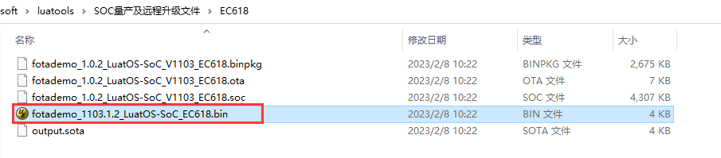

* **需要升级底层CORE，差分包制作流程如下：**
1）生成新版本的量产固件，如下所示：
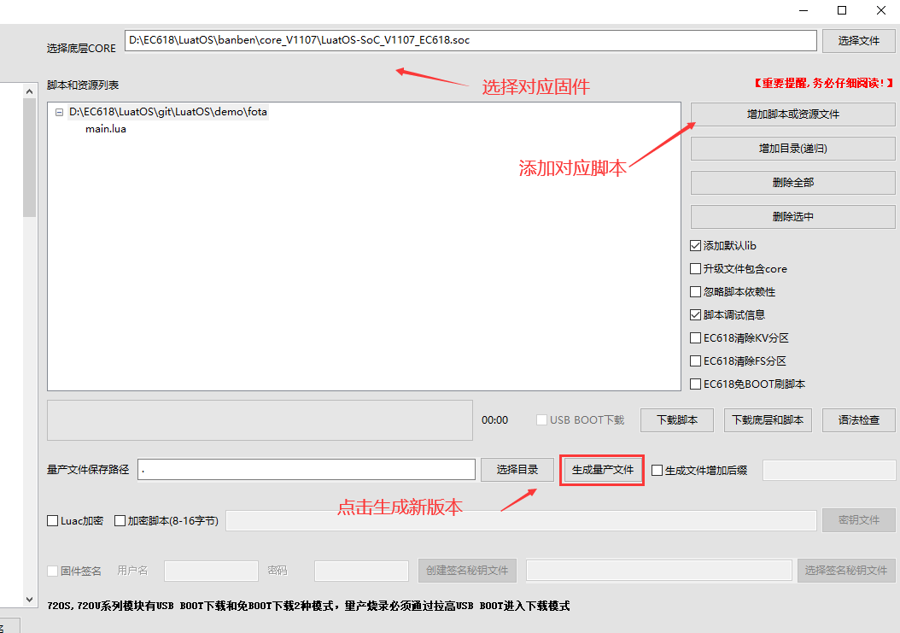
2）根据新旧固件生成对应差分文件，如下所示：
a、点击选项及工具选项，选择升级包制作工具
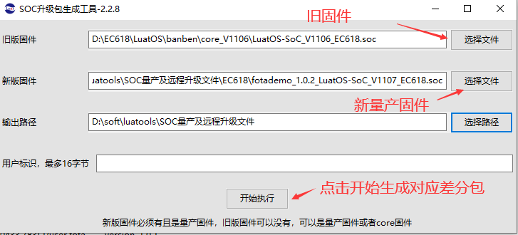
b、选择对应文件，点击开始执行生成对应差分文件
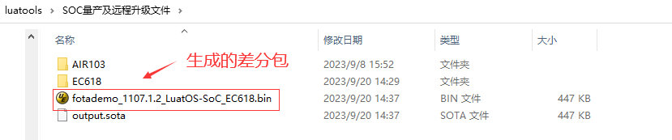
3）生成的对应差分文件见下图所示：
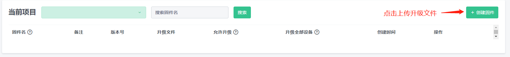

  ###  5.在合宙iot平台配置升级包

   进入iot平台创建的产品，打开我的项目->固件列表->创建固件，如下图所示


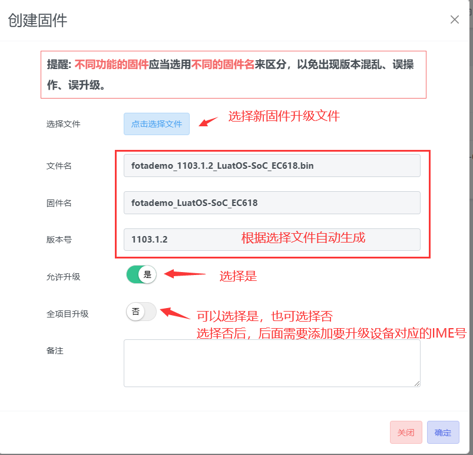


点击确定之后，升级配置完成，如下图所示
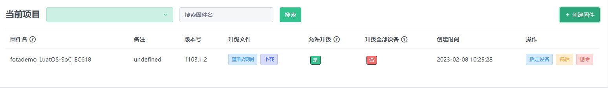

添加需要升级的模块imei，如下图所示

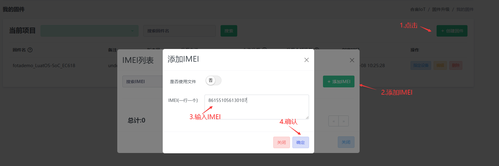

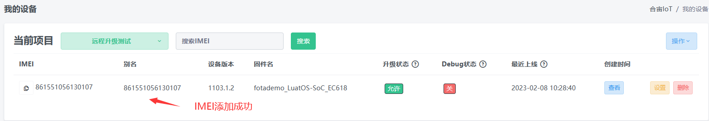

### 6. 模块开机，完成升级

烧录旧版本的模块开机后，连接升级服务器，下载差分升级包，自动重启，重启过程中完成固件升级，整个过程的关键日志如下图所示
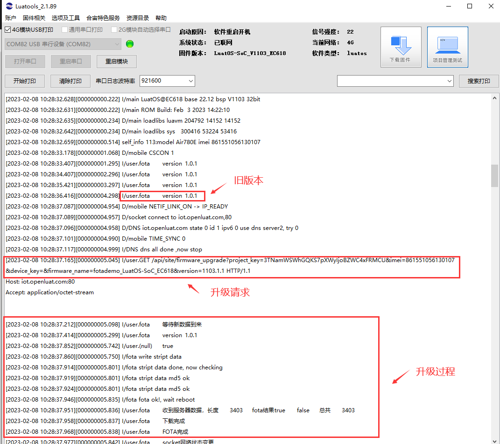

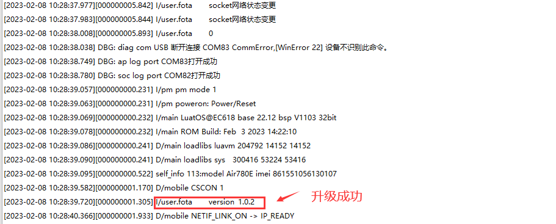

### 7.云平台查看升级日志

登录云平台，选择对应设备升级的产品->固件升级->升级日志->输入对应的imei并选择日期->搜索

可以看到设备在此日期下的空中升级日志。正常升级成功的情况下，短时间内会有两次升级请求，第一次请求升级获取到升级包之后，设备重启升级成功会再次向云平台请求是否有更高版本的固件可以升级。直到升级结果为 “已是最新版本” 服务器没有更高版本的固件为止。

设备升级失败等情况，可对照以下表格寻求解决方案。

| 响应码 |   响应信息   |                       问题以及解决办法                       |                   云平台日志结果                   |
| :----: | :----------: | :----------------------------------------------------------: | :------------------------------------------------: |
|   3    |  无效的设备  |                 检查请求键名(imei小写)正确性                 |                         无                         |
|   17   |    无权限    | 设备会上报imei、固件名、项目key。<br />服务器会以此查出设备、固件、项目三 条记录，<br />如果 这三者不在同一个用户名下，就会认为无权限。<br>设备不在项目key对应的账户下，<br />可寻找合宙技术支持查询该设备在哪个账户下，<br />核实情况后可修改设备归属 |                       无权限                       |
|   21   |      21      |                    不允许从1.0.2升到1.0.3                    |                         21                         |
|   25   |  无效的项目  | productkey不一致，检查是否存在拼写错误，<br />检查模块是否在本人账户下，若不在本人账户下，请联系合宙工作人员处理 |                     未找到项目                     |
|   26   |  无效的固件  | 固件名称错误，项目中没有对应的固件。用户自己修改了固件名称，可对照升级日志中设备当前固件名与升级配置中固件名是否相同（固件名称，固件功能要完全一致，只是版本号不同）。 |                     找不到固件                     |
|   27   | 已是最新版本 | 1、设备固件版本高于云平台<br>2、固件版本设备脚本版本高于云平台版本<br>3、用户项目升级配置中未添加该设备<br />4、云平台升级配置中，是否升级配置为否 |    已是最新版本<br>设备不在配置的升级设备列表中    |
|   40   |   循环升级   | [云平台](https://iot.openluat.com/)进入设备列表搜索被禁止的imei，解除禁止升级就好了。<br />云平台防止模块在升级失败后，反复请求升级导致流量耗尽，<br />在模块一天请求升级六次后会禁止模块升级。可在平台解除。 | 检测到循环升级<br />(已禁止升级，请到设备列表解除) |
|   43   |    请等待    | 云平台生成差分升级包需要等待，<br />一到三分钟后云平台生成完成差分包便可以请求成功。 |                正在生成版本，请等待                |
|   44   | 基础版本缺失 | 平台未收录设备固件（多为定制固件，<br />可寻找合宙技术支持人员添加，需提供定制固件邮件） |                  基础CORE版本缺失                  |


## 四. 自建第三方服务器升级过程

### 使用自建第三方服务器升级：
**`注意：只有Luatools版本2.1.89以上支持生成bin文件差分包，低版本仅支持生成sota文件`**

手动生成core差分包+script全量包。例如core版本有1001、1002、1003，现在要统一升级到1004，则需要按照如下步骤操作：

1、手动生成：从1001到1004的core差分包+script全量包、从1002到1004的core差分包+script全量包、从1003到1004的core差分包+script全量包

2、模块请求升级时，服务器根据模块中的core版本返回对应的升级包文件

手动生成差分包的过程如下：

用合宙提供的luatools中的soc差分工具生成差分包
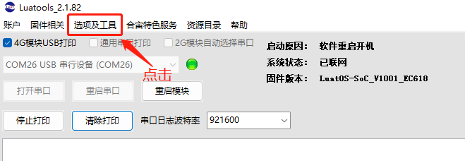
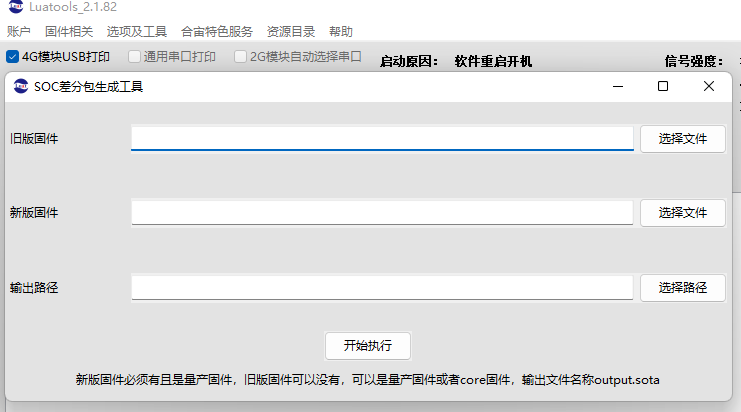

操作步骤：

#### 1、准备：模块中使用的旧版本core升级文件

此文件指的是模块中旧版本core中的.soc文件（从合宙官方渠道下载），例如以LuatOS-SoC_V1103_EC618.soc为例
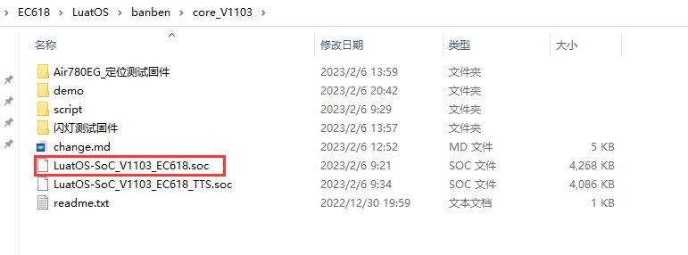


### 2. 使用Luatools分别生成新旧版本的升级包

如下图所示

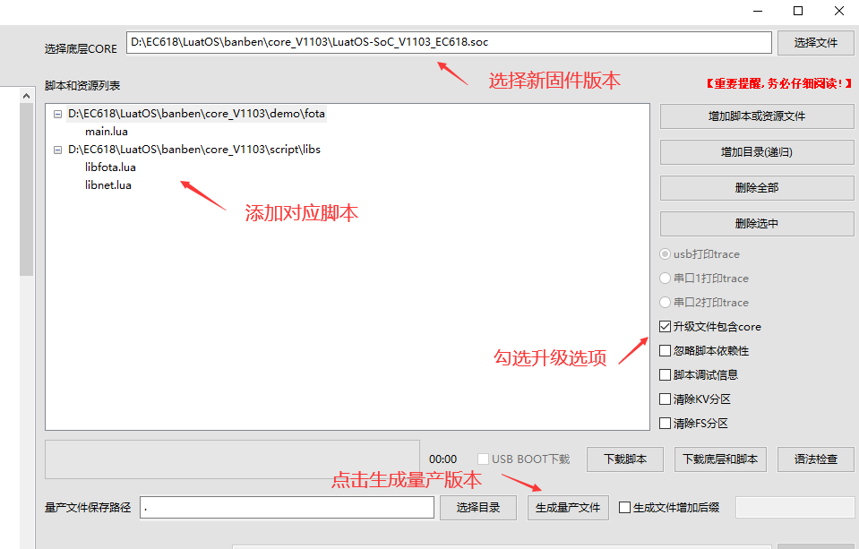

 在Luatools目录下SOC量产及远程升级文件下的EC618下，生了一个后缀名为.soc的文件fotademo_1.0.2_LuatOS-SoC_V1103_EC618.soc，这个就是新版本的升级包
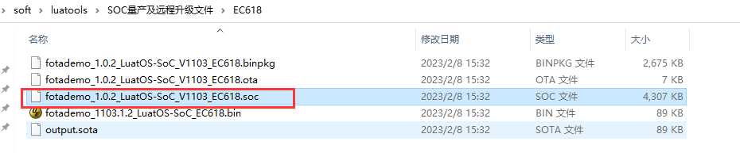


#### 3、生成差分包

使用luatools生成升级文件，无论core是否需要升级，升级文件必须包含core，因为差分会用到
使用luatools内的soc差分工具生成即可
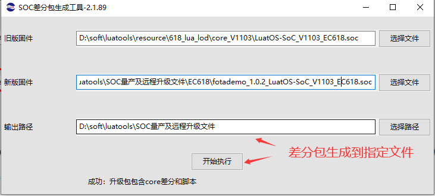
生成对应差分包如下图所示：

>**注意：差分包不能超过480k**

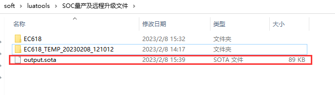

#### 4、差分包上传到自建服务器

lua固件默认支持HTTP获取升级包

启动远程升级功能，demo/fota/mian.lua文件做如下修改，注释掉使用合宙iot平台进行升级，打开使用自建服务器进行升级部分代码，填写对应的ota_url 。

>注意：服务器端需要有判断版本号的能力。

```lua
-- 使用合宙iot平台进行升级
--libfota.request(fota_cb)
--sys.timerLoopStart(libfota.request, 3600000, fota_cb)

-- 使用自建服务器进行升级
 local ota_url = "http://myserv.com/myapi/version=" .. _G.VERSION .. "&imei=" .. mobile.imei()
 libfota.request(fota_cb, ota_url)
 sys.timerLoopStart(libfota.request, 3600000, fota_cb, ota_url)
```


#### 5、使用其他协议实现自建服务器远程升级

可参考脚本库中配置。无论使用哪种协议，远程升级的关键是获取正确的升级固件包。


