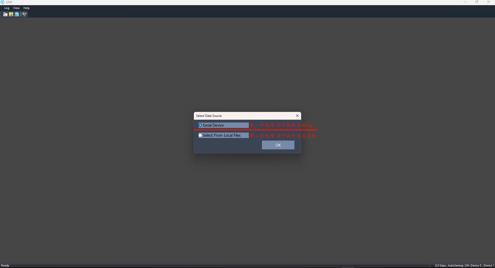
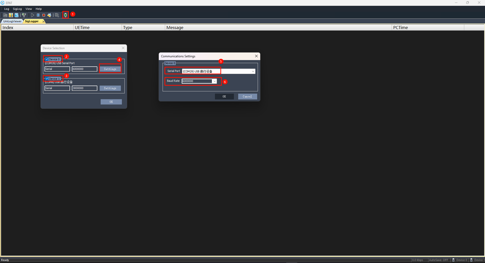
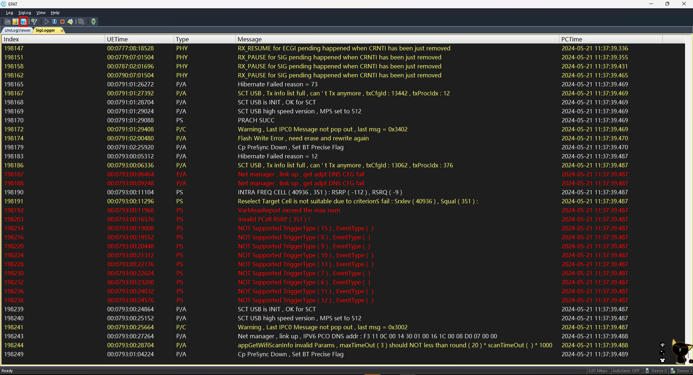
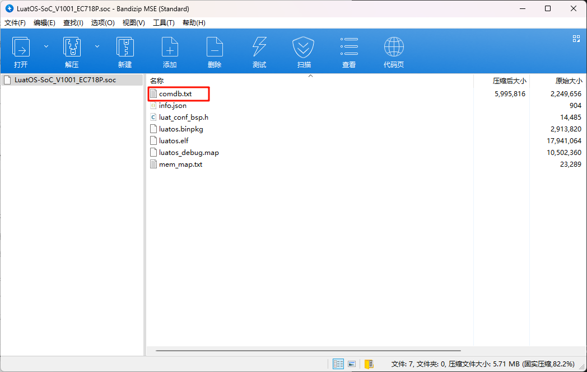
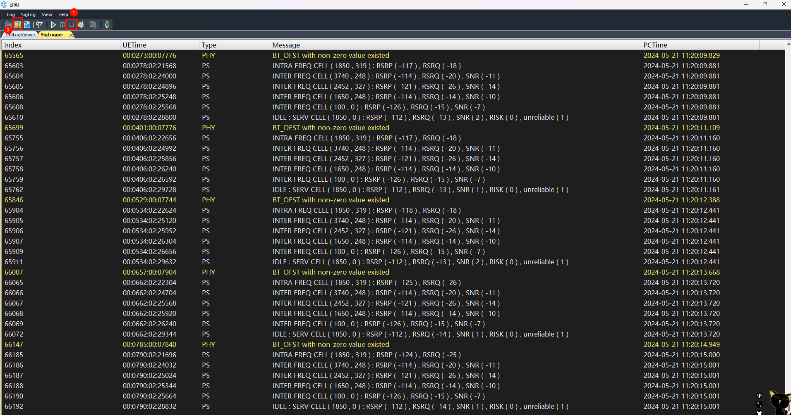

# 合宙模组日志总体介绍

## 一、本文讨论的边界
   
    本文是对合宙 4G 模组， 以及 4G+GNSS 模组的日志功能的总体介绍。

    通过日志，可以对研发过程中，以及模组运行过程中的各种故障进行分析。

## 二、4G 模组日志的几种类型

    4G 模组的日志有两种类型：  业务日志和底层日志。

    业务日志是指在用模组的客户代码输出的日志，包括 AT指令交互的日志和二次开发的业务代码输出的日志。

### （一）AT 交互的业务日志

    把模组作为 AT 指令的方式做开发的时候， 可以通过串口工具，抓取 AT 指令的日志。

    也可以由设备的主控 CPU，输出和模组的 AT 指令的交互日志。

    AT 交互的日志，用普通的串口工具，比如 sscom，LLcom，都可以使用。

### （二）二次开发的业务日志

    在用 LuatOS 二次开发的代码里面， 用 print()函数， 就可以输出任何的信息到 Luatools。

    通过 Luatools 的日志查看界面， 就可以非常方便的查看， 保存，分析业务日志。

    使用 Luatools 查看日志的详细资料，可以查看：    
[Luatools下载和使用教程](https://docs.openluat.com/Luatools_1/ "Luatools详细教程")

### （三）底层日志

   当遇到疑难问题， 用业务日志无法定位问题原因的时候， 就需要抓取底层日志，
   
   交给合宙的技术同事分析问题。

   无论是 AT 指令方式的开发，还是在模组内部做二次开发，都可以抓取底层日志。

## 三、怎么抓底层日志
    本章的内容，适合合宙 780 系列模组，700系列模组，不适合 724和795系列模组。
    底层日志工具，叫做 EPAT 工具。

### （一）下载底层日志工具

   点击如下链接， 直接下载底层日志工具 EPAT：
[合宙模组底层日志抓取和分析工具](https://cdn.openluat-luatcommunity.openluat.com/attachment/20240204134335482_EPAT_V1.3.262.573.zip "合宙底层日志工具下载")   

### （二）日志输出端口
   如  [彻底讲清楚 USB驱动问题](https://docs.openluat.com/usb_drv/) 这篇教程所说，
   USB的虚拟端口中，有一个底层日志的输出端口。
   可以从设备管理器的端口属性中根据“设备实例路径”中的值是否是0004，来判断底层日志的输出端口。

   正常情况下，要用USB物理接口抓取日志，因为USB虚拟出来的端口的输出速率很高，
   基本不会出现丢日志的现象。

   而串口抓底层日志，很容易丢失日志，导致抓不全日志，给问题分析带来很大的障碍。

### （三）EPAT工具中图标功能
- 打开日志文件，需要在打开EPAT工具时跳出的"Select Data Source"选择框中选择"Select From Local Files"，才能点击使用功能，可以打开ZIP压缩包和Bin格式的日志文件。
-  保存日志，会将已抓取到的日志导出，以ZIP压缩包的方式保存，方便提供给技术同事或研发同事分析。
- 更新解析日志的数据库文件，在抓日志的时候，可以不匹配，等在使用EPAT打开日志文件的时候再做匹配解析。
-  筛选查看日志，如果不了解，用不到这个功能
- 启动开始抓日志，如果没有日志出来，请检查日志端口有没有选择正确，有没有勾选打开；确认端口正确，也以勾选，还是没有日志出来，请尝试：
    - 1）重启模块
    - 2）勾选选择的端口从其他串口调试工具尝试打开是否可以正常输出数据（乱码）
    - 3）如果使用AT固件，默认DBG_UART端口输出是3M波特率，可以通过AT+ECPCFG=logBaudrate,6000000 指令修改，波特率设置请不要低于3M，不然很容易出现丢日志、抓的不全。
-  暂停日志
-  停止抓日志，点击完停止后，就可以选择保存日志 发给技术/研发同事分析了。
-  清除日志，建议每次正式准备抓日志前清理一下日志，这样保存出来的日志给技术同事分析会方便很多。
-  搜索日志内容
- 设备端口配置界面

### （四）EPAT底层日志抓取方法

#### 1，打开EPAT工具，抓日志选择第一项“Serial Device”

#### 2，选择日志端口，准备抓取log

    - （1）打开设备端口配置界面

    - （2）关闭或打开端口，如果端口被占用，工具也不会提示"端口已被占用"，所以如果发现端口选择正确，并且日志还是没有出来的话，可以确认下日志端口是否有被占用，而导致EPAT没有打开日志端口。

    - （3）日志端口可以同时打开两个，一个用模块的DBG_UART端口打开，另一个使用USB的日志输出端口，AT固件需要设置AT+ECPCFG=logPortSel,2（重启生效）才能设置日志端口可以从USB和DBG_UART两个端口输出。
    好处是在进入休眠的时候，待USB断开，就会用DBG串口输出日志，等模块唤醒时就会重新虚拟出来USB端口，就会从USB的日志口抓取日志。这样抓取休眠中的程序日志 也基本上不会出现日志丢失的情况。

    - （4）打开日志输出端口和修改波特率的界面

    - （5）选择日志输出端口

    - （6）USB的虚拟日志端口不用特意修改波特率；
 DBG_UART端口默认为3M波特率输出，请不要随意更改，如果技术/研发同事发现日志丢失严重，可手动写入修改为6000000（6M）波特率；

#### 3，抓取底层日志

如果输出的日志有乱码，先确认波特率是否有改动，是不是默认3M波特率抓取的，或确认串口线是否支持3M波特率输出。然后再点击上图红框中的图标匹配数据库comdb解析文件。

#### 4，获取数据库db文件

抓日志时，可以不做数据库匹配，只需要把文件发给技术同事就可以了；
但如果技术同事建议本地先匹配数据库文件后再抓取，那优先保证日志可以正常输出出来，然后再匹配数据库文件。

    - LuatOS开发的db文件获取
在底层core .soc后缀的固件中，通过解压缩工具打开该文件，可以看到里面会有一个comdb.txt文件，在EPAT选择更新数据库文件的时候 选择该文件，随后点击"UPDATE"，如果变为绿灯 代表匹配成功；如果是还是红灯表示 选择的db文件和现在模块中烧录的固件不匹配；

    - AT开发的db文件获取
AT开发方式只能从技术同事中获取，一般AT的底层问题，不需要客户去看，所以一般不需要匹配数据库文件，抓取成功日志将zip日志压缩包和模块使用的AT固件完整版本号（发ATI 指令查看版本号）发给技术同事，分析时自行匹配。

数据库文件更新成功后， 灯会变成绿色

#### 5，保存日志

    - 导出日志前，先停止打印

    - 点击保存日志的图标
保存的日志文件不要以相同名称文件覆盖的形式保存，否则日志会保存失败，实际内容不会覆盖。

#### 6，将保存出来的ZIP日志压缩包发给技术分析

