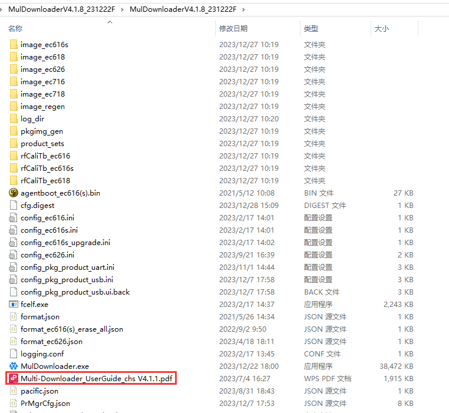
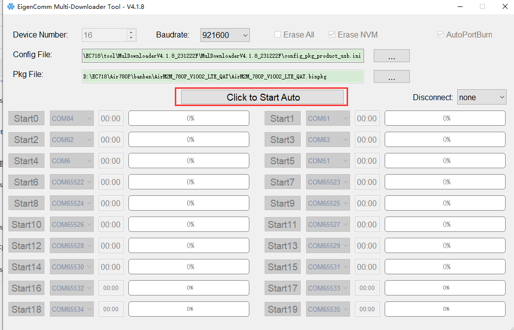
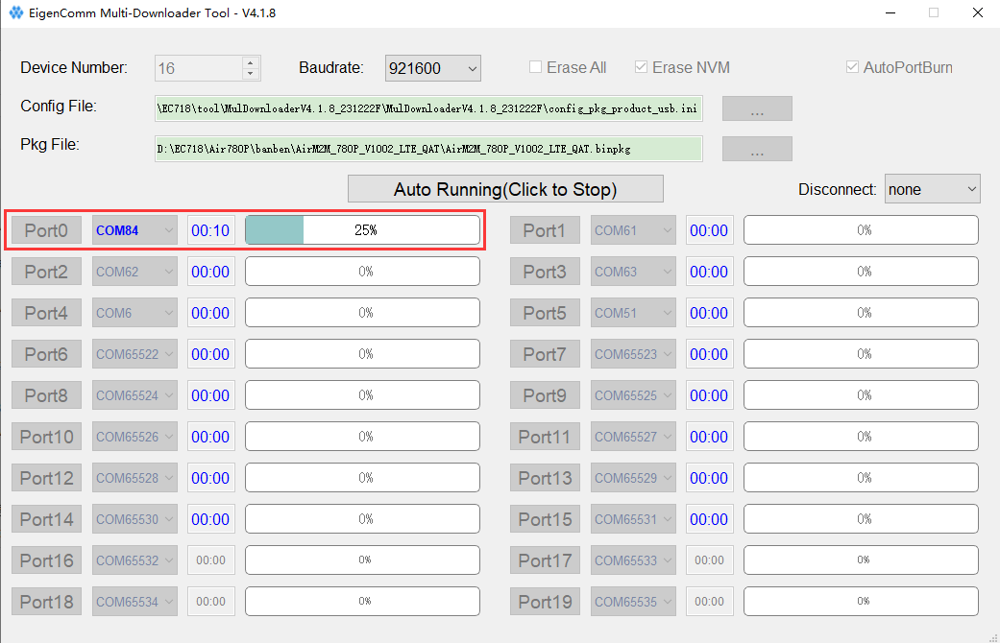
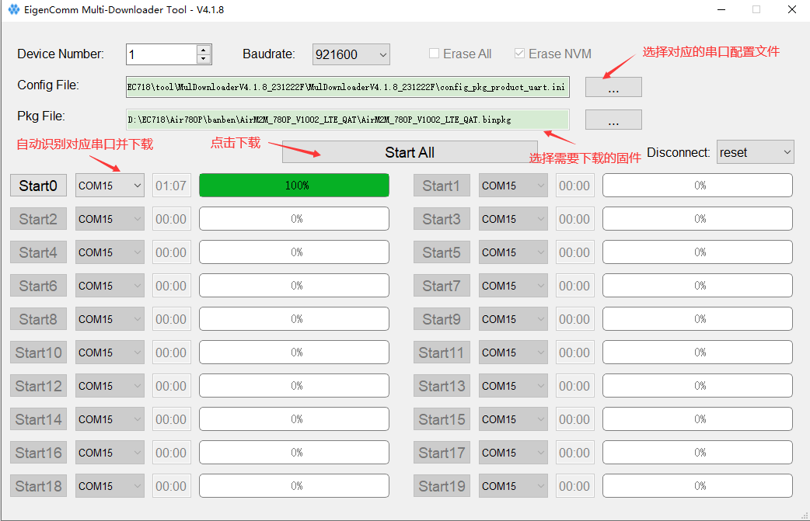
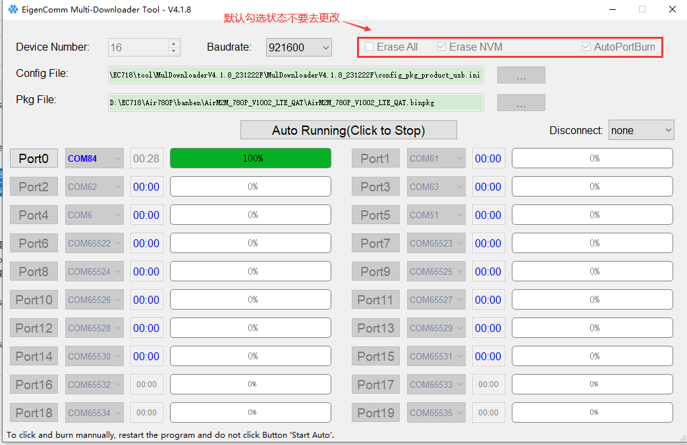
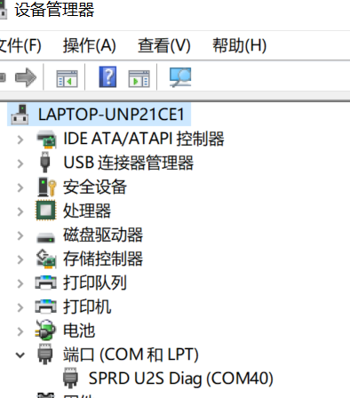
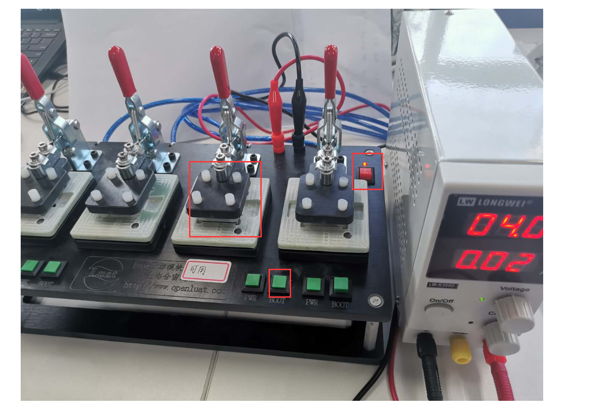
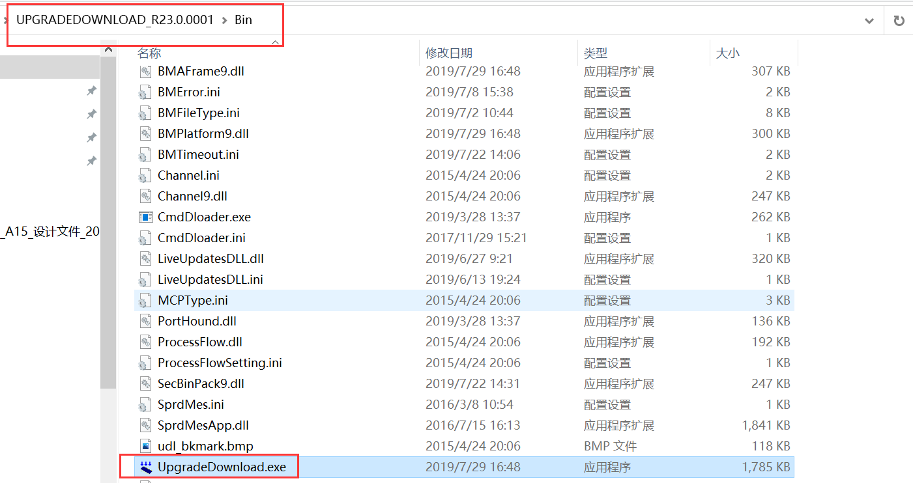
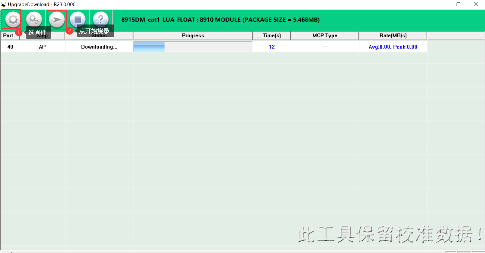
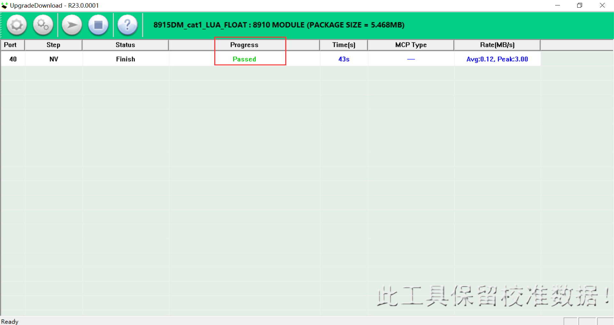

# 合宙模组量产多路下载工具

## 一、烧录前的准备

### 1. 一拖N量产夹具（带boot键）
    需要在合宙淘宝企业店购买一拖八的量产烧录夹具。
    购买地址为： luat.taobao.com

### 2. 直流稳压源
    准备一台直流稳压电源，给夹具供电。
    合宙官方淘宝店也有稳压电源销售。

### 3. 待烧录模块
    准备好待烧录的模块。

### 4. 准备烧录固件
    向相关同时索取烧录固件。
    如果是在模组上做LuatOS 的二次开发，可以参考如下文章，自己合成烧录固件：

[Luatools下载和使用教程](https://docs.openluat.com/Luatools/)

## 二、Air780系列 Air700 系列模组的多路量产烧录工具

### （一）烧录 PC 工具下载

点击如下地址直接下载：

[Air780&Air700量产多路烧录工具](https://cdn.openluat-luatcommunity.openluat.com/attachment/20240711135533529_MulDownloaderV4.1.9_240511F.zip)

注意：V4.1.9版本前的量产工具，可能无法下载最新**luatos_soc_2024**仓库编译的csdk固件。请下载最新的版本，所以务必使用 4.1.9 版本的多路量产下载工具！

### （二）多路下载工具使用手册

下载上面的量产工具，解压后的**Multi-Downloader_UserGuide_chs V4.1.1.pdf**为使用说明，如下图所示。

### （三）USB烧录

注意：USB下载需要在 BOOT 模式下进行。

#### 1， 修改配置文件，指定烧录固件

打开 config_pkg_product_usb.ini， 

找到 arg_pkg_path_val = 这一行， 在等号右边填入待烧录固件的文件绝对目录和文件名，如图所示：

#### 2， 选择配置文件

点击**MulDownloader.exe**运行下载工具，选择对应配置文件。这里USB下载方式选择的配置文件为**config_pkg_product_usb.ini**如下图所示：

#### 3，选择需要下载的固件

点击**Pkg File**后面的设置按钮，选择**Pkg File**文件及模块需要下载的固件，这里选择的固件是**AirM2M_780P_V1002_LTE_QAT.binpkg**。如下图所示：

#### 4，烧录

先按住BOOT键，点击**Click to Start Auto**，在按开机键（开机状态下按复位键）进行下载，如下所示。

工具会自动识别下载口进行下载，这里的下载端口为84。

下载过程会显示下载进度，如下所示。

烧录完成会显示现在进度为100%，如下所示。

### （二）串口烧录

除了需要修改的配置文件为：**config_pkg_product_uart.ini**，

其他的步骤，和 USB 烧录完全相同。

### （三）注意事项

**文件路径中不能有中文目录，否则会下载失败**

默认是如下配置，不需要去修改。

## 三、Air724 Air795，Air720，Air722系列模组的多路量产烧录工具

### （一）烧录 PC 工具下载
  
  点击如下链接下载烧录工具：

 [Air724 量产多路烧录工具](https://cdn.openluat-luatcommunity.openluat.com/attachment/20200808185432677_8910-UPGRADEDOWNLOAD_R23.0.0001.7z)

### （二）安装 USB 驱动
   
   参考如下教程，安装 USB 驱动：

[合宙模组USB驱动教程](https://docs.openluat.com/usb_drv/)

### （三）开始烧录

#### 1. 硬件连接

    - 模块正确摆放

    - 稳压源给夹具供电（一般4V），USB接电脑，按下夹具上boot键，依次打开稳压源开关、夹具电源开关，观察电流，20mA左右正常，模块正常开机，设备管理器端口显示如下图，进入下载模式

    - 硬件连接如图

#### 2，开始烧录

    - 打开软件

    - 加载固件，开始烧录

    - 烧录成功提示

