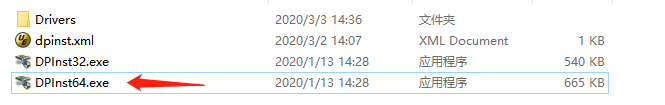
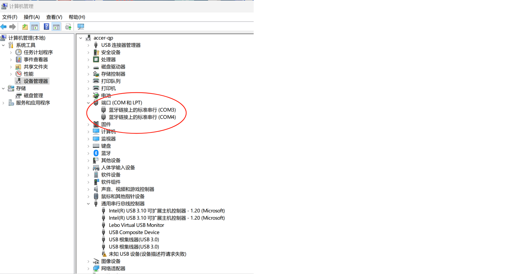
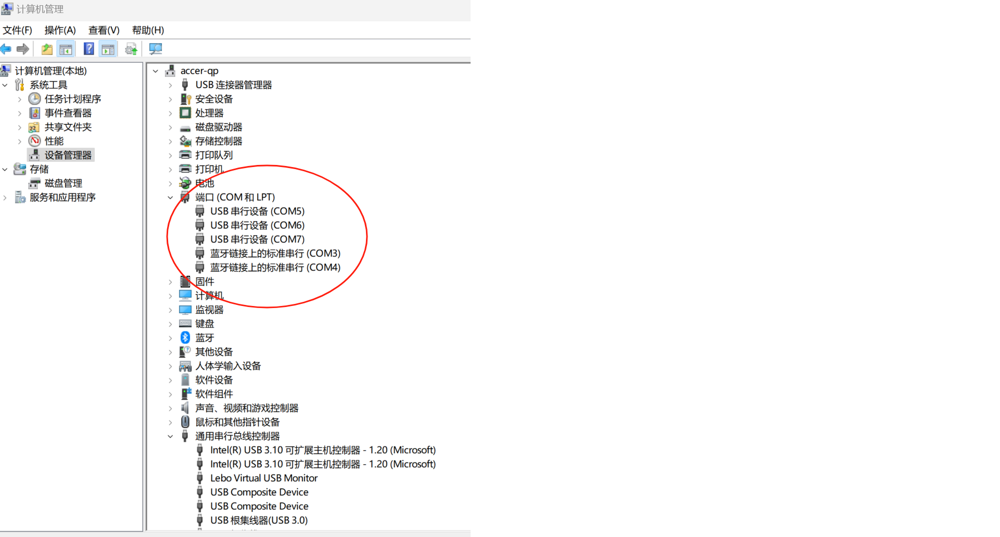
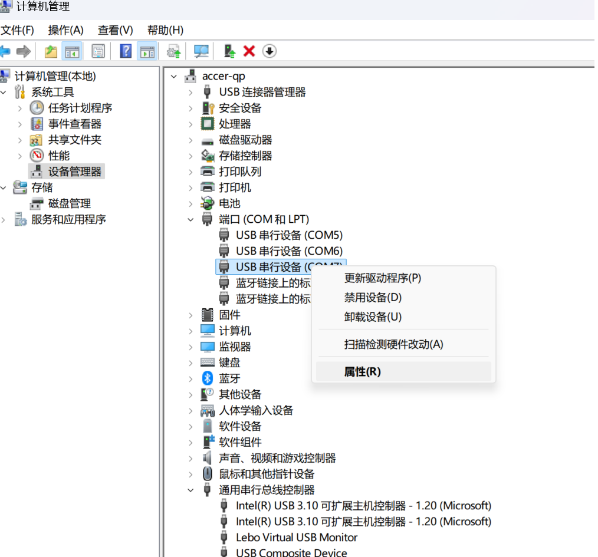
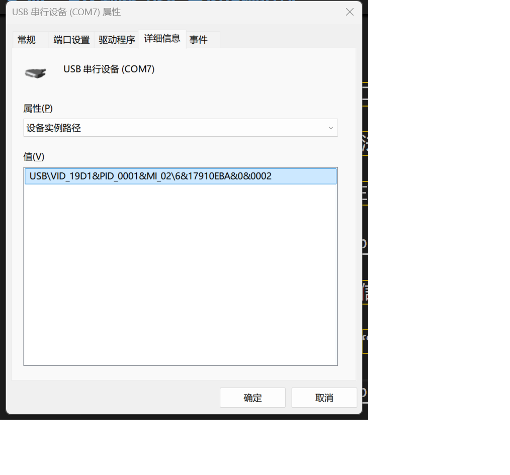
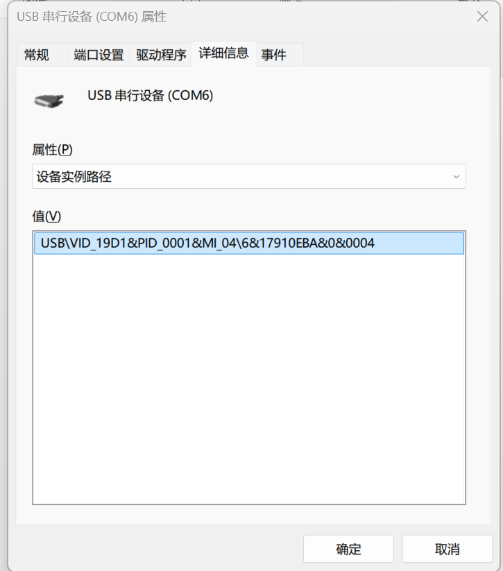
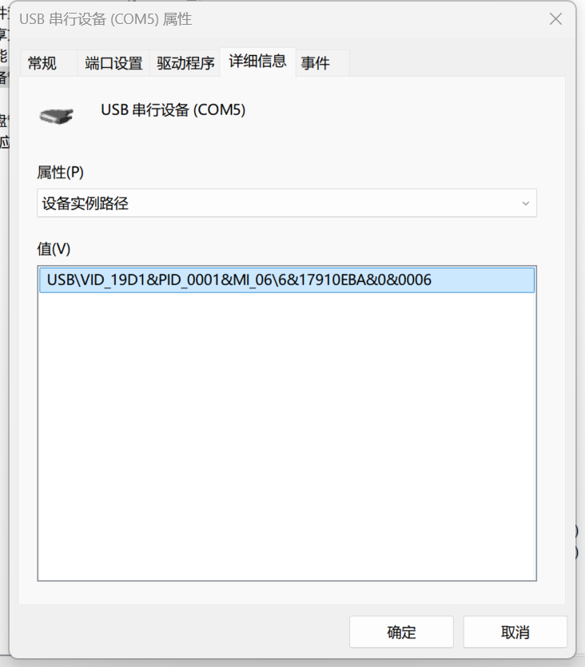

# 一、本文的讨论边界
    本文涉及的内容， 都是基于 windows系统， 并且都是不低于windows7 的版本。
    Linux，Mac，UNIX，低版本的 windows，都不在本文涉及范围之内。 

# 二、哪几个模组需要安装 USB 驱动？

    合宙的 4G 模组，分为两类，
    
    - 第一类，需要安装 USB 驱动：
    Air724， Air795， Air720，Air722。
    安装驱动的教程，参见下一章。

    - 第二类，不需要安装 USB 驱动
    Air780E，780EX，780EQ，780EP, 780EPS, 780EEU, 780EEN
    Air700ECQ，700EAQ, 700EMQ
    Air201,
    都不需要安装 USB 驱动。

# 三、Air724 和 Air795 USB 驱动安装教程

## 1， 下载驱动

    先点击如下链接下载驱动，并安装：

    该驱动适合 Win7及以上版本的非企业板 WINDOWS 系统。

[Air724_Air705模组USB驱动](https://cdn.openluat-luatcommunity.openluat.com/attachment/20200808183454135_sw_file_20200303181718_8910_module_usb_driver_signed%20_20200303_hezhou.7z "点击直接下载驱动")

## 2，安装驱动
 
    下载驱动压缩包，解压后，根据电脑配置安装对应驱动。
    如果你的电脑是64位， 就按照如下选择：

## 3，检查是否安装成功
  
    按照下一章的方法，可以检查是否驱动安装成功。

# 四、怎么判断 USB 已经正确识别

    无论是免安装驱动， 还是已经安装了驱动， 都可以通过设备管理器查看USB设备是否识别成功。

## 1，通过设备管理器的端口识别

    在插入 USB 之前， 通过查看电脑设备管理器的端口， 记录下来端口的数量，如图所示：

    插入 设备，并上电之后，观察设备管理器的端口是否自动更新多了几个设备端口，如图：

    这就代表 USB 设备识别成功了。

    如果无法自动多出来几个设备端口，说明 USB 设备没有成功识别，需要检查设备是否正常，
    或者检查数据线是否只有充电功能，没有数据功能。

    如果是 Air724 或者 Air795模组，需要检查是否正确安装了驱动。

## 2, 通过端口设备的详细信息进一步确认

    如果你需要进一步确认，增加的几个端口，哪个是普通log端口， 哪个是底层log端口，

    哪个是 AT 命令端口，可以采用如下方法：

    右键单击多出来的对应的设备端口， 在弹出的菜单里面，选择 “属性”，如图：

    在弹出来的属性对话框中，选择 “详细信息”这个page， 

    然后在“属性”的下拉框， 选择第二个 “设备实例路径”，如图：

    查看显示的设备实例路径的值， 
    
    如果是0002 结尾， 就是普通的log端口：

    如果是0004 结尾， 就是底层的log端口：

    如果是0006 结尾， 就是虚拟串口的AT端口：

如果一切正常，恭喜你，可以成功了！

如果还需要问题，可以在 chat.openluat.com 提交问题，等待回答。

