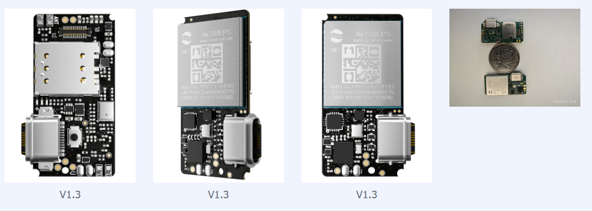
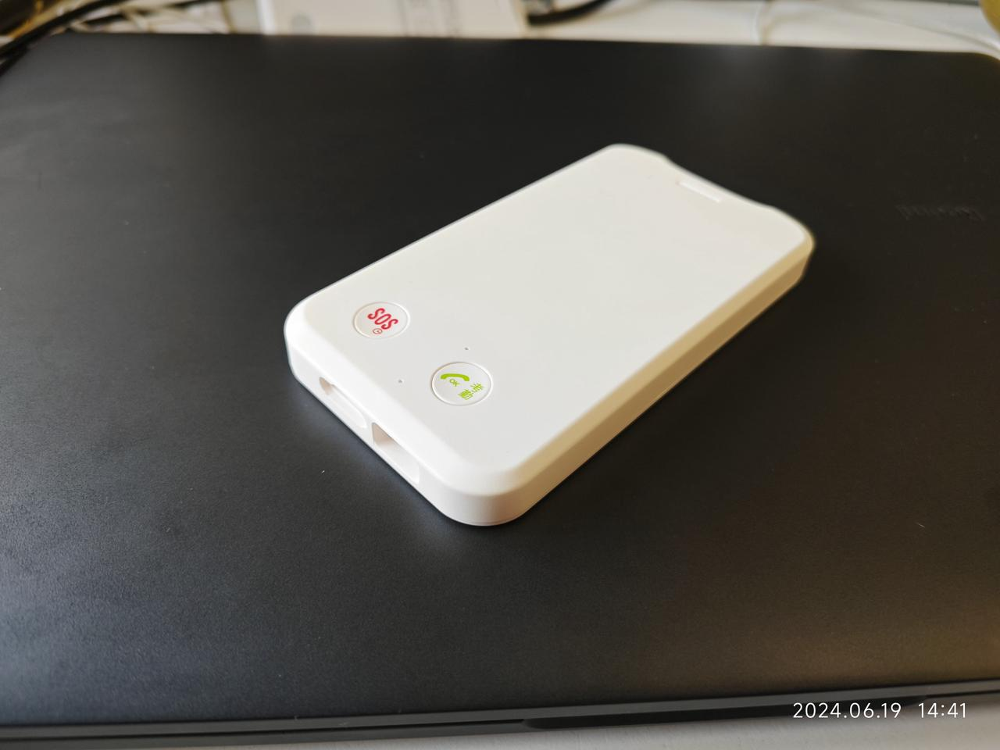
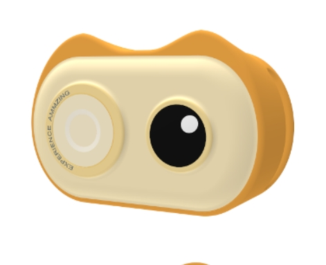
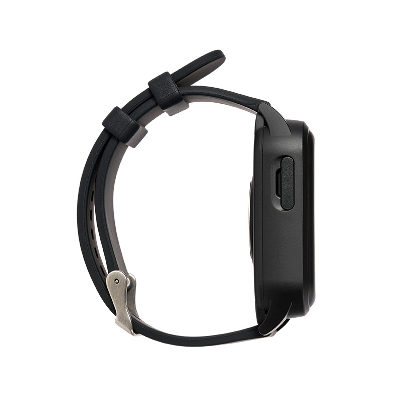
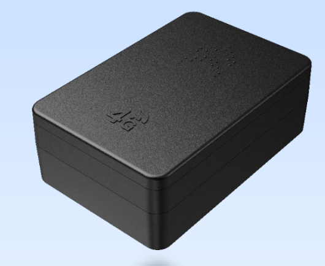

# 合宙Air201模组资料中心

- [产品介绍](https://docs.openluat.com/air201/product/)

- [开发资料](https://docs.openluat.com/air201/luatos/quickstart/)

- [常见问题](https://docs.openluat.com/air201/luatos/faq/)

## 🔹 项目介绍 

- 快速测试市场
- 减少企业客户研发投入，让客户的时间花费在值钱的业务逻辑上
- 用最好的器件，造就最好的服务
- 提供全套服务（后台，小程序，PCBA，嵌入式软件，外壳）
- 支持多种功能外扩

​      整体整体图（**16\*32\*4mm**）

1. 底板0.6mm
2. 模块厚度1.7mm
3. sim卡厚度1.4mm(可改为贴片卡) 

|  |  |
| ------------------------------------------------------------ | ------------------------------------------------------------ |

## 💡 客户成品展示

### 1. 定位工牌

|  |  |
| ------------------------------------------------------------ | ------------------------------------------------------------ |

### 2. 宠物定位

|  |  |
| ------------------------------------------------------------ | ------------------------------------------------------------ |

### 3. 腕式学生卡

|  |  |
| ------------------------------------------------------------ | ------------------------------------------------------------ |

### 4. 车载定位

### 5. 老人定位

​ing。。。

### 6. 鸟类定位

ing。。。

### 7. 船舶定位

ing。。。