# Air201产品手册

| 模块名称  | 适用区域         | 频段                                          | 封装尺寸        |
| -------- | ---------------- | --------------------------------------------- | --------------- |
| 780EPS    | 中国/印度/东南亚 | TDD：B34/B38/B39/B40/B41 FDD：B1/B3/B5/B8 | 17.7\*15.8\*2.3 |

## 💡 相关资料

### 1. [Air201 的 LuatOS快速入门](https://e3zt58hesn.feishu.cn/wiki/DfMMw2ZFziqPIikh1BMcZDwHnCb)

### 2. [Air201 硬件手册](https://docs.openluat.com/air201/luatos/hardware/)

如需了解更多，可添加微信

15055190176:   梁健

15989666845： 谢萧辉 

进一步沟通；

## 🔹 项目介绍 

- 快速测试市场
- 减少企业客户研发投入，让客户的时间花费在值钱的业务逻辑上
- 用最好的器件，造就最好的服务
- 提供全套服务（后台，小程序，PCBA，嵌入式软件，外壳）

​      整体整体图（**16\*32\*4mm**）

1. 底板0.6mm
2. 模块厚度1.7mm
3. sim卡厚度1.4mm(可改为贴片卡) 

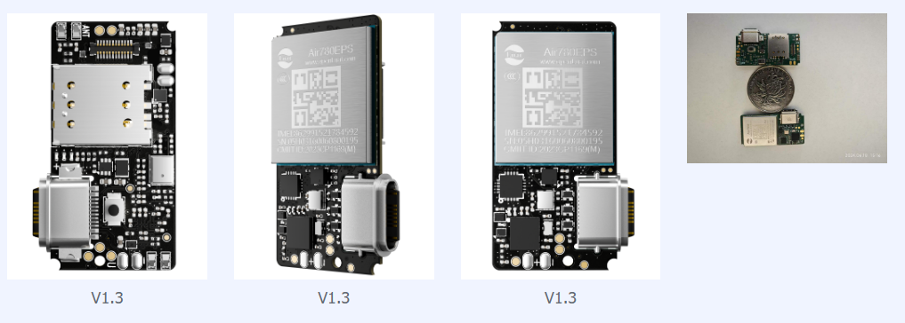

| 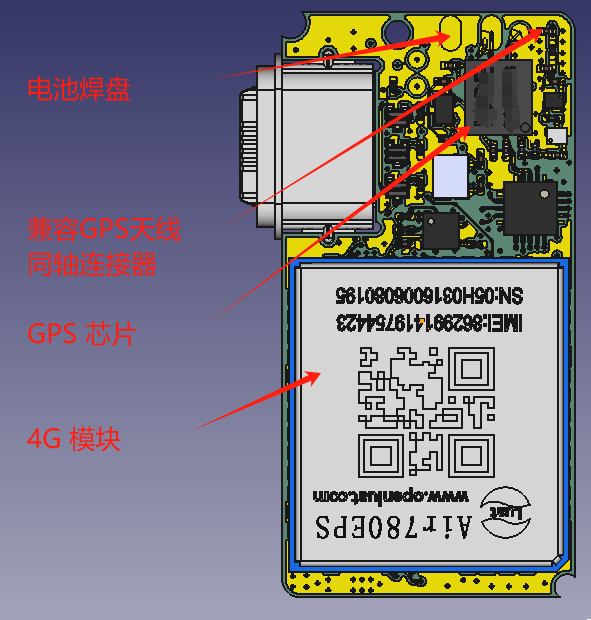 | 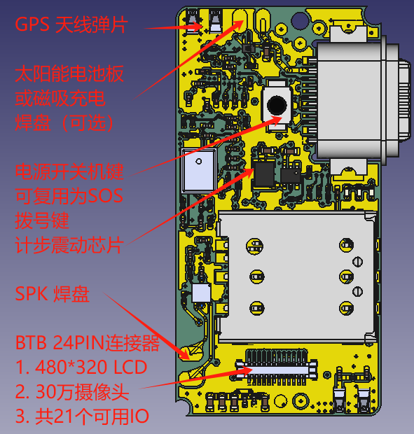 |
| ------------------------------------------------------------ | ------------------------------------------------------------ |

## 💡 客户成品展示

### 1. 定位工牌

| 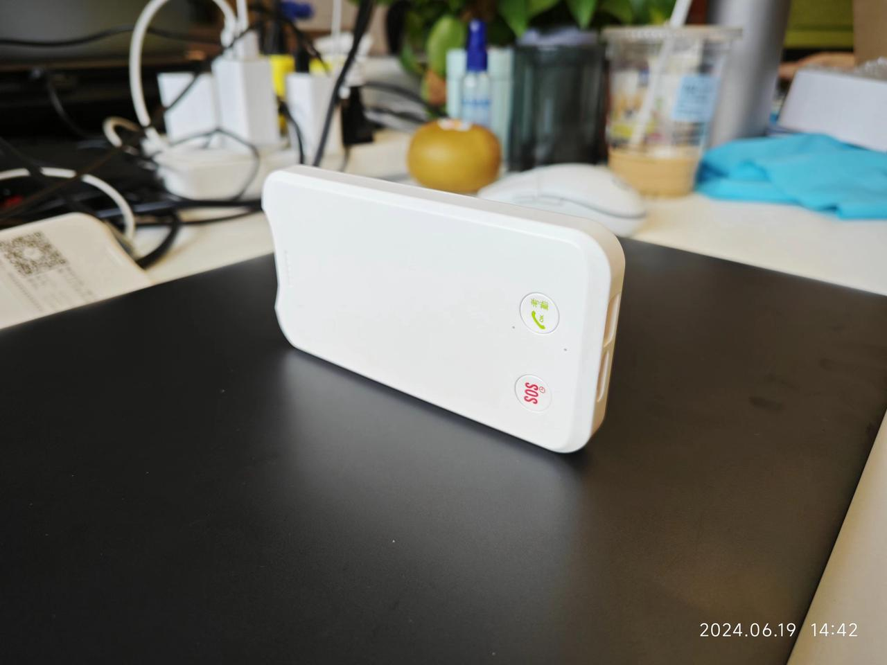 | 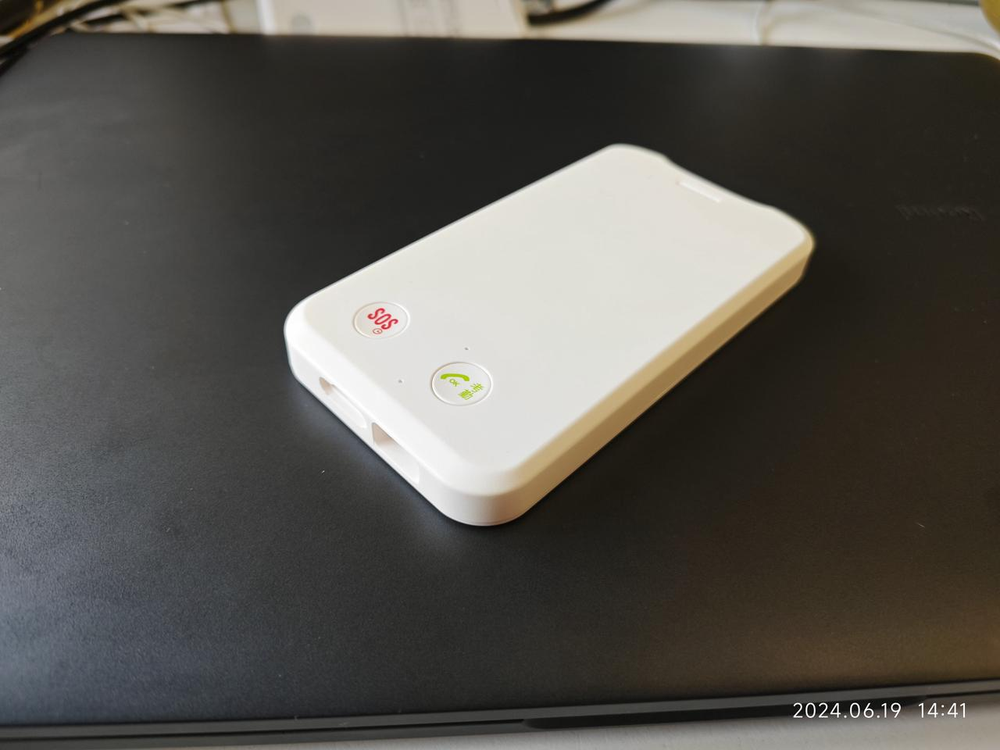 |
| ------------------------------------------------------------ | ------------------------------------------------------------ |

### 2. 宠物定位

| 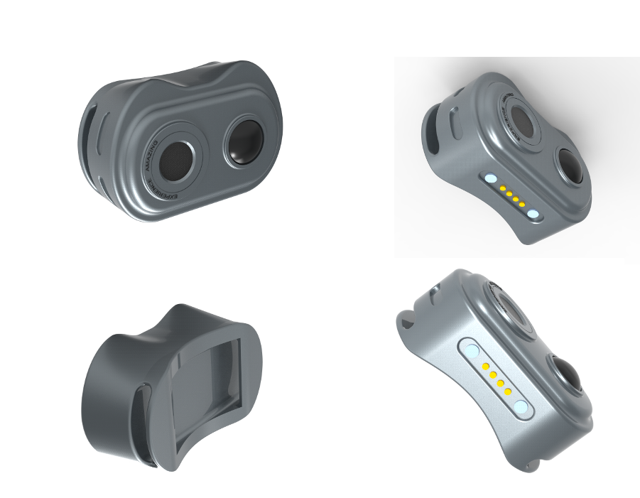 |  |
| ------------------------------------------------------------ | ------------------------------------------------------------ |

### 3. 腕式学生卡

| 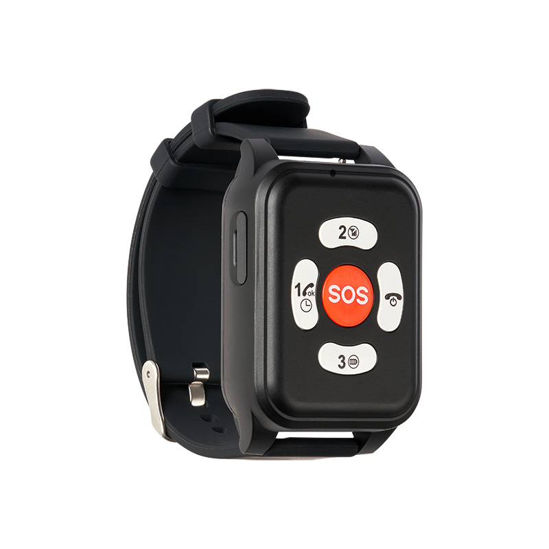 | 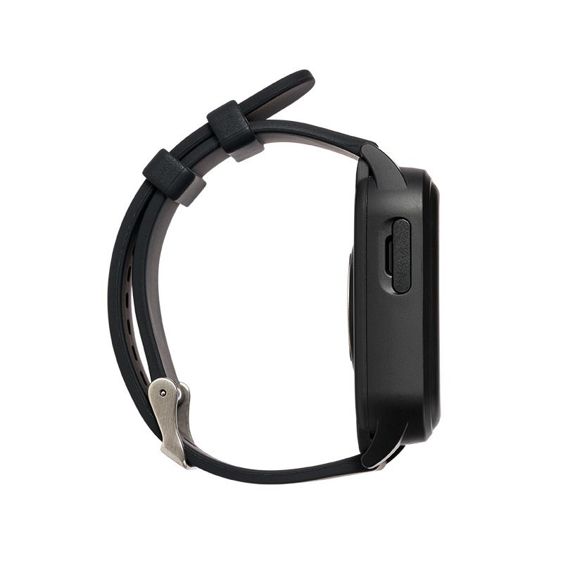 |
| ------------------------------------------------------------ | ------------------------------------------------------------ |

### 4. 车载定位

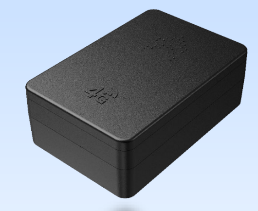

### 5. 老人定位

​      ing。。。

### 6. 鸟类定位

ing。。。

### 7. 船舶定位

ing。。。

## 💬 核心功能

### 1. **4G 通信模块**

**4G 通信模块（780EPS）超低功耗:**

> 合宙选用进口物料专门定制的4G模块，模块内部使用多种功耗控制的硬件单元，并采用类似于英特尔的筛选方法（I9,I7,I5,I3 是一个晶体出来的产品，好的定为I9，差的定为I3），将1/10 的最好性能最低功耗的产品筛选出来单独命名为780EPS，同时配合合宙自研降功耗算法，待机功耗低于 400 微安

- 4G 特性(3.7V 电压)
  - 长连接5分钟心跳保活: 390ua
  - 休眠功耗：2.89ua
  - 首次开机上网时间：3S
  - 外部终端/定时器唤醒上网时间：1.5S
  - 从开机到发送数据(1000字节)耗能：0.12mw
  - 支持海外大多数国家（欧洲，亚洲，澳洲，北美 , 日本等）

### 2. GPS

**GPS** 

> 选用超低功耗定位芯片
>
> 先进制程

 

- GPS 性能指标：
  - 捕获：18mw     追踪:  10mw
  - 单点定位精度 <1.5m
  - 灵敏度：-149dbm
  - 支持单频（双频可选），北斗，RTK（选配）

### 3. 音频

**音频**

> 支持音频编解码
>
> 硅麦输入
>
> 喇叭输出

 

- 音频
  - VOLTE 语音
  - 录音
  - 放音输出 ：3W

### 4. 计步&加速度传感器

**计步&三轴加速度计**

> [明皜](https://detail.1688.com/offer/719001700910.html) DA267 加速度传感器

- 性能指标：
  - 支持计步
  - 支持震动检测

### 5. BTB 外扩功能

BTB 外扩功能

> 24pin多功能连接器
>
> 满足客户定制化需求
>
> 连接牢固，方便安装

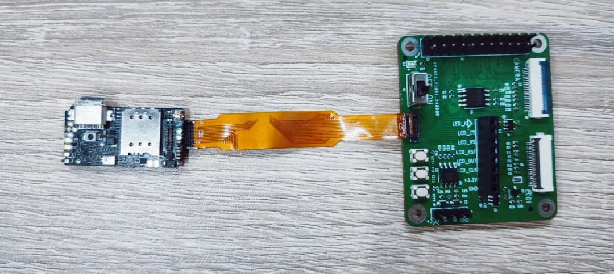

- 外扩功能：
  - 支持480*320 LCD 显示
  - 支持30W 摄像头拍摄
  - 支持1路串口
  - 支持8W摄像头10 fps视频对话（后期功能）
  - 总共支持 21 个IO 可供使用
  - 支持外扩flash

## ✅**MD**设计阶段  

### 1. 主板固定方式

机壳定位主板时要以 PCB 板为基准，禁止以板上元器件为基准固定主板。建议通过主板 3 个螺丝孔（也可以作主板 限位孔）固定主板，同时外壳上可以作卡钩和筋辅助固定主板，主板厚度 0.6mm，公差为+/-0.1mm。此类产品使用场景。

复杂，注意考虑结构的可靠性和稳定性。

### 2. 主 LTE 射频天线

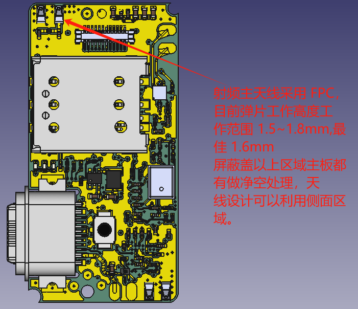

客户根据外观 ID 可能选用不同电池容量的情况下，如果电池放在屏蔽罩上，用 FPC 天线需要在壳料上做台阶，保

证天线焊脚和主板天线弹片良好接触

### 3. GPS 天线

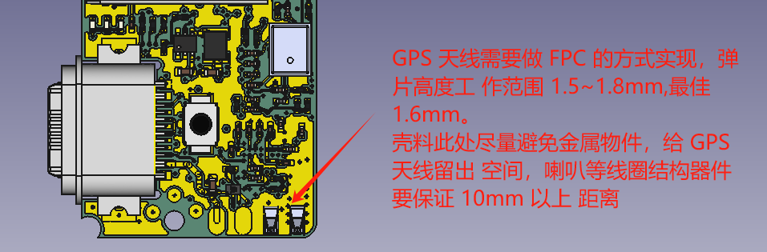

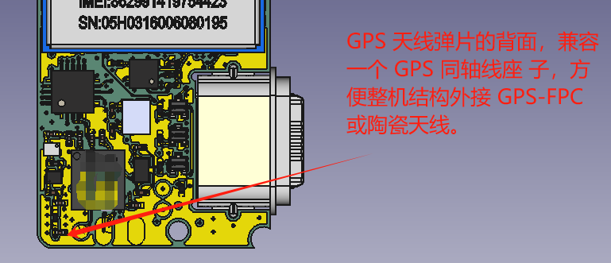

### 4. 贴片按键

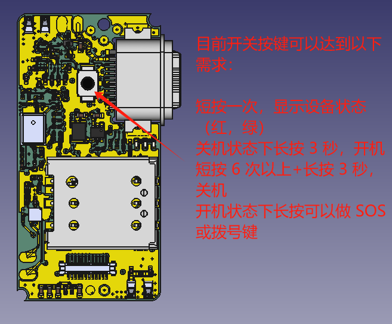

### 5. BTB 连接器,24 PIN

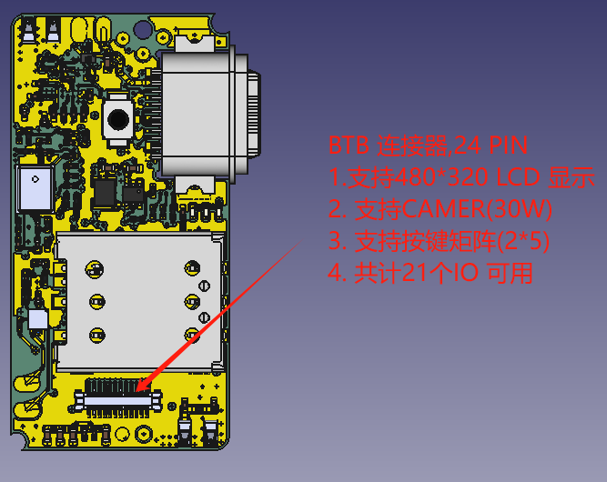

### 6. SIM 卡座和防水 Type-C

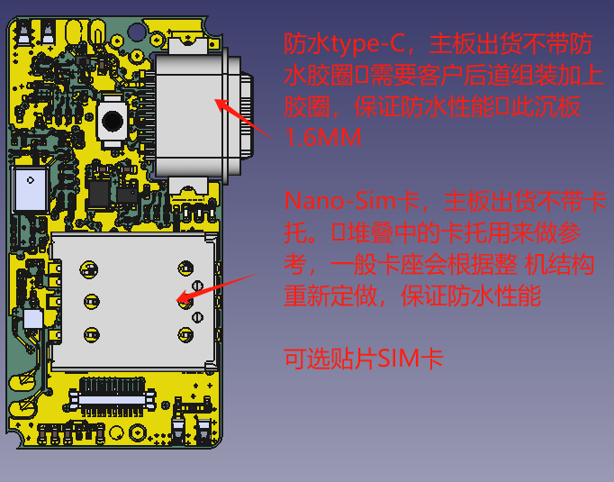

### 7. 充电焊盘（磁吸或太阳能）

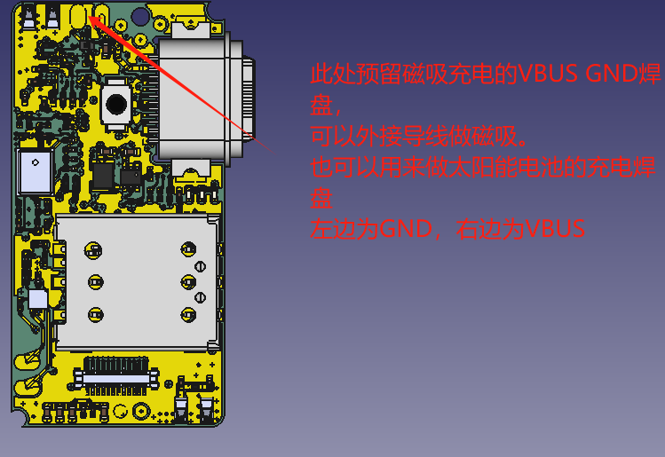

### 8. 震 动 + 计 步 传 感 器

### 9. 麦克风

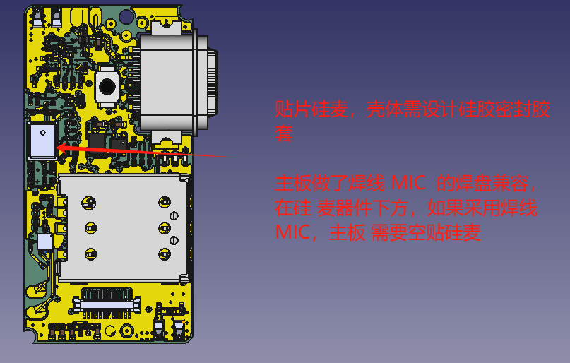

### 10. 喇叭

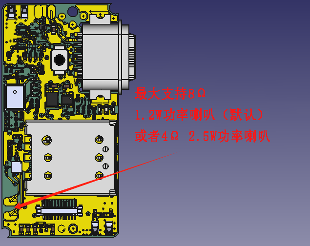

### 11. 其他

    整机对静电要求较高(要求过接触 +/-7KV，空气+/-14KV)，结构上注意间隙控制，并设计合适的静电挡墙。

## 📝 提供的服务  

### 1. 提供整机服务

   1. 可以提供整机，pcba，后台，小程序等服务
   2. 需经过评审

### 2. PCBA + 后台和小程序服务

   1. 客户自己设计外壳
   2. 我司提供 pcba，嵌入式软件，后台，小程序
   3. 需经过评审

### 3. PCBA 

   1. 我司提供 pcba
   2. 提供板载驱动演示代码
   3. 提供基础代码（支持二开）

## 📝 功耗&待机时长计算

### [您的电池可以用多久？](https://e3zt58hesn.feishu.cn/share/base/form/shrcnoi7m5H85T3yYyOlQ4W4Nja?iframeFrom=docx&ccm_open=iframe)

### [您需要多大的电池？](https://e3zt58hesn.feishu.cn/share/base/form/shrcnx7Z26k9l3Ma1cMLTZ2Gk8d?iframeFrom=docx&ccm_open=iframe)

## 💬 相关疑问

1. [Air201 常见问题集合](https://e3zt58hesn.feishu.cn/wiki/S8EUwQ5qiiPpJCkmJwEc7nB7n9e)

## 💡 功耗数据

### 1. 4G 功耗

**实网环境，移动卡，B8，电压3.8V,合宙上海办公室环境下测试 ：**

|          | 开机   | 搜网    | 休眠    | 发送数据（1k） | 接收数据(1k) |
| -------- | ------ | ------- | ------- | -------------- | ------------ |
| 平均功耗 | 7.3mA  | 29.3mA  | 0.16mA  | 21.2mA         | 19.5mA       |
| 过程耗时 | 1.1S   | 2.3S    |         | 1.3S           | 1.7S         |
| 测试时长 |        |         | 29分钟  |                |              |
| 耗电量   | 2.3μAh | 18.9μAh | 80.2μAh | 8.1μAh         | 9.2μAh       |

### 2. GPS 功耗

|        | 捕获 | 搜网 |
| ------ | ---- | ---- |
| 耗电量 | 26mw | 15mw |

### 堆叠图

[HZ201P_ASM.stp](https://internal-api-drive-stream.feishu.cn/space/api/box/stream/download/all/UAPmbWABqoNYYPxNx60cOr13n7e/?mount_node_token=J974dLHIdoNz62xirMHcAw2Lneg&mount_point=docx_file)

### BTB映射表

#### 封装资料图

  [C2880692_板对板与背板连接器_X0400FVS-24-LPV01_规格书_XKB+CONNECTIVITY(中国星坤)板对板连接器规格书.PDF](https://internal-api-drive-stream.feishu.cn/space/api/box/stream/download/all/CJZKbeJCZowT3uxczzHcjxevnoe/?mount_node_token=NuS3dsSfPoPuzyx0Qotc0mIPnVh&mount_point=docx_file)

#### 映射表

  [Air201_v1.3 gpio引脚映射表.xlsx](https://internal-api-drive-stream.feishu.cn/space/api/box/stream/download/all/TGlQbdvIiopZZIxesUzcEGaVntb/?mount_node_token=YKUwdlNWIoiNAZxz6wOcd9dnnec&mount_point=docx_file)

#### 框位图

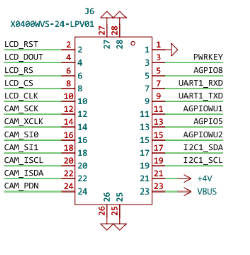

## 认证证书

### CCC 证书

- [Air780E_CCC中文证书.pdf](https://cdn.openluat-luatcommunity.openluat.com/attachment/20221129105209534_Air780E_CCC%E4%B8%AD%E6%96%87%E8%AF%81%E4%B9%A6.pdf)
- [Air780E_CCC英文证书.pdf](https://cdn.openluat-luatcommunity.openluat.com/attachment/20221129105227474_Air780E_CCC%E8%8B%B1%E6%96%87%E8%AF%81%E4%B9%A6.pdf)

### 入网许可证

- [Air780E入网许可证.pdf](https://cdn.openluat-luatcommunity.openluat.com/attachment/20230130113321541_Air780E%E5%85%A5%E7%BD%91%E8%AE%B8%E5%8F%AF%E8%AF%81.pdf)

### SRRC 证书

- [Air780E型号核准证.pdf](https://cdn.openluat-luatcommunity.openluat.com/attachment/20230221104159741_Air780E%E5%9E%8B%E5%8F%B7%E6%A0%B8%E5%87%86%E8%AF%81.pdf)

### ROHS 证书

- [Air780E-ROHS证书.pdf](https://cdn.openluat-luatcommunity.openluat.com/attachment/20230313092434185_Air780E-ROHS%E8%AF%81%E4%B9%A6.pdf)
