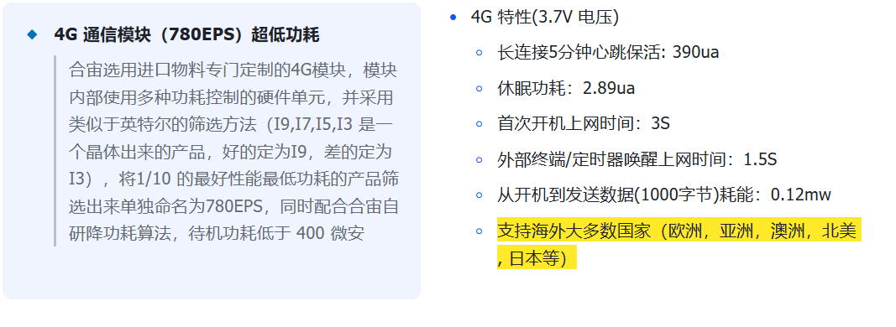
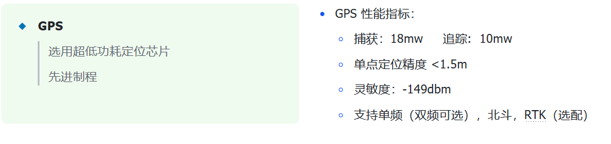
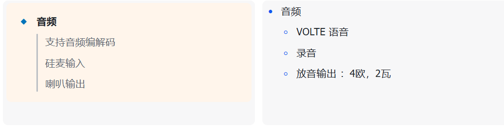
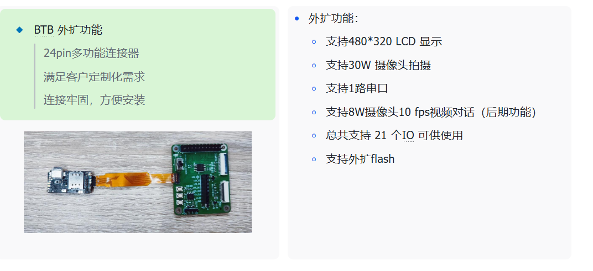
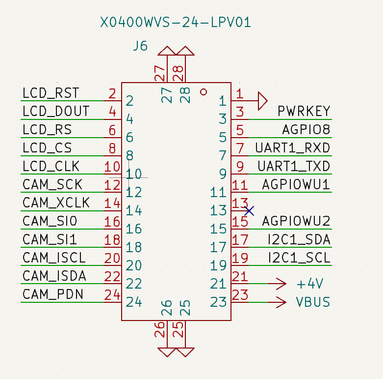

# Air201产品手册

## 💡 相关资料

### 1. [Air201 的 LuatOS快速入门](https://docs.openluat.com/air201/luatos/quickstart/)

### 2. [Air201 硬件手册](https://docs.openluat.com/air201/luatos/hardware/)

如需了解更多，可添加微信

15989666845： 谢萧辉 

进一步沟通；

## 💬 核心功能

### 1. **4G 通信模块**

**4G 通信模块（780EPS）超低功耗:**

 

### 2. GPS
 

### 3. 音频
 

### 4. 计步&加速度传感器

**计步&三轴加速度计**

 

### 5. BTB 外扩功能

 

## ✅**MD**设计阶段  

### 1. 主板固定方式

机壳定位主板时要以 PCB 板为基准，禁止以板上元器件为基准固定主板。建议通过主板 3 个螺丝孔（也可以作主板 限位孔）固定主板，同时外壳上可以作卡钩和筋辅助固定主板，主板厚度 0.6mm，公差为+/-0.1mm。此类产品使用场景。

复杂，注意考虑结构的可靠性和稳定性。

### 2. 主 LTE 射频天线

客户根据外观 ID 可能选用不同电池容量的情况下，如果电池放在屏蔽罩上，用 FPC 天线需要在壳料上做台阶，保

证天线焊脚和主板天线弹片良好接触

### 3. GPS 天线

### 4. 贴片按键

### 5. BTB 连接器,24 PIN

### 6. SIM 卡座和防水 Type-C

### 7. 充电焊盘（磁吸或太阳能）

### 8. 震 动 + 计 步 传 感 器

### 9. 麦克风

### 10. 喇叭

### 11. 其他

    整机对静电要求较高(要求过接触 +/-7KV，空气+/-14KV)，结构上注意间隙控制，并设计合适的静电挡墙。

## 📝 提供的服务  

### 1. 提供整机服务

   1. 可以提供整机，pcba，后台，小程序等服务
   2. 需经过评审

### 2. PCBA + 后台和小程序服务

   1. 客户自己设计外壳
   2. 我司提供 pcba，嵌入式软件，后台，小程序
   3. 需经过评审

### 3. PCBA 

   1. 我司提供 pcba
   2. 提供板载驱动演示代码
   3. 提供基础代码（支持二开）

## 📝 功耗&待机时长计算

### [您的电池可以用多久？](https://e3zt58hesn.feishu.cn/share/base/form/shrcnoi7m5H85T3yYyOlQ4W4Nja?iframeFrom=docx&ccm_open=iframe)

### [您需要多大的电池？](https://e3zt58hesn.feishu.cn/share/base/form/shrcnx7Z26k9l3Ma1cMLTZ2Gk8d?iframeFrom=docx&ccm_open=iframe)

## 💬 相关疑问

1. [Air201 常见问题集合](https://docs.openluat.com/air201/luatos/faq/)

## 💡 功耗数据

### 1. 4G 功耗

**实网环境，移动卡，B8，电压3.8V,合宙上海办公室环境下测试 ：**

|          | 开机   | 搜网    | 休眠    | 发送数据（1k） | 接收数据(1k) |
| -------- | ------ | ------- | ------- | -------------- | ------------ |
| 平均功耗 | 7.3mA  | 29.3mA  | 0.16mA  | 21.2mA         | 19.5mA       |
| 过程耗时 | 1.1S   | 2.3S    |         | 1.3S           | 1.7S         |
| 测试时长 |        |         | 29分钟  |                |              |
| 耗电量   | 2.3μAh | 18.9μAh | 80.2μAh | 8.1μAh         | 9.2μAh       |

### 2. GPS 功耗

|        | 捕获 | 搜网 |
| ------ | ---- | ---- |
| 耗电量 | 26mw | 15mw |

### 堆叠图

- [堆叠图.pdf](https://docs.openluat.com/air201/luatos/hardware/design/file/HZ201P_10.8.wrl)

### BTB映射表

#### 封装资料图
- [btb连接器](./file/C2880692_datasheet.pdf)

#### 映射表
- [GPIO映射表.pdf](https://docs.openluat.com/air201/luatos/hardware/design/file/Air201_gpio_config.xlsx)

 

#### 框位图

- 

## 认证证书

### CCC 证书

- [Air780E_CCC中文证书.pdf](https://cdn.openluat-luatcommunity.openluat.com/attachment/20221129105209534_Air780E_CCC%E4%B8%AD%E6%96%87%E8%AF%81%E4%B9%A6.pdf)
- [Air780E_CCC英文证书.pdf](https://cdn.openluat-luatcommunity.openluat.com/attachment/20221129105227474_Air780E_CCC%E8%8B%B1%E6%96%87%E8%AF%81%E4%B9%A6.pdf)

### 入网许可证

- [Air780E入网许可证.pdf](https://cdn.openluat-luatcommunity.openluat.com/attachment/20230130113321541_Air780E%E5%85%A5%E7%BD%91%E8%AE%B8%E5%8F%AF%E8%AF%81.pdf)

### SRRC 证书

- [Air780E型号核准证.pdf](https://cdn.openluat-luatcommunity.openluat.com/attachment/20230221104159741_Air780E%E5%9E%8B%E5%8F%B7%E6%A0%B8%E5%87%86%E8%AF%81.pdf)

### ROHS 证书

- [Air780E-ROHS证书.pdf](https://cdn.openluat-luatcommunity.openluat.com/attachment/20230313092434185_Air780E-ROHS%E8%AF%81%E4%B9%A6.pdf)
