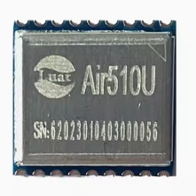
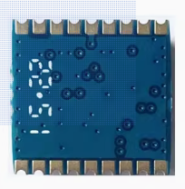

# Air510U产品手册

## 模块硬件资料

| 资料简介         | 相关链接                                                                                                                                                                                                                                                                                                                                                                                          |
| ---------------- | ------------------------------------------------------------------------------------------------------------------------------------------------------------------------------------------------------------------------------------------------------------------------------------------------------------------------------------------------------------------------------------------------- |
| 硬件设计相关手册 | [Air510U定位模块使用手册V1.0.5.pdf](https://cdn.openluat-luatcommunity.openluat.com/attachment/20240903143950575_Air510U%E5%AE%9A%E4%BD%8D%E6%A8%A1%E5%9D%97%E4%BD%BF%E7%94%A8%E6%89%8B%E5%86%8CV1.0.5.pdf)  注意：RMC和VTG上报的cog值固定为空                                                                                                                                                  |
| 原理图及PCB封装  | [Air510U_PADS9.5.zip](https://cdn.openluat-luatcommunity.openluat.com/attachment/20230119110115776_Air510U_PADS9.5.zip)  [Air510_AD.zip](https://cdn.openluat-luatcommunity.openluat.com/attachment/20230418143314439_Air510_AD.zip)                                                                                                                                                               |
| 开发板相关资料   | [EVB_Air510U开发板设计文件.zip](https://cdn.openluat-luatcommunity.openluat.com/attachment/20230128114058550_EVB_Air510U%E5%BC%80%E5%8F%91%E6%9D%BF%E8%AE%BE%E8%AE%A1%E6%96%87%E4%BB%B6.zip)  [Air510U开发板G2使用说明V1.0.1.pdf](https://cdn.openluat-luatcommunity.openluat.com/attachment/20230717142724911_Air510U%E5%BC%80%E5%8F%91%E6%9D%BFG2%E4%BD%BF%E7%94%A8%E8%AF%B4%E6%98%8EV1.0.1.pdf) |
| 调试工具         | [iNavTool_R4.0.1_Build1430.7z](https://cdn.openluat-luatcommunity.openluat.com/attachment/20230128164130842_iNavTool_R4.0.1_Build1430.7z)                                                                                                                                                                                                                                                            |

## 模块外形

| 正面                                          | 反面                                          |
| --------------------------------------------- | --------------------------------------------- |
|  |  |
