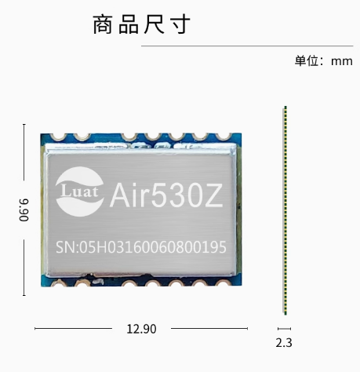
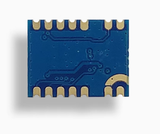

# Air530Z产品手册

## 模块硬件资料

| 资料简介         | 相关链接                                                                                                                                                                                          |
| ---------------- | ------------------------------------------------------------------------------------------------------------------------------------------------------------------------------------------------- |
| 硬件设计相关手册 | [Air530Z定位模块使用手册](https://doc.openluat.com/article/1657/0)                                                                                                                                   |
| 原理图及PCB封装  | [Air530_Air530Z_Air530H_原理图PCB封装.rar](https://cdn.openluat-luatcommunity.openluat.com/attachment/20210715163807297_Air530_Air530Z_Air530H_%E5%8E%9F%E7%90%86%E5%9B%BEPCB%E5%B0%81%E8%A3%85.rar) |
| 参考设计原理图   | [Air530Z_参考设计电路](http://doc.openluat.com/article/1657/0#5_72)                                                                                                                                  |

## 模块外形

| 正面                                          | 反面                                          |
| --------------------------------------------- | --------------------------------------------- |
|  |  |
