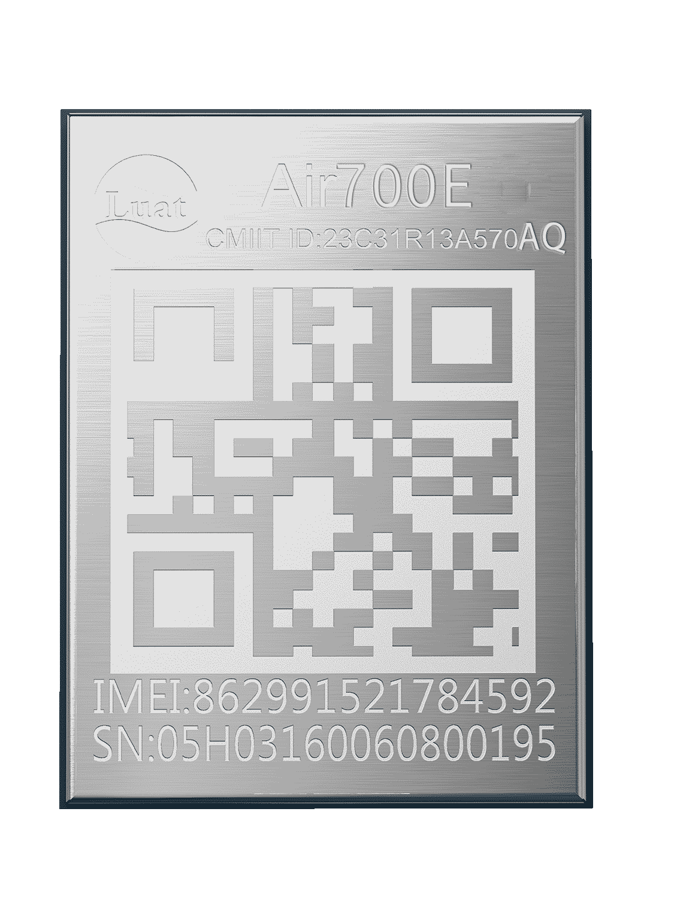

# Air700EAQ产品手册

| 模块名称  | 适用区域      | 频段      | 封装尺寸      |
| --------- | ------------- | --------- | ------------- |
| Air700EAQ | 中国电信/亚洲 | FDD:1,3,5 | 10\*13\*1.7mm |

## 模块硬件资料

| 资料简介        | 相关链接                                                     |
| --------------- | ------------------------------------------------------------ |
| 规格书          | [Air700EAQ_模块产品规格书_V1.0.0.pdf](https://cdn.openluat-luatcommunity.openluat.com/attachment/20240723174042576_Air700EAQ_模块产品规格书_V1.0.0.pdf) |
|                 | [Air700EAQ_硬件设计手册_V1.0.2.pdf](https://cdn.openluat-luatcommunity.openluat.com/attachment/20241011160619622_Air700EAQ_硬件设计手册_V1.0.2.pdf) [700EAQ_GPIO_table_20240521.pdf](https://cdn.openluat-luatcommunity.openluat.com/attachment/20240521095504789_Air780EL&780ETGG&780ETG&700EL&700EY&700EC_GPIO_table_20240521.pdf) [EC716-IO-特性.pdf](https://cdn.openluat-luatcommunity.openluat.com/attachment/20240508154944217_EC716-IO-特性.pdf) |
| 原理图及PCB封装 | [Air700EAQ封装.zip](https://cdn.openluat-luatcommunity.openluat.com/attachment/20231225171117125_Air700EL&700EY封装.zip) |
| 参考设计原理图  | [Air700EAQ_硬件参考设计.pdf](https://cdn.openluat-luatcommunity.openluat.com/attachment/20240228162252366_Air700EL_硬件参考设计.pdf) |
| 开发板相关资料  | [EVB_Air700EAQ开发板使用手册V1.0.2.pdf](https://cdn.openluat-luatcommunity.openluat.com/attachment/20240417134308942_EVB_Air700EL&700EY开发板使用手册V1.0.2.pdf) [EVB_700EAQ_V1.0_SCH.zip](https://cdn.openluat-luatcommunity.openluat.com/attachment/20230308153627280_EVB_Air700E_V1.0_SCH.zip) [EVB_700EAQ_V1.0_bom.XLS](https://cdn.openluat-luatcommunity.openluat.com/attachment/20230331111453962_EVB_Air700E_V1.0_bom.XLS) [EVB_700EAQ开发板ad.zip](https://cdn.openluat-luatcommunity.openluat.com/attachment/20230510094340802_EVB_Air700E开发板ad.zip)（kicad转出的 有些地方不兼容仅供参考） |

## 模块外形

| 正面                        | 反面                          |
| --------------------------- | ----------------------------- |
|  |  |
