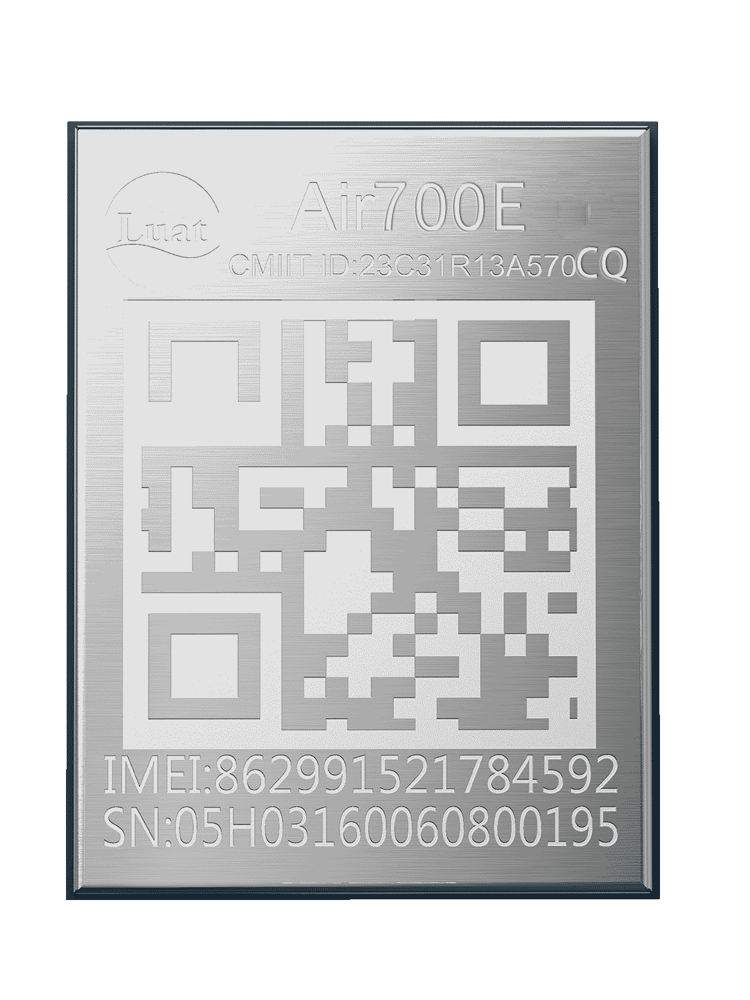

# Air700ECQ产品手册

| 模块名称  | 适用区域         | 频段                             | 封装尺寸    |
| --------- | ---------------- | -------------------------------- | ----------- |
| Air700ECQ | 中国(移动全频段) | FDD:3,8  TDD,38,39,40,41 | 10\*13\*1.7mm |

## 模块硬件资料

| 资料简介         | 相关链接                                                     |
| ---------------- | ------------------------------------------------------------ |
| 规格书           | [Air700ECQ_模块产品规格书_V1.0.1.pdf](https://cdn.openluat-luatcommunity.openluat.com/attachment/20240812191654720_Air700ECQ_模块产品规格书_V1.0.1.pdf) |
| 硬件设计相关手册 | [Air700ECQ_硬件设计手册_V1.0.3.pdf](https://cdn.openluat-luatcommunity.openluat.com/attachment/20241022164705125_Air700ECQ_硬件设计手册_V1.0.3.pdf)   [Air700ECQ_GPIO_table_20240521.pdf](https://cdn.openluat-luatcommunity.openluat.com/attachment/20240521095504789_Air780EL&780ETGG&780ETG&700EL&700EY&700EC_GPIO_table_20240521.pdf) [EC716-IO-特性.pdf](https://cdn.openluat-luatcommunity.openluat.com/attachment/20240508154944217_EC716-IO-特性.pdf) |
| 原理图及PCB封装  | [Air700ECQ封装.zip](https://cdn.openluat-luatcommunity.openluat.com/attachment/20231225171117125_Air700EL&700EY封装.zip) [EVB_Air700ECQ_All_Func.pdf](https://cdn.openluat-luatcommunity.openluat.com/attachment/20240816170227359_EVB_Air700EX_All_Func.pdf) |
| 参考设计原理图   | [Air700ECQ_硬件参考设计.pdf](https://cdn.openluat-luatcommunity.openluat.com/attachment/20240228162252366_Air700EL_硬件参考设计.pdf) |
| 开发板相关资料   | [开发板EVB-Air700ECQ-IO使用手册V1.0.0.pdf](https://cdn.openluat-luatcommunity.openluat.com/attachment/20240816172628952_开发板EVB-Air700ECQ-IO使用手册V1.0.0.pdf) [EVB_700ECQ_V1.0_SCH.zip](https://cdn.openluat-luatcommunity.openluat.com/attachment/20230308153627280_EVB_Air700E_V1.0_SCH.zip) [EVB_700ECQ_V1.0_bom.XLS](https://cdn.openluat-luatcommunity.openluat.com/attachment/20230331111453962_EVB_Air700E_V1.0_bom.XLS) [EVB_700ECQ开发板ad.zip](https://cdn.openluat-luatcommunity.openluat.com/attachment/20230510094340802_EVB_Air700E开发板ad.zip)（kicad转出的 有些地方不兼容仅供参考） |

## 模块外形

| 正面                        | 反面                          |
| --------------------------- | ----------------------------- |
|  |  |

## 模块固件版本

[AT固件版本](https://docs.openluat.com/air700ecq/at/firmware/)

[LuatOS二次开发sdk和demo](https://docs.openluat.com/air700ecq/luatos/firmware/)

## 相关证书
### CCC 证书
[Air700E_CCC英文证书(2024).pdf](https://cdn.openluat-luatcommunity.openluat.com/attachment/20240131103202782_Air700E_CCC英文证书(2024).pdf)

[Air700E_CCC中文证书(2024).pdf](https://cdn.openluat-luatcommunity.openluat.com/attachment/20240131103156086_Air700E_CCC中文证书(2024).pdf)

### SRRC 证书
[Air700E型号核准证.pdf](https://cdn.openluat-luatcommunity.openluat.com/attachment/20240307110448672_Air700E型号核准证.pdf)

### ROHS 证书
[Air700E-Rohs-Report.pdf](https://cdn.openluat-luatcommunity.openluat.com/attachment/20240701140430543_Air700E-Rohs-Report.pdf)
