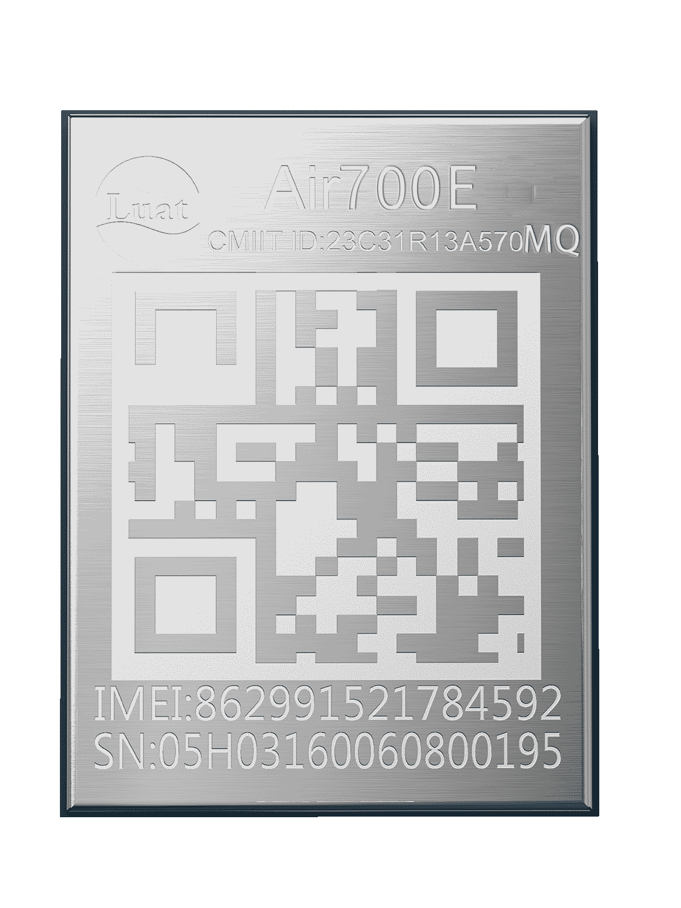

# Air700EMQ产品手册

| 模块名称  | 适用区域 | 频段      | 封装尺寸      |
| --------- | -------- | --------- | ------------- |
| Air700EMQ | 中国联通 | FDD:1,3,8 | 10\*13\*1.7mm |

## 模块硬件资料

| 资料简介         | 相关链接                                                     |
| ---------------- | ------------------------------------------------------------ |
| 硬件设计相关手册 | [Air700EMQ_硬件设计手册_V1.0.1.pdf](https://cdn.openluat-luatcommunity.openluat.com/attachment/20241011160846405_Air700EMQ_硬件设计手册_V1.0.1.pdf) [Air700EMQ_GPIO_table_20240521.pdf](https://cdn.openluat-luatcommunity.openluat.com/attachment/20240521095504789_Air780EL&780ETGG&780ETG&700EL&700EY&700EC_GPIO_table_20240521.pdf) [EC716-IO-特性.pdf](https://cdn.openluat-luatcommunity.openluat.com/attachment/20240508154944217_EC716-IO-特性.pdf) |
| 原理图及PCB封装  | [Air700EMQ封装.zip](https://cdn.openluat-luatcommunity.openluat.com/attachment/20231225171117125_Air700EL&700EY封装.zip) |
| 参考设计原理图   | [Air700EMQ_硬件参考设计.pdf](https://cdn.openluat-luatcommunity.openluat.com/attachment/20240228162252366_Air700EL_硬件参考设计.pdf) |
| 开发板相关资料   | [EVB_Air700EMQ开发板使用手册V1.0.1.pdf](https://cdn.openluat-luatcommunity.openluat.com/attachment/20240417135218605_EVB_Air700EC开发板使用手册V1.0.1.pdf) [EVB_Air700EMQ_V1.0_SCH.zip](https://cdn.openluat-luatcommunity.openluat.com/attachment/20230308153627280_EVB_Air700E_V1.0_SCH.zip) [EVB_Air700EMQ_V1.0_bom.XLS](https://cdn.openluat-luatcommunity.openluat.com/attachment/20230331111453962_EVB_Air700E_V1.0_bom.XLS) [EVB_Air700EMQ开发板ad.zip](https://cdn.openluat-luatcommunity.openluat.com/attachment/20230510094340802_EVB_Air700E开发板ad.zip)（kicad转出的 有些地方不兼容仅供参考） |
| 全功能开发板     | [EVB_Air700EMQ_All_原理图.pdf](https://cdn.openluat-luatcommunity.openluat.com/attachment/20240528151044948_EVB_Air700EL_All_Func.pdf) [开发板EVB-Air700EMQ-IO使用说明V1.0.0.pdf](https://cdn.openluat-luatcommunity.openluat.com/attachment/20240528160859252_开发板EVB-Air700EC-IO使用说明V1.0.0.pdf) |

## 模块外形

| 正面                        | 反面                          |
| --------------------------- | ----------------------------- |
|  |  |

## 模块固件版本

[AT固件版本](https://docs.openluat.com/air700emq/at/firmware/)

[LuatOS二次开发sdk和demo](https://docs.openluat.com/air700emq/luatos/firmware/)

## 相关证书
### CCC 证书
[Air700E_CCC英文证书(2024).pdf](https://cdn.openluat-luatcommunity.openluat.com/attachment/20240131103202782_Air700E_CCC英文证书(2024).pdf)

[Air700E_CCC中文证书(2024).pdf](https://cdn.openluat-luatcommunity.openluat.com/attachment/20240131103156086_Air700E_CCC中文证书(2024).pdf)

### SRRC 证书
[Air700E型号核准证.pdf](https://cdn.openluat-luatcommunity.openluat.com/attachment/20240307110448672_Air700E型号核准证.pdf)

### ROHS 证书
[Air700E-Rohs-Report.pdf](https://cdn.openluat-luatcommunity.openluat.com/attachment/20240701140430543_Air700E-Rohs-Report.pdf)
